# 用 UNET 理解语义分割

> 原文：<https://towardsdatascience.com/understanding-semantic-segmentation-with-unet-6be4f42d4b47?source=collection_archive---------0----------------------->

## 盐鉴定案例研究

目录:

1.  介绍
2.  先决条件
3.  什么是语义切分？
4.  应用程序
5.  商业问题
6.  理解数据
7.  了解卷积、最大汇集和转置卷积
8.  UNET 建筑与培训
9.  推理
10.  结论
11.  参考

# 1.介绍

计算机视觉是一个跨学科的科学领域，研究如何让计算机从数字图像或视频中获得高层次的理解。从工程的角度来看，它寻求将人类视觉系统可以完成的任务自动化。(维基百科)

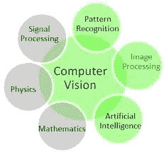

CV is a very interdisciplinary field

深度学习使得计算机视觉领域在过去几年中迅速发展。在这篇文章中，我想讨论一下计算机视觉中的一个特殊任务，叫做**语义分割**。尽管研究人员已经提出了许多方法来解决这个问题，但我将谈论一种特殊的架构，即 **UNET** ，它使用完全卷积的网络模型来完成任务。

我们将使用 UNET 为 Kaggle 主办的 [*TGS 盐鉴定*](https://www.kaggle.com/c/tgs-salt-identification-challenge) 挑战赛构建第一套解决方案。

除此之外，我写这篇博客的目的还在于为图像理解提供一些关于卷积网络中常用运算和术语的直观见解。其中一些包括卷积、最大池、感受野、上采样、转置卷积、跳过连接等。

# 2.先决条件

我将假设读者已经熟悉机器学习和卷积网络的基本概念。此外，你必须有一些与 Python 和 Keras 库 ConvNets 的工作知识。

# 3.什么是语义切分？

计算机理解图像有不同的粒度级别。对于这些级别中的每一个，都有一个在计算机视觉领域中定义的问题。从粗粒度到更细粒度的理解开始，让我们在下面描述这些问题:

## **a .图像分类**

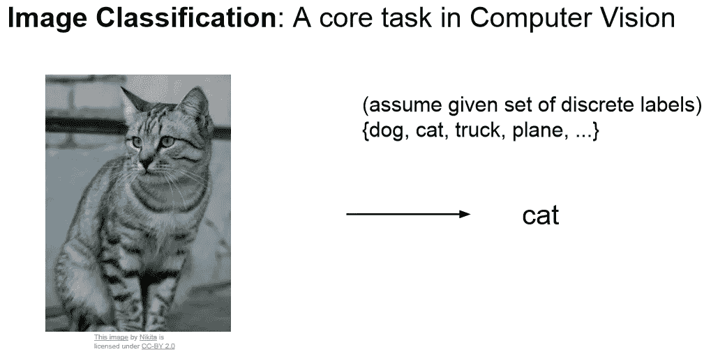

Image Classification

计算机视觉中最基本的构建模块是图像分类问题，其中给定一幅图像，我们期望计算机输出一个离散的标签，它是图像中的主要对象。在图像分类中，我们假设图像中只有一个(而不是多个)对象。

## **b .本地化分类**

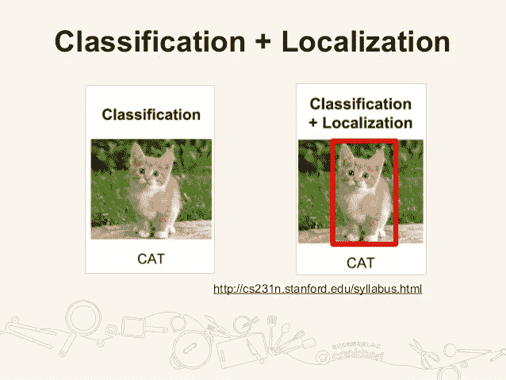

Classification with localization

在与离散标签一起定位时，我们还期望计算机准确定位图像中对象的位置。这种定位通常使用边界框来实现，该边界框可以由相对于图像边界的一些数值参数来标识。即使在这种情况下，假设每个图像只有一个对象。

## c.目标检测

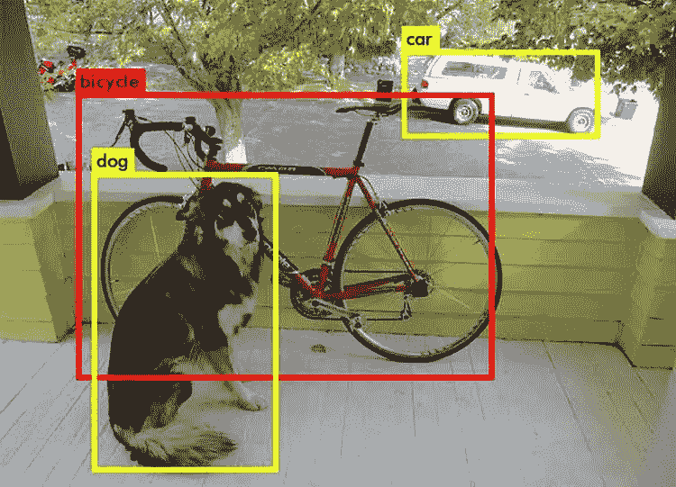

Object Detection

对象检测将定位扩展到下一个级别，现在图像不再局限于只有一个对象，而是可以包含多个对象。任务是对图像中的所有对象进行分类和定位。这里同样使用边界框的概念来完成定位。

## d.语义分割

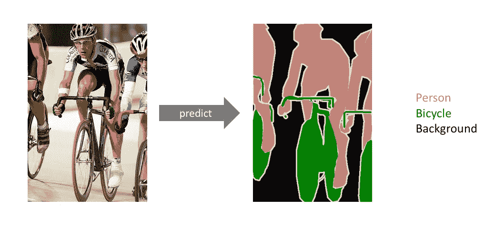

Semantic Segmentation

语义图像分割的目标是给图像的每个**像素**标上所表示内容的相应**类别**。因为我们对图像中的每个像素进行预测，这项任务通常被称为**密集预测**。

注意，与前面的任务不同，语义分割的预期输出不仅仅是标签和边界框参数。输出本身是高分辨率图像(通常与输入图像大小相同)，其中每个像素都被分类到特定的类别。因此，这是一个像素级的图像分类。

## e.实例分割

Instance Segmentation

实例分割比语义分割领先一步，在语义分割中，除了像素级分类，我们还希望计算机能够分别对一个类的每个实例进行分类。例如，在上面的图像中有 3 个人，从技术上讲，是类“Person”的 3 个实例。所有这 3 个都是单独分类的(用不同的颜色)。但是语义分割并不区分特定类的实例。

如果您仍然对对象检测、语义分割和实例分割的区别感到困惑，下图将有助于澄清这一点:

Object Detection vs Semantic Segmentation vs Instance Segmentation

在这篇文章中，我们将学习使用全卷积网络(FCN)UNET 来解决语义分割问题。

# 4.应用程序

如果你想知道语义分割是否有用，你的疑问是合理的。然而，事实证明，视觉中的许多复杂任务都需要对图像有这种精细的理解。例如:

## a.自动驾驶汽车

自动驾驶是一项复杂的机器人任务，需要在不断进化的环境中进行感知、规划和执行。这项任务也需要极其精确地完成，因为安全是最重要的。语义分割提供关于道路上自由空间的信息，以及检测车道标记和交通标志。

Source: [https://www.youtube.com/watch?v=ATlcEDSPWXY](https://www.youtube.com/watch?v=ATlcEDSPWXY)

## b.生物医学图像诊断

机器可以增强放射科医生进行的分析，大大减少运行诊断测试所需的时间。

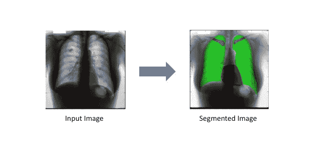

Source: [https://arxiv.org/abs/1701.08816](https://arxiv.org/abs/1701.08816)

## c.地理传感

语义分割问题也可以被认为是分类问题，其中每个像素被分类为一系列对象类中的一个。因此，有一个卫星图像土地利用制图的用例。土地覆盖信息对于各种应用都很重要，例如监测森林砍伐和城市化地区。

识别土地覆盖的类型(例如，城市、农业、水等区域)。)对于卫星图像上的每个像素，土地覆盖分类可以被视为多类语义分割任务。道路和建筑物检测也是交通管理、城市规划和道路监控的重要研究课题。

大规模公开可用数据集很少(如:SpaceNet)，数据标注一直是分割任务的瓶颈。

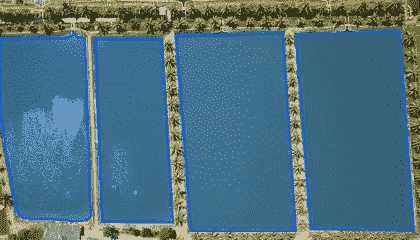

Source: [https://blog.playment.io/semantic-segmentation/](https://blog.playment.io/semantic-segmentation/)

## d.精准农业

精准农业机器人可以减少农田中需要喷洒的除草剂数量，作物和杂草的语义分割可以实时帮助它们触发除草行动。这种先进的农业图像视觉技术可以减少对农业的人工监控。

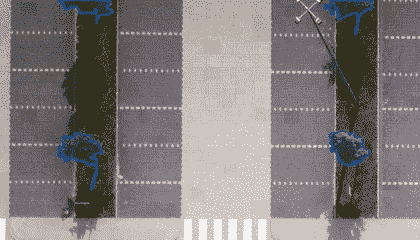

Source: [https://blog.playment.io/semantic-segmentation/](https://blog.playment.io/semantic-segmentation/)

我们还将考虑一个实际的真实世界案例研究，以理解语义分割的重要性。问题陈述和数据集将在以下章节中介绍。

# 5.商业问题

在任何机器学习任务中，总是建议花相当多的时间来恰当地理解我们旨在解决的业务问题。这不仅有助于有效地应用技术工具，还能激励开发人员使用他/她的技能来解决现实世界的问题。

[*TGS*](https://www.tgs.com/) 是一家领先的地球科学和数据公司，该公司使用地震图像和 3D 渲染来了解地球表面下哪些区域含有大量石油和天然气。

有趣的是，含有石油和天然气的地表也含有大量的盐。因此，在 T4 地震技术的帮助下，他们试图预测地球表面的哪些区域含有大量的盐。

不幸的是，专业地震成像需要专业的人类视觉来准确识别盐体。这导致高度主观和可变的渲染。此外，如果人类预测不正确，可能会给石油和天然气公司的钻探人员造成巨大损失。

因此，TGS 举办了一场 Kaggle 比赛，利用机器视觉以更高的效率和精确度来解决这个问题。

要了解更多挑战信息，请点击 [*此处*](https://www.kaggle.com/c/tgs-salt-identification-challenge) 。

阅读更多关于地震技术的内容，点击 [*此处*](https://www.chevron.com/stories/seismic-imaging) 。

# 6.理解数据

从 [*这里*](https://www.kaggle.com/c/tgs-salt-identification-challenge/data) 下载数据文件。

为简单起见，我们将只使用包含图像及其相应遮罩的 **train.zip** 文件。

在图像目录中，有 4000 张地震图像被人类专家用来预测该地区是否有盐层。

在 masks 目录中，有 4000 幅灰度图像，它们是相应图像的实际地面真实值，表示地震图像是否包含盐沉积，如果包含，在哪里。这些将用于建立监督学习模型。

让我们将给出的数据形象化，以便更好地理解:

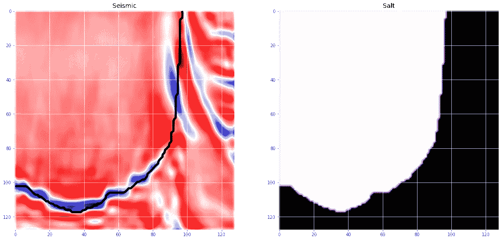

Sample data point and corresponding label

左边的图像是地震图像。画黑色边界只是为了便于理解，表示哪个部分含盐，哪个部分不含盐。(当然这个边界不是原始图像的一部分)

右边的图像被称为遮罩，它是地面真实标签。对于给定的地震图像，这是我们的模型必须预测的。白色区域表示盐沉积，黑色区域表示没有盐。

让我们再看几张图片:

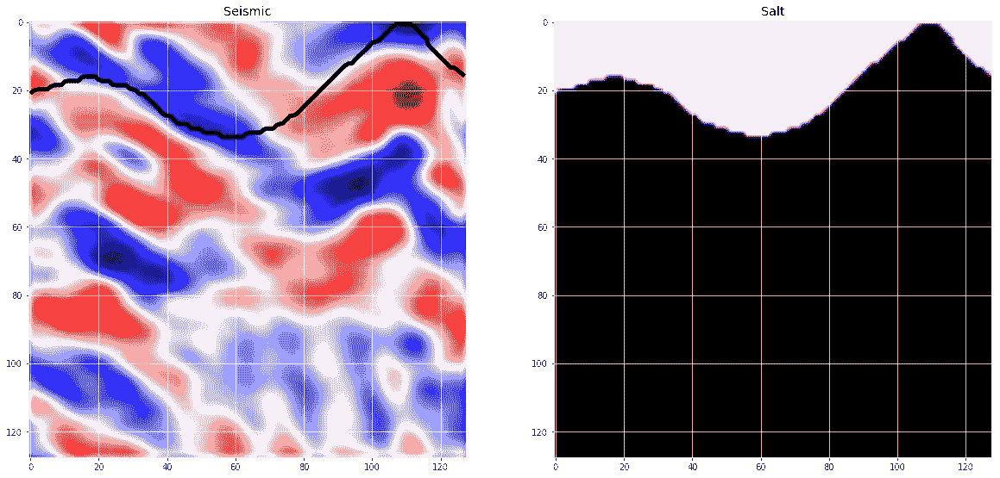

Sample data point and corresponding label

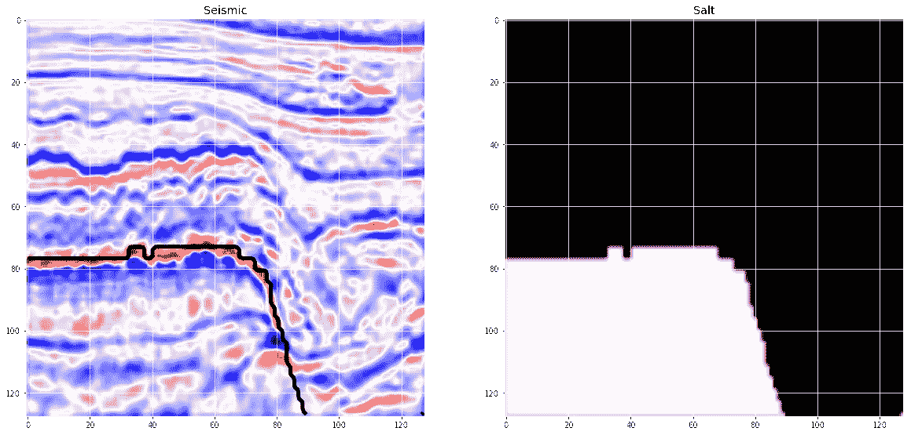

Sample data point and corresponding label

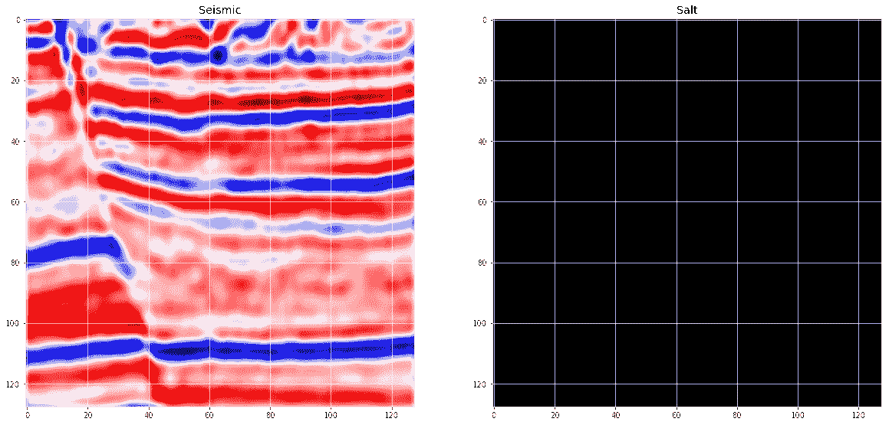

Sample data point and corresponding label

请注意，如果蒙版完全是黑色的，这意味着在给定的地震图像中没有盐沉积。

从上面的几幅图像可以清楚地推断出，对于人类专家来说，对地震图像进行准确的屏蔽预测是不容易的。

# 7.了解卷积、最大汇集和转置卷积

在深入研究 UNET 模型之前，了解卷积网络中常用的不同运算非常重要。请记下所用的术语。

## 一、卷积运算

卷积运算有两个输入

I)尺寸为(nin×nin×通道)的 3D 体积(输入图像)

ii)一组“k”个过滤器(也称为内核或特征提取器),每个过滤器的大小为(f×f×通道),其中 f 通常为 3 或 5。

卷积运算的输出也是大小为(nout x nout x k)的 3D 体(也称为输出图像或特征图)。

nin 和 nout 之间的关系如下:

Convolution Arithmetic

卷积运算可以如下所示:

Source: [http://cs231n.github.io/convolutional-networks/](http://cs231n.github.io/convolutional-networks/)

在上面的 GIF 中，我们有一个大小为 7x7x3 的输入体积。两个过滤器，每个尺寸为 3x3x3。填充=0，步幅= 2。因此输出体积是 3x3x2。如果你对这种算法感到不舒服，那么在继续下一步之前，你需要先修改卷积网络的概念。

经常使用的一个重要术语叫做**感受野**。这只是输入体积中特定特征提取器(滤波器)正在查看的区域。在上面的 GIF 中，过滤器在任何给定情况下覆盖的输入体积中的 3x3 蓝色区域是感受野。这有时也被称为**语境**。

简单来说，**感受野(context)就是** **滤波器在任意给定时间点**覆盖的输入图像区域。

## ii)最大汇集操作

简单来说，池化的作用就是减少特征图的大小，使我们在网络中的参数更少。

例如:

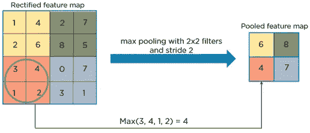

Source: [https://www.quora.com/What-is-max-pooling-in-convolutional-neural-networks#](https://www.quora.com/What-is-max-pooling-in-convolutional-neural-networks#)

基本上，从输入特征图的每个 2×2 块中，我们选择最大像素值，从而获得汇集的特征图。请注意，过滤器的大小和跨度是最大池操作中的两个重要的超参数。

其思想是只保留每个区域的重要特征(最大值像素),并丢弃不重要的信息。所谓重要，我指的是最能描述图像上下文的信息。

这里要注意的非常重要的一点是，卷积运算，特别是合并运算，都会减小图像的大小。这被称为**下采样**。在上面的示例中，合并前图像的大小是 4x4，合并后是 2x2。事实上，下采样基本上意味着将高分辨率图像转换成低分辨率图像。

因此，在汇集之前，存在于 4×4 图像中的信息，在汇集之后，(几乎)相同的信息现在存在于 2×2 图像中。

现在，当我们再次应用卷积运算时，下一层中的滤波器将能够看到更大的上下文，即，随着我们深入网络，图像的尺寸减小，然而感受野增大。

例如，下面是 LeNet 5 架构:

LeNet 5

请注意，在典型的卷积网络中，图像的高度和宽度逐渐减小(由于汇集，向下采样)，这有助于更深层中的滤波器聚焦于更大的感受域(上下文)。然而，通道/深度的数量(使用的过滤器数量)逐渐增加，这有助于从图像中提取更复杂的特征。

凭直觉，我们可以对联营作业作出如下结论。通过下采样，模型更好地理解了图像中存在的**是什么，但是它丢失了其存在的**的信息。****

## ****iii)上采样的需要****

****如前所述，语义分割的输出不仅仅是一个类标签或一些边界框参数。事实上，输出是一个完整的高分辨率图像，其中所有像素都被分类。****

****因此，如果我们使用具有池层和密集层的常规卷积网络，我们将丢失“在哪里”的信息，而只保留“是什么”的信息，这不是我们想要的。在细分的情况下，我们既需要“什么”也需要“哪里”的信息。****

****因此，需要对图像进行上采样，即将低分辨率图像转换为高分辨率图像，以恢复“在哪里”的信息。****

****在文献中，有许多对图像进行上采样的技术。其中一些是双线性插值、三次插值、最近邻插值、解卷积、转置卷积等。然而，在大多数先进的网络中，转置卷积是对图像进行上采样的首选。****

## ****iv)转置卷积****

****转置卷积(有时也称为去卷积或分数步长卷积)是一种使用可学习参数对图像进行上采样的技术。****

****我不会描述转置卷积是如何工作的，因为 Naoki Shibuya 已经在他的博客 [*中用转置卷积*](/up-sampling-with-transposed-convolution-9ae4f2df52d0) 进行了出色的采样。我强烈建议你通读这篇博客(如果需要的话可以多次通读)以了解转置卷积的过程。****

****然而，在高级别上，转置卷积是与正常卷积完全相反的过程，即，输入体积是低分辨率图像，而输出体积是高分辨率图像。****

****在博客中，很好地解释了如何将正常卷积表示为输入图像和滤波器的矩阵乘法，以产生输出图像。通过对滤波器矩阵进行转置，我们可以反转卷积过程，因此称为转置卷积。****

## ****v)本节概述****

****阅读本节后，您必须熟悉以下概念:****

*   ****感受领域或环境****
*   ****卷积和汇集操作对图像进行下采样，即将高分辨率图像转换为低分辨率图像****
*   ****最大池操作通过增加感受野来帮助理解图像中有“什么”。然而，它往往会丢失对象“在哪里”的信息。****
*   ****在语义分割中，不仅重要的是知道图像中存在“什么”,同样重要的是知道它存在于“哪里”。因此，我们需要一种方法来将图像从低分辨率向上采样到高分辨率，这将帮助我们恢复“在哪里”的信息。****
*   ****转置卷积是执行上采样的最优选选择，上采样基本上是通过反向传播来学习参数，以将低分辨率图像转换为高分辨率图像。****

****如果您对本节中解释的任何术语或概念感到困惑，请随意再读一遍，直到您熟悉为止。****

# ****8.UNET 建筑与培训****

****[*UNET*](https://arxiv.org/abs/1505.04597) 由 Olaf Ronneberger 等人开发，用于生物医学图像分割。该架构包含两条路径。第一条路径是收缩路径(也称为编码器)，用于捕获图像中的上下文。编码器只是一个传统的卷积和最大池层堆栈。第二条路径是对称扩展路径(也称为解码器)，用于使用转置卷积实现精确定位。因此，它是一个端到端的完全卷积网络(FCN)，即它只包含卷积层，不包含任何密集层，因此它可以接受任何大小的图像。****

****在原始论文中，UNET 是这样描述的:****

****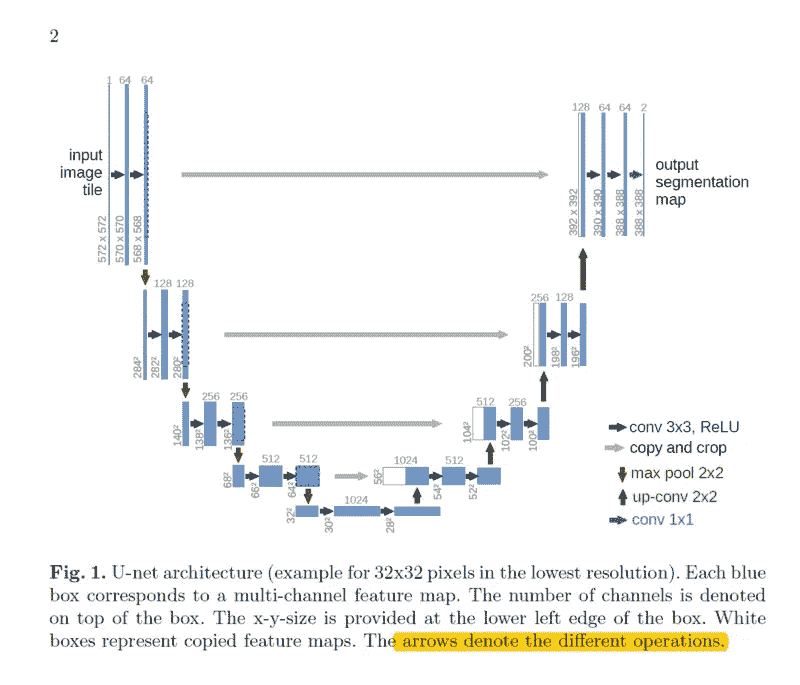****

****如果你不明白，没关系。我将尝试更直观地描述这个架构。请注意，在原始纸张中，输入图像的大小是 572x572x3，但是，我们将使用大小为 128x128x3 的输入图像。因此，不同位置的尺寸将与原始纸张中的尺寸不同，但核心组件保持不变。****

****下面是架构的详细说明:****

********

****Detailed UNET Architecture****

## ****注意事项:****

*   ****2@Conv 层意味着应用两个连续的卷积层****
*   ****c1，c2，…c9 是卷积层的输出张量****
*   ****p1、p2、p3 和 p4 是最大池层的输出张量****
*   ****u6、u7、u8 和 u9 是上采样(转置卷积)层的输出张量****
*   ****左手边是收缩路径(编码器)，在这里我们应用常规卷积和最大池层。****
*   ****在编码器中，图像的尺寸逐渐减小，而深度逐渐增加。从 128x128x3 到 8x8x256****
*   ****这基本上意味着网络学习了图像中的“什么”信息，然而它丢失了“在哪里”的信息****
*   ****右手边是扩展路径(解码器),在这里我们应用转置卷积和常规卷积****
*   ****在解码器中，图像的尺寸逐渐增大，深度逐渐减小。从 8x8x256 到 128x128x1****
*   ****直观上，解码器通过逐渐应用上采样来恢复“在哪里”的信息(精确定位)****
*   ****为了获得更精确的位置，在解码器的每一步，我们通过将转置卷积层的输出与来自同一级别的编码器的特征图连接来使用跳过连接:
    U6 = U6+C4
    u7 = u7+C3
    u8 = u8+C2
    u9 = u9+C1
    在每次连接之后，我们再次应用两个连续的常规卷积，以便模型可以学习组装更精确的输出****
*   ****这使得该建筑呈对称的 U 形，因此得名 UNET****
*   ****在高层次上，我们有以下关系:
    输入(128x128x1) = >编码器= > (8x8x256) = >解码器= >输出(128x128x1)****

****下面是定义上述模型的 Keras 代码:****

## ****培养****

****模型用 Adam 优化器编译，我们使用二元交叉熵损失函数，因为只有两个类(盐和无盐)。****

****我们使用 Keras 回调来实现:****

*   ****如果验证损失在 5 个连续时期内没有改善，则学习率衰减。****
*   ****如果验证损失在 10 个连续时期内没有改善，则提前停止。****
*   ****仅当验证损失有所改善时，才保存权重。****

****我们使用的批量大小为 32。****

****请注意，可能有很大的余地来调整这些超参数，并进一步提高模型性能。****

****该模型在 P4000 GPU 上训练，训练时间不到 20 分钟。****

# ****9.推理****

****注意，对于每个像素，我们得到一个 0 到 1 之间的值。
0 代表无盐，1 代表盐。
我们以 0.5 为阈值来决定一个像素是归类为 0 还是 1。****

****然而，决定阈值是棘手的，可以被视为另一个超参数。****

****让我们看看训练集和验证集的一些结果:****

## ****训练集的结果****

********************************

## ****验证集的结果****

****************************************

****训练集上的结果相对好于验证集上的结果，这意味着模型遭受过拟合。一个明显的原因可能是用于训练模型的图像数量较少。****

# ****10.结论****

****感谢您对博客的兴趣。如果您有任何意见、反馈和建议，请留下。****

****完整代码在我的 GitHub 回购[T3 这里](https://github.com/hlamba28/UNET-TGS)。****

# ****11.参考****

*   ****[https://arxiv.org/abs/1505.04597](https://arxiv.org/abs/1505.04597)****
*   ****[https://www . depends-on-the-definition . com/unet-keras-segmenting-images/](https://www.depends-on-the-definition.com/unet-keras-segmenting-images/)****
*   ****[https://towards data science . com/up-sampling-with-transposed-convolution-9 AE 4 F2 df 52d 0](/up-sampling-with-transposed-convolution-9ae4f2df52d0)****