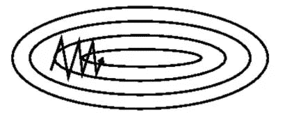
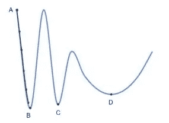
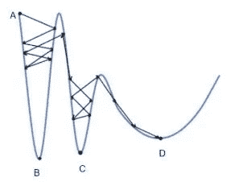
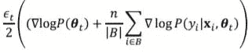
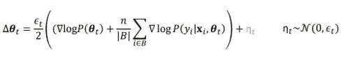

# 从不同的角度理解随机梯度下降

> 原文：<https://towardsdatascience.com/understanding-stochastic-gradient-descent-in-a-different-perspective-e4e54d47e26c?source=collection_archive---------18----------------------->

gradient descent path in a contour line with 2D feature space (from Genevieve B. Orr)

*随机优化* [1]是训练神经网络时常用的方法。在此基础上，还有像 *SGD with Momentum、Adagrad、*和 *RMSProp、*这样的方法可以给出不错的训练结果。上图显示了 2D 等高线中的之字形梯度下降路径。人们相信使用随机梯度下降法，因为它被认为是计算友好的，因为模型有大量的参数。也就是说，SGD 可以达到的最好结果相当于具有相同超参数设置的普通梯度下降法。然而，我们会发现，在很多情况下，SGD 在测试集上提供了更好的性能。最近在高级深度学习课程中，我被教导从不同的角度来看待 SGD 方法，它认为它类似于正则化。

## 香草梯度下降

假设我们的损失函数看起来像这样:

似乎 B 点是我们通过执行梯度下降想要到达的地方，因为 B 处于全局最小值。但是，如果参数有很小的偏移，损失的值会有很大的变化。我们应该注意到，这个损失函数仅仅是基于我们可以看到的训练集绘制的。通常，测试数据会有很小的变化。所以我们想要达到的理想点实际上是 D，因为它给出了我们模型的最佳概括能力。

在香草梯度下降的情况下，如果我们在点 A 初始化模型，它将一直下降到点 B。并且它没有办法从 B 周围的凹区域逃脱(具有合理的学习速率)。解决这个问题的直接方法是引入随机采样噪声。然而，与训练数据的学习分布相比，随机采样的噪声通常是微不足道的。

## 随机梯度下降

*随机梯度下降*方法是这个问题的完美解决方案。SGD 使用 MAP 估计值计算的梯度如下所示:

在每次迭代中，我们将随机对数据进行采样，并将梯度计算为整个数据集上真实梯度的近似值。

由于在一次迭代中用于训练的所有数据都是从训练集中随机采样的，因此它们将具有不同的分布，从而给我们更多的自由来探索损失函数的空间。所以更有可能达到我们想要的最小值(如上图)。迷你浴池的尺寸越小，损失功能空间越大。在我看来，*随机梯度下降*方法与*交叉验证、*方法具有相同的高级精神，因为两种方法都一次性使用部分训练数据，并尝试不同的可能分布，以增加模型的泛化能力。

## 随机梯度朗之万动力学

在[2]中，上述思想得到了进一步发展。通过*随机梯度朗之万动力学(SGLD)* 计算的梯度为:

SGLD 方法将高斯噪声引入到梯度中，这确保了最终探索整个支持。它被看作是随机微分方程的离散化。通过遵循马尔可夫链蒙特卡罗(MCMC)技术，SGLD 方法使模型能够捕捉参数不确定性，这是一种流行的贝叶斯方法来执行不确定性估计。

## 参考

[1] Robbins H，Monro S .一种随机逼近方法[J].数理统计年鉴，1951:400–407。

[2] Welling M，Y W .通过随机梯度朗之万动力学进行贝叶斯学习[C]//第 28 届国际机器学习会议(ICML-11)论文集。2011: 681–688.