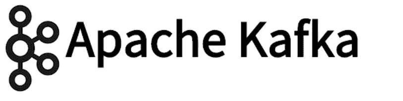
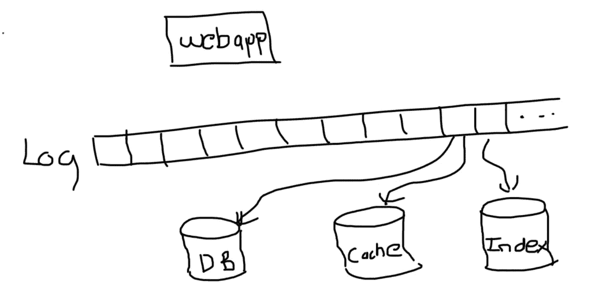

# 理解流处理和 Apache Kafka

> 原文：<https://towardsdatascience.com/understanding-stream-processing-and-apache-kafka-5610bc2d6fa3?source=collection_archive---------16----------------------->

观看节目时被称为 Torrenting，包括下载整个 mp4 文件并在本地观看。相比之下，流式传输意味着当数据包到达时，您正在观看节目。流处理是处理连续的输入数据流的行为。

# 活动采购

假设我们负责一个社交媒体平台。在传统方法中，我们将所有用户数据存储在某种持久存储中，比如关系数据库。每当其中一个用户更新他们的状态时，数据库中的值就会被覆盖。Event sourcing 认为这不是存储数据的好方法，因为我们可能希望使用以前的值进行业务分析。相反，我们应该单独记录数据库发生的每个变化。回到我们的例子，每次用户改变他们的状态，我们会创建一个单独的条目，而不是覆盖以前的值。每当数据库收到读取数据的请求时，我们都返回最新的值。

原始事件的形式非常适合写入，因为您不需要搜索条目并更新它。相反，您可以将事件附加到日志的末尾。另一方面，聚合数据的形式非常适合读取。如果用户正在查看某人的状态，他们不会对导致当前状态的所有修改历史感兴趣。因此，将写入系统的方式与读取系统的方式分开是有意义的。我们会回来的。

现在，假设一个用户试图查看他们的朋友列表。为了将这些信息呈现给用户，我们必须对数据库执行读取查询。假设活跃用户的数量从 10，000 增加到 100，000。这意味着我们必须将与这 90，000 个额外用户中的每一个相对应的信息存储到我们的数据库中。一些非常聪明的人已经想出了可以达到 O(log n)量级性能的搜索算法。然而，随着条目数量的增加，搜索某个值所花费的时间仍然会增加。因此，在扩展时实现一致的低延迟要求您利用缓存。缓存将只保存全部数据的一个子集。因此，查询花费的时间更少，因为它们不必遍历那么多的元素。

# 双重写入

缓存和其他形式的冗余数据(如索引)通常对于获得良好的读取性能至关重要。然而，保持不同系统之间的数据同步成为一个真正的挑战。在双写方法中，更新所有适当位置的数据是应用程序代码的责任。

假设我们有一个用户可以互相发送消息的应用程序。当发送新消息时，我们要做两件事:

*   将邮件添加到用户的收件箱
*   增加用户未读邮件的数量

我们保留一个单独的计数器，因为我们一直在用户界面上显示它，如果每次需要显示未读邮件数时都要扫描邮件列表来查询未读邮件数，会太慢。该计数来自收件箱中的实际邮件。因此，每当未读消息的数量发生变化时，我们需要相应地更新计数器。

假设我们有以下场景:

客户端向另一个用户发送消息，将其插入收件人的收件箱。然后，客户端请求增加未读计数器。然而，就在那一刻，出现了问题，可能是数据库宕机，或者某个进程崩溃，或者网络中断。不管什么原因，对未读计数器的更新都会失败。

现在，我们的数据库不一致。我们不一定知道哪些计数器与哪些收件箱不一致。因此，解决这个问题的唯一方法是定期重新计算值，如果我们有很多用户，这可能会非常昂贵。

即使一切运行顺利，我们仍然会遇到像比赛条件这样的问题。

假设我们有以下场景:

第一数据存储中的 x 值由第一客户端设置为 y，然后由第二客户端设置为 z。

在第二个数据存储中，请求以不同的顺序到达，值首先被设置为 z，然后是 y。

现在，两个数据存储区再次不一致。

# 分布式流媒体平台

很多时候，我们希望将应用程序数据用于其他目的，例如训练机器学习模型或可视化趋势。但是，我们不能直接从数据库中读取值，因为那样会占用资源，而这些资源本来可以用来处理用户对数据的请求。因此，我们必须在其他地方复制数据，这不可避免地会导致前面讨论过的相同问题。

那么，我们如何在几个不同的系统中获得相同数据的副本，并在数据变化时保持它们一致的同步呢？有多种可能的解决方案，但在本文中，我们将介绍分布式流媒体平台 Apache Kafka。

在大多数应用程序中，日志是对用户隐藏的实现细节。例如，大多数关系数据库使用预写日志。实际上，每当数据库必须对底层数据进行更改时，它都会将这些更改附加到预写日志中。如果数据库在执行写操作时崩溃，它可以重置为已知状态。

在卡夫卡那里，木头成了一等公民。换句话说，主要的存储机制是日志本身。为了使 Kafka 具有水平可伸缩性，日志被分割成多个分区。每个分区都存储在磁盘上，并在几台机器上复制，因此它可以承受机器故障而不会丢失数据。

回到我们的社交媒体应用程序的例子，用户所做的任何更改都将被发送到后端服务器。然后，服务器可以将这些更改作为事件添加到日志中。数据库、索引、缓存和所有其他存储系统都可以通过顺序读取日志来构建。

回想一下，在事件源的上下文中，日志是写入的理想选择，因为它们只需将数据附加到末尾，而数据库是读取的理想选择，因为它们只包含当前状态。

卡夫卡之所以能够解决竞争条件的问题，是因为它实施了严格的事件排序。每个消费者从日志的开头开始，读取每个事件，更新其内容，直到它被赶上。在数据库崩溃的情况下，它能够从它停止的地方继续读取日志，直到它被赶上。

# 最后的想法

流处理指的是我们如何处理新的输入数据。Kafka 是一个开源的分布式流媒体平台，它提供了一种跨不同存储系统可靠获取数据的机制。