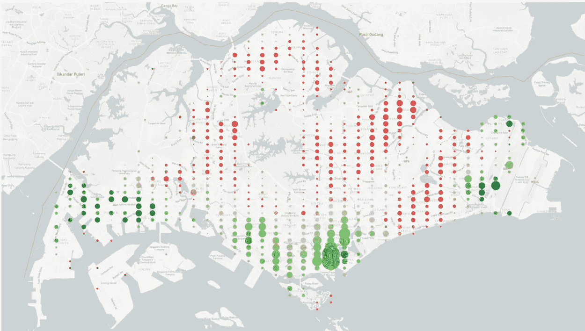
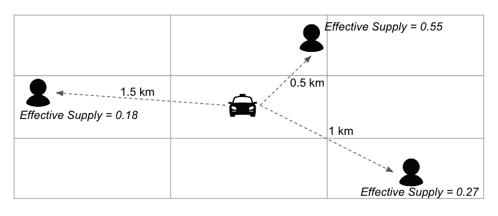
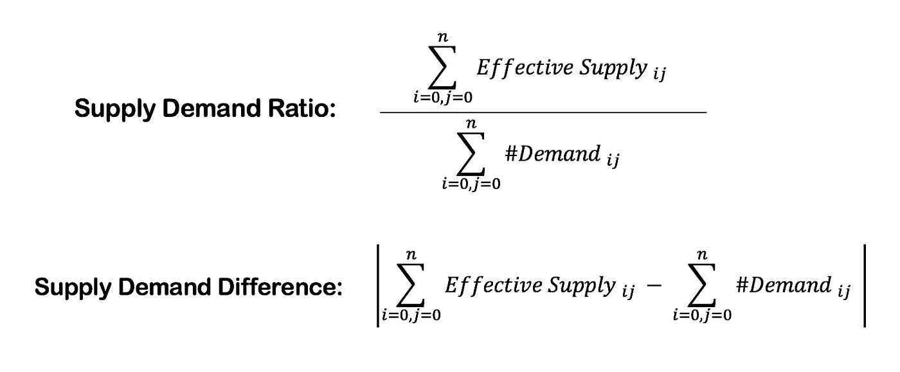
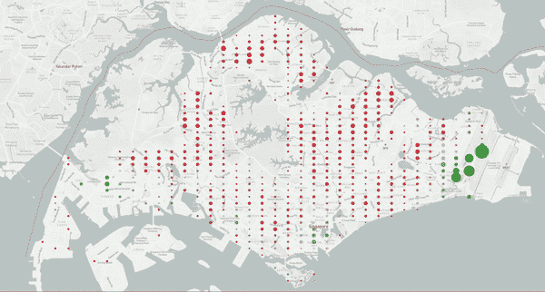
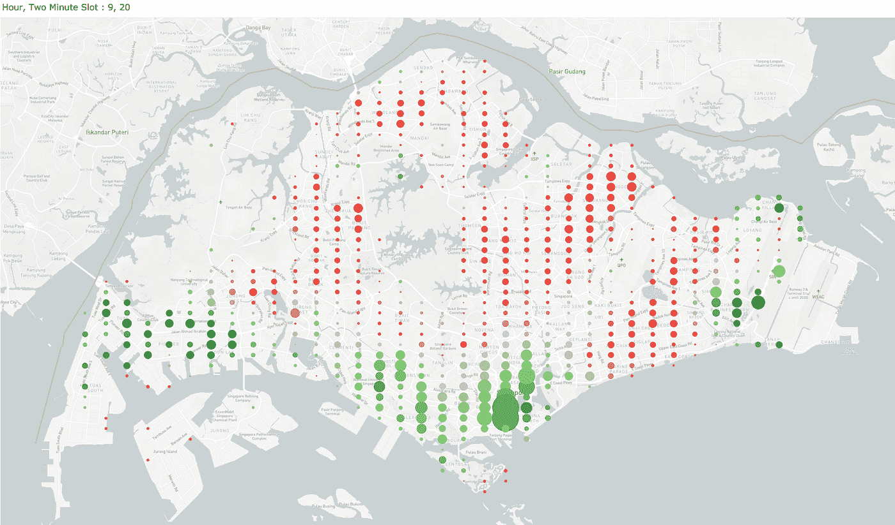
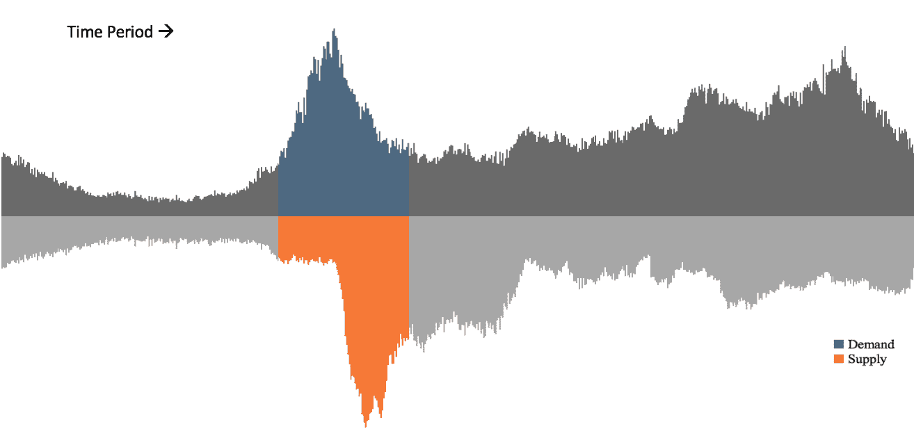
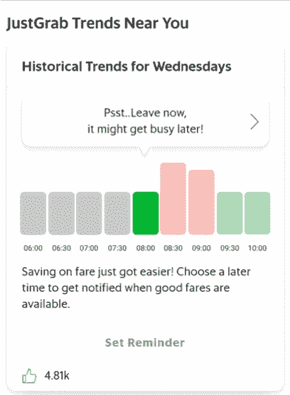

# 透过 Grab 数据透视打车供需

> 原文：<https://towardsdatascience.com/understanding-supply-demand-in-ride-hailing-through-the-lens-of-grab-data-23e24224547f?source=collection_archive---------11----------------------->

## 由[阿尤什·加尔格](https://www.linkedin.com/in/aayush-garg-94b413a6)、[拉拉·普鲁姆·伊姆](https://www.linkedin.com/in/larapureumyim/)、[春凯·潘](https://www.linkedin.com/in/chun-kai-phang-a9a7588b/)合著

***打车第一目标:分配***

Grab 的打车业务最简单的形式就是撮合寻找舒适交通方式的乘客和寻找灵活赚钱机会的司机。

在过去的 6 年里，Grab 反复微调其机器学习算法，目标是确保乘客在他们想要的时候搭车，并将他们与离他们最近的司机匹配。

但是司机们总是在移动，在任何一个时间点都可能有数百名乘客在同一个区域内要求搭车。这意味着有时，最近的可用司机可能仍然太远。

Grab 的分析团队试图通过明确定义的指标来大规模分析这些实例。我们研究差距，以便我们可以确定潜在的产品和运营解决方案，这些解决方案可能会引导供应和需求朝着地理时间一致和更好的体验的方向发展。

在本文中，我们将向您介绍我们的一项分析计划——测量任何给定地区和时间的供需比率。

***定义供需***

**供应**的单个单元被认为是在 *x* 秒时段开始时在线且空闲(当前未在工作)的驱动器，其中 *x* 是极小的时间单元。驾驶员在这个 *x* 秒时段开始时的 GPS ping 被认为是他或她的位置。

**需求**的单个单位被视为在相同的 *x* 秒时段内通过我们的应用程序查询乘车费用的乘客。我们认为乘客的位置就是输入的上车地址。

***映射供需***

出于分析的目的，每个位置被聚合为 geohash(编码为字母和数字字符串的地理位置)，精度为 *y* ，其中 *y* 表示地图上一个非常小的面空间维度。然后，每个供应单位被映射到供应的相邻地理散列内的所有需求单位，如图*图 1* 所示。

Figure 1: Illustration depicting a supply unit distributed among the demand units in its neighbouring geohashes

每个供应单元的一部分被分配给相邻地理哈希中的每个需求单元，地理哈希按距离反向加权。本质上，这意味着与较远的乘客相比，较近的乘客更容易找到司机。

为了简化本文，我们使用直线距离代替路径距离作为代理，以降低算法的复杂性。

每位乘客的可用驾驶员分数的总和将给出每位乘客的**有效供给**。这在图 1 中描述，其中每个乘客分享一小部分供应。

对于此分析，我们汇总了每个地理哈希 *i* 和时隙 *j* 组合的需求和有效供给，从而得出两个简单的汇总指标:**供需比**和**供需差** ( *图 2* ) **。**

Figure 2: The metrics aggregated for any area and time slot

***处理数据***

虽然由此产生的指标看起来像是简单的比率和差异，但计算有效供应量需要绘制相邻空间中每个司机和乘客的地图，这是一项相当繁重的计算。

在整个地区，在任何给定的时间点，都可能有成千上万的乘客在寻找搭车机会。我们的算法不仅识别每个需求和供应单元及其位置，还将每个供应单元映射到同一邻域中的所有需求单元，以输出每个乘客可用的部分供应。

简而言之，复杂性可以总结如下:每一个额外的供应或需求单位都会以指数方式增加算法的计算能力。

这只是分析团队每天处理的许多高计算问题之一。因此，问题的解决不一定要以开发一个代表网络的算法或度量标准为结束，而是要能够使它具有高性能和可用性，即使在业务扩展时也是如此。

***在地图上可视化度量***

利用我们上面讨论的指标，我们可以绘制出需求和供给之间的差距如何在一天中演变。下面的 GIF 展示了新加坡典型一天的供需缺口。

每个气泡表示地图上的一个微小区域。每个泡沫的大小表明了该地区的供需差异——泡沫越大，缺口越大。我们还用彩色气泡来表示供求比率，红色表示供应不足，绿色表示供应过剩。

为了实现我们的目标，确保乘客随时都能找到他们想要的交通工具，我们需要平衡需求和供给。在 Grab，我们通过多种方式做到这一点，包括一方面想办法将供应过剩转移到需求更高的地区，另一方面将对时间不太敏感的需求从高峰时段转移出去。

*确定位置供应的空间机会*

**

*Figure 3: Supply Demand Distribution in Singapore on a typical weekday*

*在一天中的任何给定时间，一个地区的驾驶员可能供过于求，而另一个地区则供不应求。*

*如图*图 3* 所示，这种情况在新加坡很常见，因为早高峰过后，大多数出行都在 CBD 结束，导致该地区供过于求。这种情况在樟宜机场等排队点也很常见。*

*为了解决这种地理时间错位，Grab 最近更新了 Grab Driver 应用程序上的**热图**，以鼓励司机从供应过剩的地区转移到需求更高的地区。*

****识别移动需求的时间机会****

**

*Figure 4: Typical Supply Demand Distribution in a small residential area in Singapore across the day.*

**图 4* 是新加坡一个小型住宅区典型工作日的供需汇总图。*

**图 4* 中突出显示的区域描绘了需求和供应不匹配的时间段。根据历史数据，我们知道需求会因各种因素而达到峰值，包括预期的(通常的高峰时段)和意外的(突然的暴雨)。然而，供给的增加会延迟一段时间，通常是在需求已经下降的时候。*

**

*Figure 5: Travel Trends Widget on the Passenger App showing best times to book in River Valley (Singapore)*

*为了解决这种不平衡，Grab 最近在乘客应用程序上推出了一个**出行趋势小工具** ( *图 5* )，让我们的乘客了解几个小时内的预测需求分布。*

*此小部件根据乘客特定位置的历史数据总和，向您显示需求趋势。这里的目标是鼓励*对时间不敏感的需求*(不需要立即乘车的乘客)稍晚预订，帮助有更紧急需求的乘客更容易获得分配。*

*作为其有用性的证明，旅行趋势窗口小部件现在在 Grab 的所有窗口小部件中排名第一！通过最高的点击率，我们观察到成千上万的人发现它对他们的日常使用很有用！请关注下一个升级版本，我们将继续改进它，使其更具上下文相关性和智能性！*

****敬请期待更多！****

*考虑到不断变化的现实，即不断波动的供应和需求，Grab 运输团队的最终目标可以归结为一件事:确保我们的乘客能够在他们需要的时间和地点尽可能快和容易地搭车；同时通过奖励体验为我们的司机提供更好的生活。*

*要做到这一点，平衡需求和供给至关重要。我们有许多方法做这件事。我们在这篇文章中分享了一些，但另一个重要的因素是动态定价——票价根据供求关系的变化而变化。*

*我们将在另一篇文章中进一步探讨这个话题。敬请关注！*

****感兴趣？加入我们吧！****

*Grab 的分析团队为 Grab 的所有服务和产品提供整体支持。*

*这只是分析团队努力深入理解我们的数据、使用它评估平台性能并不断迭代以构建更好的数据驱动产品的一瞥。*

*如果你有兴趣解决这样的问题，加入我们吧！我们在招人！访问我们的[职业网站](https://grab.careers/)查看职位空缺！*

****回执****

*我们要感谢对上述工作做出贡献的许多人:Ashwin Madelil(产品经理)、Shrey Jain(产品经理)、Brahmasta Adipradana(产品经理)、Prashant Kumar(产品经理)和 Ajmal Jamal(设计师)。*

**还发表在* [*Grab 旗下的中型刊物*](https://medium.com/grab/understanding-supply-demand-in-ride-hailing-through-the-lens-of-grab-data-37ccde1a2e2c)*&*[*Grab 旗下的工程博客*](https://engineering.grab.com/understanding-supply-demand-ride-hailing-data) *。**