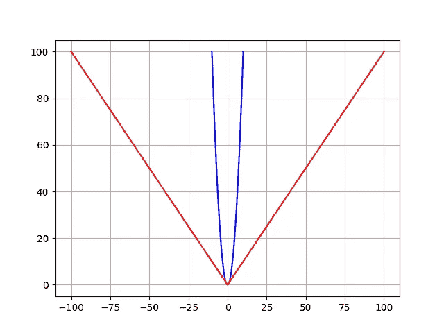
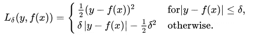

# 了解机器学习回归的 3 种最常见损失函数

> 原文：<https://towardsdatascience.com/understanding-the-3-most-common-loss-functions-for-machine-learning-regression-23e0ef3e14d3?source=collection_archive---------0----------------------->

> 想获得灵感？快来加入我的 [**超级行情快讯**](https://www.superquotes.co/?utm_source=mediumtech&utm_medium=web&utm_campaign=sharing) 。😎

机器学习中的损失函数是对你的 ML 模型能够多准确地预测预期结果(即基本事实)的一种度量。

损失函数将两个项目作为输入:我们的模型的输出值和地面真实期望值。损失函数的输出被称为*损失*，这是我们的模型在预测结果方面做得有多好的一个度量。

高损失值意味着我们的模型表现很差。较低的损失值意味着我们的模型表现得非常好。

选择合适的损失函数对于训练精确的模型是至关重要的。某些损失函数将具有某些属性，并帮助您的模型以特定的方式学习。有些人可能更看重离群值，有些人则更看重多数值。

在这篇文章中，我们将看看机器学习回归的 3 个最常见的损失函数。我将解释它们是如何工作的，它们的优缺点，以及在训练回归模型时如何最有效地应用它们。

# (1)均方误差

均方差(MSE)可能是最简单和最常见的损失函数，经常在机器学习入门课程中讲授。要计算 MSE，您需要获取模型预测值和地面真实值之间的差值，对其求平方，然后在整个数据集内取平均值。

MSE 永远不会是负的，因为我们总是在平方误差。MSE 由下式正式定义:

其中 *N* 是我们测试的样本数。代码非常简单，我们可以用普通的 numpy 编写它，并使用 matplotlib 绘制它:

MSE Loss Function

**优势:**MSE 非常有助于确保我们训练的模型没有具有巨大误差的异常值预测，因为 MSE 由于函数的平方部分而对这些误差赋予了更大的权重。

**缺点:**如果我们的模型做出一个非常糟糕的预测，函数的平方部分会放大误差。然而，在许多实际情况下，我们并不太关心这些异常值，我们的目标是更全面的模型，在大多数情况下表现足够好。

# (2)平均绝对误差

平均绝对误差(MAE)在定义上与 MSE 略有不同，但有趣的是，它提供了几乎完全相反的性质！要计算 MAE，您需要获取模型预测和地面实况之间的差异，将绝对值应用于该差异，然后在整个数据集内进行平均。

MAE 和 MSE 一样，永远不会是负值，因为在这种情况下，我们总是取误差的绝对值。MAE 由以下等式正式定义:

我们的代码在 Python 中再次变得超级简单！我们可以用普通的 numpy 编写它，并用 matplotlib 绘制它。这一次，我们将在 MSE 的正上方用红色标出，看看它们是如何比较的。

MAE (red) and MSE (blue) loss functions

**优势:**MAE 的妙处在于它的优势直接覆盖了 MSE 的劣势。因为我们取绝对值，所有的误差将在相同的线性标度上加权。因此，与 MSE 不同，我们不会将太多的权重放在异常值上，我们的损失函数提供了一个通用的甚至是衡量我们的模型表现如何的标准。

**缺点:**如果我们真的关心模型的异常预测，那么 MAE 就不会那么有效。来自异常值的较大误差最终与较低误差一样被加权。这可能导致我们的模型在大多数时候都很好，但偶尔会做出一些非常糟糕的预测。

# (3)胡伯损失

现在我们知道 MSE 非常适合学习异常值，而 MAE 非常适合忽略它们。但是中间的东西呢？

考虑一个例子，我们有一个 100 个值的数据集，我们希望我们的模型被训练来预测。在所有这些数据中，25%的预期值是 5，而另外 75%是 10。

一个 MSE 损失并不能完全解决问题，因为我们并没有真正的“异常值”；25%绝不是一个小分数。另一方面，我们不一定要用 MAE 来衡量太低的 25%。这些值 5 并不接近中值(10——因为 75%的点的值为 10 ),但它们也不是真正的异常值。

我们的解决方案？

*胡贝尔损失函数*。

Huber Loss 通过同时平衡 MSE 和 MAE 提供了两个世界的最佳选择。我们可以使用以下分段函数来定义它:

这个等式本质上说的是:对于小于δ的损失值，使用 MSE 对于大于 delta 的损失值，使用 MAE。这有效地结合了两个损失函数的优点！

对较大的损失值使用 MAE 减轻了我们对异常值的重视，因此我们仍然可以得到一个全面的模型。同时，我们使用较小损失值的 MSE 来保持中心附近的二次函数。

只要损失值大于 1，这就具有放大损失值的效果。一旦这些数据点的损失下降到 1 以下，二次函数就降低它们的权重，以将训练集中在更高误差的数据点上。

查看以下 Huber 损失函数的代码。我们还在 MSE 和 MAE 旁边绘制了 Huber 损失，以比较差异。

MSE

MAE (red), MSE (blue), and Huber (green) loss functions

请注意，我们是如何在 MSE 和 MAE 之间得到 Huber 损失的。

两全其美！

当你觉得需要在给异常值一些权重，但不要太多之间取得平衡时，你会想要使用 Huber 损失。对于异常值对您非常重要的情况，使用 MSE！对于您根本不关心异常值的情况，请使用 MAE！

# 喜欢学习？

在 twitter 上关注我，我会在这里发布所有最新最棒的人工智能、技术和科学！也在 [LinkedIn](https://www.linkedin.com/in/georgeseif/) 上和我联系吧！