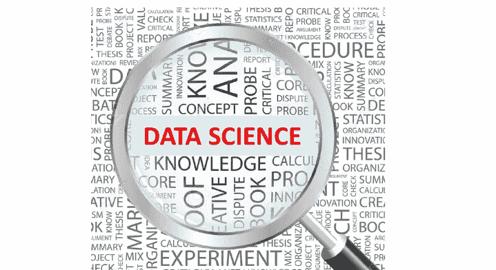

# 了解数据科学的基础知识

> 原文：<https://towardsdatascience.com/understanding-the-basics-of-data-science-883b0ebbf5e0?source=collection_archive---------18----------------------->

在这篇博客中，我将讲述在尝试任何类型的数据科学问题之前应该知道的基础知识。我认为，在开始解决任何数据科学问题之前，您应该了解两件关键事情:

1.您将使用什么数据集？

2.机器学习算法的主要类型有哪些？

让我们来详细看看每个问题。

1.您将使用什么数据集？

数据集是手头问题的支柱。在解决任何数据科学问题时，选择具有正确数据量的正确数据集至关重要。数据集应该满足的一些基本要求是:

a.相关数据:

请记住，您不能使用任何数据集来解决特定的问题。那么，*‘相关’*数据集是什么样子的呢？

在上面的例子中，左边的表数据集列彼此完全不相关。患者标识符与当前股票价格和不同保险计划的保费金额无关。

而在右边的表格中，每一行都可以与一个特定的患者相关联。不同的列实际上限定了患者，并被称为数据集的*‘特征’*。

b.数据大小:

在解决数据科学问题时，估计所需的正确数据量至关重要。经验法则是，例如，如果您有 20 个分类变量，每个变量有 15 个级别/类别，18 个连续变量(对于连续变量，假设有 10 个级别/类别)，那么所需的最小行数是:(20 * 15 + 18 * 10) * 100 = 48，000 行。(100 只是一个乘数，可以根据可用数据量和考虑的应用领域而变化)

还有一个很重要的概念就是‘稀疏数据’。如果数据集有许多缺失值，那么该数据称为稀疏数据。有多种方法(如 KNN 插补、平均值/中值插补等)。)中，我们可以根据应用领域来处理缺失值。(我在这篇博客中不涉及数据插补部分。)

2.机器学习算法的主要类型有哪些？

因此，一旦你有了正确的结构和数据量，让我们看看不同类型的机器学习算法可用于解决问题。首先你需要理解一个算法到底是做什么的。给定一个适当的数据集，算法会给出用户所提问题的答案。为了简单起见，我用算法帮助我们回答的一个问题来表示每种类型的算法。

我相信任何机器学习算法都有助于回答以下 5 个问题:

a.多少/多少？

b.哪一类？

c.哪个组？

d.行为不正常吗？

e.什么行动？

让我们深入其中的每一个，探索其中的奥秘。

a.多少/多少？

线性回归、多项式回归等。是从本质上帮助我们回答一些问题的算法，比如:

*   未来 12 个月每个销售代表的销售额是多少？
*   这种新上市的药物销量如何？
*   每个账户持有人的保险费金额是多少？

b.哪一类？

分类算法使我们能够回答必须预测类别的问题。分类算法是那些当你知道你必须把每个实体分成固定数量的类或类别时抛出一个类别的算法。这些也被称为*‘监督分类器’。*

*   确定每位医生的类别，他是早期采用者/中期采用者/后期采用者？*(多类分类器)*
*   在多适应症市场中，将每个患者与特定的适应症/诊断对应起来。
*   病人患了癌症吗？—是/否*(二元分类器)*

c.哪个组？

那么如果你不知道数据需要分成多少个类别呢？别担心，也有算法为你服务。这样的算法叫做*‘无监督算法’*:*聚类，推荐引擎。*

*   识别具有相似药物处方模式的医师群。
*   哪些网上购物者有类似的购物模式？
*   应该向网飞上的每个用户推荐哪些电影？

e.行为不正常吗？

这种问题一开始可能看起来很模糊，但它有很多实际的例子。这些算法被称为*“异常检测器”*。

*   欺诈检测取决于在线时间长度/登录位置/消费模式和频率。
*   在计算机群集中，确定参数以确定计算机是否会出现故障。

e.什么行动？

在最后一个类别中，有些系统需要实时做出决策，没有大量的数据要处理，但有数据流要处理。此外，环境变量的变化会改变前面场景中应用的整个规则集。学习代理通过与其环境交互并观察这些交互的结果来学习。这模仿了人类(和动物一样)学习的基本方式。

一种这样的算法被称为*强化学习’*。这个想法通常被称为*‘因’*和*‘果’*。

*   玩游戏:让电脑决定游戏中的最佳走法。
*   控制问题:在自动驾驶汽车中，系统必须持续监控实时环境变量，并做出决定，例如刹车或加速。

所有 5 大类的机器学习算法几乎涵盖了整个机器学习领域，并以非常简单的方式和通俗易懂的语言进行了讨论(不可能在一篇博客中涵盖详细的解释)。我将在接下来的博客中详细介绍这些算法。

我想用一句话来结束这篇博客:*“机器学习其实并不复杂，但它是一门外语。”*

如果您有任何问题或建议，请在下面评论。

这篇内容最初发表在我的个人博客网站上:【http://datascienceninja.com/[。点击](http://datascienceninja.com/)[此处](http://datascienceninja.com/2019/07/10/understanding-the-basics-of-data-science/)查看并订阅，即时接收最新博客更新。