# 理解中心极限定理

> 原文：<https://towardsdatascience.com/understanding-the-central-limit-theorem-e598158cc5da?source=collection_archive---------11----------------------->

## 深入研究统计学中最重要的定理之一

在这篇文章中，我想谈谈中心极限定理及其在统计学中的应用。中心极限定理指出，如果数据独立地从任何分布中抽取，并且样本大小足够大，样本均值总是呈现正态分布。目前这可能有点难以理解，所以让我们来看看样本均值及其属性。让我们试着计算样本均值和样本方差的期望值，这并不十分困难。这里，我们假设我们的数据是完全相同且独立分布的，并从样本均值的定义开始:

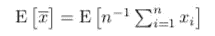

现在我们可以从期望值中取出常数 1/n:

接下来，我们将期望值包含在总和中:

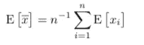

这里，每个观测值的期望值是𝜇:

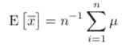

右边的项是 n 次𝜇之和除以 n，得到样本均值的期望值，即𝜇本身:

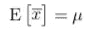

接下来，我们尝试计算样本均值的方差，这有点复杂但很重要。我们像以前一样对数据进行相同的假设，并从方差的定义开始:

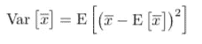

我们可以看到等式中的样本均值，这非常好，因为我们已经在上面计算过了:

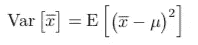

现在，我们将样本均值项扩展为单个数据点，并将其与𝜇:相结合

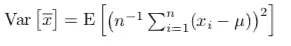

然后我们将平方项分成两项:

这与寻找 x *i* 和 x *j* 之间的协方差相同:

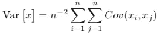

现在，我们知道，当 I 不等于 j 时，协方差为 0，因为根据我们最初的假设，它们是独立的观测值。所以，我们只剩下 i = j 的项，其中 n 项等于 x 的方差*I*:

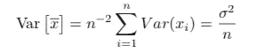

请注意，当 n → ∞时，样本均值的方差趋近于 0。

既然我们知道了样本均值和方差的期望值，我们就能更好地讨论中心极限定理了。但是首先，我们应该讨论一种叫做分布收敛的收敛类型，它表明一个统计量将收敛到一个具有某种内在随机性的整个分布。这意味着当我们采用足够大的样本量时，统计量的概率密度函数应该收敛于特定分布的 pdf。中心极限定理是同样的一个应用，它说，如果我们取足够大的样本，任何分布的样本均值应该收敛于一个正态分布。一旦我们将样本均值标准化，我们就可以将其近似为标准的正态分布。标准化尤其意味着从变量中减去平均值，然后除以标准差。中心极限定理可以用数学方法表示如下:

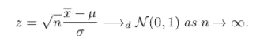

这里，z 是样本均值的标准化形式，也称为 z 统计量，𝜇是总体均值，𝜎是总体标准差。我们得到一个根 n 项，因为正如我们之前推导的，样本均值的标准差等于总体的标准差除以 n。

既然对中心极限定理有了了解，那就用一些数据来检验一下吧。为此，我用 R 写了一个函数，使用它我们可以从我们选择的分布中抽取不同大小的样本。

simulate 函数接受两个输入: *nsim* ，模拟的数量和 *nvec* ，要使用的 n 个样本的数量，并为我们稍后生成的数据返回一个正确形状的 data.table 类。然后，我们使用 simulate 函数创建一个表来存储 100，000 个大小分别为 1、2、3、5 的样本。然后我们从 1 到-1 之间的均匀分布中抽取样本。然后，我们计算所有样本的平均值，并分别绘制每个样本大小的 pdf。

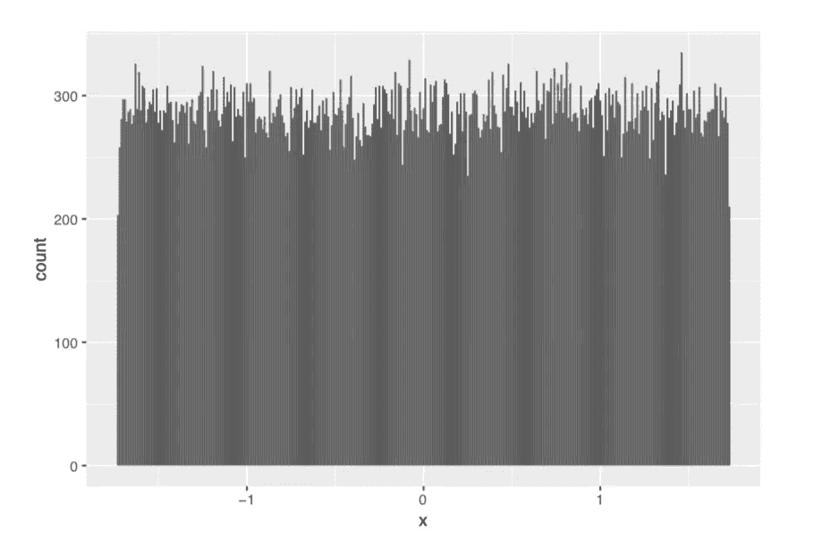

对于 n=1，我们看到 z 和我们的数据一样遵循均匀分布。

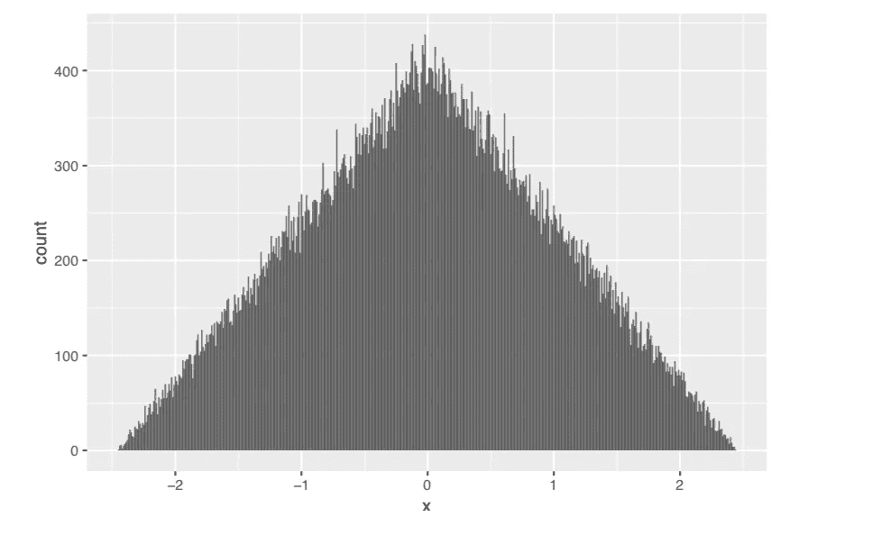

对于 n=2，z 遵循一种三角形形状。

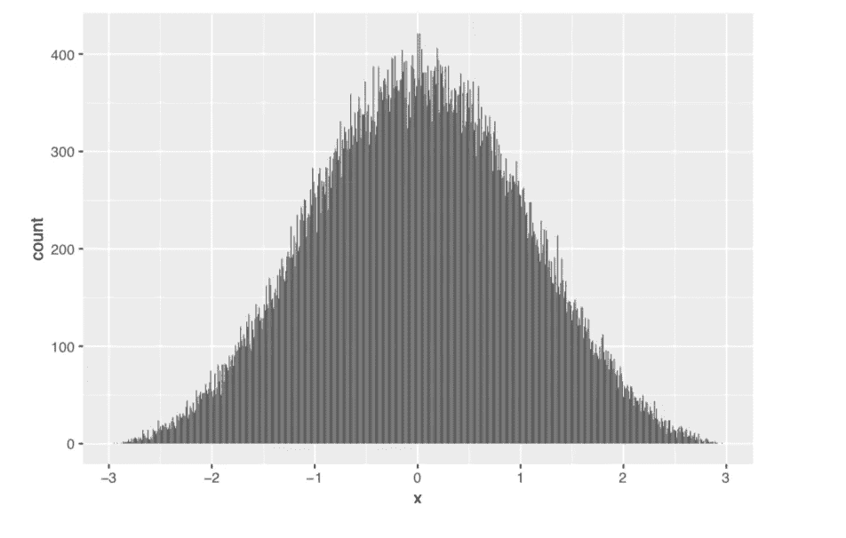

对于 n=3，事情开始变得有趣，z 开始看起来像一个钟形曲线。

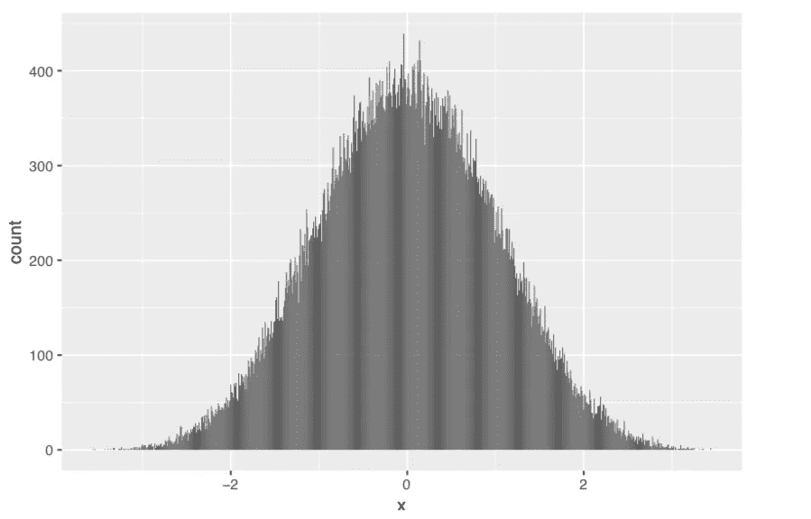

对于 n=5，z 变得几乎完全正常。因此，对于小至 5 的样本量，我们能够观察到中心极限定理，这使得它在真实数据中更加有效。

当我们不想对数据的分布进行建模，并且我们只需要关心统计分析的平均值和方差时，我们使用中心极限定理。这是统计学中最重要和最有用的定理之一。