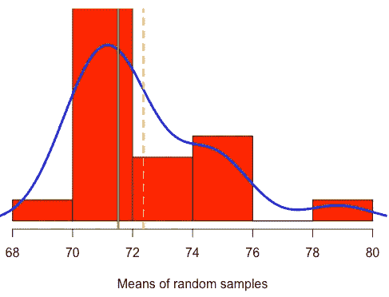
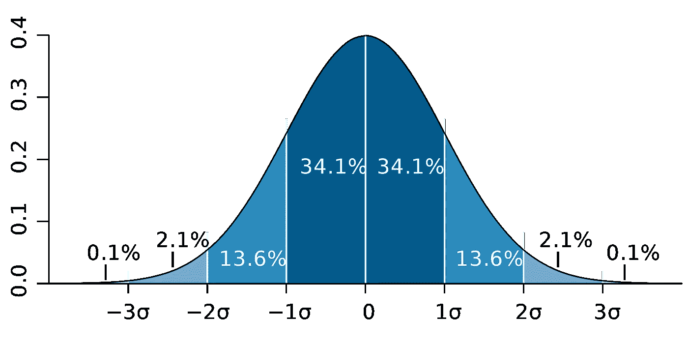

# 理解中心极限定理、标准误差和置信区间

> 原文：<https://towardsdatascience.com/understanding-the-central-limit-theorem-standard-error-and-confidence-intervals-7e20c674a51a?source=collection_archive---------10----------------------->

## 理解上述概念的工作示例

在本帖中，我们将建立对描述性统计(包括均值和标准差)和推断性统计(包括均值的标准差和置信区间)的直观理解。在这个过程中，我们还将加深对中心极限定理的理解。本文中用于生成示例的 R 代码可从[这里](https://github.com/neerajkumarvaid/Blogpost-Codes/blob/master/Code%20for%20CLT_SE_CI.R)获得。

让我们从假设一个国家有 N = 10，000 名学生在 10 年级学习物理开始我们的旅程。我们记录了他们在期末考试后获得的分数(满分为 100 分),这些分数的直方图(间隔为 10)如图 1 所示。这个直方图代表了我们的人口分布。

**Figure 1** Histogram of the marks obtained by all 10th grade students in Physics across the country (population distribution).

现在，我们可以使用以下公式计算总体均值(μ)和标准差(σ):

其中 xᵢ代表 iᵗʰ学生的分数，n 代表全国学生总数。对于图 1 所示的人口分布，μ = 71.52，σ = 16.15。这两者都是描述性统计，因为它们描述了手头数据的一些特征。平均值代表数据的中心性(中心是中值)，标准差代表每个点与平均值的差异程度。较小的σ表示数据集中的值接近数据的平均值，而较大的σ表示数据集中的值远离平均值。我们可以看到，我们的人口分布在左边有一个比右边更长的尾巴，这种分布被称为左偏。

需要注意的是，我们的人口分布需要全国所有学生的数据。这一要求实际上很难满足，我们通常无法获得人口分布(以及相关的描述性统计数据:μ和σ)。在这种情况下，我们求助于随机抽样，以*从样本分布的描述性统计中推断出*潜在人口分布的描述性统计——让我们来理解这一点！

随机抽样意味着我们不是从所有学生，即整个人口中收集数据，而是在全国范围内随机选择几个有代表性的学生来做我们的分析。假设在我们的第一次随机抽样尝试 s1 中，我们在全国范围内选择了 n₁= 50 名有代表性的学生，并记下了他们的分数。让我们将 s₁的描述性统计数据表示为μ₁和σ₁，并将我们的第一个随机抽样事件表示为 s₁: n₁,μ₁,σ₁.按照这个符号和随机抽样程序，我们可以从人口分布中随机选择多组有代表性的学生。请记住，人口分布包括全国的所有学生，样本分布仅包含随机选择的 50 名学生，每个样本分布都是人口分布的子集。

样本分布的描述性统计如何与人口分布的描述性统计相关联？答案由**中心极限定理**给出，简单来说就是

对于[独立随机变量](https://en.wikipedia.org/wiki/Statistical_independence)，样本分布的均值分布趋于正态分布(非正式地为“*钟形曲线*”)，与总体分布的形状无关。

现在，让我们把这个定理应用到我们的例子中，看看通过这个练习我们能理解什么。在我们的例子中，随机变量是每个学生得到的分数，这些确实是独立的随机变量，因为一个学生的分数独立于另一个学生的分数。更进一步，假设我们从人口分布中获得 r = 20 个随机样本，每个样本有 n = 50 名学生，这些样本分布可以写成:

这里，n₁ = n₂ = … nᵣ = 50，r = 20。20 个样本平均值的平均值可计算如下:

现在让我们画出 20 个样本分布的平均值，看看它们的分布是什么样的。从图 2 中可以明显看出，无论我们的人口分布(实际上是 Beta 分布，详见代码)的形状如何，该分布看起来确实像一条钟形曲线。

**Figure 2** Distribution of the means of 20 random samples (μ₁, μ₂,…,μ₂₀). Mean of the sample means (μ₂₀means = 72.26) yellow dashed vertical line, and actual population mean (μ = 71.52), green vertical line, are also plotted for comparison.

如图 3 所示，如果我们获得(r=) 80 个随机样本(每个样本大小 n = 50)，而不是(r=) 20 个，样本均值分布的正态性会更强。80 个样本平均值的计算如下

**Figure 3** Distribution of the means of 80 random samples (μ₁, μ₂,…,μ₈₀). Mean of the sample means (μ₈₀means = 71.66) yellow dashed vertical line, and actual population mean (μ = 71.52), green vertical line, are also plotted for comparison.

从图 2 和图 3 中还可以明显看出，当我们抽取更多的随机样本时，样本均值越来越接近总体均值。请注意，只有 r*n = 80*50 = 4000 个学生成绩，我们才能得到 N = 10，000 个学生成绩的总体均值(μ = 71.52)的足够精确的估计值(μ₈₀means = 71.66)。这意味着，如果我们有足够数量的随机样本，那么我们实际上不需要整个人口分布进行分析。

**问:对于一个实际的数据分析问题，我们应该使用多个随机样本(每个样本的观察值较少)还是单个随机样本(观察值较多)？**

我们刚刚看到，使用 80 个随机样本，每个样本有 50 个观察值(学生分数)，我们可以非常接近基本总体分布的平均值。然而，在实践中，我们通常使用一个包含足够大数量(n)的数据点(学生分数)的随机样本，使得 n ≪ N，这里，n 表示我们随机样本中的学生数量，n 表示全国学生的总体数量。

现在开始，我们将使用一个包含 n 名学生的随机样本，让我们将这个随机样本的标准差和均值分别表示为 s 和μₑ (e 表示估计值)。图 4 显示了中心极限定理的原理仍然成立——对于 n = 4000，我们的随机样本的分布是钟形的，其均值μₑ = 71.58，是对总体均值(μ = 71.52)的一个很好的估计。

**Figure 4** Distribution of a random sample containing n = 4000 observations. Sample mean (μₑ = 71.58), yellow dashed vertical line, and actual population mean (μ = 71.52), green vertical line, are also shown for comparison.

值得注意的是，μₑ和 s 本身都是随机变量，因为它们的值取决于随机抽样的策略。

**推断统计**

上述观察结果对数据分析有很大的意义，因为我们通常无法获得整个人口，因此人口分布的描述性统计通常是未知的。在这种情况下，中心极限定理为我们提供了一种用随机选择的数据点进行数据分析的方法，这种分析的*精确度*可以使用*推断统计*进行量化，包括均值和置信区间的标准误差，这将在下面讨论。这些统计数据是推断性的，因为我们使用随机抽样分布来推断潜在总体分布的特征。

**平均值的标准误差(SEM)** :根据中心极限定理，我们知道我们的样本分布是正态的，具有均值=μₑ.但是μₑ本身是一个随机变量，因为它取决于我们随机样本的选择。换句话说，样本分布的任何变化都会改变我们的μₑ.平均值的标准误差通过计算潜在总体平均值(μ)的估计值μₑ的标准偏差来量化这种变化。形式上，它可以计算如下:

取上述等式两边的平方根，我们得到平均值的期望标准误差:

请注意，我们可以使用样本量(n)足够大的单个随机样本来计算总体均值的标准误差估计。如果 n 足够大，我们可以得到几乎为零的标准误差。这意味着，如果我们有一个大的数据点随机样本，那么我们的样本分布的平均值精确地接近于潜在的未知总体分布的平均值。因此，在各种机器学习和统计问题中，为了更好地推广，通常需要更高的 n。

**置信区间:**置信区间是估计均值(μₑ)附近的一个区间，很可能包含未知总体均值(μ)。让我们理解这一点-我们想要估计潜在总体分布的平均值μ，并且我们可以访问包含 n 个具有标准偏差 s 和平均μₑ.的观察值的随机样本置信区间以用户选择的*置信水平*构建，例如 95%。置信水平描述了与*采样方法*相关的不确定性。假设我们使用相同的抽样方法选择多个随机样本，并使用每个随机样本的μₑ计算置信区间。我们自然会有多个置信区间(每个μₑ).周围一个这些区间估计中有些会包括总体均值μ，而有些则不会。95%的置信水平意味着我们预期 95%的区间估计将包括总体均值。通常，我们只处理一个包含大量数据点的随机样本，在这种情况下，我们只有一个置信区间估计值，对于 95%的置信水平，可以计算如下:

请注意，上述等式右侧的加号--减号后的项根据样本平均值(μₑ).)量化了总体平均值(μ)估计值的不确定性 1.96 乘以平均值的标准误差，因为对于标准正态分布 N(0，1)，95%的数据位于平均值的 1.96 标准偏差范围内，如图 5 所示。

**Figure 5** Standard normal distribution with mean 0 and standard deviation 1, N(0,1) [Image from [Wikipedia](https://en.wikipedia.org/wiki/Standard_error#/media/File:Standard_deviation_diagram.svg)]

有时，出于计算目的，1.96 会向上舍入到 2。最后，更高的标准误差导致更宽的置信区间，这表明我们的随机样本的均值μₑ不是潜在总体分布的均值μ的良好近似。