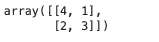
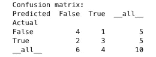
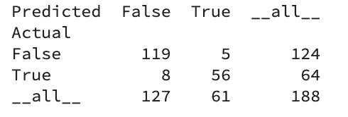
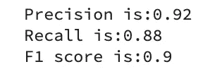
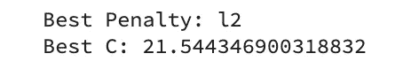
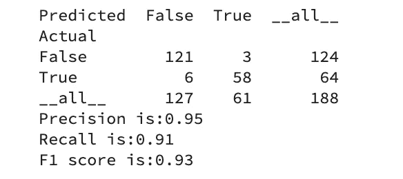

# 用混淆矩阵优化机器学习模型

> 原文：<https://towardsdatascience.com/understanding-the-confusion-matrix-and-its-business-applications-c4e8aaf37f42?source=collection_archive---------10----------------------->


Photo by [Thomas Thompson](https://unsplash.com/@tomthompsonphotography?utm_source=unsplash&utm_medium=referral&utm_content=creditCopyText) on [Unsplash](https://unsplash.com/s/photos/tune?utm_source=unsplash&utm_medium=referral&utm_content=creditCopyText)

## 如何根据您的用例调整分类器，包括 python 中的演练

*机器学习中的混淆矩阵是一个数值网格，有助于评估监督分类模型的性能。从这个网格中，您还可以计算一些指标来为模型打分，包括精确度、召回率和 F1 值。虽然从表面上看这个网格相当简单，而且措施只需要高中水平的数学计算，但矩阵背后的概念却很难掌握。*

在下面的帖子中，我将简单介绍以下内容:

1.  混乱矩阵
2.  精确度、召回率和 F1 分数
3.  python 中的演练演示了如何选择正确的指标并优化模型性能以最大化该指标

## 混淆矩阵

为了这个解释，让我们假设我们正在处理一个二元分类问题，以检测一个交易是否是欺诈性的。我们的模型使用用户和交易的特征，如果预测交易是欺诈性的，则返回 1，否则返回 0。

鉴于机器学习模型很少 100%准确，部署这种模型会有一定程度的风险。如果我们错误地将非欺诈交易归类为欺诈，那么我们很可能会失去该交易，甚至可能失去未来的客户业务。另一方面，如果我们错误地将欺诈性交易检测为非欺诈性交易，那么我们可能会损失该交易的价值。

混淆矩阵实质上将结果预测分为四组。它们如下:

**真阳性(TP):** 模型预测欺诈，交易确实欺诈。

**误报(FP):** 模型预测欺诈，但交易不是欺诈。

**真阴性(TN):** 模型预测不存在欺诈，交易不存在欺诈。

**假阴性(FN):** 模型预测不是欺诈，但交易实际上是欺诈。

为了说明混淆矩阵的样子，我将使用一些人造数据。

有几个 python 库使得构建混淆矩阵相当简单，下面是几个例子；

创建一个非常简单的网格。

```
from sklearn.metrics import confusion_matrixy_true = [0,1,1,0,1,0,0,0,1,1]
y_pred = [0,1,0,0,1,0,0,1,0,1]confusion_matrix(y_true, y_pred, labels=[0,1])
```



Output from sklearn confusion_matrix

pandas_ml 库产生了一个可读性更好的输出。

```
from pandas_ml import ConfusionMatrixConfusionMatrix(y_true, y_pred)
```



Output from panda_ml ConfusionMatrix

让我们使用网格来确定我们上面讨论的 4 个组中每个组的数字。

有 3 个样本，其中模型预测欺诈，并且交易是欺诈性的，因此 TP = 3。这是右下角的数字，其中行和列都为真。

有 1 个样本，其中模型预测欺诈，但交易不是欺诈性的，因此 FP = 1。

有 2 个样本，模型预测不是欺诈，但交易是欺诈的，所以 FN = 2。

有 4 个样本，其中模型正确预测了非欺诈，而交易是欺诈性的，因此 TN = 4。

如果我们在一个企业中，像这样的模型将被部署并用于推动价值成果，混淆矩阵可以帮助确定一些事情。其中包括:

该模型在确定欺诈交易方面有多好？

该模型区分欺诈性交易和非欺诈性交易的能力如何？

模型有多少次错误地预测欺诈性交易不是欺诈性的？

我之前提到的你可以从混淆矩阵中得到的方法可以帮助回答这些问题。

## 精确度、召回率和 F1 分数

从混淆矩阵中可以得出许多度量标准，这些标准都用于衡量模型的性能。我将介绍三种最常用的解释。

*Precision:* 这基本上是对所有被预测为欺诈的样本中有多少是正确的测量。因此，计算是:

TP / (TP + FP)

*回忆(敏感度):*这是对那些欺诈性的样本中有多少被正确预测为欺诈性的度量。

TP /(TP + FN)

这两个指标之间的差异很微妙，但非常重要。如果我们优化精确度，那么我们将得到更少的假阳性(更少的非欺诈交易被归类为欺诈)，0 假阳性将给出满分 1。如果我们对召回进行优化，那么我们会得到更少的假阴性，因此我们会捕获更多的欺诈交易，但这可能会有损于将更多的非欺诈交易错误地归类为欺诈。

*F1 分:*是精确度和召回率的“调和平均值”。

因此，F1 分数很好地指示了分类器的整体准确性，而精确度和召回率提供了关于模型在哪些方面表现良好或不太好的信息。最大化 F1 分数将创建一个平衡的模型，该模型具有精确度和召回率的最佳分数。您选择优化哪个指标将在很大程度上取决于用例。

## 针对给定指标进行调整

有几种方法可以针对适合您的特定用例的特定指标来调整机器学习模型。一个例子是 scikit-learn `GridSearchCV`，它有一个`scoring` [参数](https://scikit-learn.org/stable/modules/generated/sklearn.model_selection.GridSearchCV.html#sklearn.model_selection.GridSearchCV)，允许您选择一个给定的指标。该函数在参数网格上执行[交叉验证网格搜索](https://stackabuse.com/cross-validation-and-grid-search-for-model-selection-in-python/)，并根据您提供的评分标准返回模型的最佳参数。

在这篇文章的下一部分，我将介绍一个使用`GridSearchCV`优化模型的例子。首先导入相关的库。

```
import wget
import pandas as pd
import numpy as np
from sklearn.model_selection import train_test_split
from sklearn.linear_model import LogisticRegression
from sklearn.metrics import classification_report
from pandas_ml import ConfusionMatrix
from sklearn.metrics import precision_score
from sklearn.metrics import recall_score
from sklearn.metrics import f1_score
from sklearn.datasets import load_breast_cancer
from sklearn.model_selection import GridSearchCV
from pandas_ml import ConfusionMatrix
```

在这个例子中，我将使用一个简单的数据集，它由患者样本的属性和一个描述他们是否患有乳腺癌的指标组成。这可以使用下面的代码直接从 [scikit-learn](https://scikit-learn.org/stable/modules/generated/sklearn.datasets.load_breast_cancer.html) 获得。

```
X, y = load_breast_cancer(return_X_y=True)
```

在这个数据集中，恶性类实际上是负类。为了使产生的混淆矩阵更容易解释，我将重新标记它们，使恶性类为阳性。

```
for i in range(len(y)):
    if y[i] > 0:
        y[i] = 0
    elif y[i] < 1:
        y[i] = 1
```

接下来，我将数据分为测试集和训练集。

```
X_train, X_test, y_train, y_test = train_test_split(X, y, test_size=0.33)
```

然后，我将训练一个简单的逻辑回归模型，并使用该模型进行一些预测。

```
rf = LogisticRegression()
model = rf.fit(X_train, y_train)
y_pred = rf.predict(X_test)
ConfusionMatrix(y_test, y_pred)
```

混乱矩阵是这样的。



让我们来计算一下指标。

```
print('Precision is:'+str(round(precision_score(y_test, y_pred),2)))
print('Recall is:'+str(round(recall_score(y_test, y_pred, average='binary'),2)))
print('F1 score is:'+str(round(f1_score(y_test, y_pred, average='binary'),2)))
```



该模型在所有指标上都表现良好。然而，如果我们要用这个模型代替医生对乳腺癌的诊断，那么 8 个假阴性就太多了。因此，对于这个用例，我们希望最大限度地减少假阴性，因此希望优化召回模型。现在，我们将实施`GridSearchCV`并针对该指标优化模型。

首先，我们为两个选择的`LogisticRegression`参数创建超参数搜索空间。

```
penalty = ['l1', 'l2']
C = np.logspace(0, 4, 10)
hyperparameters = dict(C=C, penalty=penalty)
```

然后，我们调用逻辑回归模型并调用`GridSearchCV`，选择`scoring`参数作为召回。

```
lr = LogisticRegression()
clf = GridSearchCV(lr, hyperparameters, cv=5, verbose=0, scoring='recall')
```

现在，我们安装`GridSearchCV`并打印最佳参数以供调用。

```
best_model = clf.fit(X_train, y_train)
print('Best Penalty:', best_model.best_estimator_.get_params()['penalty'])
print('Best C:', round(best_model.best_estimator_.get_params()['C'],2))
```



现在让我们打印最佳模型的混淆矩阵和度量标准。

```
y_pred_gs = best_model.predict(X_test)
cm_gs = ConfusionMatrix(y_test, y_pred_gs)
print(cm_gs)print('Precision is:'+str(round(precision_score(y_test, y_pred_gs),2)))
print('Recall is:'+str(round(recall_score(y_test, y_pred_gs, average='binary'),2)))
print('F1 score is:'+str(round(f1_score(y_test, y_pred_gs, average='binary'),2)))
```

您可以从这些结果中看到，召回分数现在更高了，我们还提高了精确度和召回率。该模型现在能够更好地预测恶性和良性病例的正确标签。



有许多其他指标对全面评估分类模型的性能很重要，包括特异性、AUC 和 ROC。然而，我认为这些需要一篇自己的文章——这是一篇好文章。

感谢阅读！