# 直观理解装袋对方差和偏差的影响

> 原文：<https://towardsdatascience.com/understanding-the-effect-of-bagging-on-variance-and-bias-visually-6131e6ff1385?source=collection_archive---------3----------------------->

## 给出为什么 bagging 算法实际工作的直觉，并以简单易懂的方式展示它们的效果


© by my lovely wife [Tinati Kübler](https://dribbble.com/tinati)

这里有大量优秀的文章描述了像随机森林这样的打包方法在算法层面上是如何工作的，以及为什么打包是一件好事。通常，本质是这样的:

> “你在训练集的不同部分训练许多决策树，然后将它们的预测平均化为最终预测。预测变得更好，因为随机森林的方差与单个决策树的方差相比更小。(dartboard.png)"
> 
> —一些文章

当然，我在这里是转述。这些文章包括很棒的图片、代码和更多的想法。但我经常错过的是对*为什么*装袋是一个好主意以及*如何使用真实数据集看到*方差减少的良好直觉。

因此，在这篇文章中，我想解决这两个缺点，并给出直观的推理，为什么随机森林算法的工作，以及如何可以看到方差的图形改善。你可以把这篇文章看作是对这两个主题的探索，它比一般的关于偏差-方差困境的文章更深入，但不像一篇成熟的研究论文那样深入。尽管如此，我还是会提供一些我认为有用的资源的链接，这样你就可以在需要的时候更深入地了解。

我试图让数学水平非常容易理解，让没有数学专业的人也能理解，同时也给出一些高水平的想法和插图，也让数学相关的人能喜欢。

尽管如此，我还是不会详细解释决策树、随机森林和所有其他提到的模型是如何工作的，因为正如所描述的，这已经被讨论过无数次了。我将只解释非常高级的想法，从决策树开始。

# 决策树

*免责声明:我在这里只谈论普通的决策树。在本文的其余部分，我们不考虑修剪。这些树可以长得任意深。*

## 输出描述

带有 k 个叶子的决策树就是这种形式的模型

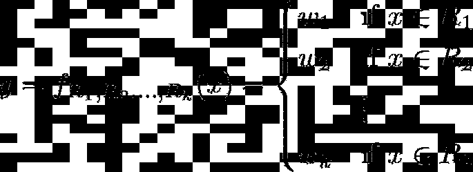

这意味着决策树是在特征空间的区域 *R* 中具有实值 *w* 的分段常数函数。这里 *x* 来自特征空间 *X* 并且 *y* 是来自输出空间 *Y* 的相应标签。对 *R* 的约束是

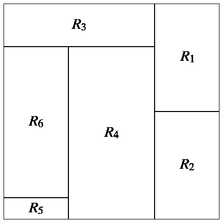

Property 1 and 2 for a 2-dimensional feature space.

1.  它们是边界平行于特征空间坐标轴的矩形
2.  所有矩形的集合是特征空间的一个划分，即，如果你取两个不相交的矩形，并且所有矩形的并集是完整的特征空间。

现在，我们已经确定了这一点，让我们检查一下为什么决策树被称为*高方差算法*，而例如*线性回归*被认为是*低方差算法*。

## 与线性回归的比较

简单回顾一下，线性回归模型具有以下形式:

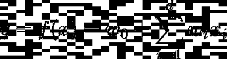

其中权重 *w* 是实数，而 *d* 是样本的维度，即特征的数量。

为了比较这些模型的方差，我们必须后退一步，思考学习问题实际上是什么。

通常，我们会得到固定数量的样本(*学习集*，训练样本)，让我们的算法变变魔术，拟合所有必要的参数，最终，我们可以预测未知样本的值。但是，这是一种相当僵化的看待事物的观点。

在学习理论中，我们将训练集建模为来自空间 *X×Y，*上的分布 *D* ，其中 *X* 是特征空间， *Y* 是输出空间*。*我们从分布中抽取大小为 *n* 的训练集 *L* (以及验证和测试集):

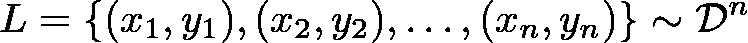

n data samples from the distribution D. Here each of the x’s is a vector of some dimension d coming from the feature space X and the y’s are the corresponding labels from the output space Y.

> 想象一个发行版是一个有按钮的黑盒；如果你点击按钮一次，你会从分布中得到一个随机样本(x₁，y₁)。再次点击它，你会得到另一个样本(x₂，y₂)，独立于之前的样本。重复，直到你有足够的样本。

然后我们可以使用来自 *L* 的 *n* 数据点来训练我们的模型。这为样本 *L 中的所有 *(xᵢ，yᵢ)* (如果我们的模型是好的)输出一个函数 *f* 和 *f(xᵢ)≈yᵢ* 。*这种方法确保模型在训练集上的表现*良好*。

但是现在想象一下，我们从分布 *D* 中查询 *n* 个新样本，并将这些样本用作训练集*L’。*让我们把在这个新集合上训练产生的模型称为 *g.* 这个新模型 *g* 也将满足*l’中所有*【xᵢ'】【yᵢ'】*的条件 *g(xᵢ')≈yᵢ'* 。*

现在，由于*l’*由不同的点 *(xᵢ'，yᵢ')* 组成，新型号 *g* 将具有与*f*不同的输出形状。型号 *f* 和*g**可能会有很大的不同，这取决于 *L* 和*的不同程度**

> *如果对于一个固定的算法(例如“决策树”)，不同训练集 L 和 L’的模型往往相差很大，我们称这个算法为高方差算法。*

*当然，这没有精确的定义，但这对于本文来说也是不必要的。在下文中，我们将使用图形来确定一种算法是否比另一种算法具有更高的方差。*

*如果你对数学感兴趣(干杯！)，我可以推荐 Gilles Louppe 的论文[1]，以及 Shai Shalev-Shwartz 和 T2 Shai Ben-David 的书[2]，这本书非常详细地解释了机器学习的理论基础。*

*让我们回到决策树和线性回归的比较。我们将使用以下运行示例: *X=[0，10]* 和 *Y=ℝ，*即**特征空间的维度为 1** ，并且这一个特征可以取 0 到 10 之间的实数值，而标签可以取任何实数值。*

*在我们的例子中，我们定义一个分布 *D* 做如下事情:从 0 到 10 均匀地选择特征 *x* ，并且通过*隐藏函数*显式地计算标签 y*

*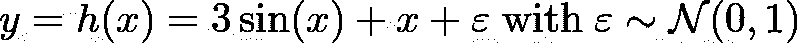*

*y is computed deterministically via 3sin(x)+x and then standard normally distributed noise is added.*

**

*y without the noise.*

*函数 *h* 描述了标签的底层结构，这是我们想要了解标签的真相。我们称之为隐藏，因为我们不会给算法这个信息。他们必须自己想办法。:)*

*按照上面的推理，如果我们对我们的分布 *D* 查询三次，每次 10 个样本，我们可能会得到以下三个训练集:*

*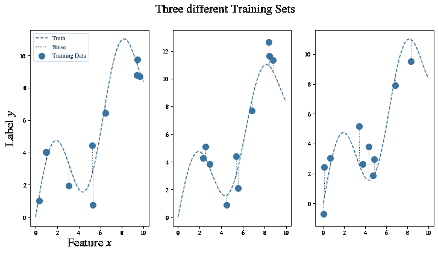*

*Sampling from the distribution three times yields 3 different results. Each time 10 training samples were generated.*

*让我们使用最右边的训练集，并在应用决策树和线性回归后绘制结果。*

*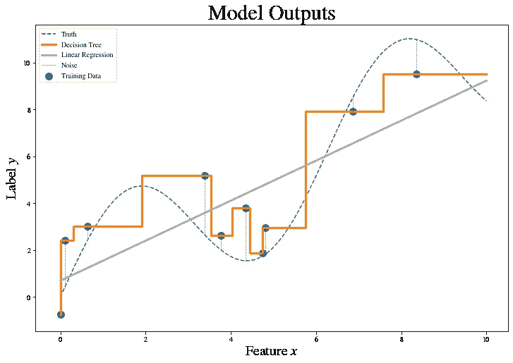*

*We can see that the decision tree fits the training data perfectly, which is not a reason to celebrate, however. The problem is that the algorithm also captures the noise, which we do not want. We are only interested in capturing the underlying structure of the labels (namely 3sin(x)+x), instead.*

## *决策树的偏差和方差与线性回归*

*让我们对 3000 个独立采样的训练集进行 3000 次相同的实验，每个训练集的大小也是 10。在左侧，我们可以看到决策树的结果，在右侧，线性回归结果相互叠加。*

*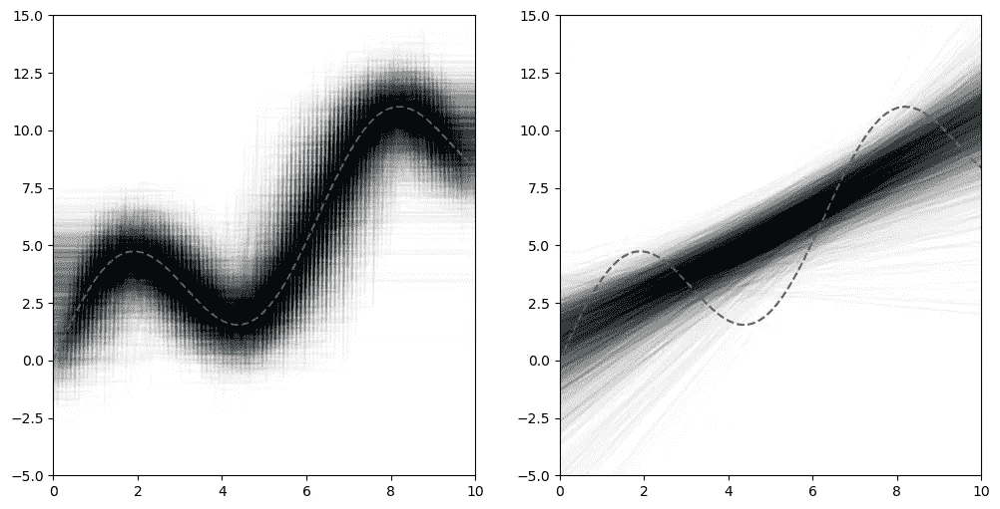*

*Each trial gives one curve in transparent black. The more lines stack, the darker the intersections get. The dashed blue line is 3sin(x)+x again, the underlying truth.*

*在这里，我们可以看到决策树(左侧)**平均来说非常适合数据**。人们也称这种属性为**决策树**具有**低偏差**。同时，对于右侧的线性回归，该模型显然不能捕捉底层标签结构的复杂模式。我们说**线性回归**有**高偏差** *，*在这种情况下，是不能够得知真相的。*

*然而，如果你考虑这些黑管的**垂直宽度**，源自决策树的黑管比右边的线性回归黑管更宽。这意味着，当对训练数据集进行重新采样时，决策树预测*在*附近摆动的幅度比线性回归预测更大，我们称之为具有**高方差**的**决策树**和具有**低方差**的**线性回归**。*

*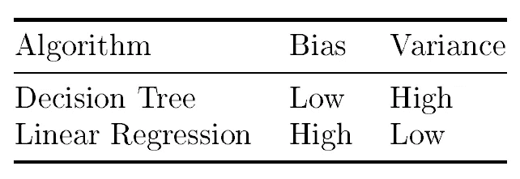*

*Summary of the algorithm properties.*

*我们实际上想要的是具有**低偏差**(它们平均符合事实)**和低方差**(它们不会过多地偏离事实)的算法。幸运的是，有许多方法可以降低偏差(例如，使用一种称为*Boosting*的技术)，还有其他方法可以降低方差*。*后者可以通过所谓的*装袋来实现。*装袋的好处是，它也不会再次增加偏差，这一点我们将在下一节讨论。*

> *这就是为什么 Bagging 和线性回归一起使用的效果很低:你不能通过 Bagging 来减少偏差，但可以通过 Boosting 来减少偏差。有趣的是，将决策树与 Boosting 结合使用也被证明是有用的。在这种情况下，使用大量修剪的决策树，它也具有较低的偏差。*

# *制袋材料*

*在这一节中，我们将看到 Bagging 做什么，为什么它工作，以及如何看到方差的减少。*

## *简单的动机*

*假设我们有标准正态分布，特别是，一个观察值的均值为 0，方差为 1。让我们假设我们喜欢看到 0 附近的值(*就像我们喜欢看到 3sin(x)+x* 附近的预测函数一样)。但是 1 的方差对于我们的口味来说太大了(*就像黑色灯管的宽度*)，我们正在寻找减小它的方法。一种简单的方法是从标准正态分布中抽取更多的值，然后取它们的平均值。以下结果是众所周知且易于验证的:*

*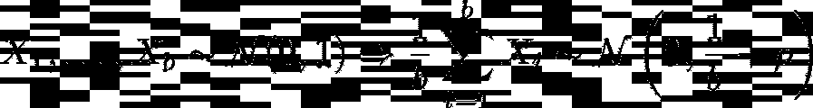*

*The average of standard normal random variables is [also normally distributed](https://en.wikipedia.org/wiki/Sum_of_normally_distributed_random_variables). The new mean is just the sum of the means and the new variance can be computed with the [Bienaymé Formula](https://en.wikipedia.org/wiki/Variance#Sum_of_uncorrelated_variables_(Bienaym%C3%A9_formula)). ρ is a term that reflects the dependencies between random variables. If they are all independent, then ρ=0\. If the [covariances](https://en.wikipedia.org/wiki/Covariance) between the random variables are all less than a bound K, then ρ is also less than K.*

*因此，通过平均，我们模拟从**另一个正态分布**中提取，具有**相同的平均值**，但是具有**较小的方差**，如果ρ不太大。这很好，因为我们得到的**值比以前更接近零，而**的概率比以前更高！*

*在独立随机变量( *ρ=0* )和 *b=100* 的特殊情况下，比如方差从 1 下降到 0.01。结果如下:*

*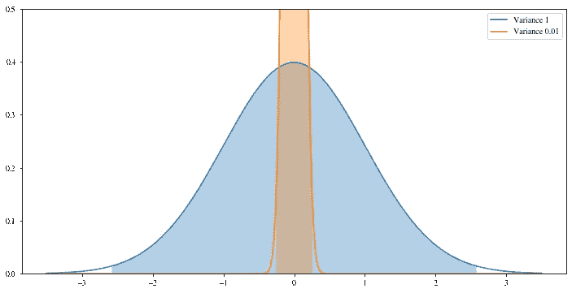*

*The normal distribution is with a variance of 0.01 is much narrower than the standard normal distribution with a variance of 1\. In the shaded regions, one can see where 99% of the probability of each distribution lies.*

***注意:**如果随机变量 *X* 都与值 1 相关，这意味着 *ρ=(b-1)/b* ，即平均值的方差又会是 1。这对应于每个样本实际上是相同数量的情况。对许多相同的数字进行平均并不能给我们任何新的信息，所以这相当于只画一个值。*

> *在最好的情况下，我们可以平均独立样本。它们越相关，在平均过程中就越无用。*

## *装袋的核心理念*

*现在，有用的见解是**我们可以用预测模型**做同样的事情。在随机抽取的训练数据集上运行决策树算法为我们提供了一个模型，它本质上是从分布中对函数**进行采样。对这些模型进行平均得到了另一个模型(如随机森林),具有相同的偏差**,但方差**较低。平均而言，这种集成模型比单个决策树更接近事实。***

*但问题是:这些功能的相关性有多差？考虑以下情况:如果我们遇到一个数据集，我们可以在它上面安装一个决策树。到目前为止，一切顺利。但是，如果我们再做一次，在决策树的情况下，结果将(几乎)相同。这意味着我们以这种方式采样的函数是高度相关的 *(ρ≈1)* ，并且不会改进单个决策树。*

> *它不一定正好是 1，因为决策树算法偶尔必须打破束缚，这可以以随机方式进行，但是因为这是随机性的唯一来源，所以它不会产生彼此根本不同的树。*

*不管怎样，我们必须去相关这些树，我们将在下一节看到如何去做。*

## *走向随机森林*

*随机森林是 Leo Breiman 发明的[3]。这里的想法是以一种特殊的方式在训练集上安装许多决策树，给出同样多的树模型(=函数)。之后，这些树被组合成单个模型，例如，通过对任何给定输入 *x，*的输出进行平均，使其成为一种特殊的打包方法。这导致了一个具有较低方差的模型，类似于我们之前看到的正态分布随机变量。*

*获得许多非最大相关树的想法如下:*

1.  *对每棵树使用训练样本的随机子集。*
2.  *在生长每棵树的每个步骤中使用随机的特征子集。*

*拥有两个随机化源比只使用其中一个更有助于减少不同树之间的相关性。如果你碰巧设计了一个新的装袋算法，请随意添加更多！还有各种其他方法来组合单个决策树，例如 Geurts 等人[4]的极度随机化的树。*

# *一维决策树和随机森林的方差比较*

*让我们再次从我们的分布中抽取 10 个样本，并拟合一个决策树和一个包含 100 个决策树的随机森林。我们重复这个过程 1000 次，得到下面的图片:*

*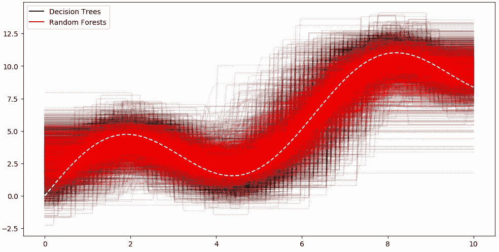*

*我们看到由随机森林形成的红管的垂直宽度小于决策树的黑管。因此，正如所料，**随机森林比决策树**具有更低的方差。此外，似乎两个管的平均值(中间)是相同的，这意味着平均**的过程没有改变偏差**。我们仍然很好地实现了底层的真实函数 *3sin(x)+x* 。*

*请注意，随机森林算法在这里无法显示其全部潜力，因为我们使用的数据集只有一个特征，每个决策树都必须使用这个特征。因此，随机森林中的 100 棵决策树只能在被选择来生长每棵树的训练样本之间有所不同。在这种情况下，随机森林算法就变成了更简单的 Bagging 算法，只对每棵树使用不同的训练样本。*

*如果我们想扩大方差的差距，同时仍然能够直观地解释结果，我们必须转移到二维特征空间。这允许随机森林算法在算法的每一步从两个可用特征中随机选择**恰好一个**。*

# *二维决策树和随机森林的方差比较*

*让我们为训练数据定义一个分布，它类似于我们在一维情况下使用的分布。我们选择*x =【0，10】*和 *Y=ℝ，*其中 *D* 从顶点在 *(0，0)，(0，10)，(10，0)* 和 *(10，10)* 的正方形中均匀采样一个 *(x，x’)*和*

*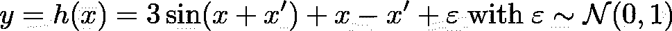*

*Similar to what we have seen before, y is computed deterministically via 3sin(x+x’)+x-x’ and then standard normally distributed noise is added.*

*包含 50 个点的随机数据集可能如下所示:*

*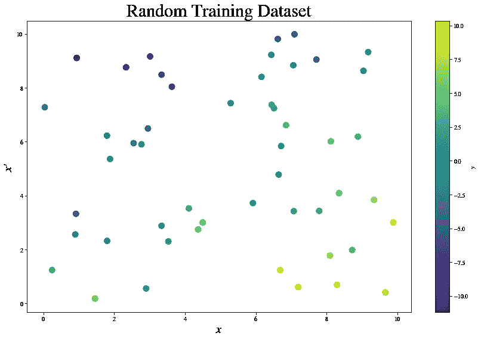*

*50 random points from the distribution. We can see that there are higher values in the bottom right corner and lower values in the top left corner. The diagonal region separating these two corners is filled with values around zero.*

*现在，让我们看看在这种情况下，决策树和随机森林的方差是如何表现的。享受成果！*

*让我们首先从决策树的例子开始。我们使用 9 个不同的训练数据集来种植 9 棵不同的树。*

*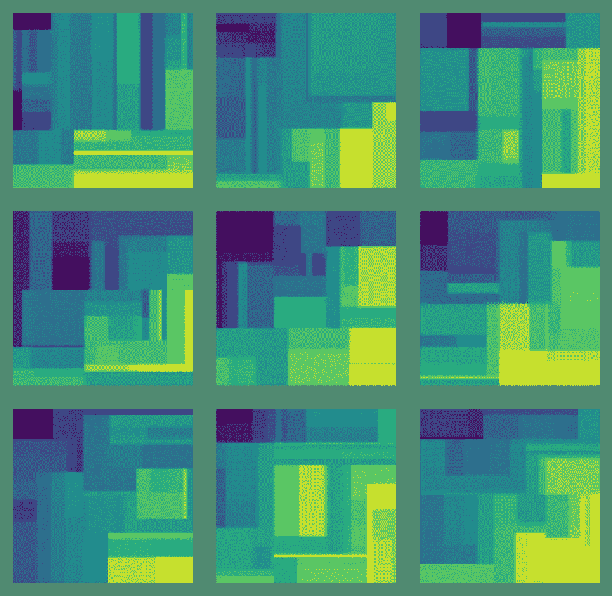*

*We see that each of these nine pictures differ quite a lot. The bottom right is always bright (indicating high values) and the top left is dark (indicating low values), but the size and shape of all the rectangles vary significantly.*

*看着眼熟？；)*

*现在，让我们对随机森林做同样的事情。这里，我们在样本**的不同子集上再次训练每个随机森林的 100 个决策树，并且随机使用两个给定特征** **中的仅一个****！每个模型在 50 个随机样本点上进行训练。***

***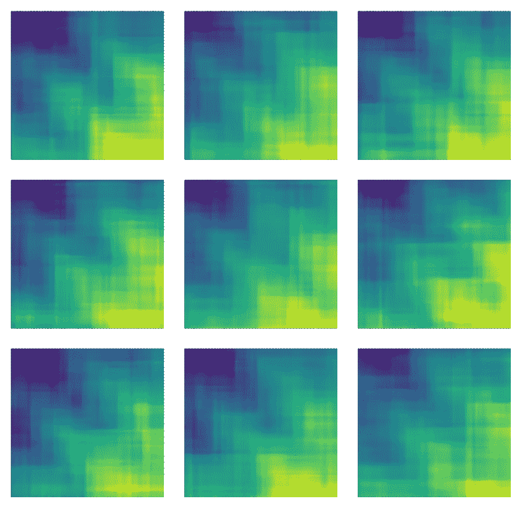***

***Not only can we see the high values in the bottom right and the low values in the top left again, but the pictures look very similar. There is a nice and smooth gradient that looks similar in each picture.***

# ***结论***

***很明显，当训练集改变时，高方差算法会迅速改变它们的结果(模型)。这很糟糕，因为我们永远不知道我们的具体模型离事实有多远，即使我们的模型的偏差为零。***

***但是我们学会了如何通过装袋来增加获得好模型的机会。我们也有一个直觉，为什么装袋降低了方差，而保持偏差不变，我们已经在很多例子中看到了这些结果。***

# ***参考***

***[1] G. Louppe，[理解随机森林—从理论到实践](https://arxiv.org/abs/1407.7502) (2014)，学位论文***

***[2] S. Shalev-Shwartz 和 S. Ben-David，[理解机器学习:从理论到算法](https://www.cse.huji.ac.il/~shais/UnderstandingMachineLearning/) (2014)，剑桥大学出版社***

***[3] L .布雷曼，[随机森林](https://www.stat.berkeley.edu/~breiman/randomforest2001.pdf) (2001)，机器学习 45.1(2001):5–32***

***[4] P. Geurts，D. Ernst 和 L. Wehenkel，[极度随机化的树](http://citeseerx.ist.psu.edu/viewdoc/download?doi=10.1.1.65.7485&rep=rep1&type=pdf) (2005)，机器学习 63.1(2006):3–42***

***我用[乳胶](https://www.latex-project.org/)创造了所有的配方。对于其他图形，我使用了 [Python](https://www.python.org/) 库 [matplotlib](https://matplotlib.org/) 和 [numpy](https://numpy.org/) 。对于模型训练，我使用了 [scikit-learn](https://scikit-learn.org/) 。***

# ***承认***

***我要感谢帕特里克·鲍曼博士的校对工作，并为改进我的文章提供了许多有益的建议。也感谢安德烈·埃塞的帮助！***

# ***奖励:马赛克的代码***

***当你开始用这种决策树马赛克艺术赚钱时，请想起我。😀***

```
***import matplotlib.pyplot as plt
from sklearn.tree import DecisionTreeRegressor
import numpy as np

# Sample from the distribution with a true function f.
def generate_data_2d(f, n_samples):
    x1 = np.random.uniform(0, 10, n_samples)
    x2 = np.random.uniform(0, 10, n_samples)
    y = f(x1, x2) + np.random.randn(n_samples)
    return np.vstack([x1, x2]).transpose(), y

# Parameters to play round with.
f = lambda x1, x2: 3 * np.sin(x1 + x2) + x1 - x2
n_samples = 50
n_rows = 3
n_cols = 3

# Increase numbers to remove white spaces in the pictures.
n_points = 100
size_points = 6

# Prepare the plotting.
fig = plt.figure(constrained_layout=True, figsize=(12, 12))
all_points = np.array([(x1, x2) for x1 in np.linspace(0, 10, n_points) for x2 in np.linspace(0, 10, n_points)])

# Start plotting.
for i in range(1, n_rows * n_cols + 1):
    # Get a random training set.
    x, y = generate_data_2d(f, n_samples)

    # Train a decision tree.
    dt = DecisionTreeRegressor()
    dt.fit(x, y)
    predictions = dt.predict(all_points)

    # Create one mosaic picture.
    ax = fig.add_subplot(n_rows, n_cols, i)
    ax.axis('off')
    ax.scatter(all_points[:, 0], all_points[:, 1], c=predictions, s=size_points)***
```

***我希望你今天学到了新的、有趣的、有用的东西。感谢阅读！***

*****作为最后一点，如果你*****

1.  *****想支持我多写点机器学习和*****
2.  *****无论如何，计划获得一个中等订阅，*****

*****为什么不做** [**通过这个环节**](https://dr-robert-kuebler.medium.com/membership) **？这将对我帮助很大！😊*****

****说白了，给你的价格不变，但是大约一半的订阅费直接归我。****

***非常感谢，如果你考虑支持我的话！***

> ***如果您有任何问题，请在 [LinkedIn](https://www.linkedin.com/in/dr-robert-k%C3%BCbler-983859150/) 上给我写信！***