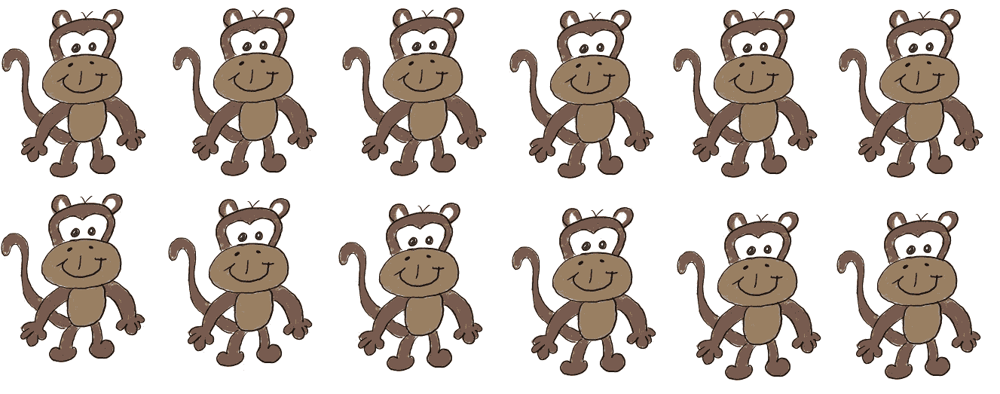
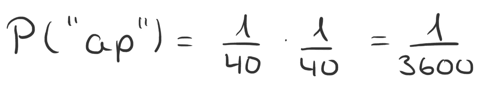
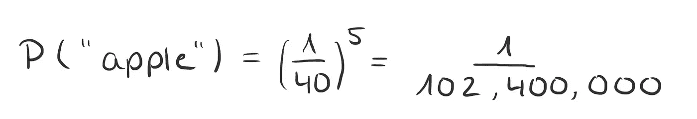
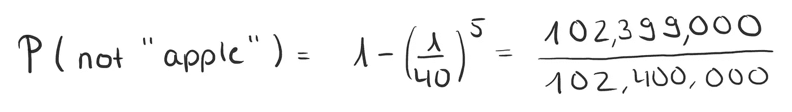
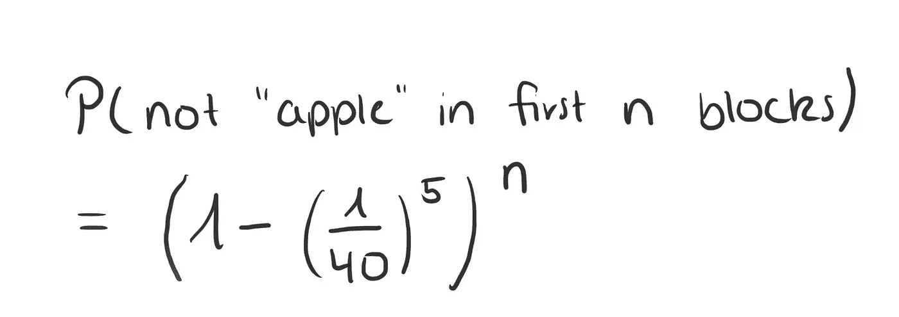

# 理解无限猴子定理

> 原文：<https://towardsdatascience.com/understanding-the-infinite-monkey-theorem-ea743d703daa?source=collection_archive---------13----------------------->

## 概率论的荒谬之处，以及为什么在猜测概率时不能相信自己的直觉

想象你有无限多的猴子。现在你给每只猴子一台笔记本电脑，让它们无限长时间地随机打字。在某个时候，这个故事会出现在任何一台笔记本电脑上，因为任何一只猴子偶然输入了它，这种可能性有多大？

Not infinitely many monkeys, but still a few! Drawing by Author (excuse my Art skills!)

或者让场景更真实一点，用一只猴子代替无限多的猴子。(说真的，让一只猴子永远打字可能已经是一个足够的挑战了，即使你没有考虑到猴子最终会死)。

还是那句话，如果我们让这只猴子，姑且称它为 Charly，永远打字的话，它打这篇文章的几率有多大？

把这个问题问给任何没学过概率的人，我向你保证(至少有 50 %的几率)，他们会把你当疯子一样看待。他们也会告诉你概率为零，或者至少接近于 0。

但令人惊讶的答案是:不是。在猴子无限的打字旅程中的某个时刻，它打出这篇文章(或任何其他文章)的概率是 1。

为什么你会想知道？让我们来看看背后的数学核心！

# 理解概率

首先，我们需要了解概率来理解定理。让我们假设(为了简单起见)，猴子只有 40 个键可供选择，包括字母(a，b，c，…z)，一些标点符号("，"，"。"、":"、…)和空格。

我们还假设猴子随机打字，并且每个键都以相同的概率被按下。这意味着每个键的概率是相同的。

打字母“a”的概率有多大？嗯，我们总共有 40 个可能的键，“a”是其中之一，所以“a”被按下的概率是 1/40。这同样适用于每隔一个键，因此键入“p”的概率也是 1/40，以此类推。

The probability of pressing “a” is 1/40.

我们已经说过查理随机按键。我们的意思是，无论他接下来键入什么，都与他之前键入的内容无关。数学上，我们说这些事件是随机独立的。

因此，如果我们想计算 Charly 先输入“a”然后输入“p”的概率，我们将这些概率相乘。因此，猴子先输入“a ”,然后输入“p”的概率是 1/40 * 1/40 = 1/1600——这是非常小的。

The probability of pressing “a” and then “p”, i.e. “ap” is 1/3600.

为什么乘而不加？有数学上的解释，也有直观的解释。为了直观的解释，请记住，猴子先输入“a”然后输入“p”的事件比先输入“a”然后再输入任何东西的概率要小。由于概率是介于 0 和 1 之间的数字，通过将它们相乘，我们使这些数字变小。如果我们把概率相加，结果会是一个更大的数字——这没有意义。如果你想知道如果你把概率相加会发生什么，你会得到猴子输入“a”或“p”的概率。

现在，猴子输入“苹果”的概率是多少？

The probability of typing “apple” is surprisingly small!

哦，那真是小得令人难以置信。其实应该小于彩票中奖的几率(至少有所收获)。我可能会在未来的另一篇文章中再次确认这一说法。

那么不输入数学的概率会是多少？就是 TR:互补概率，所以我们可以用 1 减去输入“苹果”的概率来计算。

Conversely, the probability of not typing “apple” is quite high.

这是在前 5 个字母中没有输入“苹果”的概率。我们现在可以计算前 n * 5 块内不输入的概率！

This is the probability of not typing apple within the first n blocks of size 5 each.

这是一个概率，意味着它取 0 到 1 之间的值。对于小 n，该值接近 1，但是随着 n 变大，不键入“apple”的概率也变得越来越小，最终接近 0。这意味着最终输入“苹果”的概率也接近 1。

完成了。经过验证。最终，我们的猴子 Charly 会键入“apple ”,同样，它也会键入这篇文章。

# 等等，重点在哪里？

这个结果太棒了！因为这也意味着如果我们继续玩彩票，最终我们会赢。

那为什么没有一个理智的数学家会利用彩票来发财呢？

因为:

a)平均而言，你总是会入不敷出(我们将在以后的另一篇文章中讨论这一点)。

b)在你达到正确的数字之前，你很可能会死或者没钱。

因为即使输入“苹果”的概率最终会趋近于 1，这也要花费难以置信的大量时间。

假设 Charly 以每秒一个键的速度打字，他大概需要 11.25 年才能打出“苹果”，概率至少是 0.5 或 50%。在这 11.25 年里，查理不允许做任何其他事情，甚至不允许睡觉或吃饭。

所以，不，我永远不会建议你去玩彩票，或者去赌一只在现实生活中打字的猴子。我永远不会向你推荐它，除非你没什么可输的，而且赢的机会微乎其微，总比什么都没有好。

但是——我会一直建议你和你的朋友打赌，你假想的猴子最终会打你最喜欢的书。