# 理解梯度下降背后的数学。

> 原文：<https://towardsdatascience.com/understanding-the-mathematics-behind-gradient-descent-dde5dc9be06e?source=collection_archive---------0----------------------->

## 机器学习中一种常用优化算法背后的简单数学直觉。

PC: Pexels/Pixabay

> "过早优化是万恶之源."
> ――高德纳

[**敏捷**](http://en.wikipedia.org/wiki/Agile_software_development) 是软件开发过程中一个相当知名的术语。背后的基本思想很简单:快速建立一些东西，➡️把它拿出来，➡️得到一些反馈，➡️根据反馈做出改变，➡️重复这个过程。**的目标**是让产品靠近用户，并通过**反馈**引导你获得误差**最小**的最佳产品。同样，为改进而采取的**步骤**需要很小，并且应该不断地让用户参与进来。在某种程度上，敏捷软件开发过程包括快速迭代。尽快从解决方案开始，尽可能频繁地度量和迭代的想法是引擎盖下的[梯度递减](https://hackernoon.com/life-is-gradient-descent-880c60ac1be8) t。

# 目标

梯度下降算法是一个迭代过程，将我们带到一个函数的最小值(除了一些警告)。下面的公式在一行中总结了整个梯度下降算法。

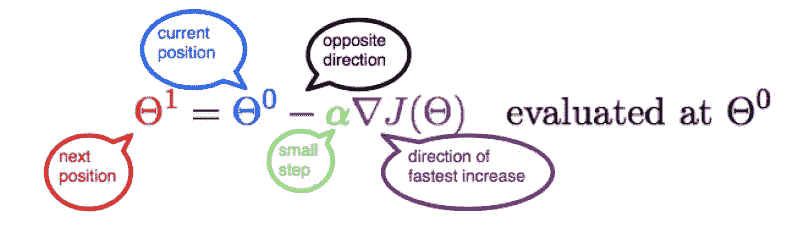

[https://www.coursehero.com/file/27927651/Gradient-Descentpdf/](https://www.coursehero.com/file/27927651/Gradient-Descentpdf/)

但是我们如何得出这个公式呢？嗯，它很简单，包括一些高中数学。通过这篇文章，我们将尝试在线性回归模型的背景下理解并重新创建这个公式。

> 本文改编自《编码列车 **》视频 [**梯度下降的数学——智能与学习。这篇文章最初是作为笔记来补充我的理解。我也强烈推荐看这个视频。**](https://www.youtube.com/watch?v=jc2IthslyzM&vl=en)**

# 机器学习模型

*   考虑二维空间中的一组数据点。假设数据与一组学生的身高体重有关。我们试图预测这些量之间的一些关系，以预测一些新生的体重。这本质上是监督机器学习技术的一个简单例子。
*   现在让我们在空间中画一条穿过这些数据点的任意线。这条直线的方程式是`**Y = mX + b**`，其中 **m** 是斜率，而 **b** 是它在 Y 轴上的截距。

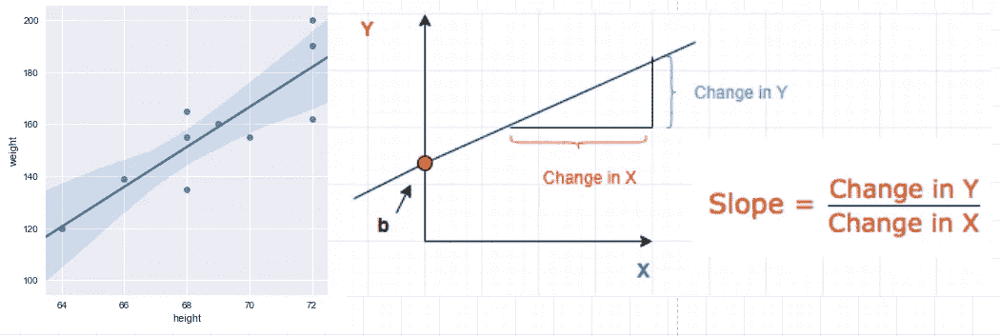

## 预言

给定一组已知的输入及其相应的输出，机器学习模型试图对一组新的输入进行一些预测。

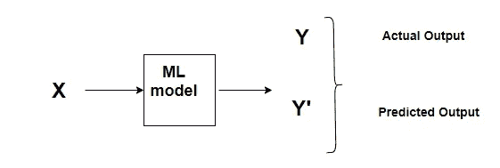

ML process

误差将是两个预测之间的差异。

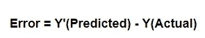

这涉及到**成本函数或损失函数的概念。**

# 价值函数

一个**成本函数/损失函数**评估我们的机器学习算法的性能。**损失函数**计算单个训练示例的误差，而**成本函数**是所有训练示例的损失函数的平均值。从今以后，我将交替使用这两个术语。

> 成本函数基本上告诉我们，我们的模型在预测给定的 m 和 b 值时有多好。

假设数据集中总共有“N”个点，对于所有这“N”个数据点，我们希望最小化误差。因此，成本函数将是总平方误差，即

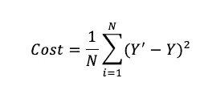

The cost function for N data points

> 为什么我们要平方差，而不是绝对差？因为平方差更容易得出回归线。事实上，为了找到这条线，我们需要计算成本函数的一阶导数，而计算绝对值的导数比计算平方值要困难得多。此外，平方差增加了误差距离，从而使坏的预测比好的预测更明显。

## 最小化成本函数

> 任何机器学习算法的目标都是最小化成本函数。

这是因为实际值和预测值之间的误差越小，表示该算法已经完成了出色的学习工作。因为我们想要最低的误差值，所以我们想要给出最小可能误差的那些' **m'** 和' **b'** 值。

## 我们如何最小化任何函数？

如果我们仔细观察，我们的**成本函数**的形式是`**Y = X²**` 。在笛卡尔坐标系中，这是一个抛物线方程，可以用图形表示为:

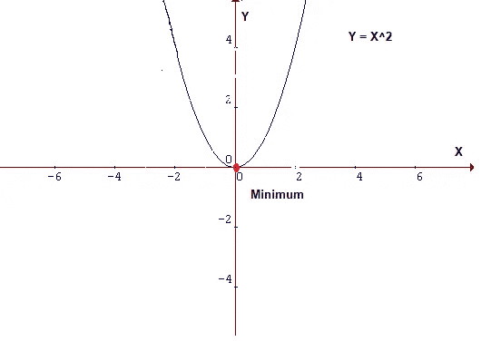

Parabola

为了最小化上面的函数，我们需要找到 `**X**` **中产生** `**Y**` 最小值的**，也就是**红点。因为这是一个 2D 图，所以很容易在这里找到最小值，但是情况可能不总是这样，尤其是在更高维度的情况下。对于这些情况，我们需要设计一个算法来定位最小值，这个算法叫做**梯度下降。******

# 梯度下降

**梯度下降**是最流行的优化算法之一，也是优化神经网络最常用的方法。这是一种迭代优化算法，用于寻找一个函数的最小值。

## 直觉

假设你正沿着下图走，并且你现在在“**绿色**点。你的目标是到达最小值，即“红色”点，但从你的位置，你无法查看它。

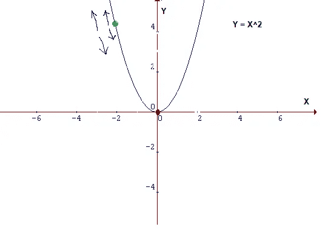

Figure 2

**可能的行动有:**

*   你可能向上或向下
*   如果你决定走哪条路，你可能会迈出一大步或一小步来到达你的目的地。

> 本质上，有两件事你应该知道以达到最小值，即走哪条路，走多大的一步。

梯度下降算法有助于我们利用导数高效和有效地做出这些决定。一个**导数**是一个来自微积分的术语，计算为图形在特定点的斜率。斜率是通过在该点画一条切线来描述的。所以，如果我们可以计算这条切线，我们就可以计算出达到最小值的方向。我们将在文章的后半部分更详细地讨论这一点。

## 最小值

在同一个图中，如果我们在绿点画一条切线，我们知道如果我们向上移动，我们就远离最小值，反之亦然。此外，切线给我们一种斜率陡度的感觉。

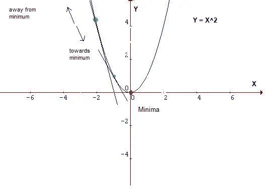

蓝点处的斜率没有绿点处的斜率陡，这意味着从蓝点处到达最小值所需的**步数比从绿点处到达最小值所需的**步数少得多。

## 成本函数的数学解释

现在让我们把所有这些知识放进一个数学公式。方程中，`y = mX+b`‘m’和‘b’是它的参数。在训练过程中，他们的价值观会有一个小的变化。让这个小变化用δ **表示。**参数值将分别更新为**m = m-δm**T1 和 **b=b-δb，**。我们的目标是在`y = mx+b`中找到误差最小的 m 和 b 的值，即最小化成本函数的值。

重写成本函数:

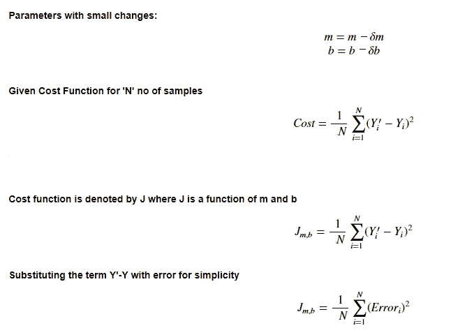

> 这个想法是，通过计算函数的导数/斜率，我们可以找到函数的最小值。

# 学习率

达到最小值或底部所需的步长称为**学习速率**。我们可以用更大的步长/更高的学习率覆盖更多的区域，但是有超过最小值的风险。另一方面，小步/更小的学习率会消耗大量时间到达最低点。

下面的形象化展示了学习率的概念。请看第三张图，我们如何用最少的步数到达最小的点。这是这个问题的最佳学习率。

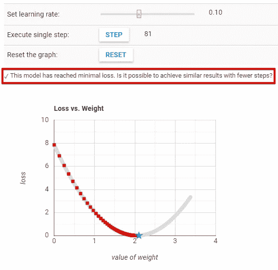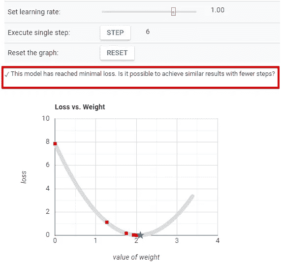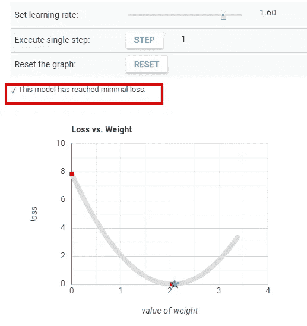

[Source](https://developers.google.com/machine-learning/crash-course/fitter/graph)

我们看到，当学习率太低时，需要很多步才能收敛。另一方面，当学习率太高时，梯度下降无法达到最小值，如下图所示。

[Source](https://developers.google.com/machine-learning/crash-course/fitter/graph)

访问下面的链接，尝试不同的学习速度。

 [## 优化学习速度|机器学习速成班|谷歌开发者

### 能否以更高的学习率更快地达到最小值？将学习率设置为 1，并持续按步骤…

developers.google.com](https://developers.google.com/machine-learning/crash-course/fitter/graph) 

# 派生物

机器学习在最优化问题中使用导数。像*梯度下降*这样的优化算法使用导数来决定是否增加或减少权重来增加或减少任何目标函数。

> 如果我们能够计算一个函数的导数，我们就知道朝哪个方向去最小化它。

主要我们将处理微积分中的两个概念:

*   **权力法则**

幂规则计算变量的幂的导数。

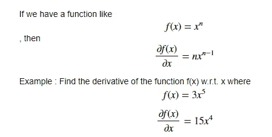

*   **链式法则**

**链式法则**用于计算复合函数的导数。链式法则也可以用[莱布尼茨的符号](https://en.wikipedia.org/wiki/Leibniz%27s_notation)表示如下:

如果一个变量 ***z*** 依赖于变量 ***y*** ，而后者又依赖于变量 ***x*** ，那么 *y* 和 *z* 都是因变量，那么 *z* 通过中间变量 *y* 也依赖于 *x* 。这被称为[链式法则](https://en.wikipedia.org/wiki/Chain_rule)，数学上写为:

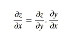

让我们通过一个例子来理解它:

*   使用导数的**幂**和**链**规则，让我们计算成本函数相对于 m 和 c 如何变化。这涉及到**偏导数的概念，**它说，如果有一个两个变量的函数，那么要找到该函数对一个变量的偏导数，将另一个变量视为常数。这将通过一个例子变得更加清楚:

## 计算梯度下降

现在让我们将这些微积分规则的知识应用到我们的原始方程中，并找到成本函数 w.r.t 对**‘m’**和**‘b’**的导数。修改成本函数方程:

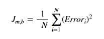

为了简单起见，让我们去掉求和符号。求和部分很重要，尤其是对于**随机梯度下降(SGD )** 与**批量梯度下降**的概念。在**批次梯度下降**期间，我们一次查看所有训练样本的误差，而在 **SGD、**中，我们一次查看每个误差。然而，为了简单起见，我们将假设我们一次查看一个错误。

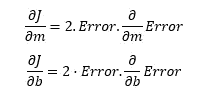

现在让我们计算误差 w.r.t 对 m 和 b 的梯度:

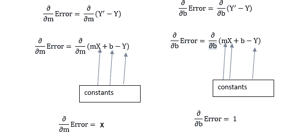

将值插回到成本函数中，并将其乘以学习率:

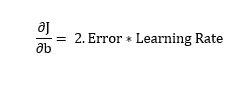

这个等式中的这个 **2** 并不那么重要，因为它只是说我们的学习率是它的两倍或一半。所以让我们也摆脱它。所以，最终，整篇文章归结为两个简单的方程，代表梯度下降的方程。

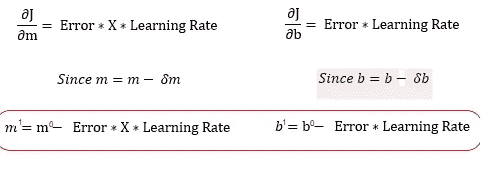

m，b =下一个位置参数；m⁰,b⁰ =当前位置参数

> 因此，为了求解梯度，我们使用新的 m 和 b 值迭代我们的数据点，并计算偏导数。这个新的梯度告诉我们在当前位置的成本函数的斜率，以及我们应该移动以更新参数的方向。我们更新的大小是由学习率控制的。

# 结论

本文的重点是演示梯度下降的概念。我们使用梯度下降作为线性回归的优化策略。通过绘制最佳拟合线来衡量学生身高和体重之间的关系。然而，这里需要注意的是，线性回归示例是为了简单起见而选择的，但是也可以与其他机器学习技术一起使用。