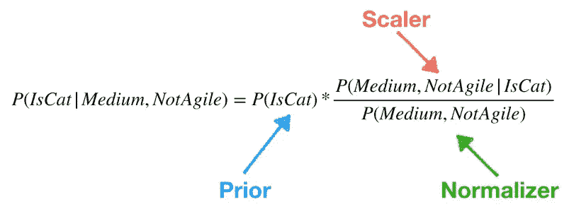
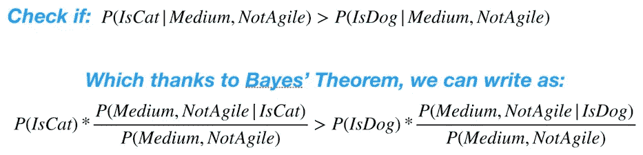
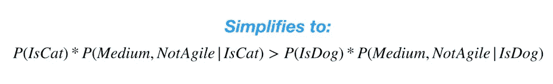
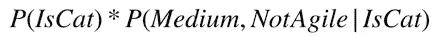
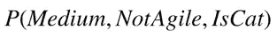
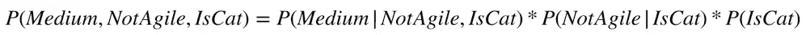
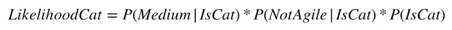
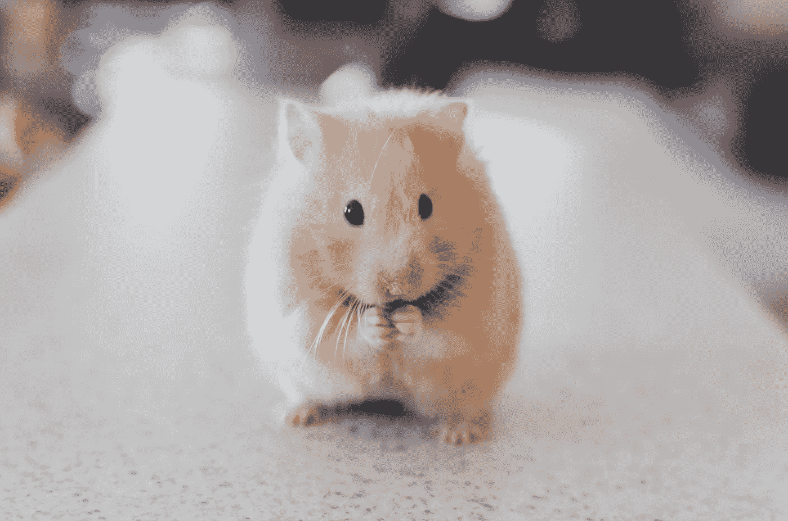

# 了解朴素贝叶斯分类器

> 原文：<https://towardsdatascience.com/understanding-the-naive-bayes-classifier-16b6ee03ff7b?source=collection_archive---------6----------------------->

## 用这个经典的分类算法对猫、仓鼠、垃圾邮件等进行分类

现在，我们已经充分探索了贝叶斯定理，让我们来看看利用它的分类算法——朴素贝叶斯分类器。

分类是定量计算给定观察值应被分配到哪个类别(也称为组)的过程，是数据科学中的一个重要过程。分类的一些示例应用包括弄清楚患者是否特别有患病风险，识别可能流失的客户，或者将电子邮件标记为垃圾邮件。

有许多分类算法，每一种都有各自的优缺点。例如，如果您只想获得预测能力，您可以考虑 XGBoost 或神经网络。如果您对了解哪些因素以及这些因素如何驱动您的类之间的差异更感兴趣，您可以考虑使用逻辑回归。

朴素贝叶斯是一种已经存在了一段时间的算法(根据维基百科的说法，从 20 世纪 60 年代[开始)。虽然它可能缺乏一些最近开发的算法的宣传和火力，但它是一个强大而通用的工具，经受住了时间的考验(**)而且它的缺点也很好理解，这在构建模型时往往一样有用，甚至更有用** ) —所以它绝对值得更多地了解。](https://en.wikipedia.org/wiki/Naive_Bayes_classifier)

# 它是做什么的？

让我们先退后一步，用**贝叶斯术语来构建我们的分类问题——我们有一组先验信念，并在观察和收集证据时更新我们的信念。**

在统计学中，一切都围绕着假设。我们对世界如何运转做出一个假设(一个有根据的猜测)，然后我们着手收集证据来检验这个假设(如果你想知道细节，[我在这里写了一篇关于假设检验的文章](/data-science-fundamentals-a-b-testing-cb371ceecc27))。

分类模型也可以被框定为一种假设。让我们首先写出分类问题的目标和变量:

*   **目标**是在给定其特征的情况下，预测给定观察值属于哪一类。例如，给定一个描述，我们可能试图预测某个动物是猫、狗还是仓鼠。
*   **Y** =我们试图预测的类标签。在我们的例子中，类别标签是猫、狗和仓鼠。
*   **X1，X2，X3 等。** =我们试图进行预测的观察特征。我们可能用来区分猫、狗和仓鼠的一些特征是大小和灵活性(喵喵叫、吠叫、沉默类别会使这太容易了)。

好了，这就是分类——现在让我们通过贝叶斯透镜来检查分类。大多数分类算法通过估计(对于每个类别)观察值属于该类别的概率来进行预测。那么估计概率最高的类就是我们的预测:

> P(Y = Cat) = 0.20
> 
> **P(Y =狗)= 0.60**
> 
> P(Y =仓鼠)= 0.20
> 
> **预言被观察的动物是狗！**

但是我们如何计算这些类概率呢？救援的条件概率！条件概率 P(H|E)(其中 H 是我们的假设，E 是我们的证据)是在给定证据的情况下我们的假设为真的概率。对于猫的例子，我们的假设 H 是观察对象是一只猫。我们的证据 E 是它是中等规模的，不敏捷。给定我们的证据，我们可以将它是猫的条件概率写为(等式读作“给定它是中等大小且不敏捷的观察是猫的概率”):

> P(Y=Cat | Size=Medium，Agile=No)

好的，这很酷，但是我们实际上如何解决它呢？这就是[贝叶斯定理](/understanding-bayes-theorem-7e31b8434d4b)的用武之地——利用它我们可以写出:

我在这里再次使用了我在[上一篇文章](/understanding-bayes-theorem-7e31b8434d4b)中描述的一些术语，但是让我快速回顾一下:

*   **先验**是随机选择的观察结果是猫的未缩放概率。对于我们的模型，估计 P(IsCat)的合理方法是通过计算我们的数据集由猫组成的百分比(假设我们的样本合理地代表了总体)。
*   **缩放器**的工作是根据证据放大或缩小我们的先验。它试图定量地回答这个问题— **“既然我已经观察到这个证据，我应该如何调整我的信念？”**在我们的例子中，缩放器会调整我们的先验，以考虑到所讨论的动物是中等大小且不灵活的事实。它通过计算出中等体型和不敏捷的猫的比例来做到这一点。如果它很多，那么它有助于提高我们的信念，我们的观察是一只猫。如果只有一小部分是，那么它有助于降低我们的信念，我们正在处理一只猫。
*   **规格化器**用于调整分子——调整证据稀有度的计算概率。
*   理解缩放器和规格化器之间的比例非常重要。当定标器大于规格化器时，我们增加先验——证据增加了我们对它是一只猫的信念。实际上，比率执行以下分析链:

1.  中等体型且不敏捷的动物占多大比例？
2.  中等体型且不敏捷的猫占多大比例？
3.  **如果中型而敏捷的猫的比例大于中型而敏捷的动物的比例，那么就有理由相信我们正在和一只猫打交道。我们应该相应地修改我们的先验知识来反映这一点。**

贝叶斯定理的问题在于，它迫使我们计算许多概率，包括一些很难估计的概率。但是在下一节中，我们将看到朴素贝叶斯如何通过一些巧妙的假设，帮助我们大大简化事情。

# 转到朴素贝叶斯的简化世界

让我们从规格化器开始。我们不需要它来分类。要了解原因，让我写出所有三个公式:

**注意规格化项(绿色方框)在所有三类概率方程中是相同的。所以基本上它是一个常数，我们可以安全地忽略它。**让我们看看我们是如何做到的——在分类中，我们更关心亲戚而不是绝对。回想一下，我们通过找到最可能的类(具有最大可能性的类)来进行预测。为了做到这一点，我们做了这样的比较:

因为分母 P(Medium|NotAgile)在不等式的两边是相同的，所以我们可以将等式简化为:

所以(暂时忘记仓鼠)**如果左边的值更大，那么我们预测猫，否则我们预测狗。**

## 天真(但聪明)的关键假设

现在到了算法的幼稚部分，我认为它实际上非常聪明，一点也不幼稚。**朴素贝叶斯做出了一个关键的简化假设，即对于给定的类，我们的所有特征(X 个变量，如大小和灵活性)都是相互独立的。**在概率中，独立性的概念意味着无论 B 是否发生，事件 A 发生的概率是相同的——或者如果你像我一样更熟悉统计学术语，我们可以说 **A 和 B 彼此之间的相关性为零。**如果 A 和 B 是独立的，那么它们的条件概率简化为:

> P(A|B) = P(A)和 P(B|A) = P(B)

## 警告:数学传入

让我们看看这个假设如何帮助我们。但在此之前，我们需要先介绍一些有用的数学知识(为所有的方程道歉)。

***简评*** *— P(A，B，C)表示 A 和 B，C 都同时发生的概率(又名联合概率)。P(A|B，C)是在 B 和 C 已经发生的情况下，A 发生的概率。*

从贝叶斯定理和一般概率我们知道:

> P(A，B) = P(A|B) * P(B) = P(B|A) * P(A)

所以贝叶斯定理的分子(定标器和先验的乘积)是一个联合概率。因为我们取消了规格化器，所以我们只关心分子。回到我们的动物示例，回想一下我们将可能性计算中的猫部分简化为:

第一个概率 P(IsCat)是先验概率，第二个概率是比例因子，正如我们刚刚了解到的，先验概率和比例因子的乘积是一个联合概率:

从[的概率链规则](https://en.wikipedia.org/wiki/Chain_rule_(probability))中，我们知道:

> P(A，B，C) = P(A|B，C) * P(B|C) * P(C)

所以我们可以把联合概率改写为:

快到了！这就是朴素贝叶斯的简化假设拯救世界的地方。因为我们可以假设特征、规模和敏捷性是独立的(在一个类中)，所以我们知道:

> P(Medium|NotAgile，IsCat) = P(Medium|IsCat)

我们的等式最终简化为:

那很酷。**这意味着我们可以通过用与特征一样多的定标器对先验进行定标来估计属于特定类别 C 的观察的可能性:**

> Y 是类 C 的可能性= P(X1|C) * P(X2|C) * … * P(Xn|C) * P(C)

## 请用英语

对这一切的简单英语解释是:

*   我们从先验 P(IsCat)开始——随机选择的观测值属于 Cat 类的概率。我们可以基于我们的训练数据来估计这个先验，或者如果我们认为我们的训练数据有偏差，甚至可以假设所有的先验都是相等的。
*   对于给定观察的每个特征/类别组合，我们计算一个定标器(或者查找一个定标器，因为定标器通常已经被计算)。这用于根据观察特征中的信息信号调整先验。例如，假设我们的观察是微小的。参考我们的训练数据，我们发现 P(Tiny |仓鼠)真的很高——换句话说，很大一部分仓鼠都很小。同时 P(Tiny|Dog)真的很小——很少有狗是小的。在这种情况下，仓鼠类的大小特征的缩放器会相对于狗(受到其缩放器的惩罚)向有利于仓鼠的方向移动模型。
*   每个类的可能性只是该类的先验和标度的乘积。继续前面的例子，假设观察是微小的，也是笨拙的。我们的训练数据告诉我们**很大比例的仓鼠很小，中等数量的仓鼠很笨拙**。同时**极少数的狗很小，中等数量的狗很笨拙**。最后，**中等数量的猫很小，几乎没有猫是笨拙的**。

> 可能性(仓鼠)= P(小仓鼠)* P(笨拙仓鼠)
> 
> **可能性(仓鼠)=高*中=有点可能**
> 
> 可能性(狗)= P(小|狗)* P(笨|狗)
> 
> **可能性(狗)=低*中=有点低**
> 
> 可能性(猫)= P(小|猫)* P(笨拙|猫)
> 
> **可能性(Cat) =中等*几乎为零=不太可能**

所以在这种情况下，朴素贝叶斯会预测仓鼠，因为它有最高的可能性。简而言之，这就是朴素贝叶斯——**在高层次上，朴素贝叶斯只是基于其特征将简化版本的贝叶斯定理应用于每个观察值(以及每个潜在的类)。**这不是火箭科学，但在我看来，它以自己简单的方式强大。

Photo by [Ricky Kharawala](https://unsplash.com/@sweetmangostudios?utm_source=unsplash&utm_medium=referral&utm_content=creditCopyText) on [Unsplash](https://unsplash.com/s/photos/hamster?utm_source=unsplash&utm_medium=referral&utm_content=creditCopyText)

# 结论

进一步探索的主题是朴素贝叶斯分类器的特征独立性假设是否(以及如何)损害其相对于其他算法的性能。但独立性假设也是其关键优势之一，因为它允许快速训练和预测，即使是在非常大的数据集上。此外，朴素贝叶斯几乎没有要调整的超参数，所以它通常概括得很好。

需要注意的一点是，由于特征独立性假设，朴素贝叶斯输出的分类概率可能非常不准确。因此，如果您的最终应用需要对概率进行精确的估计，您将需要使用另一种算法。

另一方面，尽管天真，朴素贝叶斯在选择正确的类别方面通常做得相当好——它可能不擅长估计绝对概率，但它非常擅长测量相对可能性。

感谢阅读，干杯！

***更多数据科学与分析相关帖子由我:***

[*数据科学家是做什么的？*](/what-do-data-scientists-do-13526f678129)

[*理解贝叶斯定理*](/understanding-bayes-theorem-7e31b8434d4b)

[*二项分布*](/fun-with-the-binomial-distribution-96a5ecabf65b)

[*了解 PCA*](/understanding-pca-fae3e243731d?source=post_page---------------------------)

[*维度的诅咒*](/the-curse-of-dimensionality-50dc6e49aa1e)

*[*理解神经网络*](/understanding-neural-networks-19020b758230?source=post_page---------------------------)*