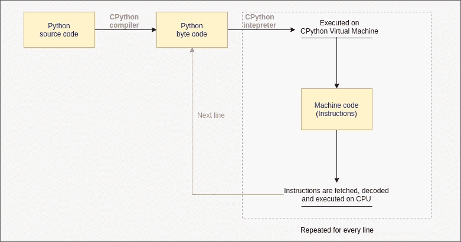
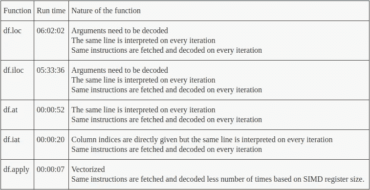

# 理解使用熊猫时的优化需求

> 原文：<https://towardsdatascience.com/understanding-the-need-for-optimization-when-using-pandas-8ce23b83330c?source=collection_archive---------16----------------------->


People waiting in a queue, for their turn (Source: [travel.jumia](https://travel.jumia.com/blog/ng/wp-content/uploads/2015/10/waiting.jpg))

你知道在大量数据处理中优化算法的重要性吗？根据实现方式的不同，一个简单的代码可以运行几秒钟到几个小时。Python 作为一种解释型语言，在编写需要大量处理的算法时需要特别小心。您可能想知道解释高级代码会如何影响性能。正如您已经知道的，在编译时，您的代码在运行程序之前被优化并翻译成机器码。但是，当解释时，它是在运行时翻译的，你的程序的总运行时间是“执行时间+解释时间”，这是你可能从来没有想到的。

## python 代码的执行过程



Execution process of python code (drawn in [draw.io](http://draw.io))

一旦我们运行 python 代码，首先它被 CPython 编译成 python 字节码。下一步，在 CPython 虚拟机上逐行解释和执行字节代码。同时，各个机器代码(指令)在 CPU 上执行。相比 C 之类的纯编译语言，由于 python 中的动态类型化，在执行之前需要花费如此多的时间进行解释。此外，在执行循环时，每次迭代都会解释相同的行。此外，在每次迭代中提取并解码相同的指令，而仅改变操作数。因此，当您处理大量数据时，减少 python 解释器和 CPU 的开销工作非常重要。

## 使用熊猫

当您拥有大量原始数据，并且您可能需要从中获取有用的信息或生成要素时。为此，您需要检查、处理、清理、分析和可视化数据集。为此，您可能需要使用最流行的用于数据分析的 python 库之一，Pandas。使用导入库的函数时，在选择它们时需要额外小心。Pandas 库中用于索引的一些常用函数有 df.loc、df.iloc、df.at、df.iloc。此处链接的这个[文档](https://pandas.pydata.org/pandas-docs/stable/user_guide/indexing.html)给出了每个函数的清晰概念以及何时何地使用它们的示例。在这里，让我们看看每个函数在使用时会产生的不同。

让我们举一个例子，数据帧的新列 C 需要填充使用我们自己定义的函数计算的值。这里，A 列中的值作为参数传递，用于计算目的。

注:这里的所有运行时测试都是在英特尔酷睿 i3、2.60 GHz 时钟速度的四核处理器和 Ubuntu 18.04.1 LTS 操作系统上进行的。

使用 df.loc

```
%%time
for i in range(0,1000000):
    x = df_A.loc[i,'A']
    df_A.loc[i,'C']=my_function(x)
```

运行时间:6 小时 2 分 3 秒

“df.loc”功能非常强大，它可以用来访问使用索引的行，使用索引和列名的单元格，切片数据帧，甚至用于布尔索引。这可以被认为是一个优点和缺点。它让你的工作变得容易，也让翻译的工作变得困难。因为参数的多样性，它可以接受，python 解释器需要解码被传递的参数的类型。当这在一百万次迭代循环中完成时，它需要解码一百万次。这就是口译的工作方式。

使用 df.iloc

```
%%time
for i in range(0,1000000):
    x = df_A.iloc[i,'A']
    df_A.iloc[i,'C']=my_function(x)
```

运行时间:5 小时 33 分 36 秒

与 df.loc 相比，df.iloc 的唯一区别是 df.iloc 知道参数是整数索引。因此，在解释时解码论点的开销时间仍然存在。问题是我们使用的函数是一个通用函数，我们需要一个专用函数来访问单个单元格。

使用 df.at

```
%%time
for i in range(0,1000000):
    x = df_A.at[i,'A']
    df_A.at[i,'C']=my_function(x)
```

运行时间:52.1 秒

这看起来与前面的实现非常相似。但是使用 df.at 函数的区别在于解释器不需要解码参数。这是因为它只接受一种方式的参数，即[index，column_name]。执行代码时这种差异的影响是，它只花了 52.1 秒。现在很清楚为什么我们需要一个更专用的函数，当它花费的时间非常大的时候。

使用 df.iat

```
%%time
for i in range(0,1000000):
    x = df_A.iat[i,'A']
    df_A.iat[i,'C']=my_function(x)
```

运行时间:20.1 秒

df.at 和 df.iat 的区别和 df.loc 和 df.iloc 的区别是一样的，所以这里不需要把列名转换成列索引。现在 python 解释器消耗的开销时间几乎被消除了，但是同一行仍然被解释了一百万次。为了解决这个问题，我们需要使用一个没有循环的函数。CPU 消耗的开销时间也仍然存在(即获取和解码相同的指令/机器代码一百万次)。如果你想知道我们如何克服这两个问题，这是你应该已经知道的“向量化”。

## …向量化…

英特尔 x84 指令集架构(ISA)的 SIMD 扩展(SSE)的引入，使得对多个数据并行执行相同操作成为可能。这是通过使用 128 位寄存器实现的，该寄存器可以保存四个单精度浮点数据(32 位数据)。被称为 AVX(高级向量扩展)的 SSE 的最新版本引入了 512 位寄存器。这一版本在采用 Intel-64 ISA 的现代处理器中可用。因此，现在可以同时处理多达 8 个双精度浮点数据(64 位数据)。

很少有像 MATLAB、Octave 和 R 这样用于数值和统计计算的语言支持数组编程。数组编程让我们可以直接编写高级向量化代码。在 python 中，矢量化是由第三方库实现的，如 NumPy 和 Pandas，其中 Pandas 实际上是构建在 NumPy 之上的。用 NumPy 编写矢量化代码来处理数据比 Pandas 简单得多，也快得多。但是要对数据进行分析、可视化和预处理，熊猫提供的数据结构“DataFrame”使用起来更舒服。下面显示的代码是 Pandas 中矢量化实现的一个简单示例。

```
df_A['columnC'] = df_A['columnA'] + df_A['columnB']
```

因为这只是一行没有任何循环的代码，所以只解释一次，现在开销就完全消除了。因为 Pandas 使用 SIMD 指令集来执行这个操作，所以几个数据也同时被处理。因此，CPU 的开销也大大减少。

df.apply 是 Pandas 中的一个函数，可用于向量化复杂算法。下面给出的代码显示了我们如何使用 df.loc 和 df.at 对开始尝试的同一个示例进行矢量化。

使用 df.apply

```
df_A['C']=df_A['A'].apply(lambda x : my_function(x))
```

运行时间:7.27 秒

矢量化之后，这里所有的 100 万个数据现在被分组为多个向量，每个向量中的数据在 CPU 中并行处理。这就是为什么我们能够看到这种差异。

当需要传递多个参数时，可以修改上述代码，如下所示

```
df_A['columnC'] = df_A[['columnA','columnB']].apply(lambda x : my_fucntion(x['columnA'],x['columnB']) )
```



A summary of the above experiment

## 结论

与 df.iat 相比，使用 df.apply 只花费了 36.2%的时间，与 df.loc 相比，只花费了 0.03%的时间。向量化不仅仅是为了缩短算法，也是为了让它们运行得更快。这样，分析数据集和预处理它们就容易多了。

浏览这个[文档](https://pandas.pydata.org/pandas-docs/stable/user_guide/indexing.html)将会给我们更多关于如何使用其他函数如 df.isin、df.where 来对基于循环的索引进行矢量化的想法。