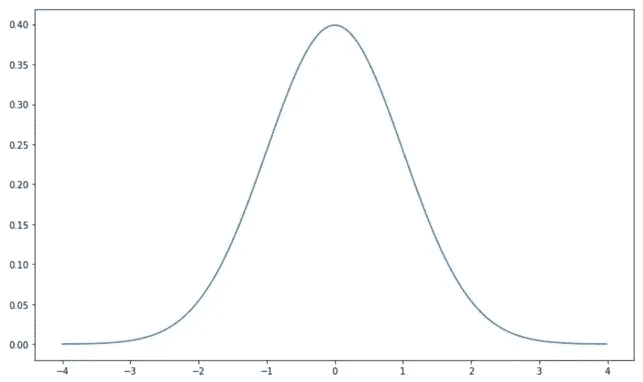
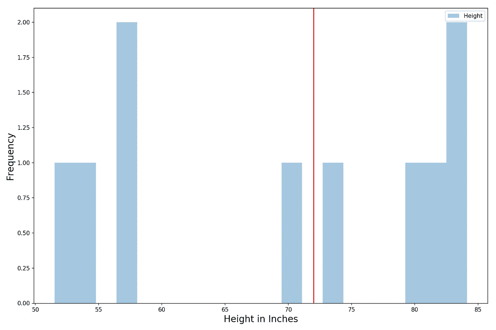
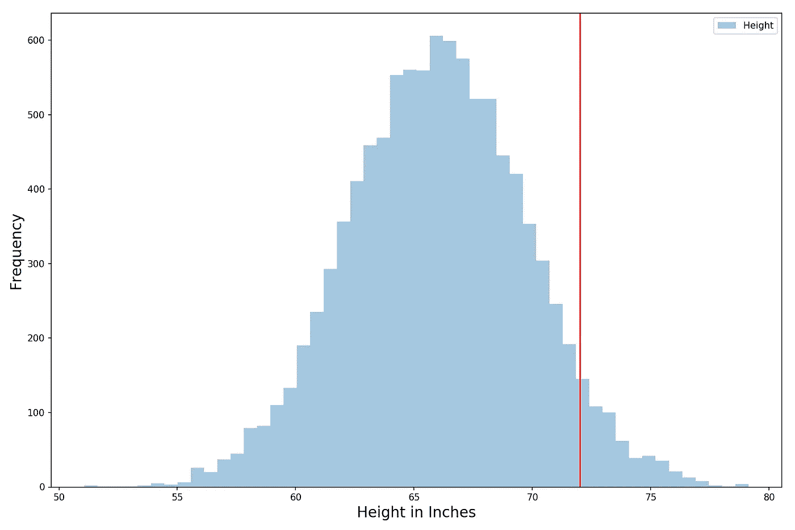
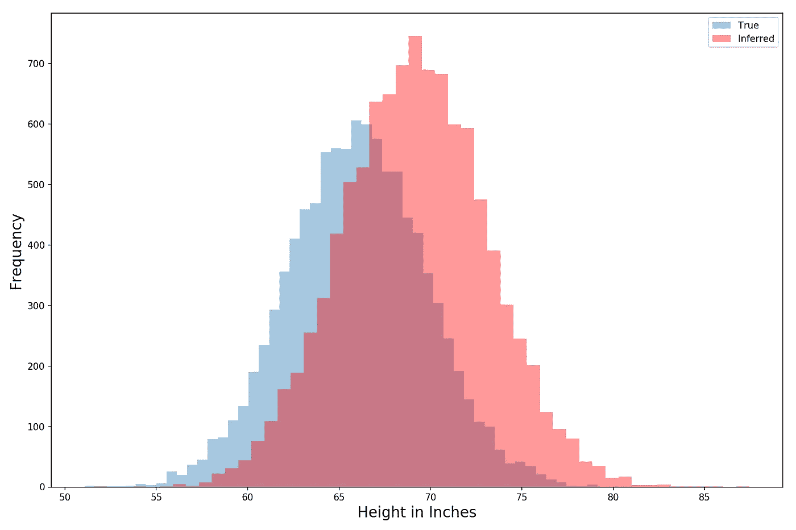
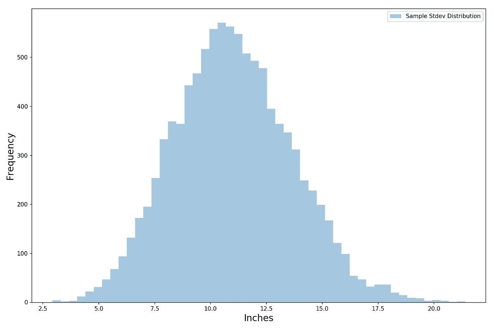
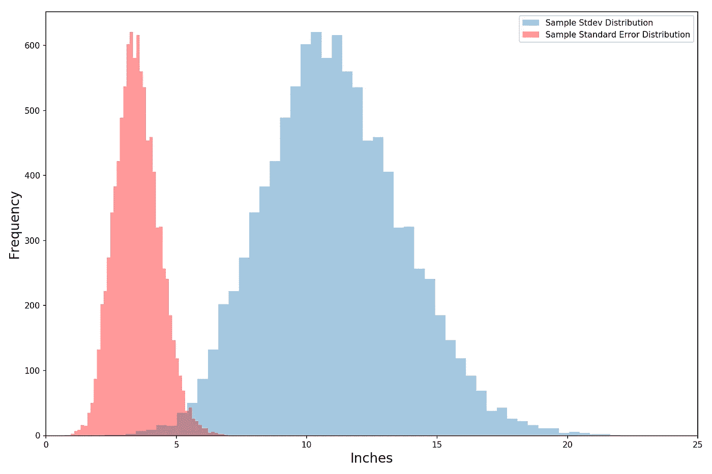
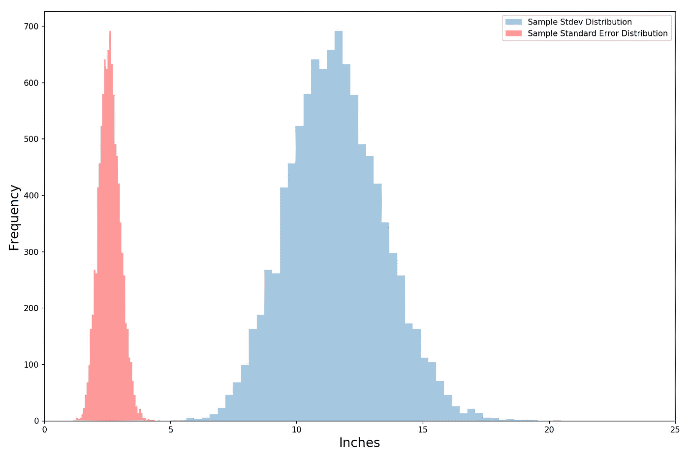

# 理解正态分布(使用 Python)

> 原文：<https://towardsdatascience.com/understanding-the-normal-distribution-with-python-e70bb855b027?source=collection_archive---------2----------------------->


Photo by [Luís Perdigão](https://unsplash.com/@scalabis?utm_source=medium&utm_medium=referral) on [Unsplash](https://unsplash.com?utm_source=medium&utm_medium=referral)

## 了解如何使用它，以及为什么它对数据科学和统计学如此重要

我写数据科学已经有一段时间了，我意识到虽然我已经触及了许多主题，但我还没有涵盖正态分布——统计学的基本概念之一。这是一个疏忽，我打算用这篇文章来弥补。

不管你是否在定量领域工作，你可能在某个时候听说过正态分布。它通常被称为钟形曲线，因为它看起来像一个钟。

## 什么是统计分布？

在我们深入研究正态分布之前，让我们先来看看什么是统计分布。借用[我之前关于二项分布的帖子](/fun-with-the-binomial-distribution-96a5ecabf65b):

> 概率和统计的新手可能会遇到的一个问题是概率分布的概念。我们倾向于确定性地思考，比如“我将一枚硬币抛 10 次，产生了 6 个头”。所以结果是 6，那么分布在哪里呢？
> 
> **概率分布来源于方差。**如果你和我都掷 10 枚硬币，很可能我们会得到不同的结果(你可能得到 5 个正面，而我得到 7 个)。**这种方差，也就是围绕结果的不确定性，产生了一种概率分布，它基本上告诉我们哪些结果相对更有可能(比如 5 个头)，哪些结果相对不太可能(比如 10 个头)。**

所以每组 10 次抛硬币就像一个随机变量。我们事先不知道会有多少头。但是如果我们知道它的分布，那么我们就知道哪些结果是可能的，哪些是不可能的。这基本上是任何统计分布告诉我们的——它是一个图表，告诉我们得到每个可能结果的可能性有多大。

或者换一种方式来思考这个问题，**如果我们一次又一次地运行一个不确定结果的实验(每次都收集结果)，结果的分布将会收敛到什么程度。**

## 正态分布

现在让我们回到正态分布。正态分布的随机变量可能具有平均值 0 和标准差 1。那是什么意思？**这意味着我们期望该值为 0(平均而言)，但我们的随机变量的实际实现值在 0 附近波动。它摆动的量是 1。我在下面画了一个正态分布图。蓝线在图中越高，在 x 轴上看到它下面的值的频率就越高。请注意，3 或更大的值是非常不可能的。这是因为我们的正态分布随机变量的波动量(标准差)为 1，3 距离均值 0 有三个标准差(真的很远！).**



The Normal Distribution

因此，组合成正态分布的各个实例就像随机数生成器的结果一样— **一个随机数生成器，它理论上可以采用负无穷大和正无穷大之间的任何值，但已经预设为以 0 为中心，并且大多数值出现在-1 和 1 之间**(因为标准偏差为 1)。

# 为什么有用？

看起来很简单，对吗？正态分布只是告诉我们运行一个随机数发生器(具有上面提到的预设特征)很多很多次的结果会是什么样子。

那么这为什么有用呢？那是因为现实世界的很多现象都符合正态分布。**例如，人们的身高是众所周知的正态分布。如果你测量你 5 个朋友的身高，你会得到一个看起来不稳定的分布。但是，随着你取样的朋友数量的增加(例如，你在脸书的所有朋友，假设你相当社会化)，分布将开始看起来越来越像正态分布。**

在企业界，制造缺陷严重程度的**分布被发现是正态分布**(这是有道理的:通常你会做对，有几次你会做错，偶尔你会完全搞砸)——事实上，过程改进框架六适马基本上是围绕这一观察建立的。

在投资领域，股票和债券等资产的定期(每日、每月甚至每年)回报被假定为服从正态分布。做出这个假设可能低估了厚尾的可能性和风险(严重的市场崩溃比模型告诉我们的更频繁发生)，但这是另一天的讨论。

**在数据科学和统计学中，统计推断(和假设检验)非常依赖于正态分布。**因为我们喜欢数据科学，所以让我们更深入地探索这一特殊应用。

# 平均值的波动性

刚学统计学的时候，被标准差搞糊涂了。我想，“为什么他们有时称之为标准差，有时称之为标准差？”后来才知道**标准差其实是指均值的波动率(标准差)。**

为什么均值会有变化？我们习惯于把均值，即某事物的期望值，看作一个静态值。你取所有的高度，除以高度数，就得到平均高度。这是预期值。如果有人让你在没有任何先验信息的情况下猜测一个人的身高(你不能给出你的猜测范围)，你会猜测平均值(这就是为什么我们称之为期望值)。

但是平均值本身实际上是一个随机变量。这是因为我们的平均身高是基于一个样本——不可能对整个人口(世界上的每个人)进行采样，所以无论我们的身高研究规模有多大，它仍然是一个样本。

因此，即使我们努力做到不偏不倚，以代表总体的方式选取每个样本，**每次我们选取一个新样本，从该样本计算出的平均值都会与之前的略有不同。**真烦人。如果我们不能确定它的价值，那么我们又如何利用它呢？例如，假设我们的朋友问我们:

> "一个人的平均身高是否大于 6 英尺？"

因此，我们开始工作并获得一些数据(通过对站在我们周围的 10 个人进行快速调查),并计算出样本的平均值为 5 英尺 9 英寸。但是然后我们告诉我们的朋友，“我不知道，我的样本均值低于 6 英尺，但最终它可能会更高或更低。均值本身会随着样本而波动，所以没人真正知道。”那不是很有帮助(而且极其优柔寡断)。过了一段时间，没有人会再问我们的洞察力。

这就是正态分布的用武之地——我们样本均值的均值本身就是一个正态分布的随机变量。也就是说，如果我们选取足够多的样本，并计算每个样本的平均值，这些平均值的分布就像正态分布一样。**这使得我们甚至可以从相对较小的样本中对总体人口做出推断——也就是说，通过少量的观察，我们可以了解到总体人口的大量统计特征。**

在前面的例子中，正态分布的随机变量的平均值为 0，标准差为 1。但是均值和标准差可以是我们需要的任何值。让我们使用一些 Python 代码来检查正态分布如何帮助我们向我们的朋友提供更好的答案。

# Python 中的正态分布

*(完整代码，* [***请查看我的 GitHub 这里***](https://github.com/yiuhyuk/normal_distribution) *)*

首先，让我们把我们的输入放在一边:

```
import numpy as np
from scipy.stats import norm
import matplotlib.pyplot as plt
import seaborn as sns
```

现在让我们生成一些数据。我们将假设一个人的真实平均身高是 5 英尺 6 英寸，真实标准偏差是 1 英尺(12 英寸)。我们还定义了一个名为“target”的变量 6 英尺，这是我们的朋友询问的高度。为了使生活更容易，我们将把一切都转换成英寸。

```
mean_height = 5.5*12
stdev_height = 1*12
target = 6*12
```

有了这些参数，我们现在可以编造一些高度数据。我们将创建一个 10，000 乘 10 的数组来保存我们的调查结果，其中每一行都是一个调查。然后我们会用一个正态分布的随机变量填充数组的每个元素。您可以给随机变量函数一个平均值和一个标准差，但我想向您展示如何手动定制随机变量的平均值和标准差(更直观):

*   **您可以通过向您的正态分布随机变量**添加一个常数来改变平均值(其中常数是您想要的平均值)。它将随机变量的中心位置从 0 改变为你添加的任何数字。
*   **您可以通过将常数**乘以您的随机变量来修改您的正态分布随机变量的标准偏差(其中常数是您想要的标准偏差)。

在下面的代码中，np.random.normal()生成一个正态分布的随机数，平均值为 0，标准差为 1。然后，我们将它乘以“stdev_height ”,得到我们想要的 12 英寸的波动性，并加上“mean_height ”,以便将中心位置移动 66 英寸。

```
mean_height + np.random.normal()*stdev_height
```

我们可以使用嵌套的 for 循环来填充我们的调查数据，然后检查输出是否符合我们的预期:

```
height_surveys = np.zeros((10000,10))
for i in range(height_surveys.shape[0]):
    for j in range(height_surveys.shape[1]):
        height_surveys[i,j] = mean_height +\
                              np.random.normal()*stdev_heightprint('Mean Height:', round(np.mean(height_surveys)/12,1), 'feet')
print('Standard Deviation of Height:', 
      round(np.var(height_surveys)**0.5/12,1), 'foot')
```

当我运行代码时，它打印出平均身高为 5.5 英尺，人的身高标准偏差为 1 英尺——这些与我们的输入相匹配。好的，我们有调查数据了。现在我们来做一些统计推断。

假设我们只有时间和资源进行一次身高调查(10 个人)。我们得到了以下结果:



Single Survey Histogram

一半的人身高超过 6 英尺，一半的人更矮(红线表示 6 英尺)——没有太多信息。我们样本中的平均高度是 69 英寸，略低于 6 英尺。

尽管如此，我们还记得，因为我们的样本量很小(只有 10 人参与调查)，我们应该预料到我们的结果会有很大的差异。**最酷的事情是，即使只有一个调查，我们也能对平均值的变化做出相当不错的估计。而且我们知道分布的形状——它是正态分布(*铁杆统计学家会说我需要说它大致是正态分布*)！**

> **标准误差=样本标准差/ sqrt(N)**

其中 N 是观察值的数量(本例中为 10)，sqrt 表示取平方根。

标准误差是平均值的标准偏差**(如果我们继续进行 10 个人的调查，并计算每个人的平均值，这些平均值的标准偏差将最终收敛到标准误差)**。就像我们提到的，样本均值的分布是正态分布。这意味着，如果我们进行大量的调查，并从总体上看它们各自的平均值，我们会看到一条钟形曲线。我们来看看这个。

回想一下，之前我们创建了一个 10，000 乘 10 的调查结果数组。我们的 10，000 行中的每一行都是一个调查。让我们计算 10，000 次调查的平均值，并通过以下代码行绘制直方图:

```
# Histogram that shows the distribution for the mean of all surveys
fig, ax = plt.subplots(figsize=(12,8))
sns.distplot(np.mean(height_surveys,axis=1), 
             kde=False, label='Height')ax.set_xlabel("Height in Inches",fontsize=16)
ax.set_ylabel("Frequency",fontsize=16)
plt.axvline(target, color='red')
plt.legend()
plt.tight_layout()
```

这给了我们下面的直方图——这是一个钟形曲线，如果我曾经见过的话:



Histogram of the Sample Means

现在让我们使用我们最初的调查(我展示的第一个看起来不可靠的直方图)来计算分布。只有一个 10 人的样本，我们别无选择，只能猜测样本均值是真实均值(统计学中所说的总体均值)。所以我们猜测平均值是 69 英寸。

现在我们来计算标准误差。我们样本的标准偏差是 12.5 英寸:

```
# I picked sample number 35 at random to plot earlier
np.var(height_surveys[35])**0.5)    # = 12.5
```

让我们覆盖我们的推断分布，一个平均值为 69 英寸、标准偏差为 12.5 英寸的正态分布在真实分布上(来自我们的 10，000 个模拟调查，我们假设这是真实的)。我们可以通过下面几行代码来实现，其中

```
# Compare mean of all surveys with inferred distribution
fig, ax = plt.subplots(figsize=(12,8))# Plot histogram of 10,000 sample means
sns.distplot(np.mean(height_surveys,axis=1), 
             kde=False, label='True')# Calculate stats using single sample
sample_mean = np.mean(height_surveys[35])
sample_stdev = np.var(height_surveys[35])**0.5
# Calculate standard error
std_error = sample_stdev/(height_surveys[35].shape[0])**0.5# Infer distribution using single sample
inferred_dist = [sample_mean + np.random.normal()*\
                 std_error for i in range(10000)]# Plot histogram of inferred distribution
sns.distplot(inferred_dist, kde=False, 
             label='Inferred', color='red')ax.set_xlabel("Height in Inches",fontsize=16)
ax.set_ylabel("Frequency",fontsize=16)
plt.legend()
plt.tight_layout()
```

我们得到了下面一组直方图:



我们有点偏离，但老实说，这还不算太糟糕，因为我们只用 10 次观察就生成了推断分布(红色)。我们之所以能够做到这一点，是因为样本均值的分布呈正态分布。

## 我们对标准差的估计也有方差

出于好奇，**样本标准差的分布也大致是正态的**(其中样本标准差是 10 人单次调查的标准差):

```
# Check out the distribution of the sample standard deviations
vol_dist = np.var(height_surveys, axis=1)**0.5# Histogram that shows the distribution of sample stdev
fig, ax = plt.subplots(figsize=(12,8))
sns.distplot(vol_dist, kde=False, 
             label='Sample Stdev Distribution')ax.set_xlabel("Inches",fontsize=16)
ax.set_ylabel("Frequency",fontsize=16)
plt.legend()
plt.tight_layout()
```

这给了我们下面的情节。这是一个相当大的标准差范围。这是否意味着我们对标准误差的估计并不像我们最初认为的那样可靠？



The Distribution of the Sample Standard Deviations (Pretty Normal!)

让我们将标准误差分布(红色)添加到上面的图中(回想一下，标准误差是标准差的函数)。它更低(因为标准误差是标准偏差除以每次调查中观察次数的平方根)。出于同样的原因，标准误差波动也较小。即便如此，这仍然比我们所能接受的要大得多——但是有一个简单的解决方法。



The Variance of the Standard Error Looks High

**通过纳入更多的观察数据，我们可以很容易地减少标准误差分布的波动。**让我们把它增加一倍，达到 20 人，看看会发生什么——在我们的调查中，只增加了 10 个人，红色直方图就变得明显更细了。酷！



We Can Reduce the Variance of Standard Error By Taking More Observations

最后，我们可以给我们的朋友一个更好的答案(他想知道人口的平均身高是否大于 6 英尺)。我们有两种方法可以做到这一点。首先，我们可以通过产生一堆随机变量(当然是正态分布的)来模拟它。当我运行下面的代码时，我得到 23%的观察值是 6 英尺或更高。

```
# Simulation method for answering the question# Generate 10,000 random variables
inferred_dist = [sample_mean + np.random.normal()*\
                 std_error for i in range(10000)]# Figure out how many are > than target
sum([1 for i in inferred_dist if i>=target])/len(inferred_dist)
```

**或者因为我们知道它是正态分布的，我们可以使用累积密度函数来计算出 6 英尺或更长的曲线下的面积**(曲线下的面积告诉我们概率)。下面的单行代码告诉我们，身高 6 英尺或更高的概率是 23%，同上。

```
1 - norm.cdf(target, loc=sample_mean, scale=std_error)
```

因此，我们应该告诉我们的朋友，尽管鉴于我们的样本是如此不正式和小，存在不确定性，但人们的平均身高仍很有可能低于 6 英尺(我们也可以进行更正式的假设检验，但那是另一个故事了)。我希望你记住三点:

1.  正态分布及其有用的性质使我们能够推断出大量关于潜在人口的统计性质。**然而，如果我们的均值和/或标准差的正确性有很多不确定性，那么我们就有垃圾进垃圾出的风险。**当我们的样本非常小(粗略的经验法则是 30 或更少，但这个数字在很大程度上取决于数据)或不具有代表性(在某些方面有偏差)时，我们应该特别小心。
2.  可能的话，总是**进行更多的观察**。当然，可能会有成本限制你这样做的能力。但是在可能的情况下，更多的数据会大大提高你做出正确推断的能力。
3.  更一般地说，从分布的角度考虑是有帮助的。不管结果如何出现，结果很少是确定的。**当你看到一个值时，你不仅要关心这个值是多少，还要关心它如何变化**(比如旧金山的温度)。对结果变化的预期让我们为意外做好准备(我知道这是老生常谈)。

# 结论

我们刚才遵循的思维过程和[假设检验(或者 A/B 检验)非常相似。你可以在这篇博文中了解更多。](/data-science-fundamentals-a-b-testing-cb371ceecc27)

但更普遍的是，因为世界上有这么多东西遵循它，所以正态分布允许我们对各种现象建模，只要我们对均值和标准差有一个合理的估计。如果你想了解更多关于它的用法，你可以看看下面的文章:

*   了解如何使用正态分布来模拟多年的投资和投资组合回报。
*   [对股票是否优于现金进行假设检验。](/do-stocks-provide-a-positive-expected-return-d21571e78ea4)
*   [模拟一个企业的业绩。](/business-simulations-with-python-a70d6cba92c8)

感谢阅读。干杯！

如果你总体上喜欢这篇文章和我的写作，请考虑通过我的推荐链接注册 Medium 来支持我的写作。谢谢！