# 简化 ROC 和 AUC 指标。

> 原文：<https://towardsdatascience.com/understanding-the-roc-and-auc-curves-a05b68550b69?source=collection_archive---------1----------------------->

## 消除分类标准的混乱。

Photo by [Daniele Levis Pelusi](https://unsplash.com/@yogidan2012?utm_source=medium&utm_medium=referral) on [Unsplash](https://unsplash.com?utm_source=medium&utm_medium=referral)

> "天才的定义是化繁为简."―阿尔伯特·爱因斯坦

ROC 和 AUC 曲线是计算任何分类模型性能的重要评估指标。这些定义和术语在机器学习社区中非常常见，当我们开始学习分类模型时，我们每个人都会遇到。然而，大多数时候它们并没有被完全理解或者被误解，它们的真正本质无法被利用。在引擎盖下，这些是非常简单的计算参数，只需要一点点说明。

> ROC 和 AUC 的概念建立在混淆矩阵、特异性和敏感性的基础上。此外，我将在本文中使用的例子是基于逻辑回归算法，但是，重要的是要记住，ROC 和 AUC 的概念可以适用于不仅仅是逻辑回归。

# 参考

*本文改编自 Josh Starmer 在 ROC 和 AUC 上的这段* [*优秀视频*](https://www.youtube.com/watch?v=xugjARegisk) *。我会推荐你看这个视频更清晰。Josh 还有许多其他关于各种统计和机器学习概念的视频。*

考虑一个**假设的例子**包含一群人。y 轴有两类，即红色的人代表的`**Has Heart Disease**`和绿色圆圈代表的`**does not have Heart Disease**` 。**沿着 x 轴的**，我们有**胆固醇**水平，分类器试图根据胆固醇水平将人分为两类。

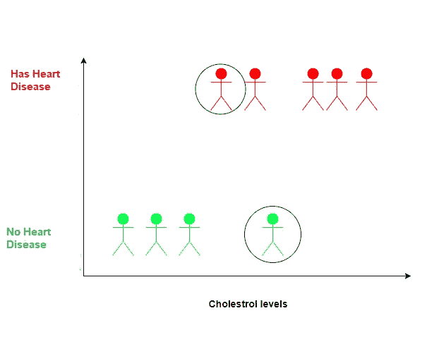

## 需要注意的事项:

*   绿色圈圈的人胆固醇水平高，但没有心脏病。这可能是由于现在的人正在观察更好的生活方式和定期锻炼的原因。
*   圈出的红色表示胆固醇水平低的人仍有心脏病。这可能是因为他有其他与心脏相关的问题。

*这是一个假设的例子，所以原因也是假设的*😃

# 逻辑回归

现在，如果我们对数据拟合逻辑回归曲线，Y 轴将根据胆固醇水平转换为患心脏病的概率。

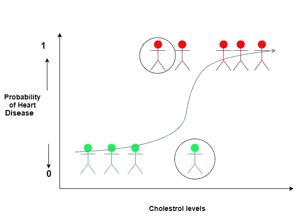

白点代表比黑点代表的人患心脏病的可能性低的人。

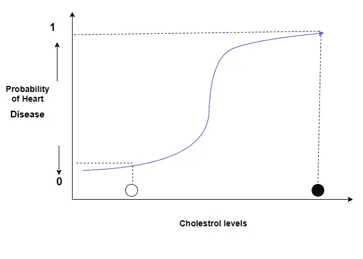

然而，如果我们想将人分为两类，我们需要一种方法将概率转化为分类。一种方法是将阈值设置为 0.5。接下来，将患心脏病的概率> 0.5 的人分类为“**患心脏病**”，将患心脏病的概率< 0.5 的人分类为“**未患心脏病**”。

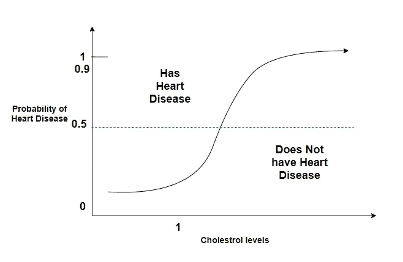

现在让我们用分类阈值设置为 0.5，用一些我们已经知道他们是否患有心脏病的新人来评估这种逻辑回归的有效性。

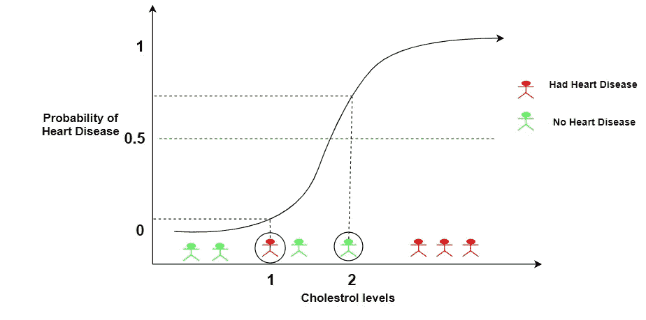

我们的逻辑回归模型正确地将除了人 1 和 2 之外的所有人分类。

*   我们知道人 1 患有心脏病，但我们的模型将其归类为其他类型。
*   我们也知道第二个人没有心脏病，但我们的模型再次将其分类错误。

# 混淆矩阵

让我们创建一个混淆矩阵来总结分类。

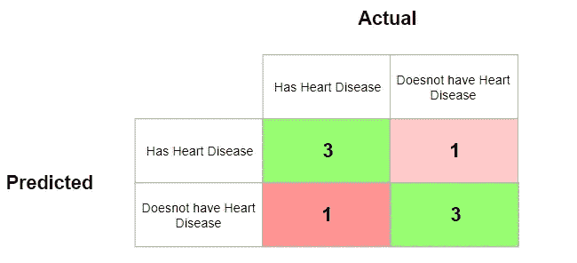

一旦混淆矩阵被填充，我们可以计算**灵敏度**和**特异性**来评估 0.5 阈值的逻辑回归。

# 特异性和敏感性

在上面的混淆矩阵中，我们用数字实际代表的东西来代替数字。

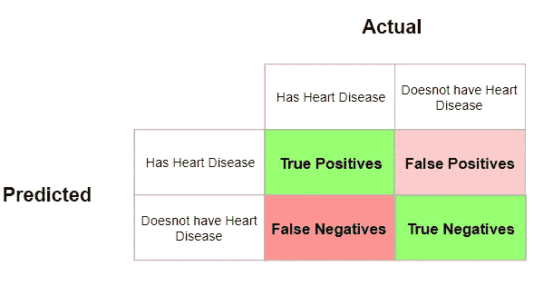

*   **真阳性(TP):***有心脏病*的人，也被预测有心脏病。
*   **真阴性(TN):** 没有**有心脏病*的人，也被预测没有心脏病。*
*   ***假阴性(FN):** 患有心脏病但预测说他们没有的人。*
*   ***假阳性(FP):** 没有**心脏病*但预测说他们有。**

**我们现在可以根据混淆矩阵计算两个有用的指标:**

## **灵敏度**

**敏感度告诉我们有多少患有心脏病的人被正确地识别出来。**

**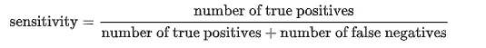**

**结果是:3/3+1 = 0.75**

**这告诉我们，75%的心脏病患者被我们的模型正确地识别出来。**

## **特征**

**特异性告诉我们没有心脏病的人实际上被正确识别的百分比。**

**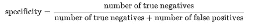**

**结果是:3/3+1 = 0.75**

**这告诉我们，我们的模型再次正确识别了 75%没有心脏病的人。**

*****如果正确识别阳性对我们来说很重要，那么我们应该选择灵敏度更高的模型。然而，如果正确识别阴性更重要，那么我们应该选择特异性作为度量标准。*****

# **确定正确的阈值**

**现在，让我们来谈谈当我们使用不同的阈值来决定一个人是否患有心脏病时会发生什么。**

*   ****将阈值设置为 0.1****

**这将正确地识别所有患有心脏病的人。标记为 1 的人也被正确地分类为心脏病患者。**

**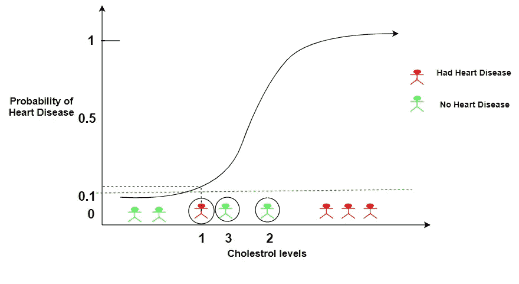**

**然而，这也将增加假阳性的数量，因为现在人 2 和 3 将被错误地分类为患有心脏病。**

**因此，阈值较低:**

*   **增加误报的数量**
*   **减少假阴性的数量。**

**重新计算混淆矩阵:**

**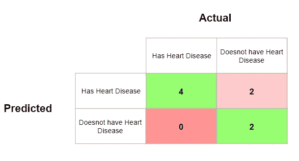**

***在这种情况下，正确识别患有心脏病的人变得很重要，以便采取纠正措施，否则心脏病会导致严重的并发症。这意味着降低阈值是一个好主意，即使这会导致更多的假阳性病例。***

*   ****将阈值设置为 0.9****

**这将正确识别所有没有心脏病的人。然而，被标记为人 1 的人将被错误地分类为没有心脏病。**

**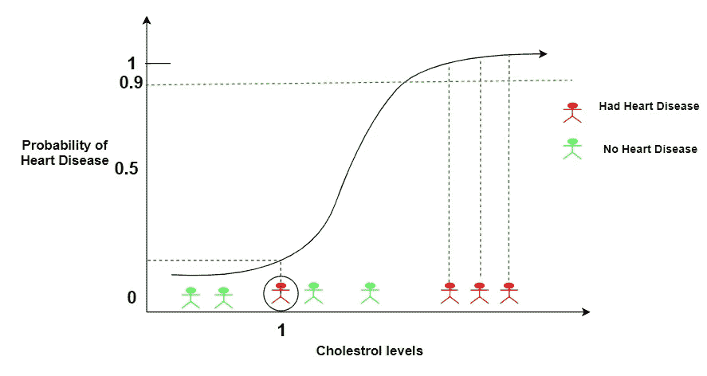**

**因此，阈值较低:**

*   **减少误报的数量**
*   **增加了假阴性的数量。**

**重新计算混淆矩阵:**

**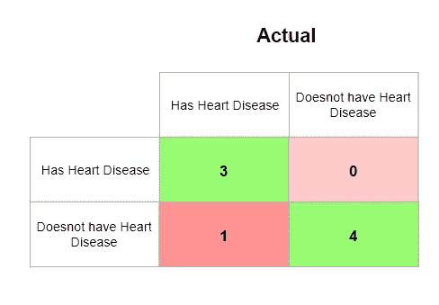**

**阈值可以设置为 0 到 1 之间的任何值。那么我们如何确定哪个阈值是最好的呢？我们需要试验所有的阈值吗？每个阈值产生不同的混淆矩阵，多个阈值将产生大量的混淆矩阵，这不是最好的工作方式。**

# **ROC 图**

**ROC(受试者操作者特征曲线)有助于确定最佳阈值。它是通过绘制真阳性率(y 轴)对假阳性率(x 轴)而产生的。**

******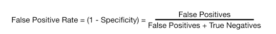**

> **真实阳性率表明患有心脏病的人被正确分类的比例。**
> 
> **假阳性率表示被归类为“**没有心脏病**”的人的比例，即假阳性。**

**为了更好地了解大鹏鸟，我们从头画一个。**

*   ****将所有人分类为患有心脏病的阈值。****

**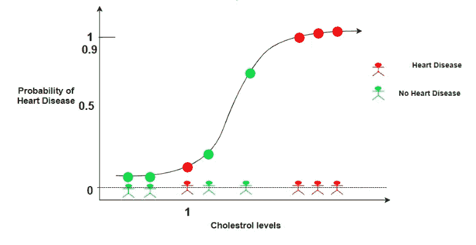**

**混淆矩阵将是:**

**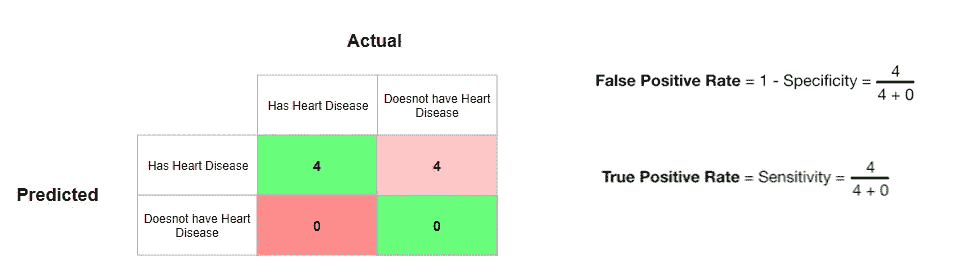**

**这意味着当阈值如此之低以至于每个人都被归类为患有心脏病时，真正的阳性率是 1。这意味着每一个患有心脏病的人都被正确分类。**

**此外，当阈值太低以至于每个人都被归类为患有心脏病时，假阳性率也是 1。这意味着每一个没有心脏病的人都被错误地分类了。**

**在 ROC 图上绘制这一点:**

**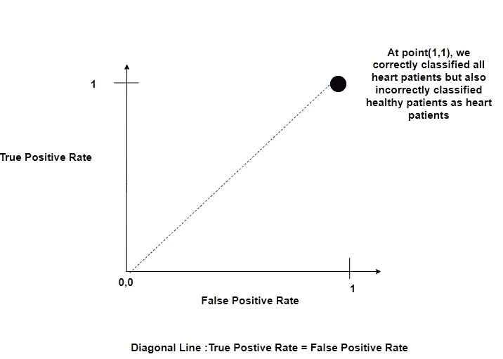**

**蓝色对角线上的任何一点表示正确分类样本的比例等于错误分类样本的比例。**

*   ****略微提高阈值，以便只有胆固醇值最低的两个人低于阈值。****

****

**混淆矩阵将是:**

**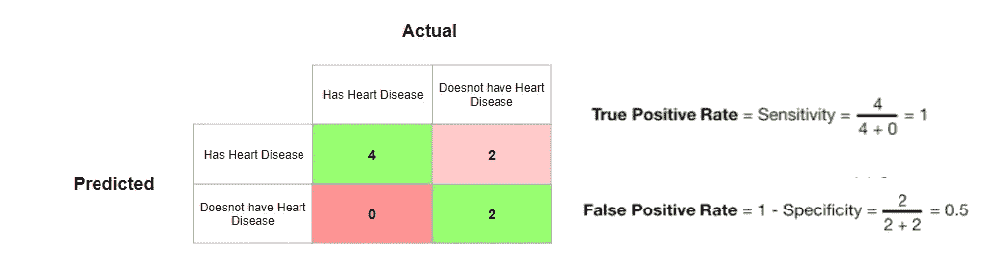**

**让我们在 ROC 图上画出这个点(0.5，1)。**

**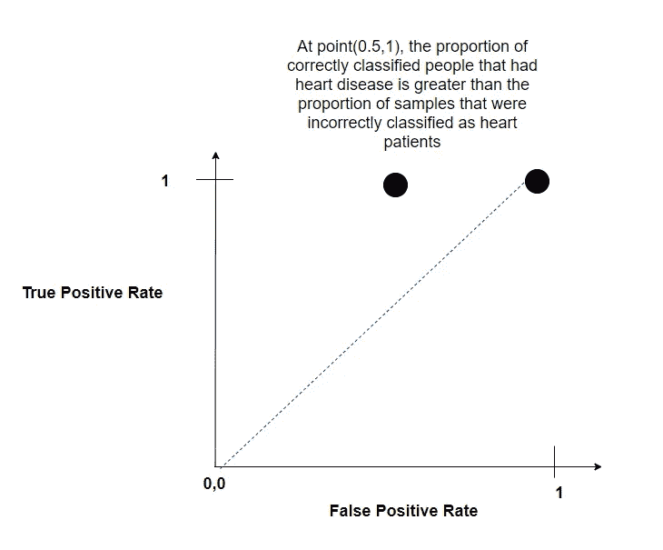**

**这意味着这个阈值比前一个更好。**

*   ****现在如果继续增加阈值，达到一个点，我们得到下面的混淆矩阵:****

**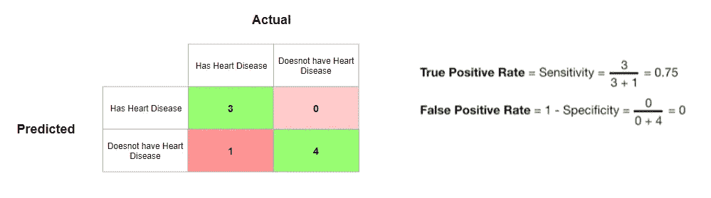**

**让我们在 ROC 图上画出这一点(0，0.75)。**

**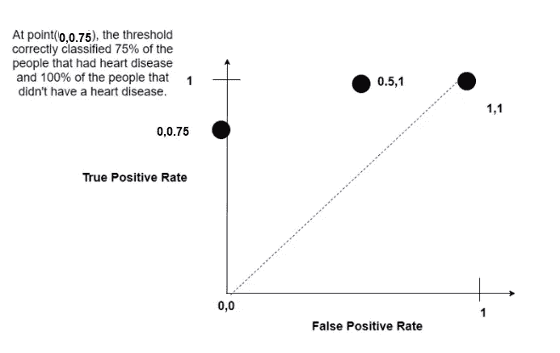**

**到目前为止，这是我们得到的最好的阈值，因为它预测没有假阳性。**

*   ****最后，我们选择一个阈值，将所有人分类为没有心脏病，即阈值为 1。****

**在这种情况下，图表将位于(0，0):**

**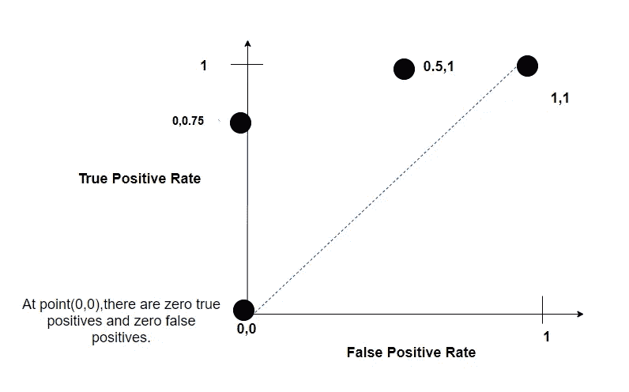**

**然后，我们可以将这些点连接起来，得到 ROC 图。ROC 图总结了每个阈值产生的混淆矩阵，而不必实际计算它们。**

**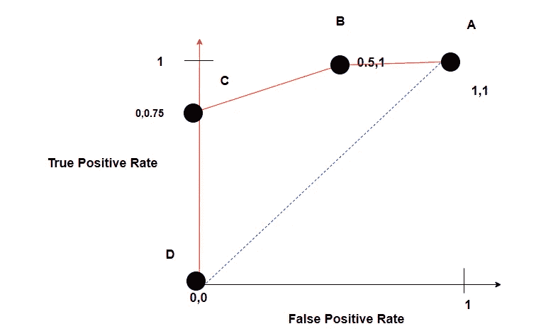**

**只要浏览一下图表，我们就可以得出结论，阈值 C 比阈值 B 更好，根据我们愿意接受的误报数量，我们可以选择最佳阈值。**

# **罗马纪元**

**AUC 代表曲线下的**面积。AUC 给出了通过逻辑模型成功分类的比率。AUC 使得比较一个模型与另一个模型的 ROC 曲线变得容易。****

**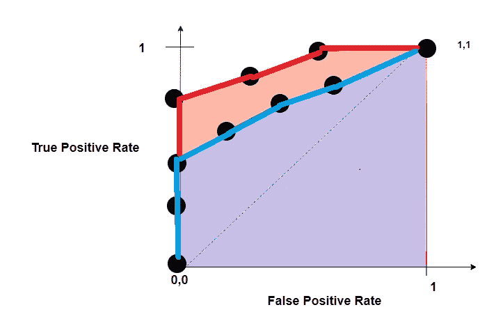**

**红色 **ROC** 曲线的 **AUC** 大于蓝色 **RO** C 曲线的 **AUC** 。这意味着红色曲线更好。如果红色 ROC 曲线由随机森林生成，蓝色 ROC 曲线由逻辑回归生成，我们可以得出结论，随机分类器在对患者进行分类方面做得更好。**

# **结论**

**AUC 和 ROC 是计算任何分类模型性能的重要评估指标。因此，了解它们是如何计算的和使用它们一样重要。希望下次当你遇到这些术语时，你能够在你的问题的背景下很容易地解释它们。**