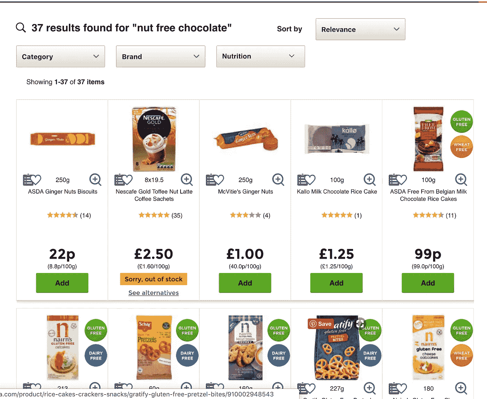
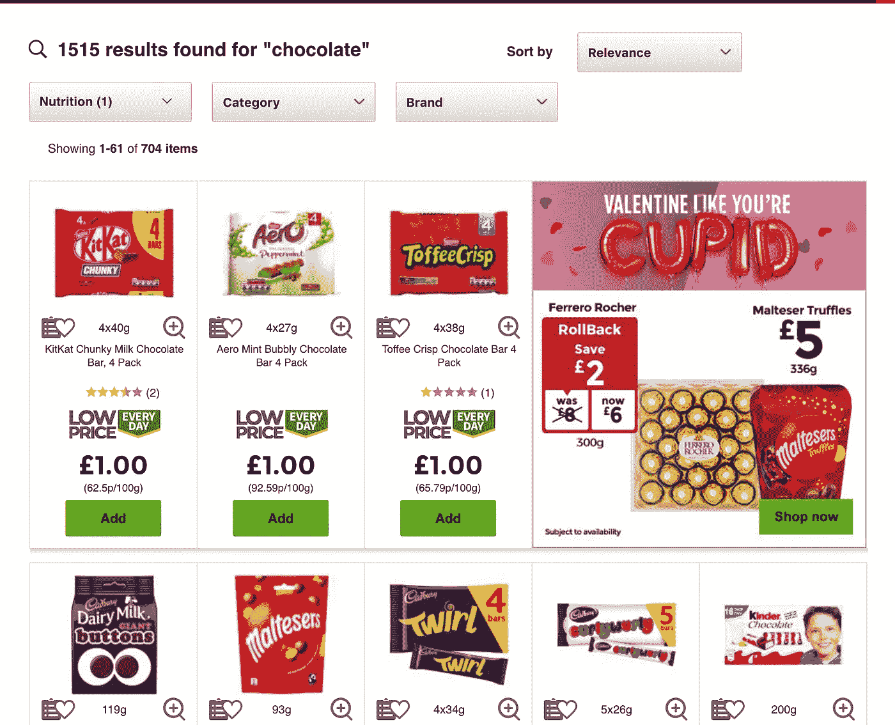
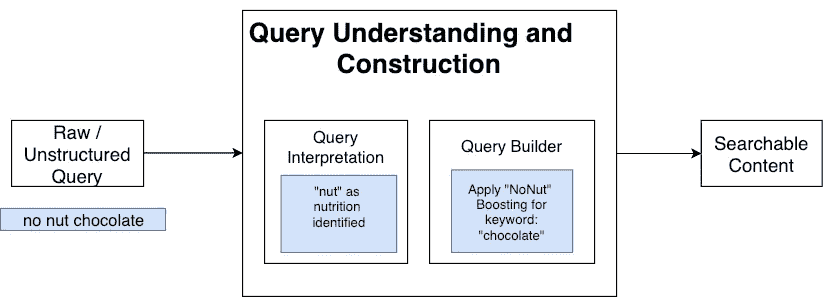
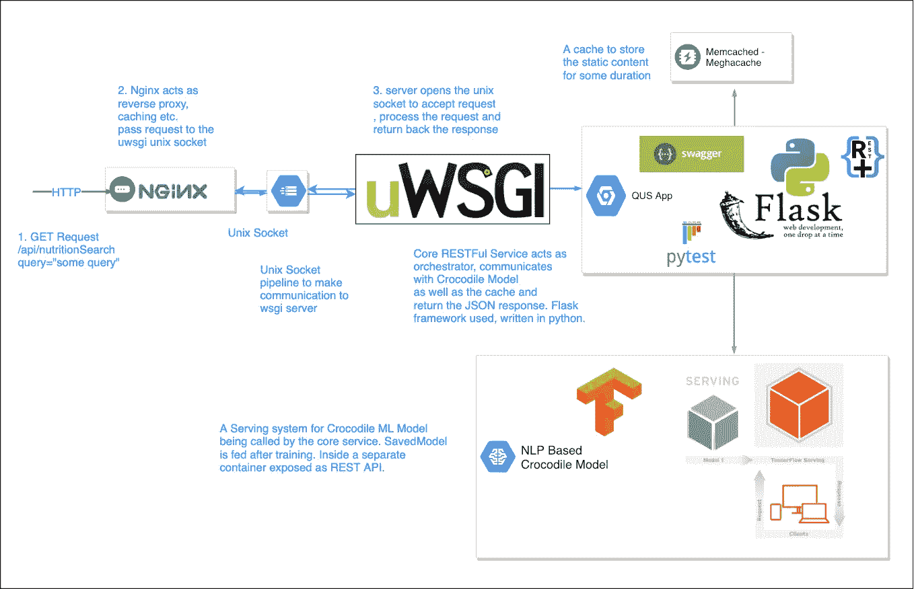

# 理解搜索查询—第一部分

> 原文：<https://towardsdatascience.com/understanding-the-search-query-part-i-632d1b323b50?source=collection_archive---------22----------------------->

## 介绍

> 终极搜索引擎基本上能理解世界上的一切，并且总是给你正确的信息。我们离那还有很长很长的路要走。—拉里·佩奇

我们称之为查询理解。我们先通过一个问题来了解用例。我认为自己是一个非常注重健康的人，想买一种非常健康的食品。我最终找到了一块不应该含有坚果作为营养的巧克力。

Normal Search Response

于是，我搜索了一下:“无坚果巧克力”。

但是，等等，我在这里看到的是饼干、咖啡包、姜果等等。除了巧克力。这种混乱都是因为搜索引擎无法理解查询的意图。为了解决这个问题，我们必须首先对查询进行规范化，然后向搜索引擎发送一个经过重写和增强的查询。

Post QU, Response

对于当前的场景，如果我们要求搜索引擎查找搜索词“巧克力”，并使用“无坚果”作为过滤器来提升结果。此后，结果将看起来像这样，我很乐意在我的购物车中添加一些商品。

因此，这里的任务是识别查询中的营养意图。

听起来很有趣，但是除了营养领域，我们还需要确定用户希望该营养在搜索的产品中存在还是不存在，因为我们有两种类型的营养过滤器:一种过滤含有该营养的产品[例如，素食者、纯素食者等。]另一种不含该营养成分[如 NoNut、NoGluten、NoSoya 等。].例如，我们来看一些查询:

1.  无坚果巧克力/无坚果巧克力—过滤器:“无坚果”
2.  素食蛋糕—过滤器:“素食”
3.  混合蔬菜:查询中没有营养信息

到目前为止，我们只考虑了营养属性以获得更好的精确度，我们期待着实施品牌和其他产品属性。

# 了解查询了解:

QU: Complete Flow

从上图可以明显看出，[查询理解](https://en.wikipedia.org/wiki/Query_understanding)是关于在搜索引擎对结果进行评分和排名之前发生的事情——也就是说，搜索者将意图表达为查询的过程，以及搜索引擎确定该意图的过程。查询理解栈从字符级技术的底部开始，然后到标记级，在顶部到实体级或查询级本身，称为查询重写。

让我们从堆栈的底部开始，逐一讨论这三个问题:

1.**字符级技术**(字符过滤) :

a) Unicode 标准化——优选地通过转换成 UTF-8 编码来标准化字符。

b)去除重音符号:Unicode 标准化将字符串转换成标准的字符编码，但是保留了重音符号。例如*咖啡馆。*在 python 中，有一个 Unidecode 模块。

c)忽略大写:将所有字符串转换为小写。

2.**令牌级技术**:

a)拼写纠正——这尚未实施。算法可以在这里找到:【https://norvig.com/spell-correct.html】T4

b)词干化和词干化:对于词干化，波特斯特梅尔和 K 词干是最常用的。通过词汇化，K-Stem 将是一个很好的选择，因为我之前也使用过它来通过对结果重新排序来提高搜索相关性。在每次去除屈折后缀后，我们可以在字典中查找并停止进一步的屈折操作。更多选项:[https://pdfs . semantic scholar . org/1c0c/0fa 35d 4 ff 8 a2 f 925 EB 955 e 48d 655494 BD 167 . pdf](https://pdfs.semanticscholar.org/1c0c/0fa35d4ff8a2f925eb955e48d655494bd167.pdf)

3.**查询重写**:最强大的技术，自动转换搜索查询，以便更好地表达搜索者的意图。为了提高查全率，两种主要的查询重写策略是**查询松弛**和**查询扩展**。

为了提高精确度，主要策略是**查询分段**和**查询范围**。

**查询分割**将搜索查询分割或分割成一系列语义单元。例如没有牛奶巧克力。这里的顺序可以是" {无牛奶" "巧克力" }和{ "无" "牛奶巧克力" }。识别最相关的语义单元的任务被称为分割。

**查询范围**是另一种重写技术，它通过将上面的每个查询片段匹配到正确的属性来提高精确度。可以通过**查询标注**来实现，这是命名实体识别(NER)的一个特例。

我们实现了一个基于机器学习的先进的基于命名实体识别的深度学习模型，以实现查询分割和查询范围的目标，并改善搜索者的体验。现在，让我们来看看整个系统的架构:

QUS Architecture

该架构由以下组件组成:

1.  NGINX: 主要用于负载均衡、反向代理、缓存和提供静态内容。在这里，它存在于每个 pod(实例/节点)中，与作为后端服务器代理的应用服务器相关联，并路由请求。它缓存映射到特定 URI 的结果，并返回响应，而不需要访问后端服务器。也可用于快速故障。它还记录访问和错误日志。
2.  **uWSGI:** 它运行符合 WSGI 的 web 应用程序，并以生产级的方式运行。处理并发请求、流程管理、日志记录、配置等。这里，它打开一个基于 uwsgi 协议的 unix 套接字，并在其上监听请求。
3.  **Flask Application:** 它公开了一个使用 flask-resplus、marshmallow 等的 RESTFul API。它像一个编排器一样读取 ML 模型响应，找到对应于特定营养属性的维度 id，并最终在 JSON 中返回响应。该服务将接收作为查询参数的搜索词，然后，在执行任何与编排相关的任务之前，应用上面描述的令牌级和字符级技术。单元测试可以使用 pytest (unittest)编写，覆盖率工具用于覆盖率，autopep8 用于格式化代码，pylint 用于代码质量。

这是因为:“ ***未经检验的东西坏了。”***

Swagger UI 也可以暴露。JSON 的输出如下所示:

> 对于查询=“无坚果巧克力”
> 
> {营养过滤器:“NoNut”，规范化查询:“chocolate”}

4.**机器学习模型即服务:**基于深度学习 NLP 技术的鳄鱼模型。这个模型也可以扩展到其他产品属性。JSON 的输出如下所示:

> 对于查询=“无坚果巧克力”
> 
> 标签:{ "坚果":" NV-S "，"免费":" PR-S "，"巧克力":" BQ-S"}

我们将在[第二部分中单独讨论该部分的其余部分，即 ML 模型和部署。](https://medium.com/@sonusharma.mnnit/understanding-the-search-query-part-ii-44d18892283f)