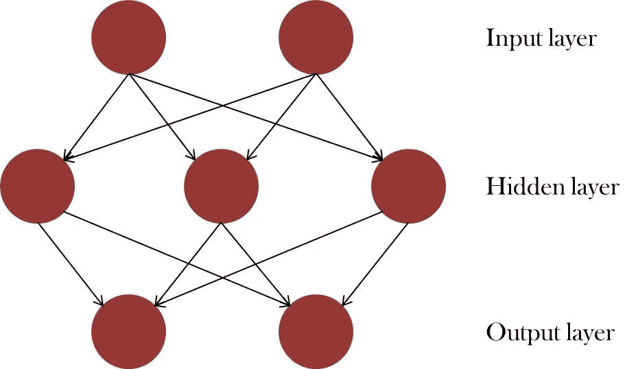
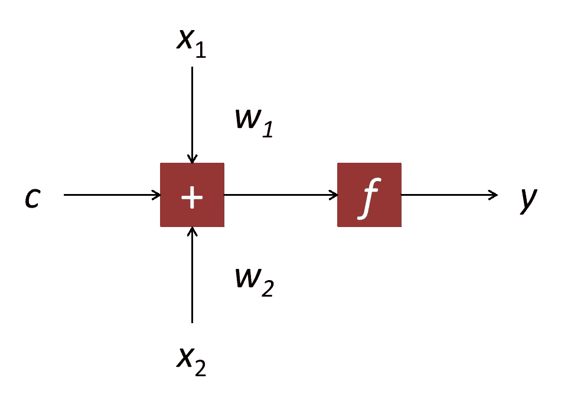
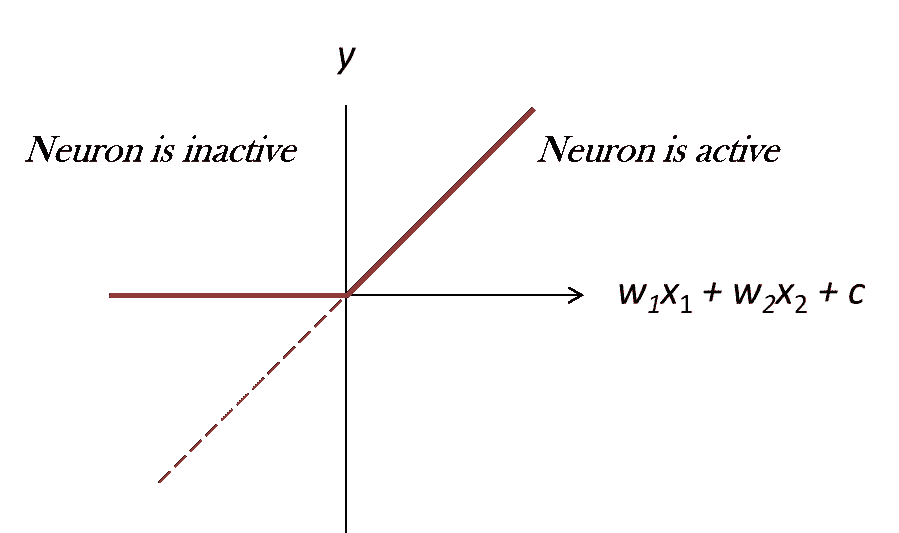
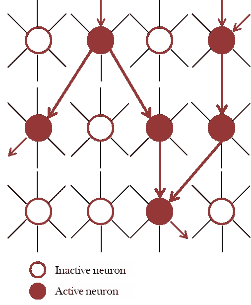
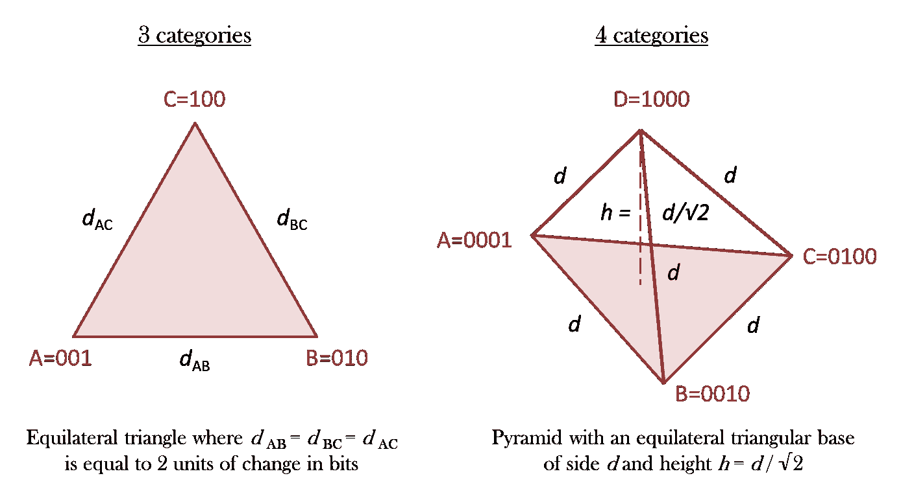
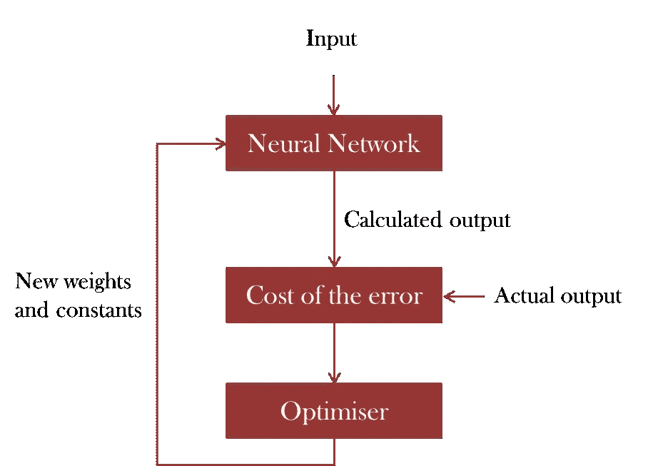

# 非专家神经网络建模中涉及的概念

> 原文：<https://towardsdatascience.com/understanding-the-set-up-of-a-simple-neural-network-to-predict-an-output-ff4d108d8f8d?source=collection_archive---------7----------------------->

到了解神经网络，我们试着把它比作人类的学习过程。

> 想想当我们还在蹒跚学步时，我们是如何学会球的。当我们看着圆形的东西时，我们可以听到一个成年人说“球”这个词。这种情况发生了几次，使得一个圆形物体(图像是输入)对应于单词“球”(声音是输出)。随着时间的推移，我们同时看到了许多其他东西，不同颜色、大小的球，或者是静止的或者是运动的，直到我们最终发现(或者预测下一次我们看到的球！)那一个圆形物体就是大概*叫做球。*

同样，人工神经网络会用每批数据更新自己，一步一步地学习，通常需要大量数据来正确学习底层机制。因此，这对于了解人类不易察觉的情况是有价值的。**它可能会失败(而且确实会失败)——不仅是因为模型的局限性或数据的稀缺，还因为数据的本质没有预测能力**。例如，添加机组人员的平均年龄或航班上小吃菜单的细节，都不太可能让我们预测航班延误！

随着人工智能(AI)或深度学习等如此多的流行词汇四处飞舞，如果不熟悉这些术语，而只是对智能机器和魔法般的算法的大黑匣子保持敬畏，可能会令人生畏。**虽然该领域的研究人员继续跨越现有的发展，并以惊人的聪明方式探索新的范式，但重要的是要注意到，归根结底，这一切都可以归结为数学**——人们不需要任何专业知识来理解基本原理。事实上，许多人工智能数据科学家或软件工程师来自不同的背景，他们在该领域提高了自己的技能。

这篇文章的意图是双重的。这是对那些不是数据科学家，但热衷于通过复制大脑中神经元的基本行为来了解计算系统如何学习的人的介绍。其次，它是对初级程序员关于所涉及的基本概念的讨论，这些概念往往是在不理解其背后的推理的情况下实现的。

## 神经网络是由什么构成的？

可以把它想象成**相互连接的节点图**，如图 1 所示。在其最简单的形式中，两端的层构成了主要的输入和输出，而中间的所有层都被**链接，使得它们的输出成为下一层的输入**。正如我们将在后面看到的，这些节点被称为神经元，因为它们的行为就是如此。

Figure 1: Illustration of a simple neural network

在实践中，可能会有许多层和每层的许多节点，例如在 2017 年[击败围棋世界冠军的 deep mind '](https://www.bbc.co.uk/news/technology-40042581)[alpha Go](https://deepmind.com/research/alphago/)仅输入就有超过 17，000 个神经元。也有不同的方式来连接各层，例如，递归神经网络(处理顺序信息)具有节点，其中一个阶段的输出作为下一阶段的输入被馈送到相同的节点。

## 节点上发生了什么？

简单地说，**一个节点的输出取决于输入的线性组合**。这是输入加上常数的加权和，其中权重和常数项的值是未知的(即，它们形成神经网络模型的参数)。下面的等式和图 2 显示了只有两个输入的情况:

> y = f(w1 * x1+w2 * x2+c)
> 
> 其中 f 代表“的函数”，x_n 是第 n 个输入，w_n 是该输入的第 n 个权重，c 是输出为 y 的节点的常数。

Figure 2: Example of a node with only two inputs

## 神经元被激活意味着什么？

本质上，**如果神经元的输出为正**，那么它就是活跃的。再次使用简单的力量，神经元的激活可以借助于截止值或阈值的概念来解释。如果上述等式的右侧产生负值，则输出被削波为零，如图 3(a)所示。

Figure 3: (a) Example of an activation function of a neuron

**从另一个角度来看，如果我们将常数放在等式的另一边，我们需要输入信号的加权和高于某个阈值，以使输出非零**，即被激活。

> w_1*x_1 + w_2*x_2 + … ≤ -c →节点不活动
> 
> w_1*x_1 + w_2*x_2 + …> -c →节点处于活动状态

图 3(b)展示了这如何复制大脑中神经元活动的机制，在大脑中，数十亿个带电细胞通过电化学信号传输信息。

Figure 3(b): Depiction of neuronal activity in a network

请注意，我上面描述的是一个 ReLU 或整流线性单位激活函数。其他功能包括 sigmoid 和 tanh，但遵循类似的神经元激活概念。

## 投入和产出在实践中会是什么样的？

让我们考虑这样一个例子，目标是预测航班延误。以下过去的信息可能有助于确定特定航班的延迟，因此可以用作学习系统的输入。

*   机场(出发和到达)；
*   航空公司；
*   一周中的某一天；
*   预定的出发时间；
*   预定到达时间；
*   天气条件:温度、风速、降雨量、降雪量等。在起飞和降落时各自机场的情况；
*   飞行路线的天气条件；
*   机场交通信息等等。

使用实际出发和到达时间，可以计算出输出。

> 出发延误=实际出发时间-计划出发时间
> 
> 附加延误=到达延误-离开延误

与任何数学公式一样，在人工智能环境中设置问题时需要小心。例如，注意出发延误(=实际-计划)将是到达延误的一部分。为了使输出独立，额外的到达延迟将是更适合使用的输出。

## 为什么我们必须缩放数字信息？

除了清理数据的一般做法，如使单位一致或删除异常值，许多人工智能问题需要某些预处理步骤来生成有效的结果-这涉及到转换输入和输出数据。

**当不同类型的数据字段同时使用时，它们都必须标准化以避免任何偏差**。为了了解这意味着什么，让我们回到第一部分的等式。以我们的航班延误为例，无论我们使用摄氏度还是华氏度作为温度单位都没有关系(比如*x1*，但是很明显，如果直接输入这个数字，使用 25 摄氏度或相当于 77 华氏度会得到不同的结果。正如我们将在后面看到的，**建立模型意味着确定该等式中的相对权重，如果处理不当，这可能会使一个输入变量的重要性超过另一个输入变量。**

**因此，要让它成为一个公平的竞争环境，每个输入都需要进行调整**。有许多方法可以做到这一点，例如，通过将其归一化到 0 和 1 之间，或者通过将其转换为均值为零且标准偏差为 1 的标准正态分布。

## 我们如何对非数字信息进行编码？

任何定性或分类信息自然需要转换成数字形式，以便在上述设置中使用。例如，在我们的预测中添加的一条重要信息是每个航班的关联航空公司(假设航空公司在不考虑外部因素的情况下在准时性或效率方面存在差异)。

假设有三家航空公司 *A* 、 *B* 和 *C* 。例如，我们不能只给它们编号 1、2、3，这是因为它们之间存在差异。如果我们这样做，我们将告诉系统，与 *A* 和*C*(3–1 = 2)相比，航空公司 *A* 和 *B* 是相似的实体(2–1 = 1)。它们可能实际上是相似的，但是在这种情况下，我们使用相似性的度量(例如航空公司的规模)作为一个单独的变量。

然而，**在这里，我们对他们的身份进行编码，这是独一无二的，并且同样不同于所有其他人**。这样做的一个正确方法是使用虚拟变量进行热编码，其中每个类别与所有其他类别相差相同的量，即两位的变化(即一个变量从 0 变到 1，另一个从 1 变到 0)。

> … d1 d2 d3
> 
> 答:0 0 1
> 
> 乙:0 1 0
> 
> 丙:1 0 0
> 
> 其中 d1、d2 和 d3 是代表三家航空公司的虚拟变量。

例如，从 *A* 变为 *B* ，虚拟变量 *d2* 和 *d3* 翻转它们的值。**本质上，这些信息已经被转换成二进制格式。**

> 如果航空公司是 A，d1 为 1，否则为 0。
> 
> 如果航线是 B，则 d2 为 1，否则为 0。
> 
> 如果航空公司是 C，d3 为 1，否则为 0。

另一种掌握的方式是通过观想，如图 4 所示。**如果距离定义为位数的变化，那么 *A* 、 *B* 和 *C* 将形成一个每边等于两个单位的等边三角形。如果有第四个航空公司 *D* ，结果将是一个金字塔状的结构，像以前一样有一个三角形的底座，高度为 2/sqrt(2)。**

Figure 4: Visualising the conversion of categorical information into numerical code

## 系统是如何学习和预测的？

简单地说，学习过程如下。

对于每个数据子集(例如，一组航班的所有信息)，神经网络使用前一个数据点的权重计算其所有节点的输出(我们可以随机初始化这些值)，并将其输出与实际输出进行比较(因为这是过去的数据，所以我们已经知道航班延误了多少)。然后，它会执行一种称为反向传播的操作，重新调整权重，使其输出与真实值相匹配，或者换句话说，它会解决权重的优化问题，以减少这种误差。这个过程如图 5 所示。

Figure 5: Schematic diagram of the learning process using a neural network

**如果它有大量有意义的数据，它可能能够找到最能代表真实情况的网络的权重和常数(例如，在现实世界中决定航班延误的复杂的多因素系统)**。为了检查这一点，将实际输出与以前尚未输入的一部分过去数据的预测输出进行比较。如果这是令人满意的，那么它可以用来预测未来的结果。

## 最后的想法

**当在实践中应用人工智能方法时，我们对我们试图解决的问题的假设是至关重要的——没有魔杖，也没有算命的地球仪。在实际案例中，我们假设有许多因素共同对感兴趣的结果负责，但是它们相互作用的方式是复杂的，不容易辨别。因此，我们决定使用像神经网络这样的人工智能技术进行研究。**然后，我们对输入做出明智的选择，测试我们的假设，并根据需要进行迭代。这不是一种被动的、不干涉的、全盘接受的方法，它需要批判性思维和积极的决策。****

这是我在业余时间进行的原创工作。请让我知道任何错误，遗漏或改进。