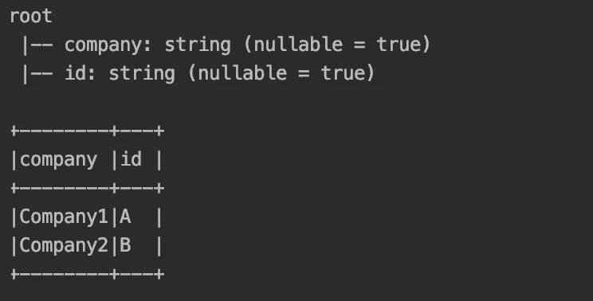
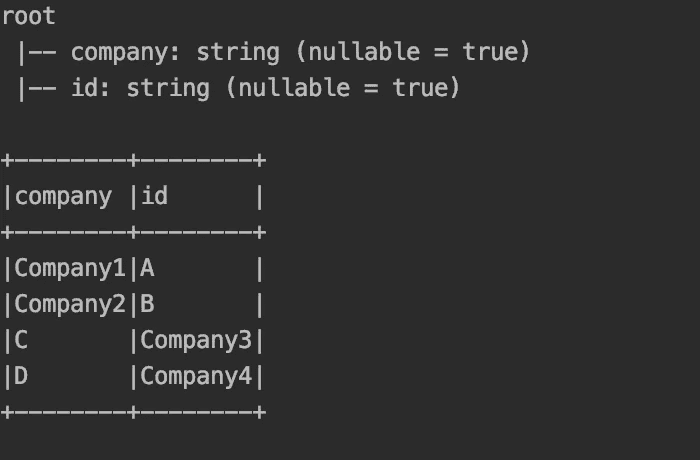
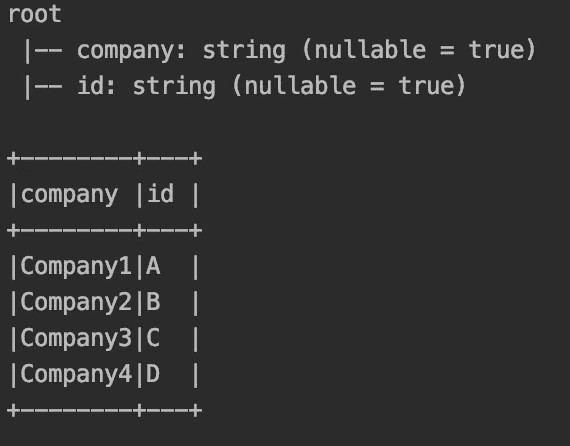
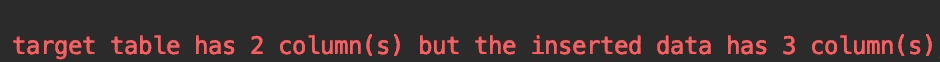
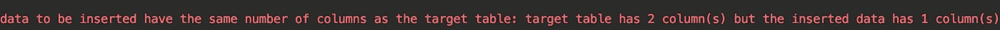
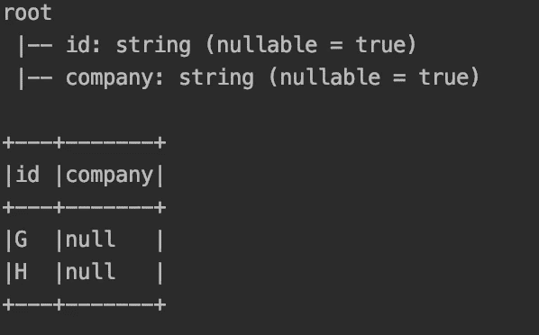

# 了解 Spark 插入功能

> 原文：<https://towardsdatascience.com/understanding-the-spark-insertinto-function-1870175c3ee9?source=collection_archive---------4----------------------->


Photo by [@marcusloke](https://unsplash.com/@marcusloke) on [Unsplash](https://unsplash.com/photos/oyXis2kALVg)

使用 spark 将原始数据吸收到数据湖中是目前常用的 ETL 方法。在某些情况下，原始数据被清理、序列化并作为分析团队用来执行 SQL 类操作的配置单元表公开。因此，spark 为表的创建提供了两种选择: ***托管*** 和 ***外部*** 表。这两者的区别在于，与 spark 控制存储和元数据的管理表不同，在外部表上，spark 不控制数据位置，只管理元数据。

此外，通常需要一种重试策略来覆盖一些失败的分区。例如，分区 **22/10/2019** 的批处理作业(时间戳分区)失败，我们需要重新运行作业，写入正确的数据。因此有两种选择: **a)** 重新生成并覆盖所有数据，或者 **b)** 处理并覆盖所需分区的数据。由于性能问题，第二种方法被放弃了，想象一下，您必须处理整整一个月的数据。

因此，使用了选项 first 选项，幸运的是 spark 有选项**dynamic****partitionOverwriteMode**，即仅对当前批处理中存在的分区覆盖数据。当将数据写入外部数据存储时，如 **HDFS** 或 **S3，这个选项非常有效；**的情况下，可以通过一个简单的**重载外部表元数据，创建外部表**命令**。**

然而，对于存储在具有动态分区的元存储中的配置单元表，为了保持数据质量和一致性，我们需要理解一些行为。首先，即使 spark 提供了两个函数来存储表中的数据 **saveAsTable** 和 **insertInto，**它们之间也有一个重要的区别:

*   **SaveAsTable:** 创建表格结构并存储数据的第一个版本。然而，覆盖保存模式**适用于所有**分区，即使配置了动态。
*   **insertInto:** 不创建表结构，但是，当配置了动态时，覆盖保存模式**只对**需要的分区起作用。

因此，可以使用 SaveAsTable 从原始数据帧定义创建表，然后在创建表之后，使用 insertInto 函数以简单的方式进行覆盖。尽管如此，insertInto 在写入分区数据时表现出一些没有很好记录的行为，在处理包含模式更改的数据时也存在一些挑战。

# 列的顺序问题

让我们编写一个简单的单元测试，从数据帧中创建一个表。

```
***it* should** "Store table and insert into new record on new partitions" in {
  val spark = ss
  import spark.implicits._
  **val targetTable** = "companies_table" **val companiesDF** = *Seq*(("A", "Company1"), ("B", "Company2")).toDF("id", "company")
     companiesDF.write.mode(SaveMode.*Overwrite*).**partitionBy**("id").**saveAsTable**(targetTable)

  **val companiesHiveDF** = ss.sql(s"SELECT * FROM **$**{targetTable}")
```



到目前为止，该表创建正确。然后，让我们使用 insertInto 覆盖一些数据，并执行一些断言。

```
 **val secondCompaniesDF** = *Seq*(("C", "Company3"), ("D", "Company4"))
    .toDF("id", "company")

secondCompaniesDF.write.mode(SaveMode.*Append*).**insertInto**(targetTable) **val companiesHiveAfterInsertDF** = ss.sql(s"SELECT * FROM **$**{targetTable}")

  companiesDF.count() should equal(2)
  companiesHiveAfterInsertDF.count() should equal(4)
  companiesHiveDF.select("id").collect().map(_.get(0)) should *contain* **allOf("A", "B")**
  companiesHiveAfterInsertDF.select("id").collect() should *contain* **allOf("A", "B", "C", "D")**

}
```

这应该可以正常工作。但是，请看下面的数据打印:



如您所见，由于列的位置，断言失败了。原因有二: **a)** *saveAsTable* 使用分区列，并在末尾添加。 **b)** *insertInto* 使用列的顺序(就像调用 SQL insertInto 一样)而不是列名。因此，在末尾添加分区列可以解决这个问题，如下所示:

```
 **//partition column should be at the end to match table schema.**
  **val secondCompaniesDF** = *Seq*(("Company3", "C"), ("Company4", "D"))
    .toDF("company", **"id"**)

  secondCompaniesDF.write.mode(SaveMode.*Append*).**insertInto**(targetTable) **val companiesHiveAfterInsertDF** = ss.sql(s"SELECT * FROM **$**{targetTable}") companiesHiveAfterInsertDF.printSchema()
  companiesHiveAfterInsertDF.show(false)

  companiesDF.count() should equal(2)
  companiesHiveAfterInsertDF.count() should equal(4)
  companiesHiveDF.select("id").collect().map(_.get(0)) **should** *contain* **allOf("A", "B")**
  companiesHiveAfterInsertDF.select("id").collect().map(_.get(0)) **should** *contain* **allOf("A", "B", "C", "D")**

}
```



现在测试通过了，数据被正确地覆盖了。

# **匹配表模式**

如前所述，列的顺序对于 *insertInto* 函数很重要。此外，假设您正在接收模式不断变化的数据，并且您收到了一批具有不同列数的新数据。

## 带有额外列的新批次

让我们首先测试添加更多列的情况。

```
**//again adding the partition column at the end and trying to overwrite partition C.**
**val thirdCompaniesDF** = *Seq*(("Company4", 10, "C"), ("Company5", 20,  "F"))
  .toDF("company", "size", "id")

thirdCompaniesDF.write.mode(**SaveMode.*Overwrite***).**insertInto**(targetTable)
```

尝试调用 *insertInto* 时，显示以下错误:



因此，需要一个返回表中缺失列的函数:

```
**def** **getMissingTableColumnsAgainstDataFrameSchema**(**df**: DataFrame, **tableDF**: DataFrame): Set[String] = {
  **val dfSchema** = df.schema.fields.map(v => (v.name, v.dataType)).toMap
  **val tableSchema** = tableDF.schema.fields.map(v => (v.name, v.dataType)).toMap
  **val columnsMissingInTable** = dfSchema.keys.toSet.diff(tableSchema.keys.toSet).map(x => x.concat(s" **$**{dfSchema.get(x).get.sql}"))

  **columnsMissingInTable**
}
```

然后，执行 **SQL ALTER TABLE** 命令。此后， *insertInto* 函数正常工作，表模式被合并，如下所示:

```
**val tableFlatDF** = ss.sql(s"SELECT * FROM **$**targetTable limit 1")

**val columnsMissingInTable =** DataFrameSchemaUtils.*getMissingTableColumnsAgainstDataFrameSchema*(thirdCompaniesDF, tableFlatDF)

if (columnsMissingInTable.size > 0) {
  ss.sql((s"ALTER TABLE **$**targetTable " +
    s"ADD COLUMNS (**$**{columnsMissingInTable.mkString(" , ")})"))
}

**thirdCompaniesDF**.write.mode(SaveMode.*Overwrite*).insertInto(targetTable)

**val companiesHiveAfterInsertNewSchemaDF** = ss.sql(s"SELECT * FROM **$**targetTable")

**companiesHiveAfterInsertNewSchemaDF**.printSchema()
**companiesHiveAfterInsertNewSchemaDF**.show(false)
```


## 列数更少的新批次

现在让我们测试接收到较少列的情况。

```
**val fourthCompaniesDF** = *Seq*("G", "H")
  .toDF("id")

fourthCompaniesDF.write.mode(SaveMode.*Overwrite*).**insertInto**(targetTable)
```

将显示以下错误:



因此，需要一个向数据框添加缺失列的函数:

```
**def mergeDataFrameSchemaAgainstTable**(**tableDF**: DataFrame)(**df**: DataFrame): DataFrame = {
  **val dfSchema** = df.schema.fields.map(v => (v.name, v.dataType)).toMap
  **val tableSchema** = tableDF.schema.fields.map(v => (v.name, v.dataType)).toMap

  **val columnMissingInDF** = tableSchema.keys.toSet.diff(dfSchema.keys.toSet).toList

  **val mergedDFWithNewColumns** = columnMissingInDF.foldLeft(df) { (currentDF, colName) =>
    currentDF.**withColumn**(
      colName,
      *lit*(null).cast(tableSchema.get(colName).get.typeName)
    )
  }

  **mergedDFWithNewColumns**
}
```

然后，合并的数据框被写入并正常工作，如下所示:

```
val **mergedFlatDF** = **fourthCompaniesDF**.transform(DataFrameSchemaUtils.***mergeDataFrameSchemaAgainstTable***(companiesHiveDF))
mergedFlatDF.write.mode(SaveMode.*Overwrite*).**insertInto**(targetTable)mergedFlatDF.printSchema()
mergedFlatDF.show(false)
```



# **结论**

Spark 提供了多种功能来集成我们的数据管道和 Hive。然而，需要很好地理解它们是如何工作的，以避免在写数据时出错。具体来说，在使用动态分区时， *insertInto* 函数有两个应该考虑的重要特性:

1.  分区列应该总是在末尾，以匹配配置单元表模式定义。
2.  *InsertInto* 使用列的顺序而不是名称。因此，您应该保证始终具有相同的列数，并保持它们相同的插入顺序。