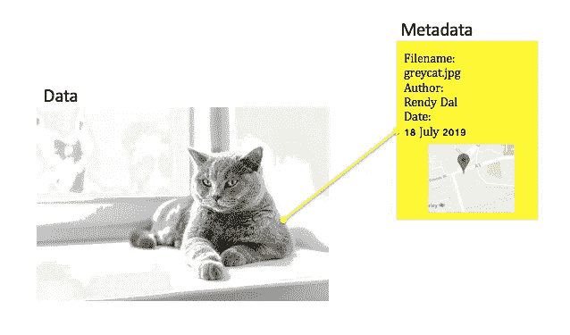

# 了解企业/组织中的数据类型

> 原文：<https://towardsdatascience.com/understanding-the-types-of-data-in-a-business-organization-67d7cb9914bd?source=collection_archive---------8----------------------->

## 尝试谷歌一下，你会保证找到各种来源，每一个都有自己的版本(有的说 3 种数据，有的说 5 种，有的甚至说 13 种)。我们通过总结让你更容易理解，并让你的理解进入下一个层次

**B** 在您开始推出您的数据管理计划之前，无论是主数据管理、企业数据仓库、大数据分析还是其他什么，您都需要首先了解最基本的要素:数据。只有彻底认识到他们的特点，你才会知道如何正确对待他们。

> “数据是一种珍贵的东西，将比系统本身持续更久”
> 
> *蒂姆·伯纳斯·李*

所以让我们开始吧！

# **交易数据**

这类数据描述了您的核心业务活动。如果你是一家贸易公司，这可能包括你的采购和销售活动的数据。如果你是一家制造公司，这将是你的生产活动数据。如果你是打车或出租车公司，这将是行程数据。在一个非常基本的组织运作中，与雇佣和解雇员工的活动相关的数据也可以归类为事务性数据。因此，与其他类型的数据相比，这种类型的数据具有非常大的容量，并且通常在诸如 ERP 系统的操作应用中创建、存储和维护。

# 主数据

它由构成事务数据的关键信息组成。例如，出租车公司的行程数据可能包含司机、乘客、路线和费用数据。司机、乘客、位置和基本票价数据是主数据。驾驶员数据可以包括驾驶员的姓名和所有相关信息。乘客数据也是如此。它们一起构成了事务数据。

主数据通常包含地点(地址、邮政编码、城市、国家)、当事人(客户、供应商、员工)和事物(产品、资产、项目等)。).它是特定于应用程序的，这意味着它的用途是特定于具有相关业务流程的应用程序的，例如:在 HR 应用程序中创建、存储和维护员工主数据。

到目前为止，您应该对主数据相对恒定有所了解。虽然交易数据是以闪电般的速度创建的，但主数据在某种程度上是恒定的。行程数据随时都会被创建，但是司机的列表将保持不变，除非车上有新的司机或者被踢出去。

如今，组织内的过程通常是相互依赖的，这意味着在一个系统中进行的过程与在另一个系统中进行的过程相关。它们可以使用相同的主数据。如果每个系统管理自己主数据，可能会出现重复和不一致的情况。例如，客户在系统 A 中可能被存储为 Rendy，但在系统 B 中被列为 Randy，尽管 Rendy 和 Randy 实际上是同一个实体。但是没必要担心，有一个规则来处理这种情况。叫做**主数据管理。**

# 参考数据

参考数据是主数据的子集。它通常是由特定编码管理的标准化数据(例如，国家列表由 ISO 3166-1 管理。有一种简单的方法来区分参考数据和主数据。永远记住，参考数据比主数据更不稳定。让我们回到我们的出租车公司。明天，后天，或者下周，每当有新人加入或者被踢出去，车手名单可能会改变。但我可以向你保证，即使 20 年后，这个国家名单也不会变，除非有一小块土地宣布独立。

# 报告数据

这是出于分析和报告目的的汇总数据汇编。这些数据包括交易数据、主数据和参考数据。比如:T *rip 数据*(交易+主*)大伦敦地区 7 月 13 日*(参考)。报告数据非常具有战略性，通常作为决策过程的组成部分。

# [计]元数据

这是一个关于数据的数据。听起来很困惑？确实如此。这是我第一次进入数据管理领域时让我头晕目眩的数据类型。谢天谢地，这张漂亮图片让我很容易理解什么是元数据。

Data & its metadata

如果我问你一个问题:猫是什么颜色的？只要看一下数据，你马上就能自信地回答我的问题。它是灰色的。但是如果我想出另一个问题:这张照片是在何时何地拍摄的呢？你很有可能无法通过*只看*数据来给我正确的答案。这就是元数据的用武之地。它为您提供了有关数据的完整信息，包括数据拍摄的时间和地点。

所以元数据给了你任何问题的答案，而你仅仅通过数据是无法回答的。所以才说:*关于数据的数据*。

这就是你需要知道的关于数据类型的全部内容。再说一次，这并不是一个令人疲惫的解释，我可以保证，仅仅通过阅读这篇文章，你还不能接受数据科学家的工作邀请。但是无论何时你在街上遇到有人问你组织中常见的数据类型，你仍然可以带着所有这些解释自信地回答。