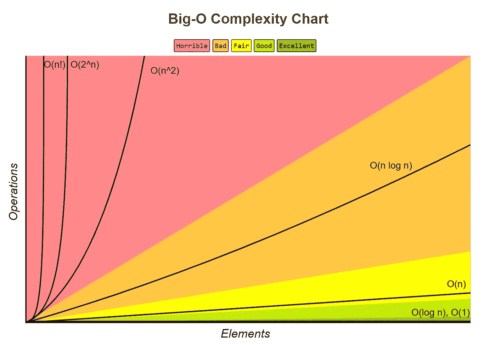
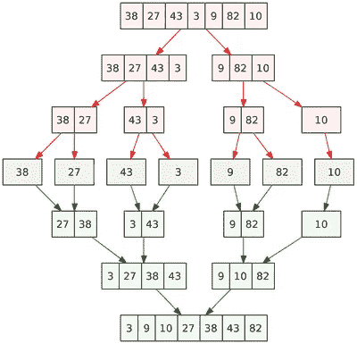
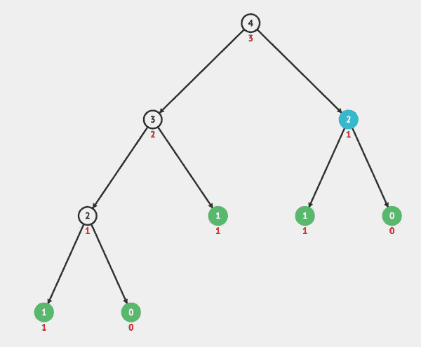
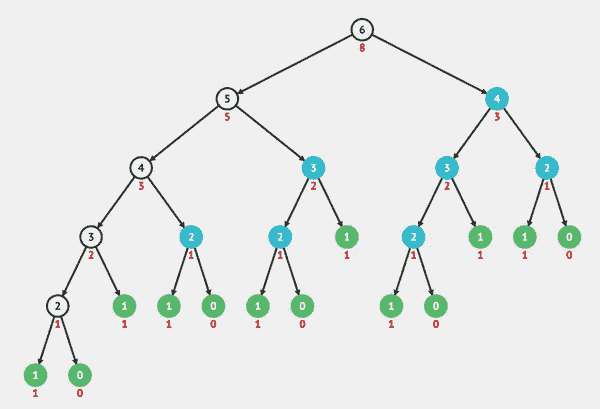
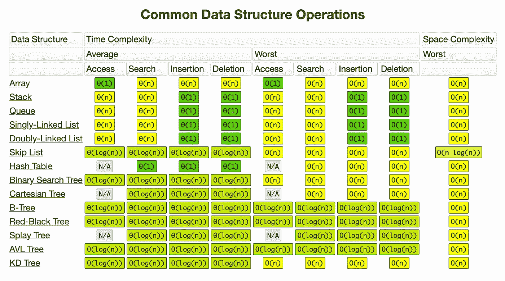
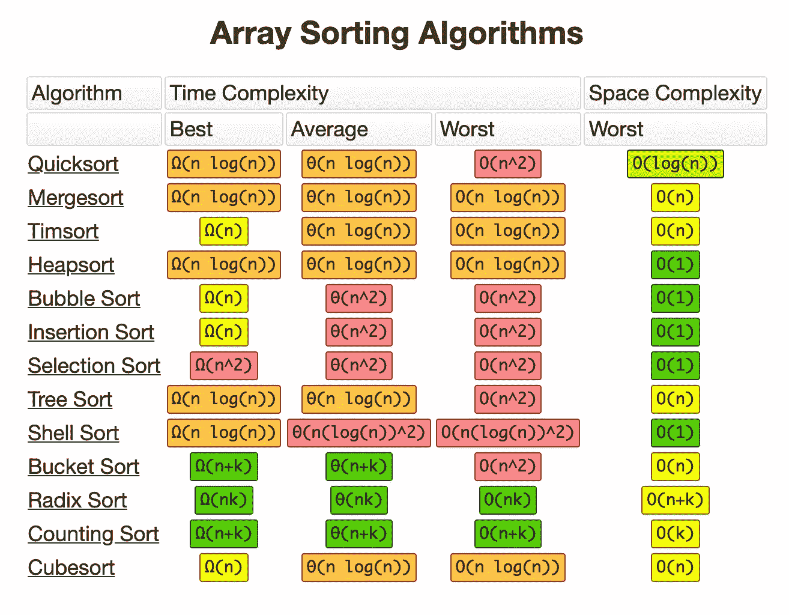

# 通过 Python 示例理解时间复杂性

> 原文：<https://towardsdatascience.com/understanding-time-complexity-with-python-examples-2bda6e8158a7?source=collection_archive---------0----------------------->



Big-O Complexity Chart: [http://bigocheatsheet.com/](http://bigocheatsheet.com/)

如今，面对我们每天消耗和生成的所有这些数据，算法必须足以处理大量数据的运算。

在这篇文章中，我们将了解更多关于时间复杂性，Big-O 符号以及为什么我们在开发算法时需要关注它。

这个故事中展示的例子是用 Python 开发的，所以如果你至少有 Python 的基础知识，会更容易理解，但这不是先决条件。

让我们开始理解什么是计算复杂性。

# 计算的复杂性

**计算复杂性**是计算机科学的一个领域，**根据运行算法所需的资源量来分析算法**。所需资源的数量根据输入大小而变化，因此复杂性通常表示为 *n* 的函数，其中 *n* 是输入的大小。

值得注意的是，当分析一个算法时，我们可以考虑时间复杂度**和空间复杂度**。空间复杂度基本上是解决与输入大小相关的问题所需的内存空间量。尽管空间复杂度在分析算法时很重要，但在这个故事中，我们将只关注时间复杂度。

# 时间复杂度

当你现在正在读这个故事的时候，你可能对什么是时间复杂性有一个概念，但是为了确保我们都在同一页上，让我们从维基百科[的一个简短描述开始理解时间复杂性意味着什么。](https://en.wikipedia.org/wiki/Time_complexity)

> 在计算机科学中，时间复杂度是计算复杂度，它描述了运行一个算法所需的时间。时间复杂度通常通过计算算法执行的基本操作的数量来估计，假设每个基本操作花费固定的时间来执行。

在分析算法的时间复杂度时，我们可能会发现三种情况:**最佳情况**、**一般情况**和**最坏情况**。让我们来理解它的含义。

假设我们有下面这个未排序的列表**【1，5，3，9，2，4，6，7，8】**，我们需要使用[线性搜索](https://en.wikipedia.org/wiki/Linear_search)找到这个列表中某个值的索引。

*   **最佳情况**:这是解决最佳输入问题的复杂度。在我们的例子中，最好的情况是搜索值 1。因为这是列表的第一个值，所以它将在第一次迭代中被找到。
*   **平均案例**:这是解决问题的平均复杂度。这种复杂性是相对于输入数据中值的分布来定义的。也许这不是最好的例子，但是根据我们的例子，我们可以说，一般情况下，当我们在列表的“中间”搜索某个值时，例如，值 2。
*   **最差情况**:这是解决大小为 n 的最差输入问题的复杂性。在我们的例子中，最差情况是搜索值 8，这是列表中的最后一个元素。

通常，当描述一个算法的时间复杂度时，我们谈论的是最坏的情况。

好的，但是我们如何描述算法的时间复杂度呢？

我们使用一种叫做 Big-O 的数学符号。

# 大 O 符号

**Big-O 符号**，有时也称为“渐近符号”，**是一种数学符号，描述了函数**在自变量趋向特定值或无穷大时的极限行为。

在计算机科学中，Big-O 符号用于根据算法的运行时间或空间需求如何随着输入大小( *n* )的增长而增长来对算法进行分类。这种符号根据函数的增长率来表征函数:具有相同增长率的不同函数可以用相同的 O 符号来表示。

让我们看看 Big-O 符号中描述的一些常见的时间复杂性。

## 常见时间复杂性表

以下是使用 Big-O 符号表示的最常见的时间复杂性:

```
╔══════════════════╦═════════════════╗
║       **Name**       ║ **Time Complexity** ║
╠══════════════════╬═════════════════╣
║ Constant Time    ║       O(1)      ║
╠══════════════════╬═════════════════╣
║ Logarithmic Time ║     O(log n)    ║
╠══════════════════╬═════════════════╣
║ Linear Time      ║       O(n)      ║
╠══════════════════╬═════════════════╣
║ Quasilinear Time ║    O(n log n)   ║
╠══════════════════╬═════════════════╣
║ Quadratic Time   ║      O(n^2)     ║
╠══════════════════╬═════════════════╣
║ Exponential Time ║      O(2^n)     ║
╠══════════════════╬═════════════════╣
║ Factorial Time   ║       O(n!)     ║
╚══════════════════╩═════════════════╝
```

请注意，我们将重点研究这些常见的时间复杂性，但还有其他一些时间复杂性，您可以稍后再研究。

正如已经说过的，我们通常使用 Big-O 符号来描述算法的时间复杂度。在符号的正式定义中涉及到很多数学，但是非正式地，我们可以假设 Big-O 符号给出了算法在最坏情况下的大概运行时间。当使用 Big-O 符号时，我们根据输入数据大小的增加来描述算法的效率( *n* )。例如，如果输入是一个字符串，则 *n* 将是该字符串的长度。如果是列表，则 *n* 将是列表的长度，以此类推。

现在，让我们看看这些常见的时间复杂性，并看看一些算法的例子。请注意，我试图遵循以下方法:给出一点描述，展示一个简单易懂的例子，展示一个更复杂的例子(通常来自现实世界的问题)。

# 时间复杂性

## 常数时间— O(1)

当一个算法不依赖于输入数据时，该算法被称为具有恒定时间( *n* )。不管输入数据的大小，运行时间总是一样的。例如:

```
if a > b:
    return True
else:
    return False
```

现在，让我们看看函数 **get_first** ，它返回列表的第一个元素:

```
def get_first(data):
    return data[0]

if __name__ == '__main__':
    data = [1, 2, 9, 8, 3, 4, 7, 6, 5]
    print(get_first(data))
```

不管输入数据大小如何，它总是有相同的运行时间，因为它只从列表中获取第一个值。

具有恒定时间复杂度的算法是极好的，因为我们不需要担心输入大小。

## 对数时间— O(log n)

当一个算法在每一步中减少输入数据的大小时(它不需要查看输入数据的所有值)，该算法被认为具有对数时间复杂度，例如:

```
for index in range(0, len(data), 3):
    print(data[index])
```

具有对数时间复杂度的算法通常出现在对[二叉树](https://en.wikipedia.org/wiki/Binary_tree)的运算中，或者使用[二分搜索法](https://en.wikipedia.org/wiki/Binary_search_algorithm)时。让我们来看一个二分搜索法的例子，我们需要找到一个元素在一个排序列表中的位置:

```
def binary_search(data, value):
    n = len(data)
    left = 0
    right = n - 1
    while left <= right:
        middle = (left + right) // 2
        if value < data[middle]:
            right = middle - 1
        elif value > data[middle]:
            left = middle + 1
        else:
            return middle
    raise ValueError('Value is not in the list')

if __name__ == '__main__':
    data = [1, 2, 3, 4, 5, 6, 7, 8, 9]
    print(binary_search(data, 8))
```

二分搜索法的步骤:

*   计算列表的中间。
*   如果搜索的值低于列表中间的值，则设置一个新的右边界。
*   如果搜索的值高于列表中间的值，则设置一个新的左边界。
*   如果搜索值等于列表中间的值，则返回中间值(索引)。
*   重复上述步骤，直到找到值，或者左边界等于或高于右边界。

理解必须访问其输入数据的所有元素的算法不能花费对数时间是很重要的，因为读取大小为 *n* 的输入所花费的时间是 *n* 的数量级。

## 线性时间— O(n)

当运行时间最多随着输入数据的大小线性增加时，算法被认为具有线性时间复杂度。当算法必须检查输入数据中的所有值时，这是可能的最佳时间复杂度。例如:

```
for value in data:
    print(value)
```

让我们来看一个[线性搜索](https://en.wikipedia.org/wiki/Linear_search)的例子，我们需要在一个未排序的列表中找到一个元素的位置:

```
def linear_search(data, value):
    for index in range(len(data)):
        if value == data[index]:
            return index
    raise ValueError('Value not found in the list')

if __name__ == '__main__':
    data = [1, 2, 9, 8, 3, 4, 7, 6, 5]
    print(linear_search(data, 7))
```

注意，在这个例子中，我们需要查看列表中的所有值，以找到我们要寻找的值。

## 准线性时间— O(n log n)

当输入数据中的每个操作都具有对数时间复杂度时，称算法具有准线性时间复杂度。常见于排序算法中(如 [mergesort](https://en.wikipedia.org/wiki/Merge_sort) 、 [timsort](https://en.wikipedia.org/wiki/Timsort) 、 [heapsort](https://en.wikipedia.org/wiki/Heapsort) )。

例如:对于数据 1 中的每个值( **O(n)** )使用二分搜索法( **O(log n)** )在数据 2 中搜索相同的值。

```
for value in data1:
    result.append(binary_search(data2, value))
```

另一个更复杂的例子，可以在[合并排序](https://en.wikipedia.org/wiki/Merge_sort)算法中找到。Mergesort 是一种高效、通用、基于比较的排序算法，具有准线性时间复杂度，让我们看一个例子:

```
def merge_sort(data):
    if len(data) <= 1:
        return

    mid = len(data) // 2
    left_data = data[:mid]
    right_data = data[mid:]

    merge_sort(left_data)
    merge_sort(right_data)

    left_index = 0
    right_index = 0
    data_index = 0

    while left_index < len(left_data) and right_index < len(right_data):
        if left_data[left_index] < right_data[right_index]:
            data[data_index] = left_data[left_index]
            left_index += 1
        else:
            data[data_index] = right_data[right_index]
            right_index += 1
        data_index += 1

    if left_index < len(left_data):
        del data[data_index:]
        data += left_data[left_index:]
    elif right_index < len(right_data):
        del data[data_index:]
        data += right_data[right_index:]

if __name__ == '__main__':
    data = [9, 1, 7, 6, 2, 8, 5, 3, 4, 0]
    merge_sort(data)
    print(data)
```

下图举例说明了 mergesort 算法所采取的步骤。



Mergesort example: [https://en.wikipedia.org/wiki/Merge_sort](https://en.wikipedia.org/wiki/Merge_sort)

注意，在这个例子中，排序是就地执行的。

## 二次时间— O(n)

当一个算法需要对输入数据中的每个值执行线性时间运算时，该算法被称为具有二次时间复杂度，例如:

```
for x in data:
    for y in data:
        print(x, y)
```

[冒泡排序](https://en.wikipedia.org/wiki/Bubble_sort)是二次时间复杂度的一个很好的例子，因为对于每个值，它需要与列表中的所有其他值进行比较，让我们来看一个例子:

```
def bubble_sort(data):
    swapped = True
    while swapped:
        swapped = False
        for i in range(len(data)-1):
            if data[i] > data[i+1]:
                data[i], data[i+1] = data[i+1], data[i]
                swapped = True

if __name__ == '__main__':
    data = [9, 1, 7, 6, 2, 8, 5, 3, 4, 0]
    bubble_sort(data)
    print(data)
```

## 指数时间— O(2^n)

当输入数据集每增加一次，增长就加倍时，算法被认为具有指数时间复杂度。这种时间复杂度通常见于蛮力算法。

正如赖薇所举的例子:

> 在密码学中，强力攻击可以通过迭代子集来系统地检查密码的所有可能元素。使用指数算法来做到这一点，暴力破解长密码和短密码会变得非常耗费资源。这就是长密码被认为比短密码更安全的原因之一。

指数时间算法的另一个例子是[斐波那契](https://en.wikipedia.org/wiki/Fibonacci_number)数的递归计算:

```
def fibonacci(n):
    if n <= 1:
        return n
    return fibonacci(n-1) + fibonacci(n-2)
```

如果你不知道什么是[递归函数](https://en.wikipedia.org/wiki/Recursion_(computer_science))，那就赶紧说清楚:递归函数可能被描述为在特定条件下调用自身的函数。您可能已经注意到，递归函数的时间复杂度有点难以定义，因为它取决于函数被调用的次数和单次函数调用的时间复杂度。

当我们看递归树时更有意义。下面的递归树是使用 *n = 4* 通过斐波那契算法生成的:



Recursion tree of Fibonacci(4): [https://visualgo.net/bn/recursion](https://visualgo.net/bn/recursion)

请注意，它会呼叫自己，直到它到达树叶。当到达树叶时，它返回值本身。

现在，看看递归树是如何增长的，只是将 *n* 增加到 6:



Recursion tree of Fibonacci(6): [https://visualgo.net/bn/recursion](https://visualgo.net/bn/recursion)

你可以在 StackOverflow 的这里找到关于递归斐波那契算法[时间复杂度的更完整的解释。](https://stackoverflow.com/a/360773/4946821)

## 阶乘— O(n！)

当一个算法根据输入数据的大小以阶乘方式增长时，该算法被称为具有阶乘时间复杂度，例如:

```
2! = 2 x 1 = 2
3! = 3 x 2 x 1 = 6
4! = 4 x 3 x 2 x 1 = 24
5! = 5 x 4 x 3 x 2 x 1 = 120
6! = 6 x 5 x 4 x 3 x 2 x 1 = 720
7! = 7 x 6 x 5 x 4 x 3 x 2 x 1 = 5.040
8! = 8 x 7 x 6 x 5 x 4 x 3 x 2 x 1 = 40.320
```

正如你可以看到的，它增长非常快，即使是一个小尺寸的输入。

具有阶乘时间复杂度的算法的一个很好的例子是堆算法，它用于生成所有可能的 *n* 对象的排列。

据[维基百科](https://en.wikipedia.org/wiki/Heap%27s_algorithm):

> 希普发现了一种系统的方法，在每一步选择一对元素进行切换，以便恰好一次产生这些元素的每一种可能的排列。

让我们来看看这个例子:

```
def heap_permutation(data, n):
    if n == 1:
        print(data)
        return

    for i in range(n):
        heap_permutation(data, n - 1)
        if n % 2 == 0:
            data[i], data[n-1] = data[n-1], data[i]
        else:
            data[0], data[n-1] = data[n-1], data[0]

if __name__ == '__main__':
    data = [1, 2, 3]
    heap_permutation(data, len(data))
```

结果将是:

```
[1, 2, 3]
[2, 1, 3]
[3, 1, 2]
[1, 3, 2]
[2, 3, 1]
[3, 2, 1]
```

请注意，它将根据输入数据的大小以阶乘的方式增长，因此我们可以说该算法的阶乘时间复杂度为 O(n！).

另一个很好的例子是[旅行推销员问题](https://en.wikipedia.org/wiki/Travelling_salesman_problem)。

# 重要注意事项

值得注意的是，当分析一个算法的时间复杂度时，我们需要根据所有操作中最大的复杂度来描述算法。例如:

```
def my_function(data):
    first_element = data[0]

    for value in data:
        print(value)

    for x in data:
        for y in data:
            print(x, y)
```

即使‘my _ function’中的操作没有意义，我们也可以看到它有多个时间复杂度:O(1) + O(n) + O(n)。因此，当增加输入数据的大小时，该算法的瓶颈将是需要 O(n)的运算。基于此，我们可以把这个算法的时间复杂度描述为 O(n)。

# Big-O 备忘单

为了让您的生活更轻松，您可以在这里找到一个表格，其中列出了最常见的数据结构中操作的时间复杂度。



Common Data Structure Operations: [http://bigocheatsheet.com/](http://bigocheatsheet.com/)

这是另一张关于最常见排序算法的时间复杂度的表格。



Array Sorting Algorithms: [http://bigocheatsheet.com/](http://bigocheatsheet.com/)

# 为什么了解所有这些很重要？

如果在读完所有这些故事后，你仍然对了解时间复杂性和 Big-O 符号的重要性有所怀疑，让我们澄清一些观点。

即使在使用现代语言时，比如 Python，它提供了内置函数，比如排序算法，有一天你可能需要实现一个算法来对一定数量的数据执行某种操作。通过学习时间复杂性，你将理解效率的重要概念，并且能够发现你的代码中应该改进的瓶颈，主要是在处理巨大的数据集时。

除此之外，如果你打算申请谷歌、脸书、推特和亚马逊这样的大公司的软件工程师职位，你需要准备好使用 Big-O 符号回答关于时间复杂性的问题。

# 最终注释

感谢您阅读这个故事。我希望你已经学到了更多关于时间复杂性和 Big-O 符号的知识。如果你喜欢它，请鼓掌并分享它。如果您有任何疑问或建议，请随时评论或给我发电子邮件。另外，你也可以在 [Twitter](https://twitter.com/KelvinINC) 、 [Linkedin](https://www.linkedin.com/in/kelvinsprado/) 和 [Github](https://github.com/kelvins) 上随时关注我。

# 参考

*   **计算复杂度**:[https://en.wikipedia.org/wiki/Computational_complexity](https://en.wikipedia.org/wiki/Computational_complexity)
*   **大 O 符号**:[https://en.wikipedia.org/wiki/Big_O_notation](https://en.wikipedia.org/wiki/Big_O_notation)
*   **时间复杂度**:[https://en.wikipedia.org/wiki/Time_complexity](https://en.wikipedia.org/wiki/Time_complexity)
*   **Big-O 小抄**:[http://bigocheatsheet.com/](http://bigocheatsheet.com/)
*   **算法时间复杂度的工间介绍**:[https://vickylai . com/verbose/A-coffee-break-introduction-to-time-complex-of-algorithms/](https://vickylai.com/verbose/a-coffee-break-introduction-to-time-complexity-of-algorithms/)