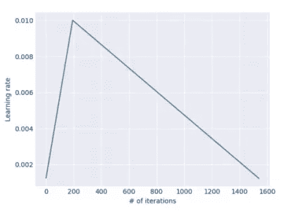
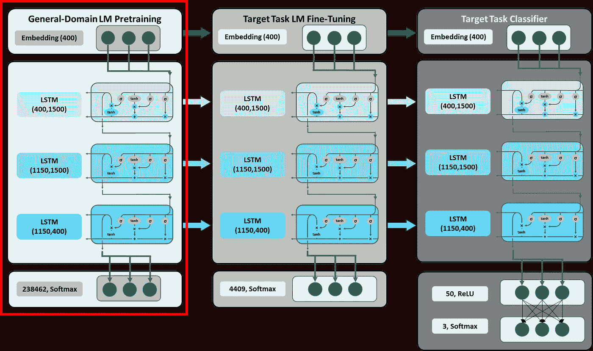

# 理解 ul fit——自然语言处理向迁移学习的转变

> 原文：<https://towardsdatascience.com/understanding-ulmfit-and-elmo-the-shift-towards-transfer-learning-in-nlp-b5d8e2e3f664?source=collection_archive---------19----------------------->

## 了解什么是 ULMFiT 它做什么和如何工作；以及它在 NLP 中引起的根本性转变

Image by [Hitesh Choudhary](https://unsplash.com/@hiteshchoudhary) from [Unsplash](https://unsplash.com/photos/t1PaIbMTJIM)

自然语言处理在过去十年中加快了步伐，随着实现深度学习越来越容易，该领域已经有了重大发展。然而，它落后于计算机视觉领域的专业水平。

主要原因是迁移学习使许多计算机视觉任务比实际简单得多——像 VGGNet⁸或 AlexNet⁹这样的预训练模型可以微调以适应大多数计算机视觉任务。这些预训练的模型是在像 ImageNet 这样的大型语料库上训练的。它们被用来捕捉图像的一般特征和属性。因此，经过一些调整，它们可以用于大多数任务。因此，不必为每一项计算机视觉任务从头开始训练模型。此外，由于它们是在一个巨大的语料库上训练的，许多任务的准确性或结果都是非常出色的，并且会胜过为特定任务从头开始训练的较小模型。

另一方面，对于每个 NLP 任务，模型必须被单独地和逐个地训练。这非常耗时，并且限制了这些模型的范围。“最近的方法(2017 年和 2018 年)将来自其他任务的嵌入与不同层的输入连接起来，仍然从头训练主任务模型，并将预训练的嵌入视为固定参数，从而限制了它们的有用性。”缺乏关于如何为各种 NLP 任务适当微调语言模型的知识。

# 通用语言模型微调

2018 年，霍华德和鲁德等人。艾尔。为*归纳迁移学习*的神经模型微调提供了一种新方法——给定一个训练模型的源任务，相同的模型将用于在其他任务(NLP 任务)上获得良好的性能。

Figure 2: Main Stages in ULMFiT — Figure from [Analytics Vidya](https://cdn.analyticsvidhya.com/wp-content/uploads/2018/11/ulmfit_flow_2.png)

**选择基础模型** 理想的源任务被视为语言建模，并被视为类似于自然语言处理任务的 ImageNet。这是因为以下原因:“它捕获了与下游任务相关的语言的许多方面，例如长期依赖、等级关系和情感。与机器翻译(MT)和蕴涵等任务相比，它为大多数领域和语言提供了近乎无限量的数据。”此外，语言建模可以被训练以适应特定的目标任务的独特特征，并且语言建模是各种其他 NLP 任务的组成部分。通常，像 AWD-LSTM⁷这样的好的语言模型(LM)被选作基础模型。一般认为，基础模型越好，最终模型在微调后在各种 NLP 任务上的性能就越好。

通用领域语言模型预训练
预训练是在一个大规模的语言语料库上进行的，该语料库能有效地捕捉语言的主要属性和方面。这有点像图像网络语料库，但是对于语言来说。该阶段只需执行一次。得到的预训练模型可以在所有任务的下一阶段重复使用。
预训练已经完成，因此模型已经理解了语言的一般属性，必须稍加调整以适应特定的任务。事实上，发现预训练对于小数据集和中等大小的数据集特别有用。

**目标任务 LM 微调**当使用预训练模型时，那么，在这个阶段的收敛更快。在这个阶段，*判别微调*和*倾斜三角学习率*用于微调语言模型。

**区别性微调**
“由于不同的层捕捉不同类型的信息，所以应该对它们进行不同程度的微调。”因此，对于每一层，使用不同的学习速率。最后一层的学习，ηᴸ是固定的。然后，用ηˡ⁻ = ηˡ/2.6 来获得其余的学习率。

Figure 3: Weight update for each layer where l=1, 2, …, L is the layer number, ηˡ is the learning rate for the lᵗʰ layer, L is the number of layers, θˡₜ is the weights of the lᵗʰ layer at iteration t and ∇(θˡ) [ J(θ) ] is the gradient with regard to the model’s objective function. — Image and Equation for [ULMFiT Research Paper](https://arxiv.org/abs/1801.06146)

**倾斜三角形学习率** 在整个微调过程中，学习率并不保持恒定。最初，对于一些时期，它们以陡峭的斜率线性增加。然后，对于多个时期，它们以逐渐的斜率线性降低。发现这给出了模型的良好性能。

Figure 4: Slanted Triangular Learning Rates — Change of learning rate with each iteration — Image from [Wordpress](https://yashuseth.files.wordpress.com/2018/06/stlr-formula2.jpg?w=413&h=303)

**目标任务分类器微调**
“最后，为了微调分类器，我们用两个额外的线性块来扩充预训练的语言模型。”每个块有以下
1。批量正常化
2。辍学
3。中间层
4 的重新激活。softmax 激活输出层以预测类别

## 进一步改进模型的一些附加步骤

**Concat Pooling** 一般来说，在文本分类中，重要的词只有几个词，可能是整个文档的一小部分，尤其是文档比较大的时候。因此，为了避免信息丢失，隐藏状态向量与隐藏状态向量的最大汇集和平均汇集形式连接。
**逐步解冻**
当所有层同时微调时，存在灾难性遗忘的风险。因此，最初除了最后一层之外的所有层都被冻结，并且微调在一个时期内完成。一个接一个的层被解冻，微调完成。重复这一过程直到收敛。
**使用双向模型** 组合前向和后向 LM 分类器进一步提高了性能。

Figure 5: Block Diagram of ULMFiT in Text Analysis — Image from by [HU-Berlin](https://www.hu-berlin.de/en) from [GitHub](https://humboldt-wi.github.io/blog/img/seminar/group4_ULMFiT/Figure_5.png)

**ULMFiT 的优势** 与在相应数据集上从头开始训练的模型相比，基于 ulm fit 的模型(已经过预训练)即使在中小型数据集上也表现得非常好。这是因为他们已经在前期训练中掌握了语言的特性。
新提出的微调 LM 和分类器的方法证明比使用传统的微调模型的方法给出更好的精度。

Figure 6: ULMFiT Performance Comparison on IMDB Dataset — Image from [FastAI](http://nlp.fast.ai/images/ulmfit_imdb.png)

ULMFiT 彻底改变了 NLP 领域，提高了 NLP 中深度学习的范围，并使在比以前少得多的时间内为各种任务训练模型成为可能。这为自然语言处理的迁移学习奠定了基础，并为埃尔莫、GPT、GPT-2、伯特和 XLNet 铺平了道路。

[如何使用 ULMFiT 进行文本处理](https://github.com/fastai/fastai/blob/master/examples/ULMFit.ipynb)

附加教程链接:[https://www . analyticsvidhya . com/blog/2018/11/Tutorial-text-classification-ulm fit-fastai-library/](https://www.analyticsvidhya.com/blog/2018/11/tutorial-text-classification-ulmfit-fastai-library/)

注意:我最初写这篇文章是作为我的自然语言处理课程的作业。

在我的 [YouTube 频道](http://bit.ly/ai-n-ml-youtube)上观看解释机器学习、人工智能和数据科学概念的视频。

# 参考

[1]霍华德，j .，&鲁德，S. (2018)。用于文本分类的通用语言模型微调。 *arXiv 预印本 arXiv:1801.06146* 。*
【2】图一:[【https://miro.medium.com/proxy/0*2t3JCdtfsV2M5S_B.png】
【3】图二:](https://miro.medium.com/proxy/0*2t3JCdtfsV2M5S_B.png)[https://cdn . analyticsvidhya . com/WP-content/uploads/2018/11/ulm fit _ flow _ 2 . png](https://cdn.analyticsvidhya.com/wp-content/uploads/2018/11/ulmfit_flow_2.png)
【4】图四:[https://yashuseth . files . WordPress . com/2018/06/stlr-formula 2 . jpg？w=413 & h=303](https://yashuseth.files.wordpress.com/2018/06/stlr-formula2.jpg?w=413&h=303) 2017 年 b。指针哨兵混合模型。2017 年国际学习代表会议论文集。
[8]西蒙扬，k .，&齐塞曼，A. (2014)。用于大规模图像识别的非常深的卷积网络。 *arXiv 预印本 arXiv:1409.1556* 。
[9]克里热夫斯基，a .，&辛顿，G. E. (2012)。基于深度卷积神经网络的图像网分类。在*神经信息处理系统的进展*(第 1097-1105 页)。

*本文中的许多短语、句子和段落都是表格[1]中句子或段落的总结。图 3 也取自[1]。