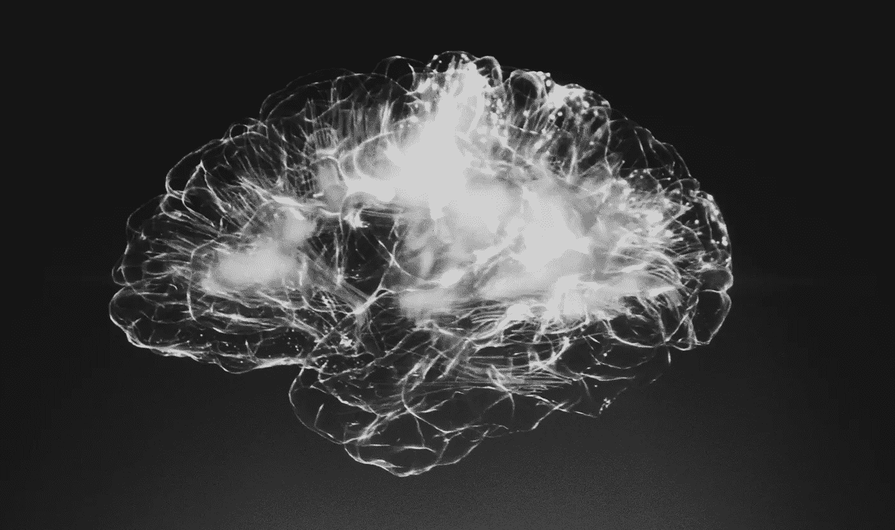
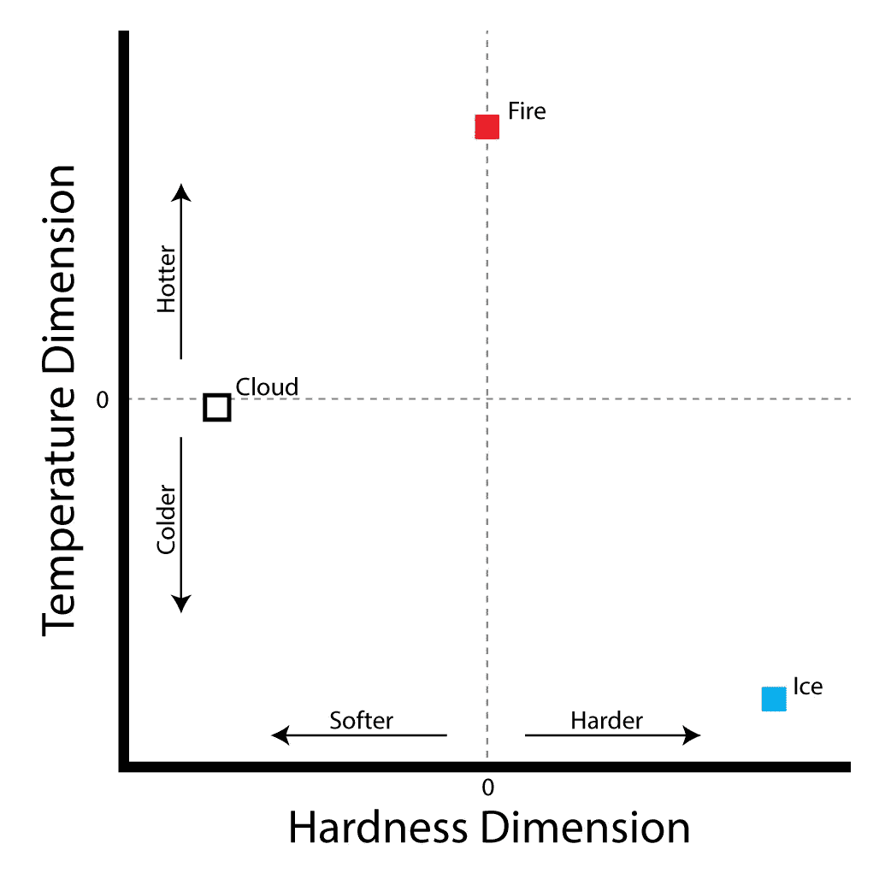

# 理解理解:事物如何有意义

> 原文：<https://towardsdatascience.com/understanding-understanding-how-anything-has-meaning-4613da9d72e2?source=collection_archive---------28----------------------->

我们的理解是我们如何认识我们的世界。它是我们的“心灵之眼”，是我们思考的地方，也是唯一赋予任何事物意义的东西。理解之外的其他体验都是通过感觉来感知的。

你将要读到的描述了无意识理解的过程。支配有意识理解的机制是未来文章的主题。

为了清楚起见，理解和觉察是说类似事情的两个角度。理解是用知识从基础上重建现实，而觉知指的是被重建的对象。

知识是理解的必要条件。知识是识别模式并将其抽象为信号的能力。一个有知识的人是能识别很多模式的人。当多个信号能够告知一个更高层次的模式时，理解就形成了。

如果你看到你下面有一艘船，周围都是水，你知道你在一片水域中的一艘船上。

虽然可能不明显，但这种理解是一种基本的模拟。例如，如果你认识到船在水面上没有摇晃，这个新的信号会改变你的理解。你可以模拟水很浅，船停在水下的地面上。

理解是一个模拟的场景，而意识是指场景中的对象。

现在，你正在用你的理解能力来阅读这句话。你正试图模拟用特定顺序排列的单词来产生这篇文章的思维。

你读的每一个单词都在激活你大脑中该单词的语义表征。“语义”意味着激活代表多维思维空间中的特定位置。我会详细说明这是什么意思:

每个词都可以在很多属性或“维度”上识别。例如，考虑“温度”维度:“火”因为高温而具有较大的正值，“冰”因为低温而具有较大的负值，“云”则接近于零，因为我们通常不认为云具有温度属性。

同时，考虑“硬度”维度:“冰”将具有大的正值，因为冰是硬的，“云”将具有大的负值，因为云是软的，“火”将接近于零，因为火通常不被认为具有硬度属性。

总的来说，所有用来描述每个单词的各种属性最终创造了一个想象的多维思维空间，每个单词都存在于其中的特定位置。

在大脑中，给定维度上的正值是连接到该属性的兴奋性神经连接，负值是连接到该属性的抑制性神经连接，零值是缺乏与该属性的连接。

在人工智能神经网络中，程序使用向量(一系列数字)来表示每个单词，这些数字是该单词在多维思维空间中所处位置的坐标。向量中的每个数字可以是正的、负的或接近于零的，并表示该单词如何与给定的维度属性相关。

理解“语义”真的很重要，因为语义是思维的基础。当你阅读每个单词时，你在大脑中激活该单词的语义表示(识别为信号的模式)，同时使用语法来修改表示，并以特定的方式将它们联系在一起。“阅读”的结果是在多维思维空间中创建一条导航路径。给你几个特定的位置，对应于代表，并告诉他们连接。

为了理解你所读到的，你必须利用你大脑中的连接来重现同样的路径。所以，文字就成了被复制的模板。为了完成这种复制，你修改神经连接来连接由模板指示的思想空间中的特定位置。这个过程就是前面提到的模拟。

一旦你的模拟与通过阅读获得的模板相匹配，你就明白了我想要传达的意思。而且，你的模拟和我的模拟的差异是我们的沟通错误。

“在多维思维空间中生成路径的能力”与“对思维的理解”是同义词。当有人说“我懂”的时候，其实是在说“我会模拟”。