# 了解变分自动编码器(VAEs)

> 原文：<https://towardsdatascience.com/understanding-variational-autoencoders-vaes-f70510919f73?source=collection_archive---------0----------------------->

## 逐步建立导致 VAEs 的推理。

Credit: [Free-Photos](https://pixabay.com/fr/users/free-photos-242387/) on [Pixabay](https://pixabay.com/)

这篇文章是与巴蒂斯特·罗卡共同撰写的。

# 介绍

在过去的几年里，由于(并暗示)该领域的一些惊人的改进，基于深度学习的生成模型已经获得了越来越多的兴趣。依靠大量的数据、精心设计的网络架构和智能训练技术，深度生成模型显示出令人难以置信的能力，可以生成各种类型的高度逼真的内容，如图像、文本和声音。在这些深度生成模型中，有两个主要家族引人注目，值得特别关注:生成对抗网络(GANs)和变分自动编码器(VAEs)。

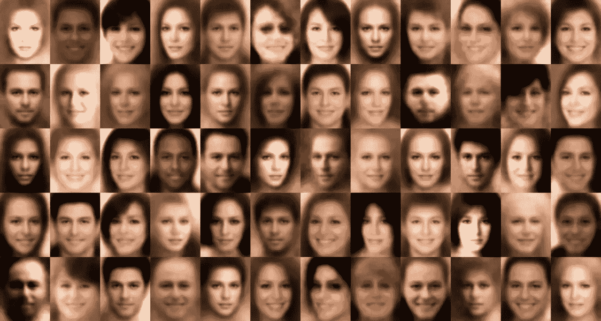

Face images generated with a Variational Autoencoder (source: [Wojciech Mormul on Github](https://github.com/WojciechMormul/vae)).

在今年 1 月发表的前一篇文章中，我们深入讨论了[生成对抗网络(GANs)](/understanding-generative-adversarial-networks-gans-cd6e4651a29) ，并特别展示了对抗训练如何对抗两个网络，一个生成器和一个鉴别器，以推动它们改进一次又一次的迭代。在这篇文章中，我们现在介绍另一种主要的深度生成模型:变分自动编码器(VAEs)。简而言之，VAE 是一个自动编码器，其编码分布在训练期间被正则化，以确保其潜在空间具有良好的属性，允许我们生成一些新数据。此外，术语“变分”来源于统计学中正则化和变分推断方法之间的密切关系。

如果最后两句很好地总结了 VAEs 的概念，它们也可以提出许多问题。什么是自动编码器？什么是潜在空间，为什么要规范它？如何从 VAEs 生成新数据？VAEs 和变分推理有什么联系？为了尽可能好地描述 VAEs，我们将尝试回答所有这些问题(以及许多其他问题！)并为读者提供尽可能多的见解(从基本的直觉到更高级的数学细节)。因此，这篇文章的目的不仅是讨论变分自动编码器所依赖的基本概念，而且是一步一步地建立，并从最开始的推理开始，导致这些概念。

事不宜迟，让我们一起(重新)发现 VAEs 吧！

## 概述

在第一部分中，我们将回顾一些关于降维和自动编码器的重要概念，它们将有助于理解 VAEs。然后，在第二部分中，我们将说明为什么自动编码器不能用于生成新数据，并将介绍各种自动编码器，它们是自动编码器的规范化版本，使生成过程成为可能。最后，在最后一节中，我们将基于变分推理给出一个更数学化的 VAEs 表示。

> **注。在上一节中，我们试图使数学推导尽可能完整和清晰，以弥合直觉和方程之间的差距。然而，不想深入 VAEs 的数学细节的读者可以跳过这一节，而不会影响对主要概念的理解。还要注意，在这篇文章中，我们将滥用符号:对于一个随机变量 z，我们将 p(z)表示这个随机变量的分布(或密度，取决于上下文)。**

# 降维、PCA 和自动编码器

在第一部分中，我们将首先讨论一些与降维相关的概念。特别是，我们将简要回顾主成分分析(PCA)和自动编码器，显示这两个想法是如何相互关联的。

## 什么是降维？

在机器学习中， [**降维**](https://en.wikipedia.org/wiki/Dimensionality_reduction) **就是减少描述某些数据的特征数量**的过程。这种缩减可以通过选择(仅保留一些现有特征)或提取(根据旧特征创建数量减少的新特征)来完成，在许多需要低维数据的情况下(数据可视化、数据存储、大量计算……)非常有用。虽然存在许多不同的降维方法，但我们可以建立一个全局框架来匹配大多数(如果没有的话！)的这些方法。

首先，我们称**编码器**为从“旧特征”表示(通过选择或提取)产生“新特征”表示的过程，称**解码器**为相反的过程。维数减少可以被解释为数据压缩，其中编码器压缩数据(从初始空间到**编码空间**，也称为**潜在空间**，而解码器解压缩它们。当然，取决于初始数据分布、潜在空间维度和编码器定义，这种压缩可能是有损的，这意味着一部分信息在编码过程中丢失，并且在解码时无法恢复。

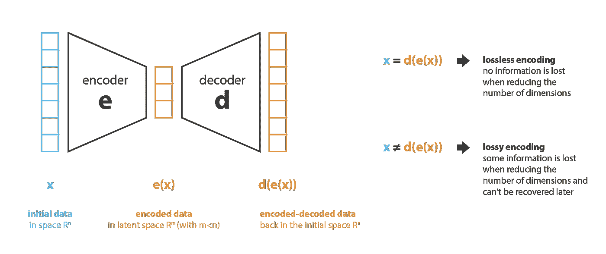

Illustration of the dimensionality reduction principle with encoder and decoder.

降维方法的主要目的是在给定系列中找到最佳编码器/解码器对。换句话说，对于给定的一组可能的编码器和解码器，我们正在寻找这样一对编码器和解码器:当对进行编码时，**保持最大的信息量，因此，当对**进行解码时，**具有最小的重建误差。如果我们分别用 E 和 D 表示我们所考虑的编码器和解码器的族，那么降维问题可以写成**

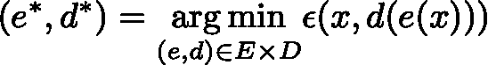

在哪里

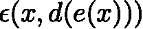

定义输入数据 x 和编码-解码数据 d(e(x))之间的重构误差度量。最后注意，在下文中，我们将表示 N 为数据数量，n_d 为初始(解码)空间的维数，n_e 为缩减(编码)空间的维数。

## 主成分分析

谈到降维，首先想到的方法之一是 [**主成分分析(PCA)**](https://en.wikipedia.org/wiki/Principal_component_analysis) 。为了展示它如何符合我们刚刚描述的框架，并与自动编码器建立联系，让我们对 PCA 的工作原理做一个非常全面的概述，把大部分细节放在一边*(注意，我们计划就这个主题写一篇完整的帖子)*。

PCA 的思想是建立 n_e 个新的**独立的**特征，这些特征是 n_d 个旧特征的**线性组合**，这样由这些新特征定义的子空间上的数据投影尽可能接近初始数据(根据欧几里德距离)。换句话说，PCA 正在寻找初始空间(由新特征的正交基描述)的最佳线性子空间，使得通过数据在该子空间上的投影来近似数据的误差尽可能小。

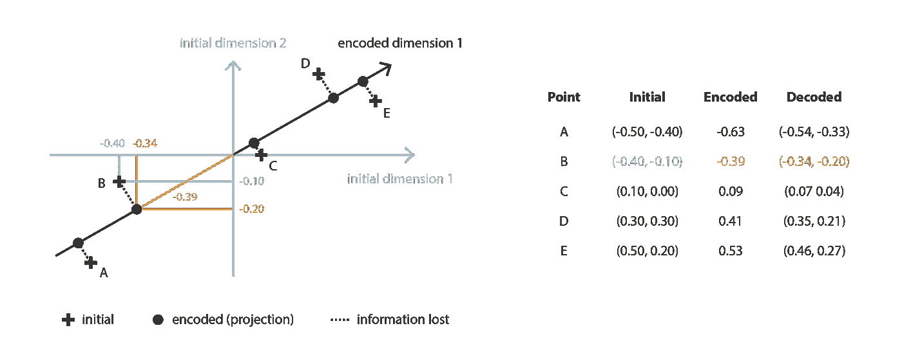

Principal Component Analysis (PCA) is looking for the best linear subspace using linear algebra.

在我们的全局框架中，我们在 n_e 乘 n_d 矩阵(线性变换)的族 E 中寻找一个编码器，其行是正交的(特征独立),并且在 n_d 乘 n_e 矩阵的族 D 中寻找相关的解码器。可以看出，对应于协方差特征矩阵的 n_e 个最大特征值(范数形式)的酉特征向量是正交的(或者可以被选择为正交的),并且定义了 n_e 维的最佳子空间，以最小的近似误差将数据投影到该子空间上。因此，这些 n_e 特征向量可以被选为我们的新特征，因此，降维问题可以表示为一个特征值/特征向量问题。此外，还可以看出，在这种情况下，解码器矩阵是编码器矩阵的转置。

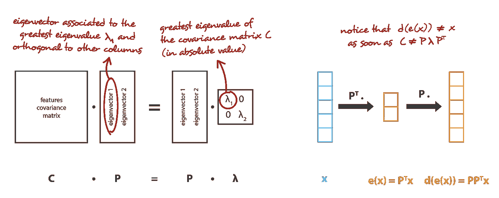

PCA matches the encoder-decoder framework we described.

## 自动编码器

现在让我们讨论一下**自动编码器**，看看我们如何使用神经网络进行降维。自动编码器的一般想法非常简单，包括**将编码器和解码器设置为神经网络**，以及**使用迭代优化过程**学习最佳编码-解码方案。因此，在每次迭代中，我们向自动编码器架构(编码器后接解码器)提供一些数据，我们将编码-解码输出与初始数据进行比较，并通过架构反向传播误差，以更新网络的权重。

因此，直觉上，整个自动编码器架构(编码器+解码器)为数据创建了一个瓶颈，确保只有信息的主要结构化部分能够通过并被重构。查看我们的一般框架，所考虑的编码器族 E 由编码器网络架构定义，所考虑的解码器族 D 由解码器网络架构定义，并且通过在这些网络的参数上的梯度下降来完成最小化重构误差的编码器和解码器的搜索。

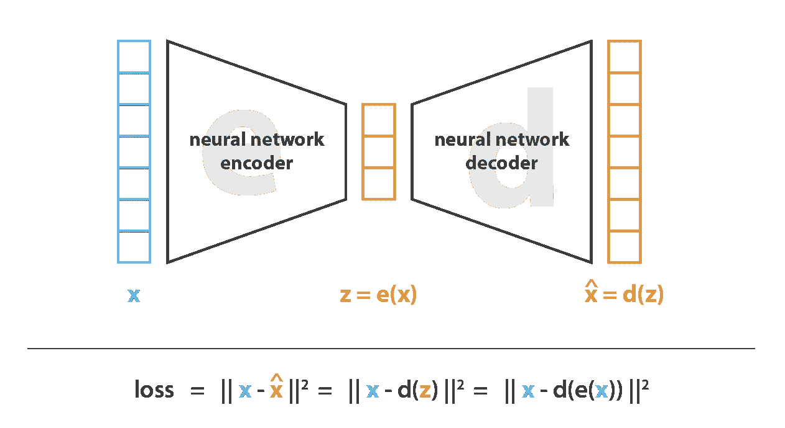

Illustration of an autoencoder with its loss function.

让我们首先假设我们的编码器和解码器架构都只有一个没有非线性的层(线性自动编码器)。这样的编码器和解码器是简单的线性变换，可以用矩阵表示。在这种情况下，我们可以看到与 PCA 的明确联系，就像 PCA 一样，我们正在寻找最佳的线性子空间来投影数据，同时尽可能少地丢失信息。用 PCA 获得的编码和解码矩阵自然地定义了我们将满意地通过梯度下降达到的解决方案之一，但是我们应该概述这不是唯一的一个。实际上，**可以选择几个基来描述同一个最佳子空间**，因此，几个编码器/解码器对可以给出最佳重建误差。此外，对于线性自动编码器，与 PCA 相反，我们最终得到的新特征不必是独立的(在神经网络中没有正交约束)。

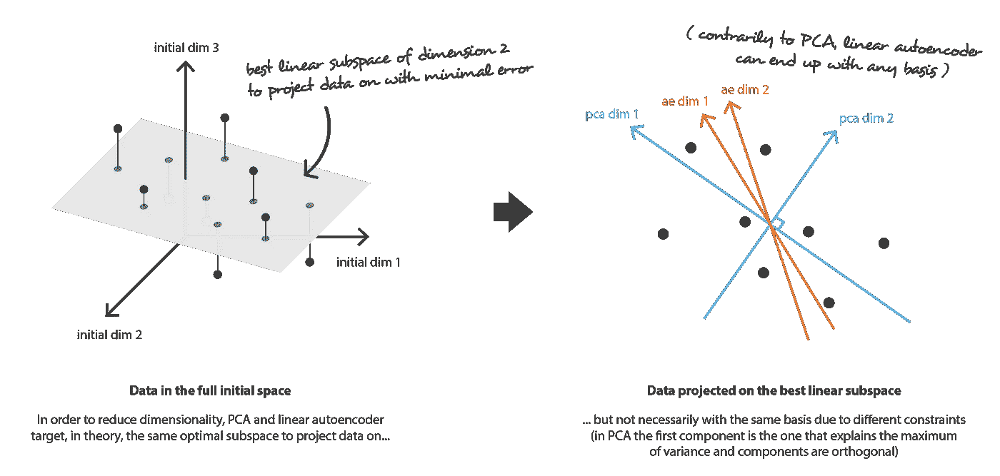

Link between linear autoencoder and PCA.

现在，让我们假设编码器和解码器都是深度非线性的。在这种情况下，架构越复杂，自动编码器就越能在保持低重建损失的同时进行高维数缩减。直观上，如果我们的编码器和解码器有足够的自由度，我们可以将任何初始维数减少到 1。事实上，具有“无限能力”的编码器理论上可以将我们的 N 个初始数据点编码为 1、2、3…直到 N(或者更一般地，作为实轴上的 N 个整数),并且相关联的解码器可以进行相反的变换，在该过程中没有损失。

在这里，我们应该记住两件事。首先，在没有重建损失的情况下进行重要的维度缩减通常是有代价的:在潜在空间中缺乏可解释和可利用的结构(**缺乏规律性**)。其次，在大多数情况下，降维的最终目的不仅仅是减少数据的维数，而是减少这个维数**，同时将数据结构信息的主要部分保留在简化的表示中**。由于这两个原因，潜在空间的维度和自动编码器的“深度”(定义压缩的程度和质量)必须根据降维的最终目的仔细控制和调整。

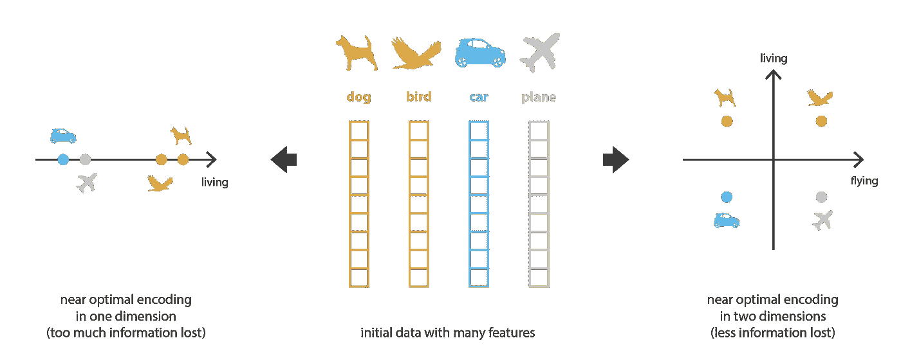

When reducing dimensionality, we want to keep the main structure there exists among the data.

# 可变自动编码器

到目前为止，我们已经讨论了降维问题，并介绍了自动编码器，它是可以通过梯度下降来训练的编码器-解码器架构。现在让我们把内容生成问题联系起来，看看当前形式的自动编码器在这个问题上的局限性，并介绍变化的自动编码器。

## 用于内容生成的自动编码器的局限性

在这一点上，一个很自然的问题浮现在脑海中:“自动编码器和内容生成之间有什么联系？”。事实上，一旦自动编码器被训练，我们就有了编码器和解码器，但仍然没有真正的方法来产生任何新的内容。乍一看，我们可能会认为，如果潜在空间足够规则(在训练过程中由编码器“组织得很好”)，我们可以从潜在空间中随机选取一个点，并对其进行解码以获得新的内容。然后，解码者的行为或多或少会像一个生成性对抗网络的生成器。

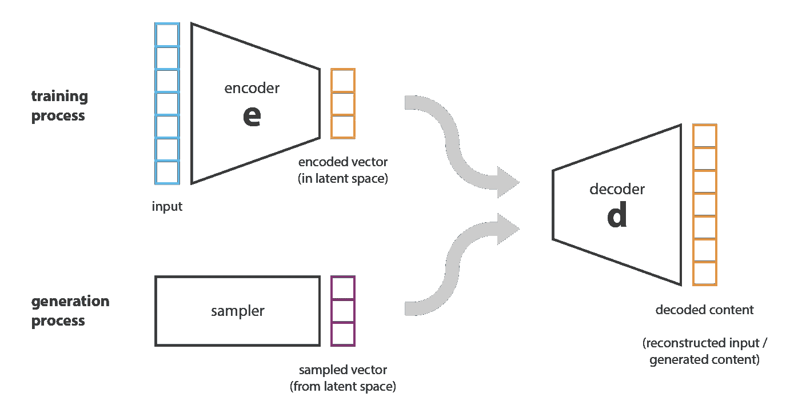

We can generate new data by decoding points that are randomly sampled from the latent space. The quality and relevance of generated data depend on the regularity of the latent space.

然而，正如我们在上一节中讨论的，自动编码器的潜在空间的正则性是一个难点，它取决于初始空间中的数据分布、潜在空间的维度和编码器的架构。因此，很难(如果不是不可能的话)事先确保编码器会以一种与我们刚刚描述的生成过程兼容的智能方式组织潜在空间。

为了说明这一点，让我们考虑之前给出的例子，其中我们描述了一个编码器和一个解码器，其功能强大到足以将任意 N 个初始训练数据放到实轴上(每个数据点被编码为一个实值)并对它们进行解码，而没有任何重建损失。在这种情况下，自动编码器的高自由度使得无信息损失地编码和解码成为可能(尽管潜在空间的维度低)**导致严重的过拟合**，这意味着潜在空间的一些点一旦解码将给出无意义的内容。如果这个一维的例子被自愿选择为非常极端的，我们可以注意到自动编码器潜在空间正则性的问题比它更普遍，值得特别注意。

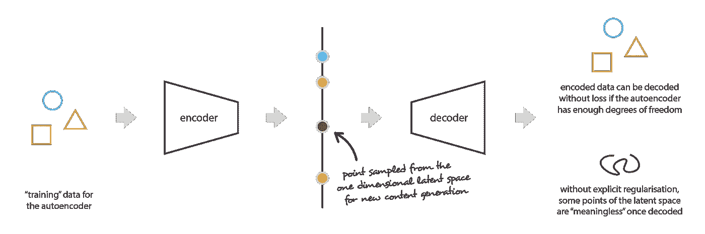

Irregular latent space prevent us from using autoencoder for new content generation.

仔细想想，潜在空间中的编码数据缺乏结构是很正常的。事实上，在任务中，自动编码器没有被训练来强制实现这样的组织:**自动编码器被单独训练来以尽可能少的损失进行编码和解码，不管潜在空间是如何组织的**。因此，如果我们不仔细考虑架构的定义，很自然地，在训练过程中，网络会利用任何过度拟合的可能性来尽可能好地完成它的任务…除非我们明确地将其规范化！

## 变分自动编码器的定义

因此，为了能够将我们的自动编码器的解码器用于生成目的，我们必须确保潜在空间足够规则。获得这种规律性的一个可能的解决方案是在训练过程中引入明确的规律性。因此，正如我们在这篇文章的介绍中简要提到的，**一个变分的自动编码器可以被定义为一个自动编码器，它的训练是正则化的，以避免过拟合，并确保潜在空间具有支持生成过程的良好属性。**

就像标准的自动编码器一样，变分自动编码器是由编码器和解码器组成的架构，并且被训练来最小化编码-解码数据和初始数据之间的重构误差。然而，为了引入潜在空间的一些正则化，我们对编码-解码过程进行了轻微的修改:**不是将输入编码为单个点，而是将其编码为潜在空间上的分布**。然后，该模型被训练如下:

*   首先，输入被编码为在潜在空间上的分布
*   第二，从潜在空间中的一个点对该分布进行采样
*   第三，对采样点进行解码，并且可以计算重建误差
*   最后，重构误差通过网络反向传播

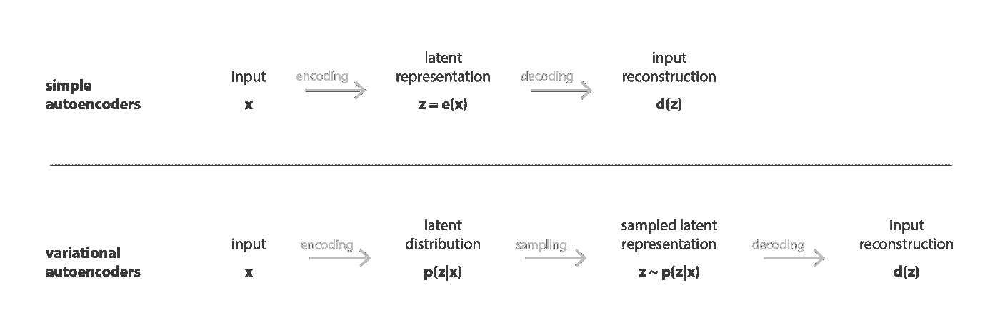

Difference between autoencoder (deterministic) and variational autoencoder (probabilistic).

在实践中，编码的分布被选择为正态分布，使得编码器可以被训练以返回描述这些高斯分布的均值和协方差矩阵。将输入编码为具有一些方差的分布而不是单个点的原因是，它使得非常自然地表达潜在空间正则化成为可能:由编码器返回的分布被强制接近标准正态分布。我们将在下一小节中看到，我们通过这种方式确保了潜在空间的局部和全局正则化(局部是因为方差控制，全局是因为均值控制)。

因此，当训练 VAE 时被最小化的损失函数由“重建项”(在最终层上)和“正则化项”(在潜在层上)组成，所述“重建项”倾向于使编码-解码方案尽可能有性能，所述“正则化项”倾向于通过使编码器返回的分布接近标准正态分布来正则化潜在空间的组织。正则化项表示为返回分布和标准高斯分布之间的 [Kulback-Leibler 散度](https://en.wikipedia.org/wiki/Kullback–Leibler_divergence)，将在下一节中进一步证明。我们可以注意到，两个高斯分布之间的 Kullback-Leibler 散度有一个封闭的形式，可以直接用两个分布的均值和协方差矩阵来表示。

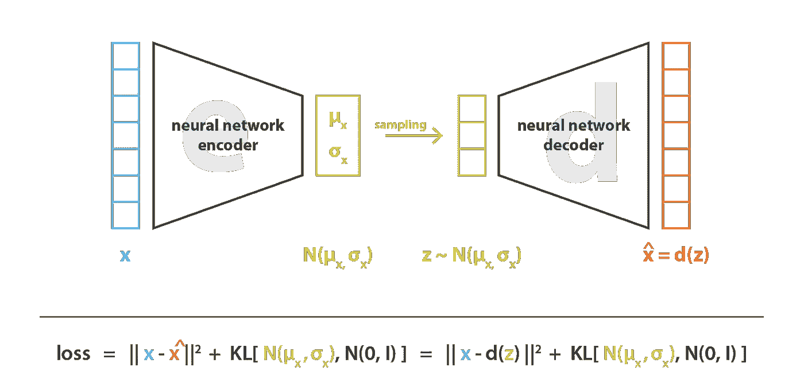

In variational autoencoders, the loss function is composed of a reconstruction term (that makes the encoding-decoding scheme efficient) and a regularisation term (that makes the latent space regular).

## 关于规范化的直觉

为了使生成过程成为可能，期望从潜在空间中得到的规律性可以通过两个主要属性来表达:**连续性**(潜在空间中两个接近的点一旦被解码就不应该给出两个完全不同的内容)和**完全性**(对于选定的分布，从潜在空间中采样的点一旦被解码就应该给出“有意义的”内容)。

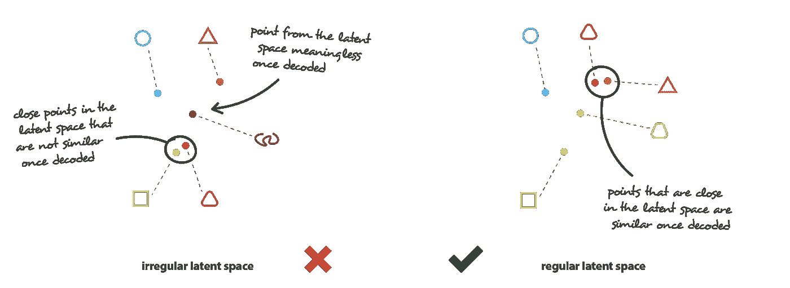

Difference between a “regular” and an “irregular” latent space.

VAEs 将输入编码为分布而不是简单的点这一事实不足以确保连续性和完整性。如果没有明确定义的正则化项，为了最小化其重建误差，模型可以学习**来“忽略”分布被返回的事实，并表现得几乎像经典的自动编码器**(导致过拟合)。为此，编码器可以返回具有微小方差的分布(趋于为点分布)，或者返回具有非常不同的平均值的分布(在潜在空间中彼此相距非常远)。在这两种情况下，分配的使用方式都是错误的(取消了预期收益),连续性和/或完整性都得不到满足。

因此，为了避免这些影响**，我们必须调整协方差矩阵和编码器**返回的分布均值。在实践中，这种规范化是通过强制分布接近标准正态分布(集中和减少)来实现的。通过这种方式，我们要求协方差矩阵接近恒等式，以防止准时分布，并且要求均值接近 0，以防止编码分布彼此相距太远。

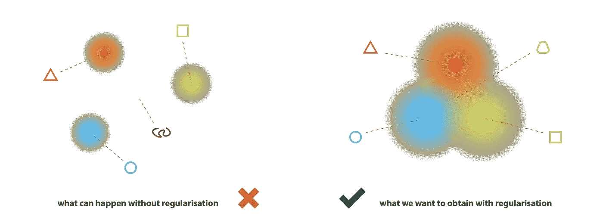

The returned distributions of VAEs have to be regularised to obtain a latent space with good properties.

通过这个正则化项，我们防止模型在潜在空间中对相距很远的数据进行编码，并鼓励尽可能多的返回分布“重叠”，以这种方式满足预期的连续性和完整性条件。自然地，对于任何正则化项，这是以训练数据上更高的重建误差为代价的。然而，可以调整重建误差和 KL 散度之间的折衷，并且我们将在下一节中看到如何从我们的形式推导中自然地出现平衡的表达式。

总结这一小节，我们可以观察到通过正则化**获得的连续性和完整性倾向于在潜在空间**中编码的信息上创建一个“梯度”。例如，在来自不同训练数据的两个编码分布的平均值之间的潜在空间的点应该被解码为在给出第一分布的数据和给出第二分布的数据之间的某处，因为在两种情况下它都可以被自动编码器采样。

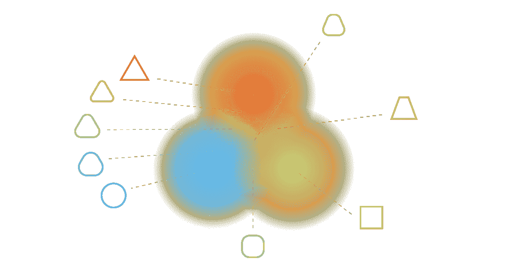

Regularisation tends to create a “gradient” over the information encoded in the latent space.

> **注。**顺便提一下，我们可以提到，我们提到的第二个潜在问题(网络使分布彼此远离)实际上几乎等同于第一个问题(网络倾向于返回正点分布)，直到尺度发生变化:在两种情况下，分布的方差相对于它们的均值之间的距离变小。

# VAEs 的数学细节

在前面的部分中，我们给出了以下直观的概述:vae 是自动编码器，其将输入编码为分布而不是点，并且其潜在空间“组织”通过将编码器返回的分布约束为接近标准高斯分布而被正则化。在这一节中，我们将给出一个更加数学化的 VAEs 视图，这将允许我们更加严格地证明正则化项。为此，我们将建立一个清晰的概率框架，并将特别使用变分推理技术。

## 概率框架和假设

让我们首先定义一个概率图形模型来描述我们的数据。我们用 x 表示代表我们的数据的变量，并假设 x 是从一个潜在的变量 z(编码表示)中产生的，这个变量不能被直接观察到。因此，对于每个数据点，假设以下两步生成过程:

*   首先，从先验分布 p(z)中采样潜在表示 z
*   第二，从条件似然分布 p(x|z)中采样数据 x

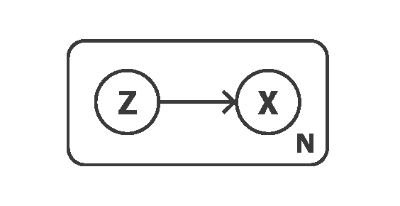

Graphical model of the data generation process.

有了这样一个概率模型，我们可以重新定义编码器和解码器的概念。事实上，与考虑确定性编码器和解码器的简单自动编码器相反，**我们现在将考虑这两个对象的概率版本**。“概率解码器”自然由 **p(x|z)定义，它描述了给定编码变量**时解码变量的分布，而“概率编码器”由 **p(z|x)定义，它描述了给定解码变量**时编码变量的分布。

在这一点上，我们已经可以注意到，我们在简单的自动编码器中缺乏的潜在空间的正则化自然地出现在数据生成过程的定义中:潜在空间中的编码表示 z 实际上被假设为遵循先验分布 p(z)。另外，我们还可以想起著名的贝叶斯定理，它将先验 p(z)、似然性 p(x|z)和后验 p(z|x)联系起来

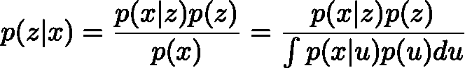

现在让我们假设 p(z)是标准高斯分布，并且 p(x|z)是高斯分布，其均值由 z 的变量的确定性函数 F 定义，并且其协方差矩阵具有乘以单位矩阵 I 的正常数 c 的形式。因此，我们有

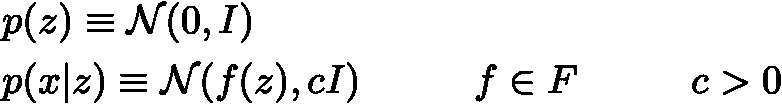

现在让我们考虑，f 是明确定义的，固定的。理论上，我们知道 p(z)和 p(x|z)，就可以用贝叶斯定理计算 p(z|x):这是一个经典的[贝叶斯推理问题](/bayesian-inference-problem-mcmc-and-variational-inference-25a8aa9bce29)。然而，正如我们在上一篇文章中讨论的，这种计算通常是难以处理的(因为分母上的积分),并且需要使用近似技术，例如变分推理。

> **注。**这里我们可以提到 p(z)和 p(x|z)都是高斯分布。因此，如果我们有 E(x|z) = f(z) = z，这将意味着 p(z|x)也应该遵循高斯分布，并且在理论上，我们可以“仅仅”尝试相对于 p(z)和 p(x|z)的均值和协方差矩阵来表达 p(z|x)的均值和协方差矩阵。然而，在实践中，这一条件并不满足，我们需要使用一种近似技术，如变分推理，使这种方法相当普遍，对模型假设的某些变化更加稳健。

## 变分推理公式

在统计学中，**变分推断(VI)是一种近似复杂分布的技术**。想法是设置一个参数化的分布族(例如高斯分布族，其参数是平均值和协方差),并在该族中寻找我们的目标分布的最佳近似。该族中的最佳元素是最小化给定近似误差测量(大多数情况下近似和目标之间的 Kullback-Leibler 散度)的元素，并且通过描述该族的参数的梯度下降来找到。更多细节，我们参考[我们关于变分推理](/bayesian-inference-problem-mcmc-and-variational-inference-25a8aa9bce29)的帖子和其中的参考资料。

这里，我们将通过高斯分布 q_x(z)来近似 p(z|x ),其均值和协方差由参数 x 的两个函数 G 和 H 来定义。这两个函数分别属于函数 G 和 H 的族，函数 G 和 H 将在后面详细说明，但应该是参数化的。因此，我们可以表示

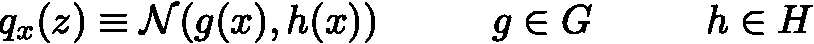

因此，我们以这种方式定义了一族用于变分推理的候选项，现在需要通过优化函数 g 和 h(实际上是它们的参数)来找到这一族中的最佳近似值，以最小化近似值和目标 p(z|x)之间的 Kullback-Leibler 散度。换句话说，我们在寻找最优的 g*和 h*使得

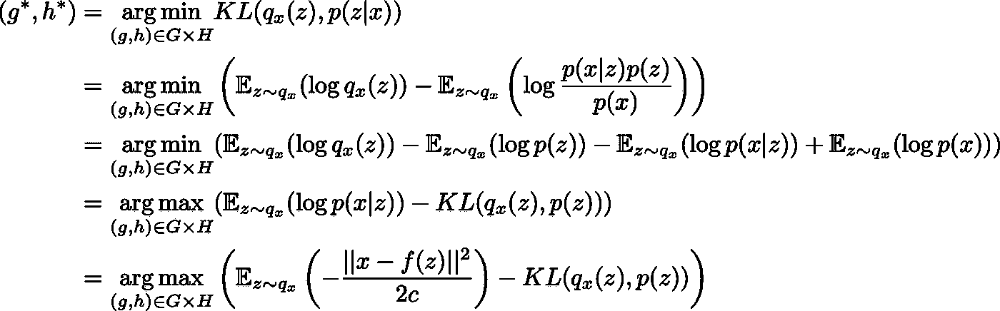

在倒数第二个方程中，我们可以观察到在最大化“观察”的可能性(最大化预期对数似然，对于第一项)和保持接近先验分布(最小化 q_x(z)和 p(z)之间的 KL 散度，对于第二项)之间存在折衷。这种权衡对于贝叶斯推理问题来说是很自然的，并且表达了需要在我们对数据的信心和我们对先验的信心之间找到的平衡。

到目前为止，我们已经假设函数 f 是已知的和固定的，并且我们已经表明，在这样的假设下，我们可以使用变分推理技术来逼近后验 p(z|x)。然而，在实践中，定义解码器的这个函数 f 是未知的，并且也需要被选择。为了做到这一点，让我们提醒一下，我们的最初目标是找到一个性能编码-解码方案，其潜在空间足够规则以用于生成目的。如果正则性主要由在潜在空间上假设的先验分布决定，则整个编码-解码方案的性能高度依赖于函数 f 的选择。实际上，由于 p(z|x)可以由 p(z)和 p(x|z)近似(通过变分推断),并且由于 p(z)是简单的标准高斯函数，因此在我们的模型中，我们可用于进行优化的仅有的两个杠杆是参数 c(其定义了似然性的方差)和函数 f(其定义了似然性的均值)。

因此，让我们考虑，正如我们先前所讨论的，我们可以为 F 中的任何函数 F(每个函数定义一个不同的概率解码器 p(x|z))得到 p(z|x)的最佳近似，记为 q*_x(z)。尽管它是概率性的，我们正在寻找一种尽可能有效的编码-解码方案，然后，当 z 从 q*_x(z)中被采样时，我们想要选择最大化给定 z 的 x 的期望对数似然的函数 f。换言之，对于给定的输入 x，当我们从分布 q*_x(z)中采样 z，然后从分布 p(x|z)中采样 x̂时，我们希望最大化 x̂ = x 的概率。因此，我们寻找最优的 f*,使得

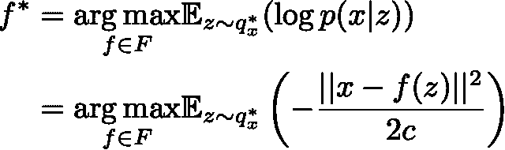

其中 q*_x(z)取决于函数 f，并如前所述获得。将所有的部分集合在一起，我们寻找最优的 f*，g*和 h*使得

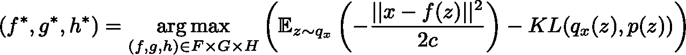

我们可以在这个目标函数中识别在前面部分中给出的 VAEs 的直观描述中引入的元素:x 和 f(z)之间的重构误差以及由 q_x(z)和 p(z)之间的 KL 散度给出的正则化项(这是一个标准高斯)。我们还可以注意到，常数 c 决定了前两项之间的平衡。在我们的模型中，c 越高，我们就越假设概率解码器在 f(z)附近的方差高，因此，我们就越倾向于正则化项而不是重建项(如果 c 低，则相反)。

## 将神经网络引入模型

到目前为止，我们已经建立了依赖于三个函数 f、g 和 h 的概率模型，并且使用变分推理来表达要求解的优化问题，以便获得 f*、g*和 h*，它们给出了利用该模型的最佳编码-解码方案。由于我们无法在整个函数空间内轻松优化，我们限制了优化域，并决定将 f、g 和 h 表示为神经网络。因此，F、G 和 H 分别对应于由网络体系结构定义的函数族，并且对这些网络的参数进行优化。

实际上，g 和 h 不是由两个完全独立的网络定义的，而是共享它们的一部分架构和权重，所以我们有

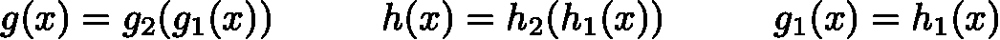

因为它定义了 q_x(z)的协方差矩阵，所以 h(x)应该是一个方阵。然而，为了简化计算和减少参数的数量，我们额外假设我们的 p(z|x)，q_x(z)的近似是具有对角协方差矩阵的多维高斯分布(变量独立性假设)。在这种假设下，h(x)仅仅是协方差矩阵的对角元素的向量，并且具有与 g(x)相同的大小。然而，我们用这种方法减少了我们考虑的变分推论的分布族，因此，得到的 p(z|x)的近似值可能不太精确。

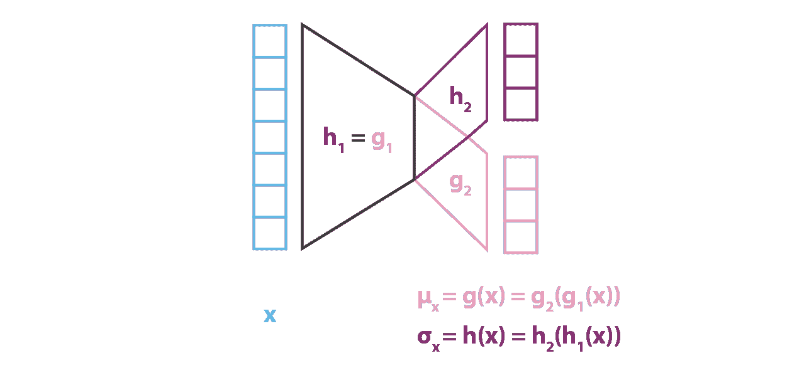

Encoder part of the VAE.

与模拟 p(z|x)的编码器部分相反，我们考虑的是具有 x (g 和 h)的函数的均值和协方差的高斯，我们的模型假设 p(x|z)是具有固定协方差的高斯。定义高斯平均值的变量 z 的函数 f 由神经网络建模，并可表示如下

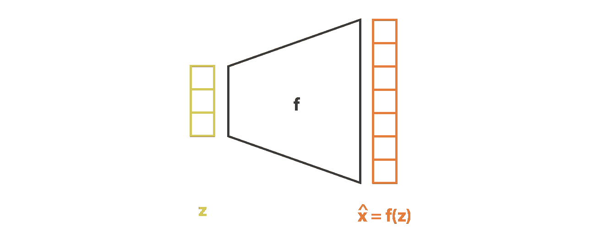

Decoder part of the VAE.

然后通过连接编码器和解码器部分获得整体架构。然而，我们仍然需要非常小心在训练期间从编码器返回的分布中采样的方式。采样过程必须以允许误差通过网络反向传播的方式来表示。一个简单的技巧，称为**重新参数化技巧**，用于使梯度下降成为可能，尽管随机采样发生在架构的中途，并且在于使用以下事实:如果 z 是一个随机变量，遵循具有均值 g(x)和协方差 H(x)=h(x)的高斯分布。h^t(x)那么它可以表示为

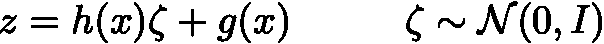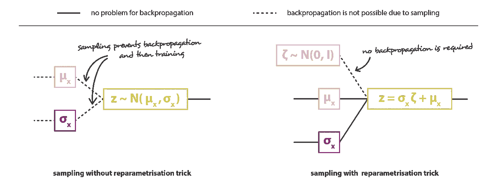

Illustration of the reparametrisation trick.

最后，以这种方式获得的变分自动编码器架构的目标函数由前一小节的最后一个方程给出，其中理论预期被或多或少精确的蒙特卡罗近似所代替，该近似在大多数时间包含在单次绘制中。因此，考虑到这种近似并表示 C = 1/(2c)，我们恢复了在前面部分中直观导出的损失函数，该函数由重建项、正则化项和定义这两项的相对权重的常数组成。

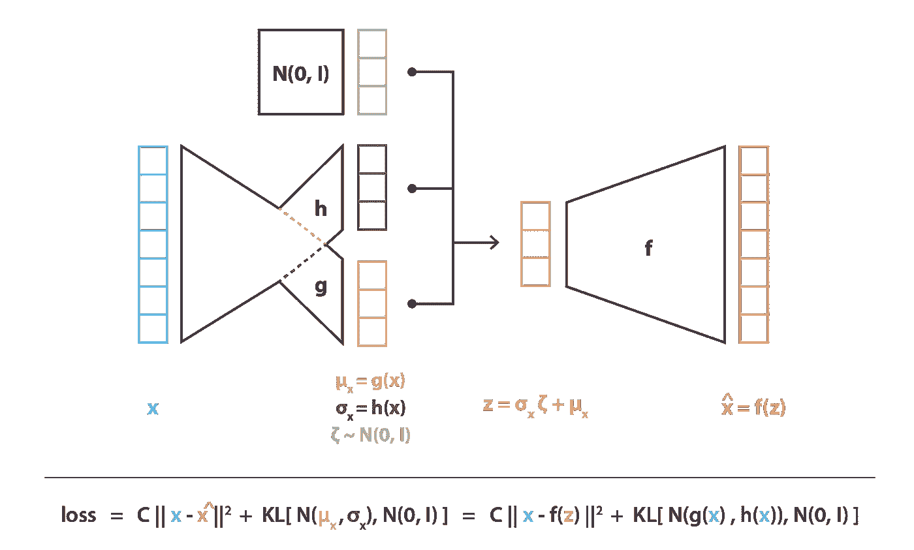

Variational Autoencoders representation.

# 外卖食品

这篇文章的主要观点是:

*   降维是减少描述某些数据的特征数量的过程(或者通过仅选择初始特征的子集，或者通过将它们组合成数量减少的新特征)，因此，可以被视为编码过程
*   自动编码器是由编码器和解码器组成的神经网络架构，其产生数据通过的瓶颈，并且被训练为在编码-解码过程中丢失最少量的信息(通过梯度下降迭代训练，目的是减少重建误差)
*   由于过拟合，自动编码器的潜在空间可能非常不规则(潜在空间中的接近点可能会给出非常不同的解码数据，潜在空间中的某个点一旦解码可能会给出无意义的内容……)，因此，我们无法真正定义一个生成过程，该过程只是简单地从潜在空间中采样一个点，并使其通过解码器以获得新数据
*   变分自动编码器(VAEs)是通过使编码器返回潜在空间上的分布而不是单个点，并通过在损失函数中添加返回分布上的正则化项以确保潜在空间的更好组织来解决潜在空间不规则问题的自动编码器
*   假设一个简单的潜在概率模型来描述我们的数据，由重建项和正则化项组成的 VAEs 的非常直观的损失函数，可以特别使用变分推断的统计技术(因此称为“变分”自动编码器)仔细地导出

总之，我们可以概括说，在过去的几年里，GANs 比 VAEs 从更多的科学贡献中受益。除了其他原因之外，社区对 GANs 表现出的更高兴趣可以部分地解释为 VAEs 理论基础(概率模型和变分推理)的复杂程度高于支配 GANs 的对抗性训练概念的简单程度。通过这篇文章，我们希望我们能够分享有价值的直觉以及强大的理论基础，使 VAEs 更容易为新人所接受，[正如我们今年早些时候为 GANs 所做的那样](/understanding-generative-adversarial-networks-gans-cd6e4651a29)。然而，现在我们已经深入地讨论了他们两个，还有一个问题…你更像 gan 还是 VAEs？

感谢阅读！

与[巴蒂斯特·罗卡](https://medium.com/u/20ad1309823a?source=post_page-----f70510919f73--------------------------------)一起写的其他文章:

 [## 推荐系统简介

### 几种主要推荐算法综述。

towardsdatascience.com](/introduction-to-recommender-systems-6c66cf15ada)  [## 整体方法:装袋、助推和堆叠

### 理解集成学习的关键概念。

towardsdatascience.com](/ensemble-methods-bagging-boosting-and-stacking-c9214a10a205)