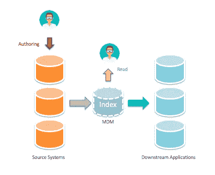
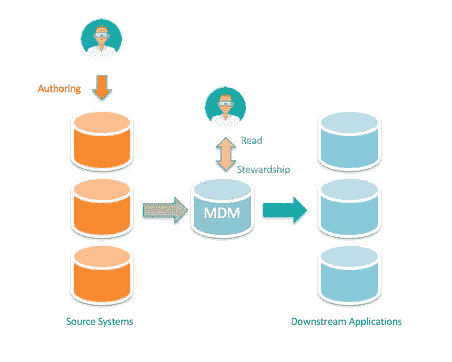
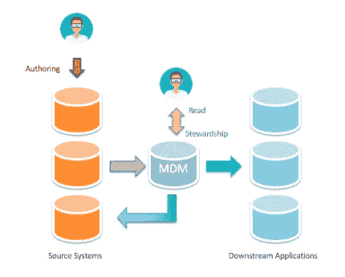
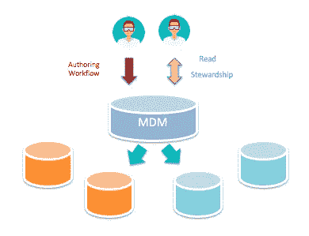

# 理解各种 MDM 实现风格

> 原文：<https://towardsdatascience.com/understanding-various-mdm-implementation-styles-5b4c8fcbbecf?source=collection_archive---------7----------------------->

最近，我有机会为一家金融监管机构写了一些关于主数据管理(MDM)的报告，在那里我学到了很多关于 MDM 的知识。我一直对 MDM 主题的复杂性感到惊讶，我了解的越多，我就越意识到我以前不知道的事情。虽然我可能距离成为 MDM 专家还有千里之遥，但是有些方面我已经开始有了很好理解。其中之一是人们可以选择不同的实现方式来满足他们的需求。

大多数情况下，决定 MDM 实现风格的是与数据管理相关的业务情况。虽然在整个组织中创建和维护单一版本的 truth 是最终目标，但在实现该目标的过程中可以有不同的关注点，例如提高数据质量、维护遗留系统和提供数据可访问性，等等。

这些因素中的每一个都可以通过实现特定的实现风格来获得。在这里，我们看一下 4 种常见的 MDM 实现方法，您可以选择它们来满足您的业务需求。我已经按照从最少打扰到最多打扰的方式进行了安排。

# 登记处

如果您有大量的源系统，每个系统都有自己的规则和复杂性，很难修改，那么您可能希望考虑以注册方式实现 MDM。有了几个源系统之后，可能很难立即建立权威的源，所以您只需从源中提取所有数据，将其放在 MDM hub 上，让它发挥魔力。MDM 将筛选数据并运行清洗和匹配算法，为重复记录分配唯一的全局标识符，并最终建立单一版本的 truth。

这种方法的美妙之处在于 MDM 永远不会触及您的源系统，这意味着尽管下游应用程序(如您的企业数据仓库(EDW)和报告系统)现在可以使用经过清理和标准化的主数据，但源系统中不会发生任何变化。这对于那些修改源系统会导致大量成本和资源的组织来说是非常有益的，更不用说法规限制了。

总而言之，注册表风格是实现 MDM 成本最低的方式，但是当然也有一些缺点，比如延迟。

# 合并

脱离了低成本和非侵入式的注册风格，我们现在有了整合方法，它仍然是非侵入式的，但是在 MDM hub 中增加了功能:管理。什么是管家？嗯，基本上就是在整个 MDM 流程中引入人的因素。因此，在您的 MDM 运行对收集的数据进行清理、匹配、链接和合并的算法，并建立单一来源的真相/黄金记录之后，有些人可以调整黄金记录，使其更加黄金。这些人被称为数据管家，他们所做的活动值得另一个专门的媒体职位。

整合方法及其管理功能是集中存储主数据并将其用作分析和报告参考点的一种很好的方式。下游应用程序可以享受可信的黄金记录，而源系统仍然可以照常维持业务。

# 共存

如果您已经有了整合风格，那么您可以通过将循环添加回您系统来发展成共存风格。这意味着，将黄金记录发送回各个源系统，这样您现在就可以享受 MDM hub 和源系统之间的实时同步了。此外，主数据的更新可以在两者中进行，这意味着主数据质量的显著提高。请记住，这种方法更具侵入性，并且允许更新发生在您的源系统中，您需要确保源系统具有数据清理功能，以便与中心保持一致。

# 交易/集中

这是 MDM 实现风格的顶峰，在这种风格中，中心成为主数据的单一提供者。在这种方式下，可以简单地说，所有主数据都被转移到 hub，任何外部系统都不能再创建或修改主数据，而是必须向 hub 订阅任何更新。

这种方法需要耗费大量的资源和时间来实现，但幸运的是，这只是前面介绍的实现方式的另一种演变。因此，组织可以花时间，如果他们确定他们的业务需要事务风格提供的优势，那么他们应该去做。

虽然这个解释并不详尽，但我希望这个简短的解释能够对 MDM 的复杂世界有一些初步的了解，尤其是实现风格。幸运的是，每种实现风格都不是惩罚性的，人们可以根据自己的需要从一种风格发展到另一种风格。只要人们选择了支持各种实现风格的正确的 MDM 平台，那么他们就处于非常有利的地位。

祝 MDM-ing 快乐！