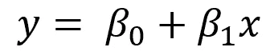
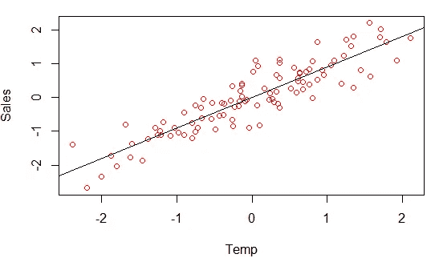
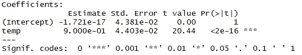
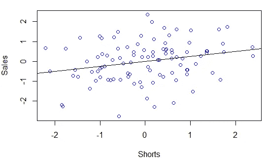
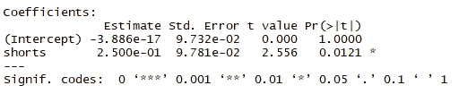
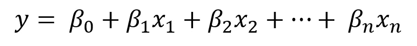
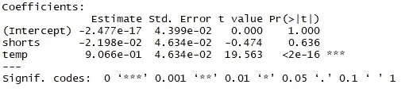
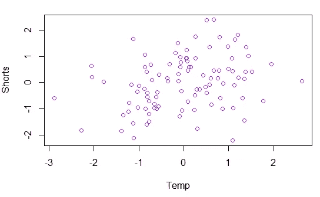

# 理解简单和多元线性回归何时给出不同的结果

> 原文：<https://towardsdatascience.com/understanding-when-simple-and-multiple-linear-regression-give-different-results-7cf6c787766c?source=collection_archive---------8----------------------->

Taken from [pexels](https://www.pexels.com/photo/asymmetry-botanical-bright-ecology-1029592/)

简单和多元线性回归通常是用于调查数据关系的第一个模型。如果你和他们玩得够久，你最终会意识到他们可以给出不同的结果。

> 使用简单线性回归时有意义的关系在使用多元线性回归时可能不再有意义，反之亦然，简单线性回归中不重要的关系在多元线性回归中可能变得有意义。

认识到为什么会发生这种情况，将有助于提高你对线性回归的理解。

快速回顾一下简单的线性回归，它试图以下列形式对数据进行建模:

如果斜率项很重要，那么 x 每增加一个单位，y 就会平均增加β_ 1，这不可能是偶然发生的。

假设我们是一家冰淇淋企业，试图找出推动销售的因素，我们测量了两个独立变量:(1)温度和(2)我们观察到的 10 分钟内走在街上的穿短裤的人数。

我们的因变量是:我们销售的冰淇淋数量。

首先，我们绘制温度与冰淇淋销量的关系图

并做一个简单的线性回归，找出销量和温度之间的显著关系。这是有道理的。

然后我们绘制观察到的卖空数量与销售额的关系图

再做一个简单的线性回归，找出我们在 10 分钟内观察到的穿短裤的人数和冰淇淋销量之间的显著关系。有意思…也许这没什么意义。

然后我们转向多元线性回归，多元线性回归试图以下列形式对数据建模:

多元线性回归与简单线性回归有点不同。首先要注意的是，我们可以包含任意多的独立变量，而不是只有一个独立变量。解释也不同。如果其中一个系数(比如β_ I)很重要，这意味着 x_i、**每增加 1 个单位，而所有其他独立变量**保持不变，则 y 平均增加β_ I，这不太可能是偶然发生的。

我们做多元线性回归，包括温度和短路进入我们的模型，看看我们的结果

温度仍然是显著相关的，但短裤不是。它已经从简单线性回归中的显著变为多元线性回归中的不再显著。

为什么？

通过绘制短路和温度可以找到答案。似乎有关系。

当我们检查这两个变量之间的相关性时，我们发现 r =0.3，短路和温度往往一起增加。

当我们进行简单的线性回归并发现短裤和销售之间的关系时，我们实际上是在检测温度和销售之间的关系，这种关系会传递到短裤上，因为短裤会随着温度而增加。

当我们进行多元线性回归时，我们在保持温度不变的情况下研究了卖空和销售**之间的关系，这种关系消失了。然而，温度和销售之间的真实关系依然存在。**

相关数据经常会导致简单和多元线性回归，从而得出不同的结果。每当你用简单的线性回归发现一个重要的关系时，确保你用多元线性回归跟踪它。你可能会对结果感到惊讶！

(注意:这个数据是我们在 R 中使用 mvrnorm()命令生成的)

欢迎在下面的评论中留下任何想法或问题！