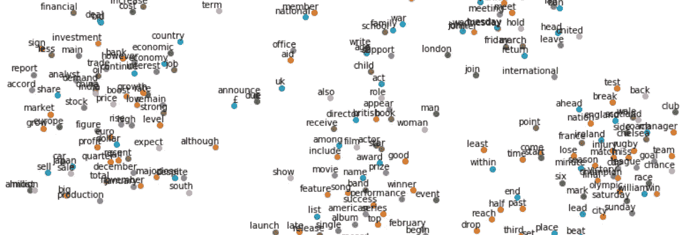
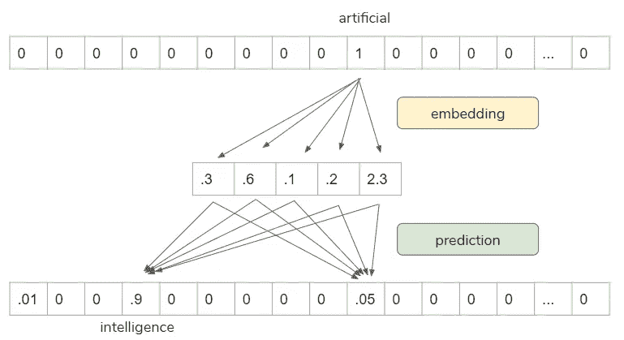
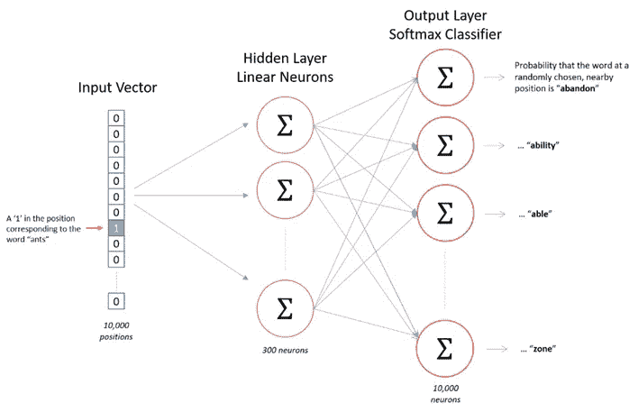
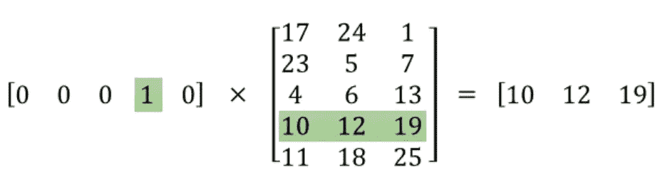
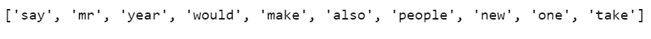
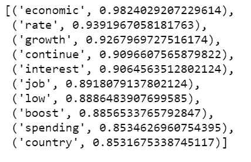
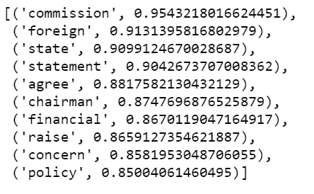
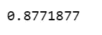
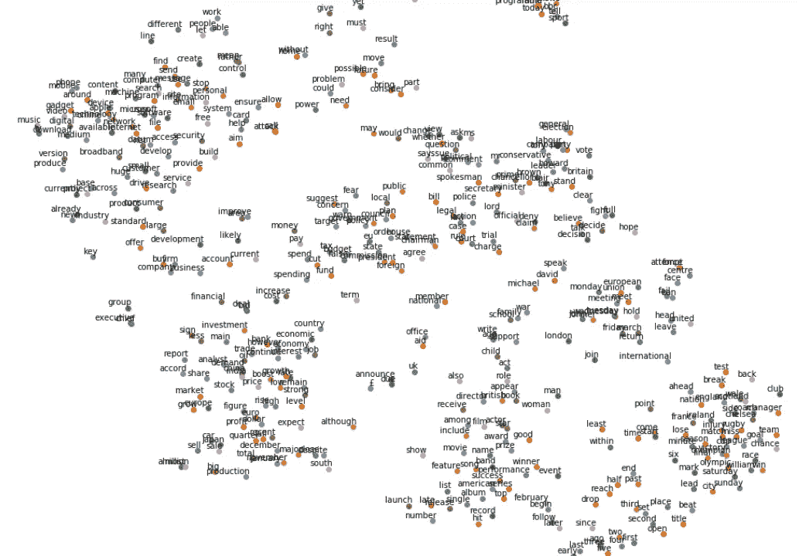

# 在实践中理解 Word2vec 嵌入

> 原文：<https://towardsdatascience.com/understanding-word2vec-embedding-in-practice-3e9b8985953?source=collection_archive---------4----------------------->



## 单词嵌入，向量空间模型，Gensim

这篇文章旨在用 Python 中的 [Gensim](https://radimrehurek.com/gensim/models/word2vec.html) 实现 Word2vec 嵌入的同时，以直观的方式解释 [Word2vec](https://en.wikipedia.org/wiki/Word2vec) 的概念以及概念背后的数学原理。

Word2vec 的基本思想是，不是在高维空间将单词表示为一键编码([count vectorizer](https://scikit-learn.org/stable/modules/generated/sklearn.feature_extraction.text.CountVectorizer.html)/[tfidfvectorizer](https://scikit-learn.org/stable/modules/generated/sklearn.feature_extraction.text.TfidfVectorizer.html))，而是在稠密的低维空间中以相似单词得到相似单词向量的方式来表示单词，从而映射到附近的点上。

Word2vec 不是深度神经网络，它把文本变成深度神经网络可以作为输入处理的数值形式。

## word2vec 模型是如何训练的

*   使用滑动窗口浏览训练语料库:每个单词都是一个预测问题。
*   目标是使用相邻单词来预测当前单词(反之亦然)。
*   预测的结果决定了我们是否调整当前的单词向量。渐渐地，向量收敛到(希望)最优值。

比如我们可以用“人工”来预测“智能”。



Source: [https://www.infoq.com/presentations/nlp-practitioners/?itm_source=presentations_about_Natural-Language-Processing&itm_medium=link&itm_campaign=Natural-Language-Processing](https://www.infoq.com/presentations/nlp-practitioners/?itm_source=presentations_about_Natural-Language-Processing&itm_medium=link&itm_campaign=Natural-Language-Processing)

然而，预测本身并不是我们的目标。它是学习向量表示的代理，以便我们可以将它用于其他任务。

## Word2vec 跳跃式网络架构

这是 word2vec 模型架构之一。它只是一个简单的隐藏层和一个输出层。



Source: [http://mccormickml.com/2016/04/19/word2vec-tutorial-the-skip-gram-model/](http://mccormickml.com/2016/04/19/word2vec-tutorial-the-skip-gram-model/)

## 数学

下面是 word2vec 嵌入背后的数学。输入层是独热编码向量，因此它在单词索引中得到“1”，在其他地方得到“0”。当我们将这个输入向量乘以权重矩阵时，我们实际上拉出了对应于该单词索引的一行。这里的目标是提取重要的行，然后，我们丢弃其余的行。



Source: [http://mccormickml.com/2016/04/19/word2vec-tutorial-the-skip-gram-model/](http://mccormickml.com/2016/04/19/word2vec-tutorial-the-skip-gram-model/)

这是 word2vec 工作的主要机制。

当我们使用 [Tensorflow / Keras](https://www.tensorflow.org/tutorials/text/word_embeddings) 或者 [Pytorch](https://pytorch.org/tutorials/beginner/nlp/word_embeddings_tutorial.html) 来做这件事的时候，他们有一个专门的层用于这个过程，叫做“嵌入层”。所以，我们不打算自己做数学，我们只需要传递一个热编码向量，“嵌入层”做所有的脏工作。

## 预处理文本

现在我们将为一个 [BBC 新闻数据集](https://raw.githubusercontent.com/susanli2016/PyCon-Canada-2019-NLP-Tutorial/master/bbc-text.csv)实现 word2vec 嵌入。

*   我们用 Gensim 来训练 word2vec 嵌入。
*   我们使用 NLTK 和 spaCy 对文本进行预处理。
*   我们使用 t-SNE 来可视化高维数据。

clean_text.py

*   我们使用空间来进行引理化。
*   禁用命名实体识别以提高速度。
*   去掉代词。

lemmatize.py

*   现在我们可以看看最常用的 10 个单词。

word_freq.py



## 在 Gensim 中实现 Word2vec 嵌入

*   `min_count`:语料库中要包含在模型中的单词的最小出现次数。数字越大，语料库中的单词就越少。
*   `window`:句子内当前词和预测词之间的最大距离。
*   `size`:特征向量的维数。
*   `workers`:我知道我的系统有 4 个内核。
*   `model.build_vocab`:准备模型词汇。
*   `model.train`:训练词向量。
*   `model.init_sims()`:当我们不打算进一步训练模型时，我们使用这一行代码来提高模型的内存效率。

word2vec_model.py

## 探索模型

*   找出与“经济”最相似的单词

```
w2v_model.wv.most_similar(positive=['economy'])
```



Figure 1

*   找出与“总统”最相似的单词

```
w2v_model.wv.most_similar(positive=['president'])
```



Figure 2

*   这两个词有多相似？

```
w2v_model.wv.similarity('company', 'business')
```



请注意，如果我们改变`min_count`，上述结果可能会改变。例如，如果我们设置`min_count=100`，我们将有更多的单词可以使用，其中一些可能比上面的结果更接近目标单词；如果我们设置`min_count=300`，上面的一些结果可能会消失。

*   我们使用 t-SNE 来表示低维空间中的高维数据。

tsne.py



Figure 3

*   很明显有些词彼此接近，比如“球队”、“进球”、“伤病”、“奥运”等等。这些词往往被用在与体育相关的新闻报道中。
*   其他聚集在一起的词，如“电影”、“演员”、“奖项”、“奖品”等，它们很可能在谈论娱乐的新闻文章中使用。
*   又来了。剧情看起来如何很大程度上取决于我们如何设定`min_count`。

[Jupyter 笔记本](https://github.com/susanli2016/PyCon-Canada-2019-NLP-Tutorial/blob/master/Word2vec%20BBC%20news.ipynb)可以在 [Github](https://github.com/susanli2016/PyCon-Canada-2019-NLP-Tutorial/blob/master/Word2vec%20BBC%20news.ipynb) 上找到。享受这周剩下的时光。

参考:[https://learning . oreilly . com/videos/oreilly-strata-data/9781492050681/9781492050681-video 327451？自动播放=假](https://learning.oreilly.com/videos/oreilly-strata-data/9781492050681/9781492050681-video327451?autoplay=false)