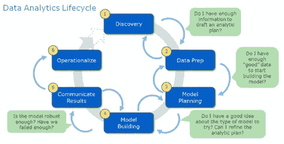
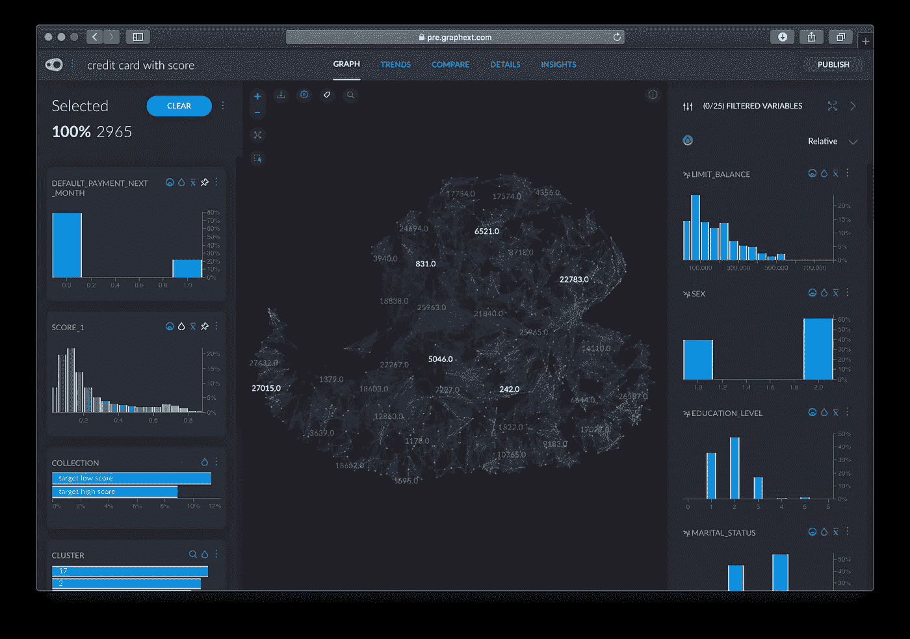
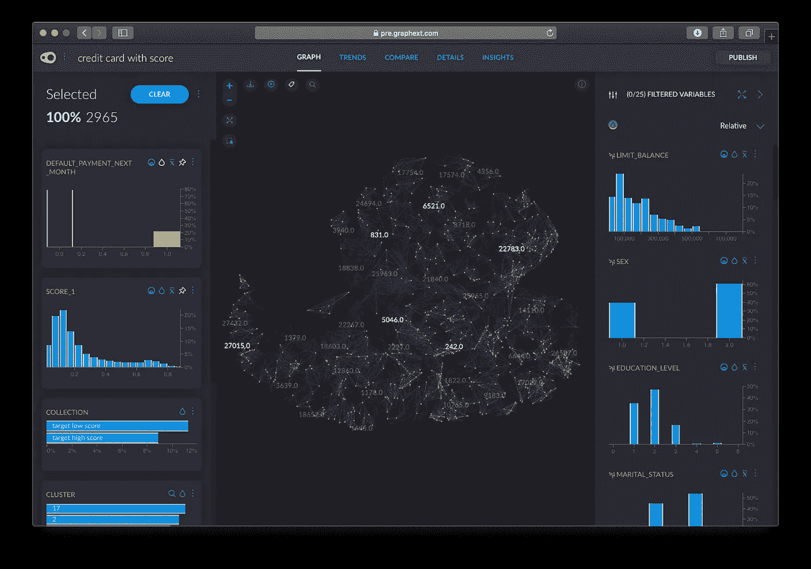
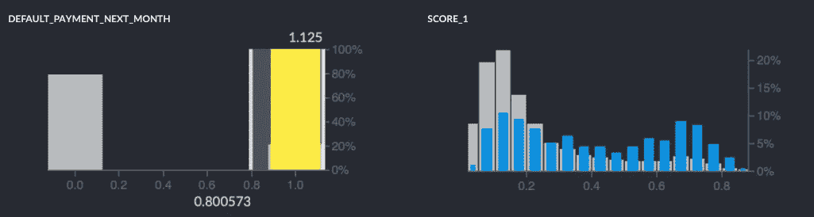
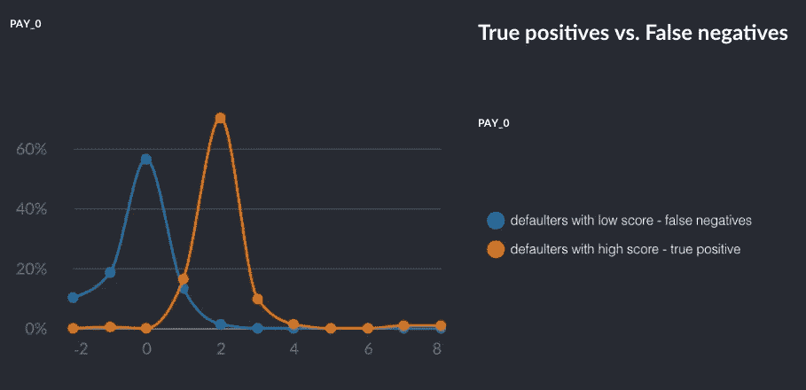
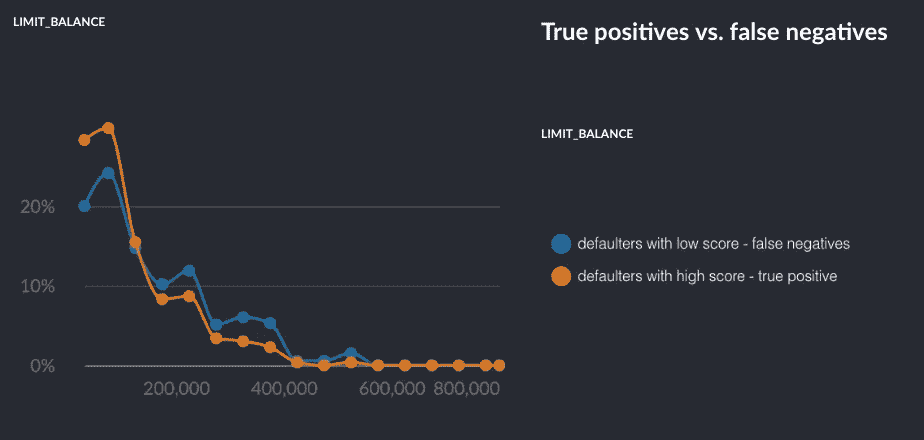
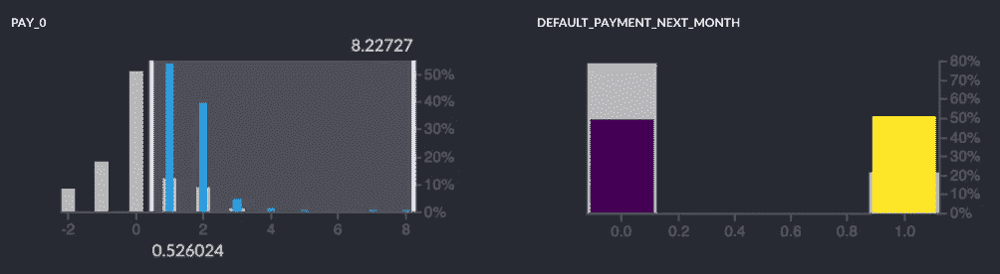
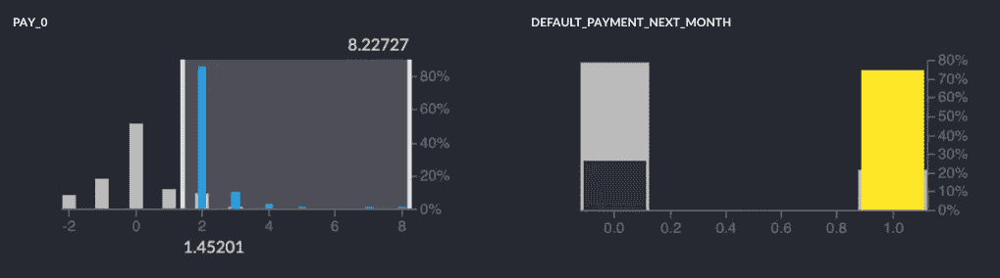

# 了解模型的结果

> 原文：<https://towardsdatascience.com/understanding-your-models-results-b0d7c5170603?source=collection_archive---------20----------------------->

数据分析和数据科学生命周期包括理解我们正在处理的数据，以及从模型提供的结果中解释和提取价值的关键步骤。

对于这些关键步骤，我们需要一个解决方案来帮助我们探索数据并与之交互，同时通过提出隐藏的见解来增强我们的发现能力。

在本文中，我们将评估预测模型的结果，找出它在哪些方面表现得更好和更差，了解某些变量是否以及为什么比其他变量更重要，以及如何改进模型。

我们将使用一个由 https://cloud.google.com/bigquery/public-data/的 BigQuery 托管的公共数据集的例子。谷歌团队发布了一个信用卡客户数据集，用来预测信用卡违约。它们提供算法给出的分数，以及默认值的真实值(1/0)。那些得分较高的客户，将有更多的违约概率。

使用 Graphext 来可视化数据，我们可以了解分数在数据拓扑中的分布情况，以及预测模型忽略了哪些区域或客户端组。这是分数分布的热图:

这是真实目标的分布图:

看起来 50%的真实违约者(黄色，1 代表 default_payment_next_month)预测得分很高，但其余的得分很低，这意味着他们是假阴性。

让我们比较这两组，看看为什么我们的算法在检测这些模式方面较弱。我们将为这两个组创建两个“集合”，或标签:真阳性(高分的违约者)和假阴性(低分的违约者)。

我们的比较界面将自动建议最能区分我们各组的变量。最有区别的变量是 Pay_0(最后一次支付延迟)。算法似乎对这个变量过度拟合，将所有 Pay_0 大于 1 的客户归类为高风险，而忽略了这个变量小于 1 的违约者。

进一步分析，我们还可以观察到假阴性比真阴性具有更高的极限平衡。这意味着，我们遗漏的违约者可能比我们正在捕获的违约者更危险，意味着他们可能拖欠更多的钱。

为什么模型过度拟合这个变量而忽略了其他危险的违约者？让我们来看看这个特殊的变量。如果我们在数据集中过滤那些 Pay_0 值大于 0 的客户，我们会看到目标利率上升到 50%以上，当我们过滤该变量值大于 2 的客户时，目标利率上升到 75%。

我们应该做的第一件事，是审查该变量是如何在数据库中建立的，并验证是否建立良好，它没有未来的信息。

检查后，很明显我们需要建立两个独立的模型，一个不需要为那些超过 Pay_0 的客户进行细分，因为目标水平很高，另一个更细分的模型用于那些 Pay_0 小于 0 的客户，因为他们更难用这个初始数据集捕获，他们的模式可能会隐藏在其他类型的变量中。

这只是一个示例，说明数据探索如何帮助您更好地理解模型的结果，并指导您如何改进和推进您的分析。

如果您想了解更多，请向我们索取[演示](https://graphext.com/demo)。