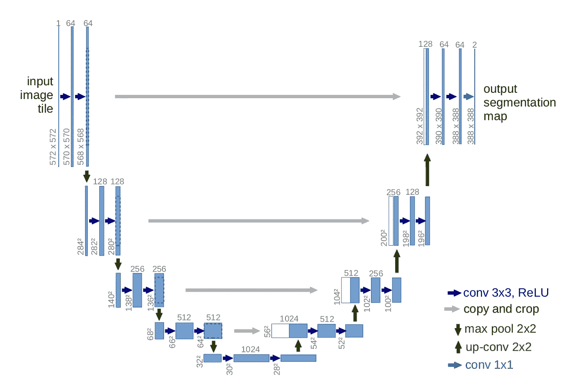
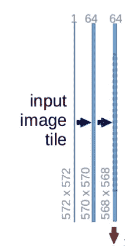
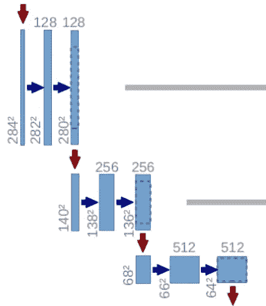
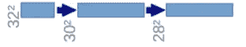
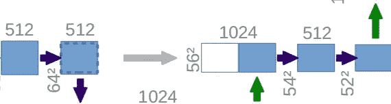
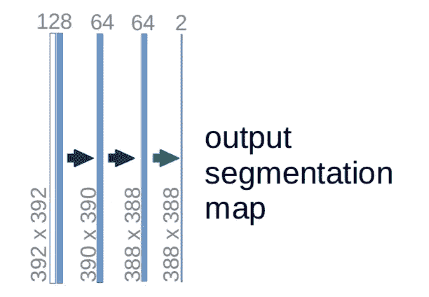

# UNet —逐行解释

> 原文：<https://towardsdatascience.com/unet-line-by-line-explanation-9b191c76baf5?source=collection_archive---------0----------------------->

## UNet 实施示例

UNet 由传统的卷积神经网络演变而来，于 2015 年首次设计并应用于处理生物医学图像。由于一般卷积神经网络将其任务集中在图像分类上，其中输入是图像，输出是一个标签，但在生物医学情况下，它要求我们不仅要区分是否存在疾病，还要定位异常区域。

UNet 致力于解决这一问题。它能够定位和区分边界的原因是通过对每个像素进行分类，因此输入和输出共享相同的大小。例如，对于尺寸为 2x2 的输入图像:

```
[[255, 230], [128, 12]]  # each number is a pixel
```

输出将具有相同的大小 2x2:

```
[[1, 0], [1, 1]]  # could be any number between [0, 1]
```

现在让我们来看看 UNet 的具体实现。我会:

1.  显示 UNet 的概述
2.  逐行分解实现并进一步解释它

# 概观

这个网络的基本基础看起来像是:



UNet architecture

乍一看，它呈“U”形。该架构是对称的，由两大部分组成—左边部分称为收缩路径，由一般的卷积过程构成；右边部分是扩展路径，由转置的 2d 卷积层构成(你现在可以认为它是一种上采样技术)。

现在让我们快速看一下实现:

代码引用自 Kaggle 竞赛的一个[内核](https://www.kaggle.com/phoenigs/u-net-dropout-augmentation-stratification)，一般来说，大多数 UNet 遵循相同的结构。

现在让我们一行一行地分解实现，并映射到 UNet 架构映像上的相应部分。

# 逐行解释

## 收缩路径

收缩路径遵循以下公式:

```
conv_layer1 -> conv_layer2 -> max_pooling -> dropout(optional)
```

所以我们代码的第一部分是:

哪一个符合:



**注意每个过程构成两个卷积层**，通道数从 1 → 64 变化，因为卷积过程会增加图像的深度。向下的红色箭头是最大池化过程，它将图像的大小减半(大小从 572x572 → 568x568 减少是由于填充问题，但这里的实现使用 padding= "same ")。

该过程重复 3 次以上:



带代码:

现在我们到达了最底部:



仍然构建了 2 个卷积层，但是没有最大池化:

这时的图像已经调整到 28x28x1024。现在让我们走上宽阔的道路。

## 宽阔的道路

在扩展路径中，图像将被放大到其原始大小。公式如下:

```
conv_2d_transpose -> concatenate -> conv_layer1 -> conv_layer2
```



转置卷积是一种扩大图像大小的上采样技术。这里有一个可视化演示和一个解释[这里](https://medium.com/activating-robotic-minds/up-sampling-with-transposed-convolution-9ae4f2df52d0)。基本上，它在原始图像上做一些填充，然后进行卷积运算。

在转置卷积之后，图像从 28×28×1024→56×56×512 被放大，然后，该图像与来自收缩路径的相应图像连接在一起，并且一起形成大小为 56×56×1024 的图像。这里的原因是组合来自先前层的信息，以便获得更精确的预测。

在第 4 行和第 5 行中，添加了 2 个其他卷积层。

与之前相同，该过程重复 3 次以上:

现在我们已经达到了架构的最上层，最后一步是重塑图像，以满足我们的预测要求。



最后一层是卷积层，有 1 个大小为 1x1 的滤波器(注意整个网络没有密集层)。剩下的神经网络训练也一样。

# 结论

UNet 能够通过逐个像素地预测图像来进行图像定位，UNet 的作者在他的[论文](https://arxiv.org/abs/1505.04597)中声称，该网络足够强大，可以通过使用过多的数据增强技术，基于甚至很少的数据集来进行良好的预测。使用 UNet 进行图像分割有很多应用，也出现在很多比赛中。一个人应该尝试一下自己，我希望这篇文章可以成为你的一个好的起点。

**参考**:

*   [https://github . com/hlamba 28/UNET-TGS/blob/master/TGS % 20 unet . ipynb](https://github.com/hlamba28/UNET-TGS/blob/master/TGS%20UNET.ipynb)
*   [https://towards data science . com/understanding-semantic-segmentation-with-unet-6 be 4f 42 D4 b 47](/understanding-semantic-segmentation-with-unet-6be4f42d4b47)
*   [https://towards data science . com/types-of-convolutions-in-deep-learning-717013397 f4d](/types-of-convolutions-in-deep-learning-717013397f4d)
*   [https://medium . com/activating-robotic-minds/up-sampling-with-transposed-convolution-9 AE 4 F2 df 52d 0](https://medium.com/activating-robotic-minds/up-sampling-with-transposed-convolution-9ae4f2df52d0)
*   [https://www . ka ggle . com/phoenigs/u-net-dropout-augmentation-layering](https://www.kaggle.com/phoenigs/u-net-dropout-augmentation-stratification)