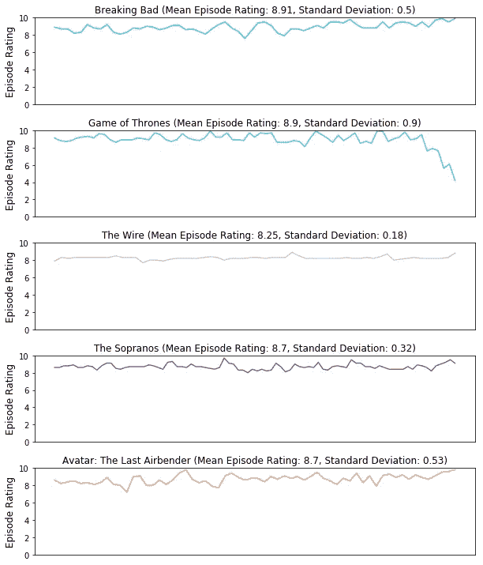
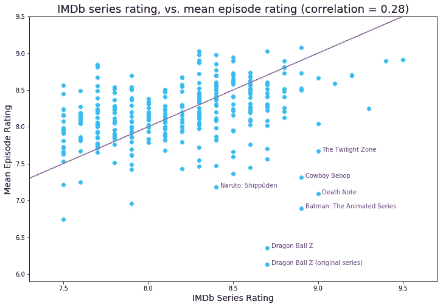
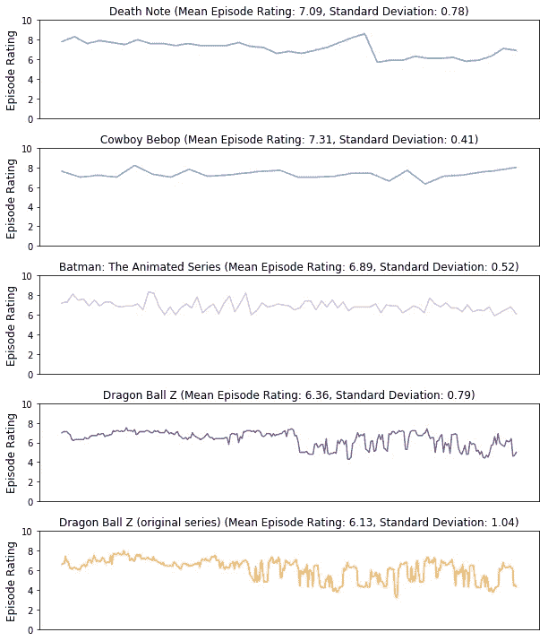
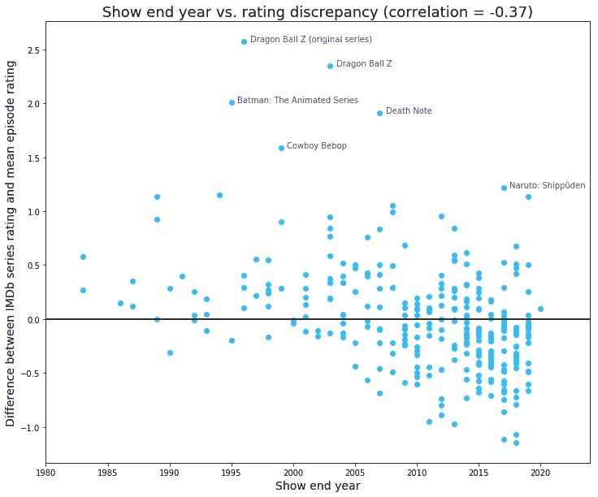
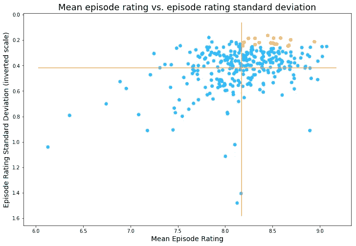
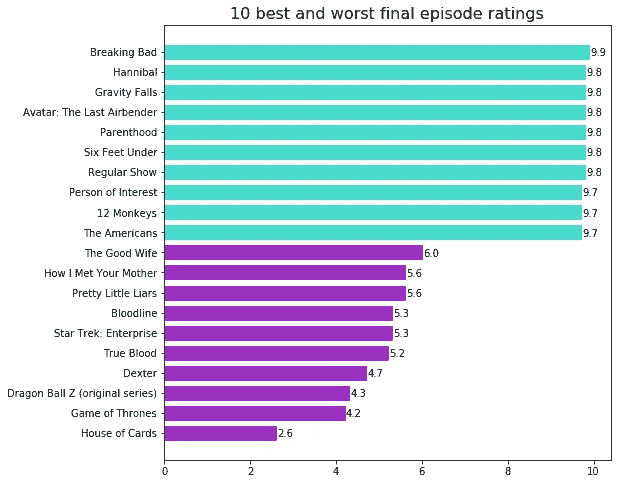
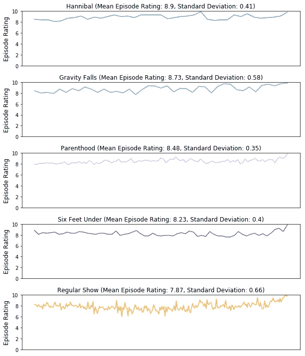
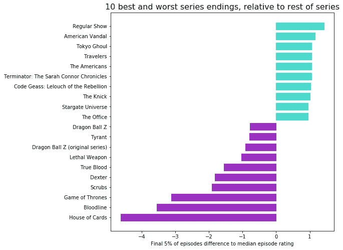

# 不幸的结局

> 原文：<https://towardsdatascience.com/unhappy-endings-36e5fd157703?source=collection_archive---------27----------------------->

## 《权力的游戏》有没有电视史上最差的大结局？

A Song of Ice and Ire (Image: HBO)

《权力的游戏》是一种文化现象，这对任何人来说都不是新闻。以任何标准衡量，这都是过去十年中最大的电视节目，尤其是就其预算而言，根据综艺节目的报道，该节目最后一季每集的预算达到了惊人的 1500 万美元(T2)。

然而，这并不是第八季唯一令人惊讶的特征。尽管开头几集很有希望，但作为《权力的游戏》同义词的出色写作开始下滑。而且不是一点点。到了节目的高潮，情节漏洞被打开了。一英寸厚的情节装甲消除了电视史上最大的战斗序列的所有紧张气氛。错综复杂的人物弧线就像被龙焰点燃的铁王座一样消失了。犯罪记录还在继续。

粉丝们对这一切毫无兴趣。一份[请愿书](https://www.change.org/p/hbo-remake-game-of-thrones-season-8-with-competent-writers)要求“与有能力的作家一起”翻拍最后一季，已经有 170 万人签名，并且人数还在增加。当然，节目主持人面临着一个几乎不可能完成的任务。鉴于前几季的高质量和由此产生的巨大期望，很难想象一个结局不会让至少一些人失望。

但是电视史上最差的？好吧，这是一个数据科学博客，所以要回答这个问题，现在是时候让一些数字参与进来了…

“I drink and I mung things,” — Tyrion Lannister, probably… (Image: HBO)

不出所料，我们将用于这一分析的数据集来自 IMDb。特别是，我们将使用几个电视连续剧统计数据的数据集，可以直接从 IMDb [这里](https://datasets.imdbws.com/)下载，以及另一个特定于剧集的统计数据的数据集。这第二个数据集需要一点网络搜集来生成(从 IMDb 并不容易获得特定剧集的数据——稍后会有更多)。

将来自 IMDb 的所需数据集连接在一起，并将其加载到熊猫数据帧中，我们看到我们有 951，196(！)行，每一行代表一个唯一的“标题”，以下列:

The index of this dataframe has been set to ‘tconst’, which is a unique identifier for each title on IMDb. This is a very useful field — especially in cases when two shows have the same name, for example, the original BBC ‘House of Cards’, and the Netflix remake, which should be analysed as two separate shows.

我们可以使用这些列来过滤标题:

*   **标题类型**告诉我们正在讨论的标题是电影、电视短片、电视电影等。我们可以删除任何不是'*电视剧*'的行。
*   **isAdult** 是 1 还是 0，取决于……嗯，你大概能猜到。假设这里的 get 计数为 0，那么删除带有 1 的行可能是安全的。
*   endYear 告诉我们这部剧在哪一年结束，而 NaN 则代表仍在制作中的剧集。鉴于我们正在分析节目的结局，我们应该删除这里带有 *NaN* s 的行。
*   **平均分**是一个介于 0 和 10 之间的浮动值，表示给予整个系列的平均分(10 分*)。这一点很重要——在 IMDb 上，人们既可以对一个系列进行评级(这在本专栏中有所考虑),也可以对单个剧集进行评级。正如我们将在后面看到的，这些评级并不总是像人们预期的那样紧密相关。如果我们在分析剧集的结局，那么只包括总体上至少还过得去的标题是合理的(一个糟糕的剧集也有一个糟糕的结局并不是一个特别有启发性的观点)。因此，我们过滤掉任何没有 7.5/10 或以上系列评分的节目。*
*   numVotes 告诉我们有多少张选票进入了平均投票。我们应该有一个较低的门槛，以确保我们只处理(相对)主流系列。我用 2 万张选票作为截止日期。
*   一旦我们有了特定剧集的数据，我们也将排除任何少于 12 集的剧集。这样的集数是必要的，以便从整个系列的整体质量中理清一个节目“结局”的质量。

令人难以置信的是，应用这些过滤器让我们从 951，000 本书减少到 305 本。这些是 305 个展示，将形成以下分析的基础。

如前所述，要获得单集的收视率，我们需要直接从 IMDb.com 那里获取。

这就是那些“tconst”标识符派上用场的地方——IMDb 在每个标题的 URL 中使用的正是这些字符串。比如《权力的游戏》就有一个 *tt0944947 的‘t const’。*因此，系列 1 的 IMDb 网页采用以下形式:

[www.imdb.com/title/**TT 0944947**/剧集？季节=1](https://www.imdb.com/title/tt0944947/episodes?season=1)

考虑到这一点，我们可以使用一个函数遍历一个节目的不同季节，并存储每一集的收视率。通过这个函数传递一个“tconst”代码列表，我们可以为给定的节目列表(在我们的例子中，我们上面确定的 305 个标题)创建一个剧集评级数据库。

有了这些新数据，我们就可以开始分析了。

让我们先看一些非常简单的东西，来测试一下我们的数据集。在我们的“已完成”电视节目数据库中，哪些节目的整体收视率最高？

即使结局令人不快，《权力的游戏》仍然享有 9.4 的健康收视率，周围是你预计会在这样的排名中看到的剧集(《绝命毒师》、《火线》(The Wire)和《黑道家族》(The Sopranos)，以及一些你可能甚至没有听说过的剧集(《蕾拉和梅克纳》(Leyla and Mecnun)是土耳其剧，目前在网飞可以看到，而《阿凡达》(Avatar)、《死亡笔记》(Death Note)和《钢之炼金术士》(Fullmetal Alchemist)都是日本动漫)。

让我们更深入地了解排名前五的剧集，追踪每一集的收视率。

正如我们可能预料的那样，第一个跳出来的是《权力的游戏》结尾时收视率的急剧下降。我们还应该注意到，这种下降并不是不可避免的——有很多高质量节目在最后一刻没有出错的例子。事实上，这里的其他剧集在最后几集几乎达到了各自的巅峰(黑道家族的轻微下滑可能是由臭名昭著的“切换到黑色”结局造成的)。

这里出现的另一个不太明显的东西是总的剧集评级(如原始数据集中所定义的)和剧集评级的平均值之间的关系。我们会认为它们非常相似，如果不是完全相同的话，尽管事实似乎并非如此。例如，虽然《连线》的剧集收视率一直很高，但平均下来仍比其整个系列的收视率低一个百分点(分别为 8.25 和 9.30)。

事实上，如果我们比较整个数据集的这两个指标，我们会发现剧集收视率和平均剧集收视率之间的相关性实际上相当弱。

The purple line here represents x = y. Very few titles sit on (or indeed especially near) it

奇怪的是，我们看到总系列和剧集评分差异最大的七个节目中有六个是动画，其中五个是日本动画(火影忍者、星际牛仔、死亡笔记和两份龙珠 Z)。

查看具有最大差异的剧集跟踪记录，我们看到很高的标准偏差(在《蝙蝠侠》和《龙珠 Z》的情况下，每集的质量相当不一致)。

我们可以猜测，这里有某种“怀旧因素”在起作用——人们可能对十多年前播出的一部电视剧有着美好的“整体”记忆，这将导致该剧整体的高收视率。

然而，时间可能会抹去对无用剧集的记忆，从而降低单集收视率(我们可以假设，逐集评分的人更有可能最近以更客观的眼光观看了这些剧集)。

数据在一定程度上证实了这一点。一部电视剧的年终与其整体剧集评分和平均剧集评分之间存在负相关关系。

The further towards the top of the chart a title is, the higher its series rating is compared to the average rating of its individual episodes. Older shows are likelier to have such discrepancies.

那么，鉴于我们已经看到了剧集收视率差异很大的不一致的剧集，哪些剧集能够在整个播出过程中保持一致的质量呢？我们可以通过绘制一部剧的剧集收视率均值和标准差来回答这个问题。

**Consistently good shows highlighted in yellow:** The Wire, Leyla and Mecnun, Firefly, Oz, Blackadder, Mr. Bean, Ezel, Pushing Daisies, The Killing, The Inbetweeners, Happy!, Studio 60 on the Sunset Strip, ‘Allo ‘Allo!, Into the Badlands, Agent Carter, Almost Human, Pinky and the Brain, The Alienist, Nikita, Rizzoli & Isles, Kyle XY, and Witches of East End

让我们回到系列赛决赛的话题上来。

回答片名问题的一个非常简单的方法是——“权力的游戏有电视史上最差的结局吗？”—就是简单的把每个剧集的最后一集隔离出来，按照收视率从上到下排序。让我们来看看这个列表的极端情况:

我们不应该对《绝命毒师》出现在顶部感到惊讶，尽管除了《阿凡达》,其他的标题对这个博客来说都是新的。让我们更详细地看看这些达到 9.8 分的其他节目。

至于天平的另一端，我们看到《权力的游戏》并不(完全)拥有最差最后一集的荣誉——这个可疑的荣誉属于网飞改编的《纸牌屋》。

“For those of us climbing to the top of the IMDb rankings, there can be no mercy” (Image: Netflix)

现在，我们将看到《纸牌屋》突然出现在这些“最差”的名单中，所以让我们马上处理这个特定的房间里的大象。《纸牌屋》在接近尾声时的衰落是毋庸置疑的。对其最后一集的一星评论既多又严厉。然而，该剧在最后一季确实不得不应对其首席演员和执行制片人的职业内爆——这是《权力的游戏》的主持人戴维·贝尼奥夫和 D·B·威斯(或者用术语来说是“D&D”)不必承受的。

除此之外，我们还能如何判断一部剧结局的好坏呢？单看最后一集似乎有点狭隘。有人可能会说，以这种方式比较不同长度的序列是不公平的。对于 12 集的节目，最后一集代表其总播放量的 8%，但是对于 150 集的节目，最后一集代表不到 1%。

此外，很多对《权力的游戏》结局的批评是因为它的前 95%的质量——我们应该在剩余剧集的背景下看待一部剧的结局。

因此，让我们来看看一部剧集在最后 5%的平均收视率(以获得一个更一致的跨标题“结尾”定义)，并将其与该剧的中值剧集收视率进行比较。

《纸牌屋》再次占据榜首，但网飞的另一部作品《血统》将《权力的游戏》挤到了倒数第二名。尽管如此，如果我们比较他们的剧集收视率，我们可以看到《血统》和《纸牌屋》都没有达到《权力的游戏》盛况下的高度。

那么，我们能得出什么结论呢？《权力的游戏》可能没有电视史上最差的大结局*。但肯定是在上面(或下面)。当然，尽管粉丝们可以为有史以来最伟大的电视节目之一的不光彩的消亡而悲伤，但我们应该记住，在它运行的大部分时间里，它恰恰是电视有史以来最伟大的节目之一。*

对泰温·兰尼斯特来说，我们必须接受 D & D 的决定，并感谢我们还有《权力的游戏》——D&D 并不完美，但没有人是完美的。

让我们只希望五年后我不会坐在这里，写一篇关于他们如何击败[星球大战](https://www.starwars.com/news/game-of-thrones-creators-david-benioff-and-d-b-weiss-to-write-and-produce-a-new-series-of-star-wars-films)的博客…

___

*注意:截至 2019 年 7 月 14 日，本文中的所有评级均正确*