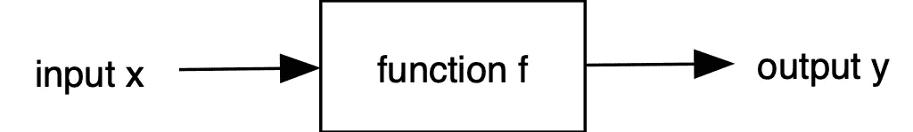
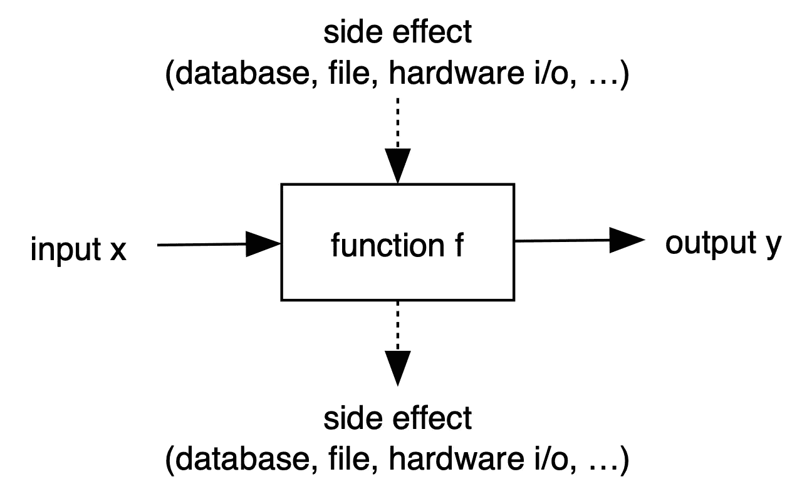
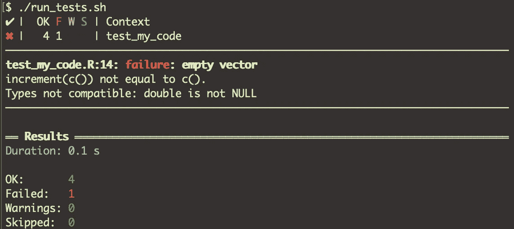

# R 中的单元测试

> 原文：<https://towardsdatascience.com/unit-testing-in-r-68ab9cc8d211?source=collection_archive---------0----------------------->

## 为什么单元测试真的是一个好主意——即使对于非包。为创建健壮的软件编写测试，节省时间，并从中获得乐趣！

你会问:“为什么要进行单元测试？我的代码起作用了！”。单元测试有助于创建健壮的代码。在简短地介绍了什么是健壮代码之后，我给出了基本单元测试思想的概述。最后，我展示了如何在 R 中快速使用它们**，甚至是简单的脚本(没有创建 R 包的负担)。**

Entangled software breaks upon tiny changes — like these wirings (Photo by [Pexel](https://pixabay.com/users/Pexels-2286921/) on [Pixabay](https://pixabay.com))

**健壮代码**

*   不会因变更(如新的 R 版本、包更新、错误修复、新特性等)而轻易中断。)
*   可以简单地重构**和**
*   可以将**延长**而不破坏其余部分
*   可以进行**测试**

单元测试对于编写健壮的代码是很重要的——它们可以让我们更加确信一些变化不会破坏代码——至少代码可以比紧耦合的代码库更快地修复。

有很多关于单元测试的精彩文献。在这篇文章中，我想分享单元测试背后的基础知识，并把它们应用到 R 脚本语言中，同时推荐一些包和概念，用于您的日常 R 编程。

确信:在不断增长的代码库中，你**将**需要单元测试。有时候，即使很小的脚本有时也会产生很多苦恼。我保证在没有测试的情况下在调试器中花很多时间。在长期的单元测试中**会节省你很多宝贵的时间**，即使你认为这可能是额外的工作。我不喜欢测试驱动设计(TDD)——在我看来，测试应该只是支持你编程的一个工具。他们不应该统治你！

**动机**

单元测试在 R 和 Python(以及其他动态类型的脚本语言)中特别有用，因为没有编译器的帮助来告诉你在哪里可以用无效的参数调用函数。有一些帮助器包，比如 R 的 lintr 或 Python 的 pylint，试图减轻这一点。

然而，在过去我经常遇到困难——代码崩溃，例如，一些中间列表突然变空，或者只包含一个项目，而一个列表包含多个项目。在这些地方，测试将有助于防止将来出现这种问题。在数据科学中，一些计算会持续很长时间。如果计算在几个小时后由于错误而中止，则为坏。

# 单元测试基础

**测试简单功能**

一个简单的函数接受一个输入并生成一个输出，如下所示

在单元测试中，我们希望在调用函数 **f** 时，验证输出 **y** 是否具有特定输入 **x** 的期望值。通常测试不同的( **x，y** )对。

一个例子可以是按升序对向量值进行排序的函数。边界测试非常重要。在这个例子中，我们可以测试

*   作为输入的空列表
*   只有一个值的列表
*   已经排序的列表
*   未排序的列表
*   如果提供了无效的参数，将引发函数错误。
*   该函数是否正确处理了所有这些情况？
*   当创建一个复杂的应用程序时，对可能失败的功能或者过去发生错误的地方进行单元测试是一个好习惯。为 bug 编写一个测试，修复 bug，看看单元测试是否成功。

**测试有副作用的功能**

事情并不总是像上一节那样简单。有时一个函数会有副作用，可能是文件的读/写、数据库的访问等等。

在这种情况下，考试的准备就更加复杂了。它可以只包含一堆用于模拟数据库访问的函数的模拟对象。这正在影响编程风格——抽象层可能会变得必要(参见 [R 数据库接口——DBI](https://db.rstudio.com/dbi/))。在某些情况下，需要在执行测试之前生成输入文件，并在测试之后检查输出文件。

**测试类别**

面向对象编程( **OOP** )在 R 里有点奇怪，感觉很别扭。如果你曾经有机会用其他语言编写软件:我强烈建议，为了更好地理解什么是面向对象——比如说尝试一下[kot Lin](https://kotlinlang.org/)——这很有趣。

面向对象背后的基本思想是你把数据(**成员变量**)和处理这些数据的代码(称为**方法**)放在一起。这是在一个**类定义**中声明的。面向对象的主要思想是，你可以通过继承从另一个类派生出类，从而扩展它的功能和数据。一个简单的例子:一个图形形状可以从原点偏移(x，y)。由此，我们得到一个矩形，除此之外，它还有一个宽度和一个高度(w，h)。

类定义只是由**构造器**生成的具体对象**实例**的蓝图。然后，实例的状态(成员变量)通过调用如下类方法逐步修改:

在 R 中有不同的面向对象系统，如 S3 和 S4。大部分旧功能都是用 S3 写的。summary()或 print()之类的函数就是这样的例子。这些“函数”实际上是**方法**，它们被分派给作为参数输入的不同对象类型的相应类方法。参见 [R 教程章节。16](https://www.cyclismo.org/tutorial/R/objectOriented.html) 凯利·布莱克如果你想了解更多这方面的情况。因此，测试通常由对对象实例的一系列操作组成，从而验证某些步骤后的结果是否符合预期。

# **R 中的单元测试**

这里我们使用 [testthat](https://testthat.r-lib.org/) package⁴，它有一个从其他语言(Java、C#、Python)派生的 xUnit 测试中已知的概念。这个例子展示了第一个基本功能测试。因为我经常发现自己创建了更多的脚本而不是 R 包(这要乏味得多),所以这个例子展示了如何使用 **testthat** 而不必创建包。

**举例:一个简单的函数**

假设我们编写了一个函数，它在 **my_code 中将其参数(可能是一个数字向量)加 1。R** 文件。那似乎是原始的。但是你会在续集里看到，连这个功能都可能失效。

创建一个名为 **tests** 的目录，并将一个或多个以 **test_** 作为文件名的 R 脚本放在那里。

在这之后，您可以通过在 R 中调用 testthat::test_dir("tests ")来启动单元测试代码，您将会看到类似这样的输出。

The output is shown after calling the tests. So the function did not work with an empty list c().

因为它不是一个包，所以测试文件必须包含一个 source()命令来导入您的脚本。

测试是使用 testthat::test_that(name，expression)函数声明的。第一个参数为测试指定一个名称，以便识别它。第二个参数是一个 R 表达式，它将使用 expect_*断言。每当断言不成立时，测试被中止并标记为失败。

好的一面是:无论何时你决定继续创建你的 R 包，你都可以让你的测试就位。然后只需要从 **test_xxx 中删除那些 **source()** 命令。R** 文件。

*   参见我的 GitHub [库](https://github.com/andremueller/r-recipes/tree/master/unit-testing)获取这个基本片段。

**结论**

单元测试让你不再害怕修改源代码。当你在写代码的时候心里想着可测试性，你的编程风格就会改变。如果函数不能被简单地测试，那就说明你有纠缠不清的代码！在这种情况下，准备环境(变量、文件、数据库连接等)的工作可能会过多。)做一个测试。对于有明确目的的函数，单元测试应该很容易！

我建议从福勒和马丁的伟大著作中获得灵感。

> 解开你的代码，编写单元测试，享受其中的乐趣！花更多时间开发有趣的功能，少花时间调试。

**参考文献**

[1]: G. J. Myers，T. Badgett，T. M. Thomas 和 C. Sandler，软件测试的艺术，第 2 卷(2004)，威利在线图书馆

[2]: M .福勒，重构:改进现有代码的设计(2000)，艾迪生-卫斯理专业版

[3]: R. C. Martin，干净代码，敏捷软件工艺手册(2009)，普伦蒂斯霍尔

[4]:[test tha:R](https://cran.r-project.org/package=testthat)的单元测试。哈德利·韦翰。