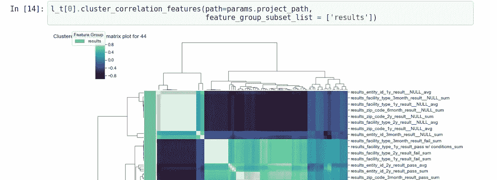

# 单元测试 Python 数据可视化

> 原文：<https://towardsdatascience.com/unit-testing-python-data-visualizations-18e0250430?source=collection_archive---------10----------------------->

对与 matplotlib 接口的 Python 代码进行单元测试可能具有挑战性。测试有多大帮助，最好的方法是什么？

在为数据科学工具包 [Triage、](https://dssg.github.io/triage)进行开发时，这种情况经常出现，该工具包包括大量使用 matplotlib 或其他相关 Python 库绘制图表的代码。这些情节经常在 Jupyter 笔记本中使用，这些笔记本有自己的设施来显示情节。

过于详细地测试可视化代码没有太多意义。对于一个情节应该是什么样子的期望很难用一种易于单元测试的方式来表达。将尽可能多的绘图数据生成与绘图分开，并像测试任何其他生成的数据一样测试绘图数据生成通常是有意义的。但是图数据不是图。我们想确保绘图代码正常工作。我们如何定义“作品”？一个有用的定义是测试是否能回答这个问题:

> 我们策划了什么吗？

这是一个很好的开始。任何应该绘制某些东西的代码可能都应该绘制某些东西，并且希望它应该足够容易地自动解决这个问题。

## 方法一:修补

我过去经常使用的方法是模仿“plt.show”并断言它被调用了。一个例子:

这通常是有效的。因为“plt.show”通常在绘制代码的末尾被调用，所以如果在 plt.show(通常是您要测试的内容)之前出现了问题，这个模拟就不会被调用，测试就会失败。

但是也有一些缺点:

*   *如果 plt.show 没有被调用怎么办？*对于经常从 Jupyter 笔记本(或任何其他可能在自己的层上处理显示的显示引擎)调用的代码。您可以尝试制定内部准则，强制所有绘图代码都调用 plt.show，但在这一点上，您只是在测试您的内部准则，而不是代码工作。
*   *如果调用了 plt.show，但不是在您正在导入的模块中调用，该怎么办？*以 seaborn 地块为例。他们使用 matplotlib，但是包装了它，所以你不太可能在你的代码中看到 plt.show。如果有人将笨拙的 matplotlib 图形重构为漂亮的 seaborn 图形会怎样？我不希望我的测试在这种情况下失败。
*   *如果调用了 plt.show 但是没有任何内容怎么办？*这个可能性不是超级大，但还是有可能的。

## 方法二:plt.gcf

幸运的是，matplotlib 有另一个接口，我们可以用它来克服 patch 的这些缺点:plt.gcf()(获取当前数字)。

我不确定这是不是 Jupyter 的内联绘图魔法的工作方式，但是它非常有用。gcf 返回对当前(最后绘制的)图形的引用。更好的是，它包括一个数字(plt.gcf()。number)，它可以让您跟踪绘制了多少个。在我们的绘图代码运行之后，我们可以检查当前的图形，以便对它做出我们想要的任何级别的断言。所以它不关心是否调用了 plt.show，只要在某个地方创建了图形，它就工作，甚至是内部使用 matplotlib 的一些高级库。

当我第一次发现 gcf 时，很容易在调用代码之前“重置”绘图编号，以尝试并断言当前图形的确切编号。在这样做之前，我试图用 plt.close()来“清除”这个情节:

这在本地有效。然而，当我推给 Travis 时,“close”似乎没有做任何事情，gcf()的值。数字受到其他测试用例的影响。我认为这与我的笔记本电脑有一个真正的显示器/窗口和 Travis 是无头的有关。也许有一种更好的方式来进行“清理”，但我不想进入显示器的杂草中，所以我想出了一种替代方式来使它具有确定性:

> 断言数字的数量比你开始测试时要多

这在 Travis 和我的笔记本电脑上是一样的。另一个不同之处是，我没有断言绘制的具体数字。不管你是否想在你的代码中这样做(最终我认为它可能会深入到 matplotlib 内部处理事情的方式)，你都可以使用这个方法。但是这本身就是一个方便的情节断言工具。我甚至最终把它变成了一个上下文管理器感知的方法，以便于重用:

这种方法可能存在哪些缺点？

我们断言，无论我们调用什么代码来绘图，都会创建 matplotlib 图形。这个易碎吗？理论上。这听起来肯定违反了“不要测试实现”的指导方针。但事实上，我认为

> matplotlib 是一个通用的后端，许多我可能会在其中切换的前端都会用到它

是一个比

> seaborn 是最好的前端，我会一直使用它，也许它会从 matplotlib 切换后端

我的团队将一个图表重做到一个新的、非 matplotlib 支持的绘图库中当然是可能的，但可能性不大。因此，作为一个相当通用的 Python 数据可视化断言，我对此相当满意。你怎么想呢?我是否遗漏了其他缺点，或者测试 Python 绘图的更好方法？