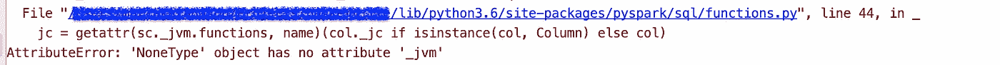
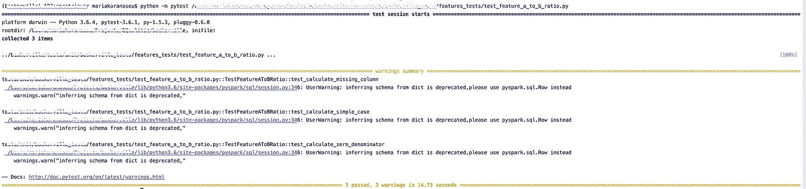
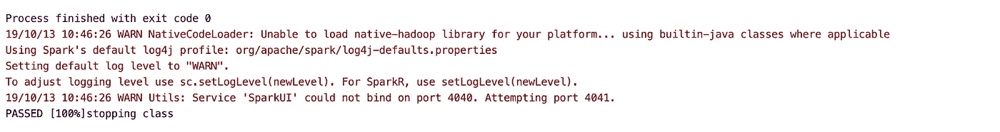

# 单元测试 Apache Spark 应用程序

> 原文：<https://towardsdatascience.com/unittesting-apache-spark-applications-b9a46e319ce3?source=collection_archive---------13----------------------->

## PySpark 案件


对 Spark 应用程序进行单元测试并不是那么简单。对于大多数情况，您可能需要一个活跃的 spark 会话，这意味着您的测试用例将需要很长时间来运行，并且可能我们正在所谓的单元测试的边界附近踮着脚尖。但是，这绝对值得去做。

*那么，我应该吗？*
嗯，**是的**！测试你的软件总是一件好事，它很可能会让你免除许多麻烦，此外，你将被迫把你的代码实现成更小的片断，这样更容易测试，从而获得可读性和简单性。

好的，那么我需要做些什么呢？嗯，我认为我们可以从`pip install spark-testing-base`开始，然后从那里开始。为此，我们还需要`pyspark`(当然)和`unittest`(单元测试 2)和`pytest`——尽管`pytest`是个人偏好。

[](https://github.com/holdenk/spark-testing-base) [## 霍尔登克/火花测试基地

### 用 Spark 编写测试时使用的基类。您已经在 Spark 中编写了一个很棒的程序，现在是时候编写了…

github.com](https://github.com/holdenk/spark-testing-base) 

Spark testing base 是一个帮助 Spark 测试的基类集合。对于这个例子，我们将使用继承自`SparkTestingBaseReuse`的基础`[SQLTestCase](https://github.com/holdenk/spark-testing-base/blob/master/python/sparktestingbase/sqltestcase.py)`，它创建并重用了一个 SparkContext。

在`SparkSession`和`SparkContext`上:

[](https://medium.com/@achilleus/spark-session-10d0d66d1d24) [## 火花会议和火花背景的故事

### 我已经有了 Spark 上下文、SQL 上下文、Hive 上下文！

medium.com](https://medium.com/@achilleus/spark-session-10d0d66d1d24) 

从个人经验来说(使用目前最新的 spark 版本。+)，我发现我需要对`SQLTestCase`做一些小的调整，这是我在当前项目中经常使用的一个测试用例。因此，这里有一个我为适应自己的需要而做的调整的例子:

Example of a base spark test case, based on Spark testing base’ s SQLTestCase

总结一下我所做的改变:

*   为了一致性，我添加了一个配置，将时区设置为`UTC`。时区一致性是贯穿你的代码的一个非常基本的东西，所以请确保你总是设置`spark.sql.session.timeZone`
*   在配置中设置的另一个重要的事情是`spark.sql.shuffle.partitions`对于将要运行测试的机器来说是合理的，比如`<= cores * 2`。如果我们不这样做，那么 spark 将使用默认值，即 **200** 分区，这将不必要地、不可避免地减慢整个过程。`<= cores * 2`是一个普遍适用的好规则，不仅仅适用于测试。
*   还添加了一种在比较之前对要比较的数据帧进行排序的方法。在一个基类中有一个`compareRDDWithOrder`方法，但是我认为使用 dataframes 更容易。
*   `schema_nullable_helper`方法应该**谨慎使用**，因为它可能最终破坏你的测试用例，这取决于你需要测试什么。这种情况的用例是在没有指定模式的情况下创建数据帧(目前不推荐使用)，因为 spark 试图推断数据类型，有时要比较的两个数据帧之间的可空标志不一致，这取决于用于创建它们的数据。该方法将两个数据帧的模式之一更新为另一个的模式，该模式仅与**可空值**相关。
*   最后，我为`appName`和`config`添加了一个稍微调整过的版本。在最新的 pyspark 版本中,`session`实例化也有所不同。(对于 2.2 的支持，有一个待定的版本。+和 2.3。+ spark 版本仍然开放[这里](https://github.com/holdenk/spark-testing-base/pull/264)和[这里](https://github.com/holdenk/spark-testing-base/issues/268)，所以，我们将子类化来解决这个问题)

注意`getOrCreate()`将创建一次 spark 会话，然后在整个测试套件中重用它。

现在让我们创建一个要测试的简单特性:

An example of a feature calculation class

这个特性只是计算`a/b`，其中`a`和`b`是输入数据帧中的列。非常简单明了。我在这里没有包括列检查，因为如果`a`或`b`丢失，我们需要计算过程失败到足以停止一切。但一般来说，这取决于您希望如何处理应用程序中的错误情况，以及这种计算对您的过程有多重要。

这里需要注意的是:即使您模拟了对`calculate` dataframe 的输入，spark 会话也是需要的，因为在我们特性的`calculate`实现中，我们使用了像`F.col('a')`这样的`pyspark.sql.functions`，这需要您有一个活动的会话。如果我们没有会话，我们会得到这样的错误:



Attribute error when using pyspark sql functions without an active session

如果出于某种原因，我们需要在特性的`__init__`体(构造函数)中声明计算，这就更明显了，例如:

```
**class** FeatureAToBRatio(object):
    feature_name = **'a_to_b_ratio'** default_value = 0.

    **def** __init__(self):
        self.calculation = F.col(**'a'**).cast(**'float'**) / F.col(**'b'**).cast(**'float'**)
```

然后我们会在特性实例化期间得到错误`feature = FeatureAToBRatio()`。

现在让我们继续添加一些测试用例。

An example test suite for testing feature a to b ratio

我们正在测试:

*   正常情况下，`a`和`b`存在，并有数值
*   其中一个例外，例如`b`不存在于数据帧中
*   分母为 0 的情况。

这些只是**人们可以为**测试的一些基本测试用例。我想到了许多其他的例子，例如，如果`a`为空或者不同类型的数据类型会发生什么，但是为了这个例子，让我们保持它简单明了。

要运行测试套件:

```
python -m pytest test_feature_a_to_b_ratio.py
```



Example output of tests execution



Example output of tests execution — ran with PyCharm

就是这样！请注意，它运行了 7.58 秒(当 shuffle 分区设置为默认的 200 时，运行了 14.72 秒)，这对于单元测试来说有点多，而且它只有 3 个测试用例—想象一下，有一个 CI/ CD 在每次合并或提交时运行测试套件…

当然，spark / pyspark 还有很多复杂的测试要做，但我认为这是一个很好的基础。如果有更好的方法，请告诉我。

我希望这有所帮助。任何想法，问题，更正和建议都非常欢迎:)

如果您想了解更多关于 Spark 的工作原理，请访问:

[](/explaining-technical-stuff-in-a-non-techincal-way-apache-spark-274d6c9f70e9) [## 用非技术性的方式解释技术性的东西——Apache Spark

### 什么是 Spark 和 PySpark，我可以用它做什么？

towardsdatascience.com](/explaining-technical-stuff-in-a-non-techincal-way-apache-spark-274d6c9f70e9) [](/adding-sequential-ids-to-a-spark-dataframe-fa0df5566ff6) [## 向 Spark 数据帧添加顺序 id

### 怎么做，这是个好主意吗？

towardsdatascience.com](/adding-sequential-ids-to-a-spark-dataframe-fa0df5566ff6)