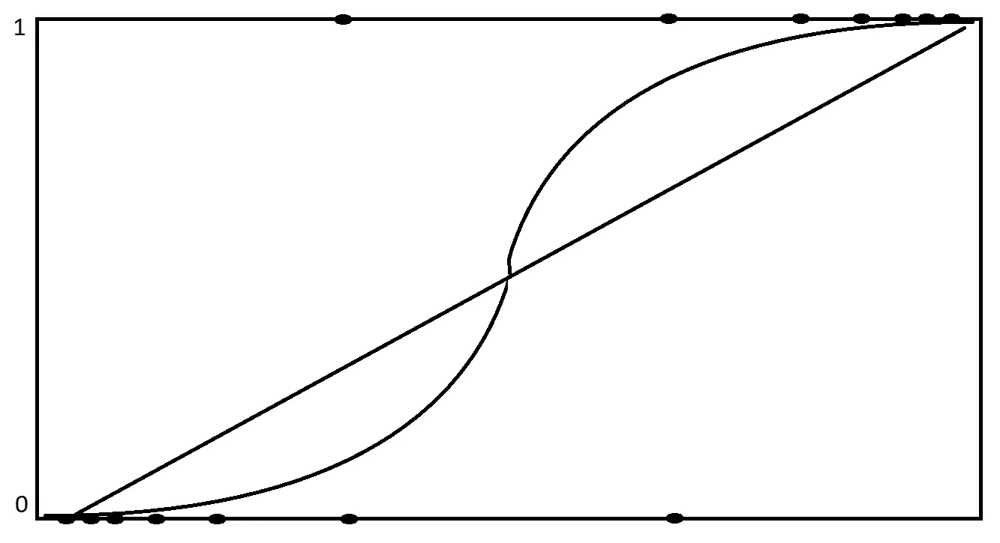
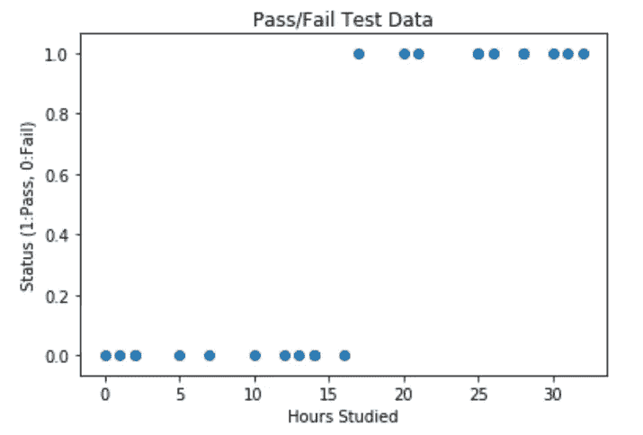
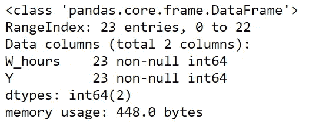
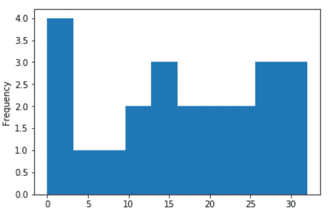
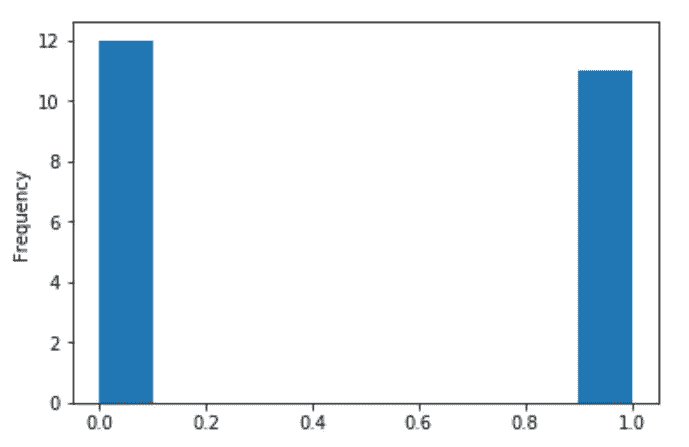
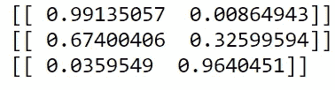
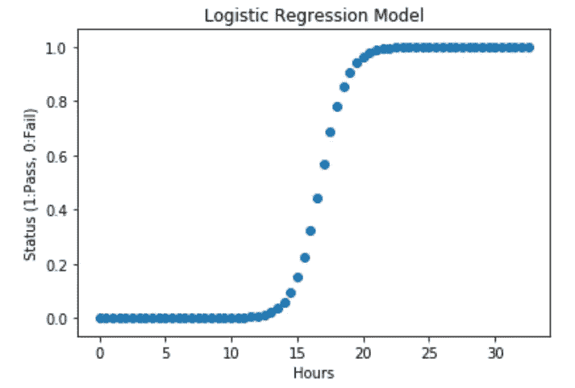

# 对逻辑回归(python)的直观理解

> 原文：<https://towardsdatascience.com/univariate-logistic-regression-example-in-python-acbefde8cc14?source=collection_archive---------21----------------------->

## 二元例子


Source: [Anne Spratt](https://unsplash.com/photos/ORDz1m1-q0I)

逻辑回归是一种用于预测目标变量“非此即彼”的模型。我们将研究的例子是:

*   **目标变量:**学生将通过或未通过考试。
*   **自变量:**每周学习时间

逻辑模型本质上是带有额外步骤的线性模型。在逻辑模型中，线性回归通过“sigmoid 函数”运行，该函数将其输出压缩成二分的 1 和 0。

> 如果我们想预测实际的考试成绩，我们会使用线性模型。如果我们想预测“通过”/“失败”，我们将使用逻辑回归模型。

# **线性(预测数值测试分数):**

**y = b0 + b1x**

# **逻辑(预测“通过/失败”):**

**p = 1 / 1 + e ^-(b0 + b1x)**

# 可视化:

下图中，直线是线性的，“S”形线是逻辑的。由于其形状，逻辑回归在用于“非此即彼”模型时具有更高的准确性。



Logistic Regressions are “S” shaped. Linear Regressions are straight.

# 理解数据:

```
import numpy as np
import pandas as pd
import matplotlib.pyplot as plt
%matplotlib inline
df = pd.read_excel(r”C:\Users\x\x\Log_test.xlsx”)
x = df[‘W_hours’]
y = df[‘Y’]plt.scatter(x,y)
plt.show()
```



```
df.info()
x.plot.hist()
y.plot.hist()
```



数据集中有 23 行。以下是学习时间的分布情况:



下面是通过(1)/失败(0)的分布情况:



# 数据准备/建模

接下来，我们将使用 sklearn 库导入“LogisticRegression”。关于参数的详细信息可以在这里找到[。](https://scikit-learn.org/stable/modules/generated/sklearn.linear_model.LogisticRegression.html)

我们把我们的双变量模型转换成二维的。shape()函数。我们定义了 1 列，但是我们将行数保留为数据集的大小。所以我们得到 x 的新形状为(23，1)，一个垂直数组。这是使 sklearn 功能正常工作所必需的。

使用“logreg.fit(x，y)”来拟合回归。

```
from sklearn.linear_model import LogisticRegression
logreg = LogisticRegression(C=1.0, solver=’lbfgs’, multi_class=’ovr’)#Convert a 1D array to a 2D array in numpy
x = x.reshape(-1,1)#Run Logistic Regression
logreg.fit(x, y)
```

# 使用和可视化模型

让我们写一个程序，通过学习的小时数，我们可以得到通过和失败的预测概率。我们在下面的代码中输入学习时间:学习 12、16 和 20 小时的例子。

```
print(logreg.predict_proba([[12]]))
print(logreg.predict_proba([[16]]))
print(logreg.predict_proba([[20]]))
```



左边的输出是失败的概率，右边的输出是通过。

为了形象化模型，让我们做一个循环，将每半小时的学习时间放入从 0 到 33 的回归中。

```
hours = np.arange(0, 33, 0.5)
probabilities= []
for i in hours:
    p_fail, p_pass = logreg.predict_proba([[i]])[0]
    probabilities.append(p_pass)plt.scatter(hours,probabilities)
plt.title("Logistic Regression Model")
plt.xlabel('Hours')
plt.ylabel('Status (1:Pass, 0:Fail)')
plt.show()
```



在这组虚构的数据中，如果一个学生学习超过 20 个小时，他/她就一定会通过，如果不到 10 个小时，他/她就一定会不及格。17 小时是 50/50 的界限。

感谢阅读，

*   [*随机森林是否优于 Logistic 回归？*(一比较)](/is-random-forest-better-than-logistic-regression-a-comparison-7a0f068963e4)
*   [*Excel vs SQL:概念上的比较*](/excel-vs-sql-a-conceptual-comparison-dcfbee640c83)
*   [*用 Python 中的逻辑回归预测癌症*](/predicting-cancer-with-logistic-regression-in-python-7b203ace16bc)
*   [*利用数学和 Python 优化投资*](/portfolio-linear-optimization-breakdown-f519546ed1ff)
*   [*优步点评文本分析*](/uber-reviews-text-analysis-11613675046d)