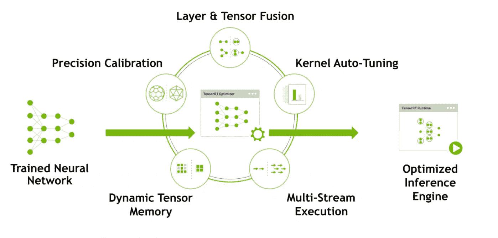

# 无标签数据的股票正在上涨

> 原文：<https://towardsdatascience.com/unlabelled-datas-stock-is-rising-71ed1cf909b7?source=collection_archive---------34----------------------->

Facebook’s latest Semi-Weak Supervised Learning framework is a novel approach to leveraging unlabelled datasets for Computer Vision. [https://ai.facebook.com/blog/billion-scale-semi-supervised-learning/](https://ai.facebook.com/blog/billion-scale-semi-supervised-learning/)

脸书大学的研究人员一直在探索使用 Instagram 标签作为 ImageNet 分类模型的弱监督预训练手段。在这项研究中，“弱监督”学习描述了使用有噪声的标签进行监督学习，即 Instagram 图片上的标签。这是有利的，因为大数据是计算机视觉中的王者，他们能够利用**10 亿张**这些 Instagram 图片进行预训练(ImageNet 包含 120 万张图片，以供参考)。

[他们基于这种弱监督学习范式的模型](https://research.fb.com/wp-content/uploads/2018/05/exploring_the_limits_of_weakly_supervised_pretraining.pdf?)已经记录了最先进的 ImageNet 分类结果，准确率高达 85.4%。他们目前通过使用[分辨率增强](https://arxiv.org/pdf/1906.06423v2.pdf)扩展弱监督学习，以 [86.4%](https://paperswithcode.com/sota/image-classification-on-imagenet) 的成绩获得 ImageNet 奖杯。

脸书的最新框架[半弱监督学习](https://ai.facebook.com/blog/billion-scale-semi-supervised-learning/)是这种思想的最新体现，取得了令人印象深刻的结果，并自然产生了高效的模型。[随着数据量持续爆炸](https://www.networkworld.com/article/3325397/idc-expect-175-zettabytes-of-data-worldwide-by-2025.html)，脸书的半弱监督学习等研究正在寻找新的方法**利用大规模未标记数据集**并解决图像网络分类等计算机视觉任务。

# 半监督和弱监督学习

脸书在这项研究中对“半监督学习”提出了独特的观点。他们将模型提取描述为半监督学习任务，这不是不正确的，只是不符合文献的常规。模型提取指的是使用更大容量的教师网络来产生类标签上的 softmax 分布。然后，较低容量的学生网络在该分布上被训练。模型提取是模型压缩中最强大的技术之一，为像 [HuggingFace 的 DistilBERT](https://medium.com/huggingface/distilbert-8cf3380435b5) 这样的模型提供动力。

半监督学习描述了从未标记数据中构造监督学习信号的范例。这是 Word2Vec、DeepWalk 或 Wav2Vec 等技术的想法，其中一部分输入被屏蔽掉，模型的任务是预测哪些被删除了。这种扩展到图像的想法被称为“修复”。然而，更常见的是做一些像人工旋转图像，然后让模型预测旋转角度。这就是驱动诸如“自监督 GAN”的自监督模型的机制。

在脸书的“半弱监督学习”框架中，教师模型最初用弱监督数据集(Instagram hashtags 的监督学习)训练，在 ImageNet 上微调，然后教师模型预测原始弱监督数据集上的班级分布，学生模型训练自己预测相同的分布，最后，学生模型在 ImageNet 数据集上微调。

# **未标记数据集中的类别不平衡**

类别不平衡描述了在训练数据中严重偏向一个类别的数据集。例如，包含 80%狗和 20%猫的训练集将产生偏向于将图像标记为狗的模型。Instagram 图片等海量无标签数据集自然包含类别不平衡和长尾分布。比如 Instagram 上有成吨的狗图片，有多少叶甲？

脸书大学的研究人员通过使用教师网络预测标签的 top-K 评分系统来解决这个问题，并使用该参数来平衡图像的数量。随着 K 变大，接近分布末端的图像相对于它们的类别标签变得更有噪声。在叶甲虫的情况下，可能只有 8K 甲虫图像，因此如果 K 被扩展到 16 或 32K，则从 8001 到 16000 的图像将被错误地标记。然而，这个想法是教师模型对 bettle 图像有足够的感觉，使得不是甲虫的图像 8001 在语义/视觉上仍然是相似的。

# **大规模模型蒸馏的推理加速**

High-level idea of NVIDIA’s TensorRT inference accelerator. [https://developer.nvidia.com/tensorrt](https://developer.nvidia.com/tensorrt)

从这个框架中产生的另一个有趣的部分是，当教师在未标记的数据集上预测标签时，推理加速的重要性。教师网络必须进行大约 10 亿次预测，以产生学生网络的精选标签。通常，用模型提取训练的模型不会解决推理瓶颈，但是在以这种方式标记 10 亿张图像的情况下，这显然是重要的。这提供了推理加速器的额外贡献，如 NVIDIA 的 TensorRT 和针对小推理延迟优化的模型。

# 弱监督数据集的最佳来源是什么？

Photo by [NeONBRAND](https://unsplash.com/@neonbrand?utm_source=unsplash&utm_medium=referral&utm_content=creditCopyText) on [Unsplash](https://unsplash.com/s/photos/instagram?utm_source=unsplash&utm_medium=referral&utm_content=creditCopyText)

想想 Instagram 的标签很有趣。这是弱监督数据集的最佳来源吗？YouTube 视频包含上传者提供的标签，但这种标签比 Instagram hashtagging 噪音大得多。

# 精华建筑搜索

脸书最近的论文改变了学生网络体系结构，从 ResNet-18 到 ResNet-50 以及递增的更大版本的 ResNeXt。在一大堆探索各种背景下的神经架构搜索的研究论文中，对升华师生架构关系的研究相对较少。ResNet 变型从较大容量转换到较小容量似乎很直观。这种想法可能更好地体现在一个更结构化的进展，如从 EfficientNet-E7 到 E5。此外，通过搜索最适合从教师的预测标签分布中学习的特定架构，可能会实现性能提升。

# 生成模型能进一步增加预训练数据集的大小吗？

Generated face images from NVIDIA’s Progressively Growing GAN models. What happens if these models are married with the 1 billion Instagram images used for pre-training? [https://arxiv.org/pdf/1710.10196.pdf](https://arxiv.org/pdf/1710.10196.pdf)

使用 GANs 从现有数据集生成新的训练数据的想法似乎很有前途。这已被证明在极其有限的数据集(如[医学图像分析](https://news.developer.nvidia.com/ai-can-generate-synthetic-mris-to-advance-medical-research/))的情况下是成功的，但对于常规任务(如 [ImageNet 分类或 COCO 对象检测)尚未奏效。](https://openreview.net/forum?id=rJMw747l_4)使用“半弱”监督训练框架，GANs 或变分自动编码器能否应用于 10 亿张未标记图像，以产生 20 亿或 100 亿张图像？这会产生新颖的图像来改善计算机视觉模型的预训练吗？

# 结论

脸书的半弱监督学习框架对半监督学习、弱监督学习、模型提取中的类不平衡以及模型提取的推理加速是一个非常有趣的视角。随着越来越多的人使用 Instagram，数据集自然会变得更大，他们使用 Instagram 图片的方法似乎会自然地扩展到数十亿张图片。top-K 评分法是解决大规模未标记数据集中明显的类别不平衡的一个很好的策略。有趣的是，如果生成模型可以进一步增加这些未标记的数据集。感谢您的阅读，如果您对本文的详细内容感兴趣，请查看下面的视频！