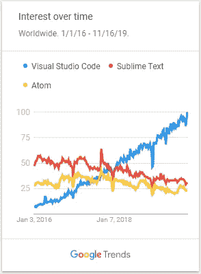
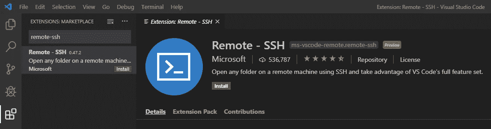
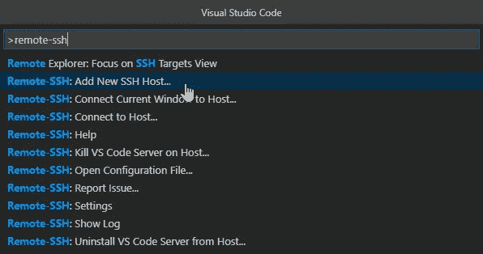
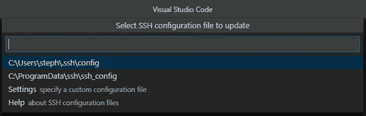
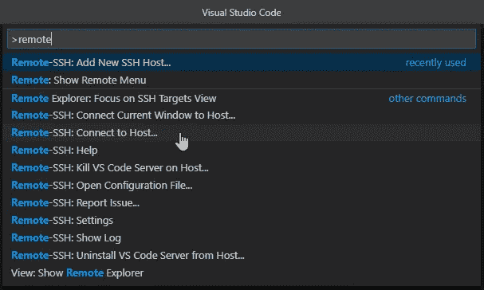

# 在谷歌云平台虚拟机上释放 Visual Studio 代码(VSCode)的威力

> 原文：<https://towardsdatascience.com/unleash-the-power-of-visual-studio-code-vscode-on-google-cloud-platform-virtual-machine-f75f78f49aee?source=collection_archive---------2----------------------->

## 在您的远程虚拟机上获得成熟的本地 IDE 体验！


Photo by [Joshua Earle](https://unsplash.com/@joshuaearle?utm_source=medium&utm_medium=referral) on [Unsplash](https://unsplash.com?utm_source=medium&utm_medium=referral)

Visual Studio Code(简称 VSCode)是一个强大的、多平台的、免费的代码编辑器，支持多种编程语言[1]。在过去的两年里，它的受欢迎程度有了惊人的增长，这可以从它的谷歌搜索趋势的迅速上升中看出。在这篇文章中，我将分享一种使用安装在本地计算机上的 VSCode 来编辑和运行位于 Google Cloud 虚拟机上的代码的方法。但是首先…



Google Trends comparison between VSCode, Sublime, and Atom from Jan 2016 to Nov 2019.

# 我有 Jupyter 为什么还要 VSCode？

作为一名数据科学家，当你拥有 Jupyter 笔记本[2]的便利时，为什么还要使用 VSCode？如果你像我一样，那么你的日常数据科学工作包括两个方面。第一个方面是使用著名的 Jupyter 笔记本进行实验。Jupyter 非常适合数据科学项目早期阶段所涉及的那种迭代的、实验性的工作流。一旦您有了想要在生产中运行的产品(每天运行数千次或数百万次)，数据科学家工作的第二个方面就开始了。在许多组织中，您没有专门的制作团队。即使您有这种奢侈，在将代码传递给生产团队之前重构代码也是一个好的实践，以确保产品在部署后能按预期工作。这就是 VSCode 在数据科学工作流中的闪光点！使用 VSCode 从 Jupyter 笔记本中重构代码的细节值得一篇独立的帖子来公正地对待。然而，[3]很好地概述了 VSCode 中可用的重构工具。一个简单的例子是“重命名符号”，它只允许你重命名一个变量一次，但是会自动更新你代码中出现的所有变量！超级得心应手！

# 先决条件

现在让我们进入这篇文章的细节。既然你正在阅读这篇文章，我假设你已经运行了一个 GCP 计算引擎 VM，并且你的个人电脑上也安装了 VSCode。如果你没有这两个，那么参考[【4】](https://cloud.google.com/compute/docs/quickstart-linux)关于如何设置 GCP 计算引擎 VM 和[【1】](https://code.visualstudio.com/)下载并安装 VSCode 到你的本地计算机上。**更新:您还必须安装 gcloud sdk，并按照**[**【9】**](https://cloud.google.com/sdk/install)中的说明在您的系统上运行 gcloud init

# 详细步骤

Mac 和 Linux 用户可以直接跳到这篇文章的*部分，使用内置终端从第 1 步开始。Windows 用户需要注意以下几点:*

**仅适用于 Windows 用户:**

*   从开始菜单，启动 *Windows Powershell*
*   对于这篇文章的*为所有用户*部分下的所有剩余步骤，请遵循参考网页上 *Linux 和 MACOS* 部分下的说明。但是，请记住删除出现的下列内容:`~/.ssh/`
*   例如，如果参考网页的 *Linux 和 MACOS* 部分显示:

```
ssh-keygen -t rsa -f ~/.ssh/[KEY_FILENAME] -C [USERNAME]
```

改为在 *Windows Powershell* 中键入:

```
ssh-keygen -t rsa -f [KEY_FILENAME] -C [USERNAME]
```

**重要！不要按照网页的 Windows 部分的说明操作，因为我还不能让它在我的 Windows10 桌面上运行。**

**适用于所有用户:**
遵循以下网页的 *Linux 和 MACOS* 部分的说明，即使您是 Windows 用户(请阅读上面的*部分，仅适用于 Windows 用户*)

1.  按照[【5】](https://cloud.google.com/compute/docs/instances/adding-removing-ssh-keys#createsshkeys)中的说明，在您的本地计算机上设置 SSH 密钥。Windows 用户，记得去掉`~/.ssh/`
2.  按照[【6】](https://cloud.google.com/compute/docs/instances/adding-removing-ssh-keys#locatesshkeys)中的说明，在本地计算机上找到并复制您的 SSH 密钥。Windows 用户，默认情况下你的密钥保存在`C:\Users\your-windows-username`
3.  您必须将此 SSH 密钥(从您的计算机)添加到您的 Google cloud platform 帐户。您可以按照[【7】](https://cloud.google.com/compute/docs/instances/adding-removing-ssh-keys#project-wide)的指示插入整个项目的密钥，也可以按照[【8】](https://cloud.google.com/compute/docs/instances/adding-removing-ssh-keys#instance-only)的指示插入特定虚拟机的密钥。我个人倾向于将它添加到特定的虚拟机中，以便进行组织。记住，您需要复制的公共 SSH 密钥是。pub 文件。Windows 用户，最好在记事本中打开此文件并复制其内容。
4.  现在，在本地计算机上打开 VSCode。在 Windows 上按 *Ctrl+Shift+x* 打开 VSCode 中的扩展管理器。在搜索框中，键入 *remote-ssh，*并安装这个扩展。



Install Remote-SSH extension in VSCode on your local computer

5.安装完成后，在电脑上按 *Ctrl+Shift+p* (或者在 Mac 上按 *Cmd+Shift+p* 调出命令面板，键入 *remote-ssh* 。应该会出现一组选项，如下图所示。单击*添加新的 SSH 主机…* 选项。



Add New SSH Host… is the second option

6.在弹出的 Enter SSH Connection 命令提示符下，键入:`ssh -i ~/.ssh/[KEY_FILENAME] [USERNAME]@[External IP]`并按 Enter 键。KEY_FILENAME 和 USERNAME 是您在步骤#1 中键入的内容。外部 IP 可以在您的 GCP 计算引擎虚拟机实例页面中找到，并且对每个虚拟机都是唯一的。又弹出一个提示，要求您*选择 SSH 配置文件来更新*。只需点击第一个，您应该会看到*主机已添加！*在 VSCode 窗口的右下角。

**对 Windows 用户很重要！**，而不是~/。ssh/[KEY_FILENAME]，您必须键入带有\\ "的完整路径。例如，`ssh -i C:\\Users\\your-windows-username\\[KEY_FILENAME] [USERNAME]@[External IP]`



Select the first option

7.按下 *Ctrl+Shift+p* (或者 Mac 上的 *Cmd+Shift+p* )打开命令面板，再次键入 remote-ssh。这次点击*连接到主机*。然后从弹出的列表中选择虚拟机的 IP 地址。如果您再次看到关于指纹的弹出窗口，请点按“继续”。



Connect to Host is the fifth option above

8.就是这样！您的本地 Visual Studio 代码现在已经连接到您的 GCP 虚拟机了！您可以单击打开文件夹或打开文件，这将显示虚拟机中的文件，可以直接从本地计算机上运行的 VSCode 编辑这些文件。

## 常见问题

我已经在 Mac、Linux 和 Windows10 桌面上测试了上述步骤。因此，如果您在此过程中遇到任何错误，很可能您犯了以下常见错误之一:

*   您的 GCP 虚拟机已停止。启动 GCP 虚拟机，然后重试。
*   在第 6 步中，您要么提供了错误的 KEY_FILENAME 位置，要么提供了错误的用户名或错误的外部 IP。请记住，如果您没有为 GCP 虚拟机设置静态 IP，那么您可能需要在每次停止和启动虚拟机时执行第 6 步，因为外部 IP 地址可能会发生变化。始终提供正在运行的虚拟机的当前外部 IP。
*   您按照[5]、[6]、[7]和[8]下的网页中的 Windows 说明进行了操作。DONT！回过头来，按照 Linux 和 MACOS 下的说明重做所有步骤，并做我上面提到的小修改

我希望这篇文章对你有所帮助。如果有，请在下面告诉我。编码快乐！

参考资料:
【1】下载 vs code:[https://code.visualstudio.com/](https://code.visualstudio.com/)
【2】下载 Anaconda 使用 Jupyter 笔记本:[https://www.anaconda.com/distribution/](https://www.anaconda.com/distribution/)
【3】vs code 中的重构选项:[https://code.visualstudio.com/docs/editor/refactoring](https://code.visualstudio.com/docs/editor/refactoring)
【4】启动一个 GCP 计算实例 VM:[https://cloud.google.com/compute/docs/quickstart-linux](https://cloud.google.com/compute/docs/quickstart-linux)
【5】在本地计算机上创建 SSH 密钥:[https://cloud . Google . com/Compute/docs/instances/add-removed-SSH-keys](https://cloud.google.com/compute/docs/instances/adding-removing-ssh-keys#createsshkeys)