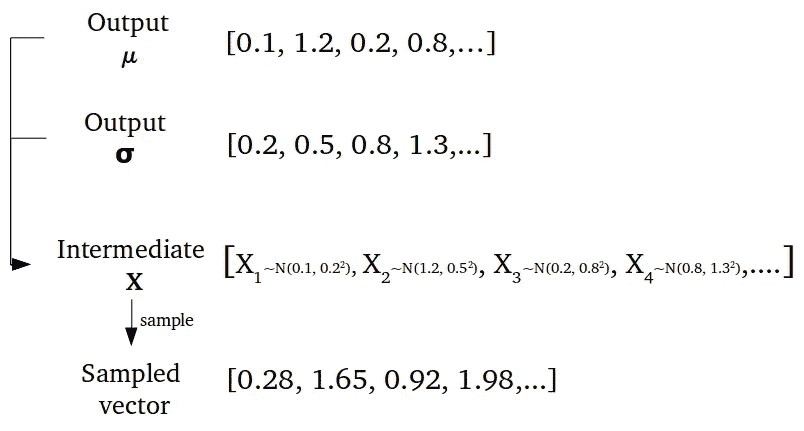

# 利用机器学习开启药物研发

> 原文：<https://towardsdatascience.com/unlocking-drug-discovery-through-machine-learning-part-1-8b2a64333e07?source=collection_archive---------6----------------------->

## 通过利用机器学习来生成和创建分子的逆向合成路径，从而加速药物发现。

我们发现药物的方式效率极低。需要做点什么。

尽管最近制药行业发生了很多创新，尤其是在癌症研究领域，但仍有巨大的差距需要改进！

自 20 世纪 20 年代以来，我们目前的药物发现方法没有太大变化。

> ***这是曾经发现毒品的故事:***

1928 年，病理学家亚历山大·弗莱明(Alexander Fleming)经常被描述为“无忧无虑”，他在去度一个月的假之前，不小心把培养皿放在了窗户旁边，没有盖上盖子。

从他美好的假期回来后，发生了更美好的事情。让他吃惊的是，这个被丢弃的培养皿让弗莱明有了惊人的发现，发现了世界上第一种抗生素——青霉素，这一发现颠覆了制药业🤯**。**

这只是一个小错误如何成为治疗突破的众多例子之一。

> ***快进到大约 8 年后，这是目前发现的药物:***

最近，纽西兰的研究人员* ***出人意料地**** 发现，先前在 21 世纪初用于对抗脑膜炎疫情的疫苗，随后也降低了淋病的风险**。**

尽管发生了这么多进展，药物发现的秘方似乎从未逃脱意外收获的魔力。

在过去的 80 年里，技术进步呈指数增长，但药物研发领域的进展相对停滞。

手机甚至都不是东西，更别说 1928 年的苹果了(如果你不是苹果粉丝，我们就不是朋友——开玩笑的😁)，现在我们不仅有苹果，而且我们还有脑机接口，人工智能将创新带入每个行业，量子计算(最近，*谷歌宣布量子至上*)和大量指数级技术的出现。

但是，相比之下，在改进药物发现过程方面进展甚微。

I meant I love eating apples 🍏

# 目前的药物发现过程是什么样的？

> *有大量的证据表明，目前的药物发现过程仅仅是* **不足** *，* **不足** *针对那些最需要的人——患有慢性和致命疾病的人。*

据估计，将一种药物从研究阶段推向市场平均需要花费 26 亿美元，并且需要 10 年以上的时间😱**。**由于药物研发非常耗费资源，最近的大部分进展都集中在癌症研究等高回报市场。

这部分解释了**90%以上的罕见疾病缺乏有效治疗。**

但是为什么会这样呢？让我们看看药物发现管道(又名药物开发的多方面过程)。

我们都希望这些救命药物能够更快、更便宜地送到有需要的患者手中。

为什么这个过程如此漫长和昂贵的简单答案是纯粹的复杂性。

药物研发管道看起来像这样:

Drug discovery pipeline! There are a total of 7 phases.

复杂吧？我们来分解一下…

药物研发有七个阶段:

## 1.目标识别:发现(2 年以上)

第一步甚至不是关于药物，而是关于理解导致疾病的目标。这些靶标通常由 DNA 突变、错误折叠的蛋白质和其他潜在的疾病生物标志物组成。但是，青霉素的发现显然不是这样，纯粹是偶然发现推动的。

**问题#1:** 虽然理想的途径是确定靶点，然后开发出专门对抗疾病靶点的药物，但这个过程并没有保证。青霉素的发现显然是这个过程的一个例外，而且还有更多例外。有这么多可能的化合物，这么多可能的目标，人类很难理解所有这些可能的组合。

## 2.线索发现:临床前(1-2 年以上)

这是筛选数千种旨在干扰疾病靶标的化合物的过程。目标是显著缩小各种潜在化合物的范围。

## 3.药物化学:临床前(1-2 年以上)

这一阶段包括进一步测试化合物的过程，以分析它们与疾病靶标的相互作用。可以进行的一些分析包括，例如，考虑化合物的 3D 构型来研究化合物的相互作用。根据分析得出的结果，朝着预期目标进一步优化化合物。

## 4.体外研究:临床前(1-2 年以上)

作为概念的证明，进入这一阶段的化合物在细胞系统中进行测试，这是一种疾病的体外模型。这是培养皿研究发生的阶段。体外研究试图详细检查该化合物在干扰靶标方面的有效性。

***问题#2:*** *体外研究结果往往不能反映动物或临床研究结果，导致* ***失败率高。*** *根据麻省理工学院的一项研究，* ***临床试验成功率徘徊在 14%左右，这太疯狂了！*** *这是因为我们的体外细胞系统模型往往是对我们复杂的人类系统的粗略简化。生物学不是以 2D 模式运行的，但培养皿研究是细胞的 2D 模型，是一种广泛使用的体外研究方法。*

## 5.体内研究:动物研究(1-2 年以上)

体外研究成功后(耶，但最困难的部分还在后面)，该化合物通常在动物模型中测试，如大鼠或小鼠模型。与 2D 体外细胞培养模型相比，动物研究的结果通常更具代表性。然而，它明显比体外研究更昂贵。这一阶段的失败率也更高，因为由于细胞模型结构的差异，体外研究的结果不一定与动物研究相关。

***注意要牢记:*** *如果我们能早点失败，而不是晚点失败呢？在如此昂贵的阶段失败是没有意义的，如果我们在体外研究阶段失败了呢？*

## 6.最后，我们进行临床试验(6 年以上)

如果上述所有阶段的结果都表明该化合物有前景，那么它将进入临床试验。临床试验有三个阶段，每个阶段都有不同的目标。临床试验的主要目标是验证化合物或潜在药物在人类环境中的有效性和安全性。

***问题#3:*** *临床试验有许多监管方面，这就是为什么它是最漫长和最昂贵的阶段。证明药物的疗效往往不是一件容易的事；具体来说，化合物的长期副作用通常在一段时间后仍然未知。在人身上试验新药总是存在巨大的内在风险。三期临床试验的平均费用估计为 1900 万美元。*

## 7.还有最后一个阶段:FDA 批准和商业化(1 年以上)

一旦所有测试完成，该化合物可以提交给美国食品和药物管理局审查批准。一旦获得批准，这种药物终于可以在患者手中商业化，以改善生活和治疗疾病！！！！！！—有史以来最激动人心的部分，但这是一次极其漫长和昂贵的旅程！

***问题#4:*** *新上市的药物往往极其昂贵，这是因为研发的成本非常高。公司通常有 20 年的专利来保护他们的药物/产品免受竞争。这意味着他们可以将药物定价在他们认为合理的价格上。有时，这一价格可能高达数十万美元，使普通大众无法承受。*

**需要牢记的注意事项:**我们如何才能加快药物发现的进程？

哇，那是一次旅行🌄！

但是，如果有一种方法可以将早期药物发现(除了临床试验+商业化之外的所有阶段)的过程从 6 年大大加快到 6 天，会怎么样呢？我很乐观，我一点也不觉得这是科幻！其实这是有可能的！我们并不缺乏实现这一点所需的工具，我们只是缺乏乐观和合适的人。

## 当前的创新:加速药物发现

*   [in silico Medicine](https://www.technologyreview.com/f/614251/an-ai-system-identified-a-potential-new-drug-in-just-46-days/)(AI+pharmaceutical startup)能够在短短 46 天内设计、合成和验证新的候选药物。
*   [AlphaFold](https://deepmind.com/blog/article/alphafold) (谷歌的人工智能算法)能够以前所未有的速度和精度预测蛋白质的三维结构(药物发现中的关键评估)，超过了该领域一些世界上最好的生物学家和研究人员。

人是推动增长的唯一最重要的因素，而不是其他因素。不管你是一个 16 岁的高中生(剧透:那是我)，还是一个著名的人工智能研究者，我相信我们所有人都可以做一些事情来创造影响。作为一个好奇的 16 岁少年，这也是我决定做点什么的根本原因。

# Synbiolic 简介:利用变分自动编码器进行药物发现

我们已经坚持同样的过程，做了大量的湿实验室实验，经历了一堆药物发现的试验和错误太久了！药物研发的人工流程必须改变！

是时候来点新的了，介绍 ***Synbiolic* :推断人工智能的潜力，特别是变型自动编码器(VAE)以 SMILES** 的格式生成新的&有效分子(简化的分子输入行输入系统)。

## Synbiolic 的魔法是如何发挥作用的？

1.  *使用****VAE****的魔棒生成分子*
2.  *使用更多的魔法将生成的分子列表过滤成几个真正好的分子*

Imagine if drug discovery was as easy and fun as lego building!

这里有一个*内部*的魔术是怎么回事！

## 除了是一个人工智能+书呆子的时髦词，什么是变化的自动编码器？

变分自动编码器(VAE)是一种类型的*机器学习算法。**生成模型是一种人工智能架构，它能够*生成与训练数据特征相似的新数据*。***

*它由两个神经网络组成: **(1)编码器，和(2)解码器。***注:编码器和解码器可以使用不同的神经网络。**

***编码器网络负责降低输入到模型中的数据的维度，解码器网络通过将数据的紧凑表示重建回其原始维度/输入来反转该过程。***

*数据的紧凑表示被称为**潜在空间表示**(也称为瓶颈)。*

**

*Autoencoder 💻*

*Synbiolic 利用 VAE 生成新的分子，这些分子具有类似药物的特性，类似于用于训练模型的分子。生成的分子与训练分子并不完全相同，而是训练分子的变体。*

*为了更直观地理解编码器和解码器模型的功能，让我们来玩一个猜字谜游戏！*

**

*Finding Demo 😍*

*让我们进入编程模式，从声明一些变量开始🤖:*

*   *右边的女士=编码器*
*   *左边的先生=解码器*
*   *海底总动员=潜在空间/分子的紧凑表示*
*   *动作=生成的分子*

*猜测短语“海底总动员”*(*分子的紧凑表示*)* 的女士类似于编码器，因为她将“动作”*(*分子*)* 浓缩成短语*(*分子的紧凑表示*)。*就 AI 语言而言，她本质上是在建构“行动”的潜在表征*(*分子*)* 。这类似于编码器如何将用于表示分子的维度减少到更紧凑的形式。*

*扮演“海底总动员”的绅士*(*分子的紧凑表示*)* 类似于解码者，因为他试图将短语重新解释为动作*(*分子*)* ，这是扩展的表示。就生成分子而言，解码器通过基于其浓缩特征或潜在空间表示来重建分子来实现这一点。*

## *但是，等等，是什么让变分自动编码器不同于普通自动编码器？*

*一个变化的自动编码器有一个编码器和解码器网络，就像上图中普通的自动编码器一样(在海底总动员之前的那个)👆。然而，它不仅仅是一个常规的机器学习模型， **VAE 为其编码器网络使用了一种概率方法。***

*之所以用 VAE 代替自动编码器，主要是因为**普通的自动编码器不能生成数据**。这是因为普通的自动编码器(特别是编码器)似乎无法找出一种好的方法来创建“可用的”潜在空间表示，以馈入解码器网络，从而生成“好的”分子。*

*当自动编码器试图生成新数据时，最终发生的是一个随机的潜在表示/向量被输入到解码器模型中，这反过来生成*真正时髦和无用的数据*。这是因为**除了强迫编码器从训练数据中创建潜在向量之外，普通的自动编码器不知道如何获得“好的”潜在向量。***

***普通自动编码器的潜在空间不是连续的，这就是它们不适合生成数据的原因。***

**

*这意味着，采用上述图片中的潜在表示，解码器能够生成看起来不错的图片，但如果肤色等潜在参数中的一个从 0.85 到 0.84 稍有改变，那么解码器网络就会完全出错，最终可能会生成类似这样的结果:*

**

***这都是因为潜在空间表征不是连续的。***

*生成*随机*数据也没那么神奇。自动编码器无法实现的 VAE 的神奇之处在于，它是最好的生成模型之一，可以用来在*期望的方向上对你已经拥有的数据进行变化。**

*编码器网络被表示为 q(z|x ),解码器网络被表示为 p(x|z ),因为 x 表示网络的输入，z 是潜在表示(它是一个向量)。*

**

*Variational Autoencoder breakdown: Green is the encoder network, blue is the decoder network*

*变化自动编码器的不同之处在于它的编码器网络利用了一个*概率模型*。这使得**潜在空间是连续的。***

*VAE 通过让它的编码器组合两个向量来做到这一点:**一个向量取平均值，另一个向量取输入数据的标准偏差。**然后从均值向量和标准差向量中通过*采样*构建潜在向量 z。*

**

***μ** represents the mean and **σ** represents the standard deviation*

*通过采样，这允许潜在空间是连续的，而不是离散的。这就是为什么 VAEs 可以生成本质上是训练数据的变体的合成数据的原因。(我们可以通过优化潜在空间来有意地应用这些“变化”,以生成具有所需属性的新数据。)*

*让我们继续关注这一切背后的*秘方*，也就是 Synbiolic 的 VAE 所用的模型。*

***对于编码器和解码器模型，使用以下神经网络:***

*   *编码器网络=卷积神经网络(CNN)*
*   *解码器网络=一种称为门控递归单元(GRU)的递归神经网络(RNN)*

# *理解卷积神经网络:编码器*

*在我们深入 CNN 之前，让我们先来探索降维实际上是什么。*

***降维是机器学习中的一种技术，用于通过*减少其特征来降低数据。****

*编码器模型可以使用两种技术来执行维度缩减:*

1.  *按要素选择-仅选择部分要素，排除其余要素*
2.  *通过特征提取-将输入数据转换为潜在表示*

*这两种技术的区别在于，特征选择*不会改变特征，而特征提取会改变特征，因为它会对“输入特征/数据”进行变换，以获得潜在空间表示。**

*卷积神经网络(CNN)是一种深度学习算法，由于其检测特征的能力而广泛用于图像分类。*

***他们通过实施特征提取来做到这一点，从而降低输入数据的维度。***

*和其他深度学习算法一样，CNN 由**【1】个输入层、【2】个隐藏层、【3】个输出层组成。***

*隐藏层由几个不同类型的层组成，如卷积层、池层和全连接层。*

**

*Convolutional Neural Networks*

*使“卷积神经网络”成为“卷积神经网络”的是卷积层。是的，就这么简单，实际上，也许没那么简单…*

*卷积层本质上执行输入和滤波器之间的点积，以获得数据的低维表示(也就是说，卷积层由数学支持)。*

**

***The yellow matrix is the filter**, the green matrix is the input image, and the pink matrix is the convolved feature or latent representation.*

*如你所见，卷积特征在尺寸上比原始输入更加紧凑。*

*要了解更多关于卷积神经网络及其在皮肤癌检测中的应用，请查看本文！*

*我没有像从痣的图像中检测皮肤癌那样使用 CNN 进行图像分类，而是在分子数据集上训练 CNN。*

*VAE 在包含 250 000 个分子的锌数据集上进行训练。编码器(CNN)将分子特征的表示转化为更紧凑的表示。*

# *解码器呢？*

*对于解码器，使用一种称为门控递归单元(GRU)的特定类型的递归神经网络(RNN)。*

*与其他类型的神经网络不同，**rnn 具有内部记忆能力。**rnn 通常应用于**序列数据**，因为它们的特殊属性是它们的决策受网络内的先前输入和输出 ***的影响。****

*普通神经网络也具有“记忆”事物的能力，但它们仅限于记忆来自 ***先前*训练迭代的事物。***

**

*“Vanilla” Neural Network*

*相比之下，rnn 记住每次训练迭代中的事情，并根据输入和前一个隐藏状态生成的输出做出决策。*

**

*x nodes are the inputs, y nodes are the outputs, and h nodes are the hidden nodes*

***这样想:**还记得你的数学老师曾经告诉你，如果你不知道数字的加减乘除，你将永远无法掌握微积分！这是因为作为人类，我们理解概念的基础是我们之前学过的概念。*

*这类似于你在读这句话时，你是基于对前面单词的理解来理解这句话的。如果我只写“以前的话”作为句子，你不会明白我想说什么。本质上，这是 rnn 真正擅长做的事情:像句子结构一样剖析顺序数据的含义。*

*RNNs 的内部存储容量指的是它能够记住网络中以前的信息，以帮助它做出决策。他们能够通过理解序列中前一个值之间的联系来预测序列数据中的下一个值。*

*所有机器学习都是由数学驱动的，RNNs 的数学由隐藏状态(h)组成，这些隐藏状态是隐藏节点。*

*隐藏状态是相互联系的。在每个隐藏状态中，都有门，门是控制信息传递的神经网络。*

*对于计算信息的隐藏状态，必须对其进行预处理并将其转换为矩阵/向量表示。*

*“普通”rnn 的隐藏状态如下所示:*

*   *前一隐藏状态的输出与当前输入组合形成一个向量，该向量包括关于当前和前一输入的信息。*
*   *这个向量通过一个 tanh 激活函数，该函数将范围限制在-1 和 1 之间，以产生新的隐藏状态。*

**

*然而，传统的 RNN 遭遇了一个被称为消失梯度下降的问题。*

**

*当训练传统 RNN 时发生的是，随着权重被更新，梯度变得如此之小，以至于更新的权重变得不重要。如果原始权重实际上保持不变，这意味着在该模型中有*很少或没有学习*。*

*小的梯度更新不会导致任何显著的学习，从而阻止模型完成它的工作。*

*为了解决这个问题，我为解码器实现了门控循环单元(RNN，但有所改变),而不是使用“传统的”RNN。*

*门控循环单元(GRU)中涉及两个门:**更新门和复位门。**本质上，门只是隐藏节点内的*神经网络*。*

*与 RNN 不同， **GRU 只记住重要的短语和单词，而不是记住句子中的每个单词。***

*比如，我们来看看这句话:*

> **“为了研究如何最好地加速罕见病研究的问题，我们将回顾一些罕见病研究中的挑战以及最近的科学进步为治疗发展带来的机遇。”**

*像“to”、“the”、“of”、“that”和“for”这样的词与句子的意思并不相关，因此 GRU 人会忘记这些词。*

> **为了考察如何最好地* ***加速罕见病研究*** *的问题，我们将回顾一下* ***中的一些挑战*******罕见病研究*** *和* ***中的机遇*** *对于* ***疗法的发展*****

**RNN 可能试图记住整个句子，而 GRU 只记住重要的术语(上面用粗体表示)。**

****

**Gated Recurrent Unit**

## **更新门**

**更新门的职责是确定需要保留多少来自先前隐藏状态的信息。**消失梯度下降问题通过通过这个门来解决，因为模型能够决定它需要将多少过去的信息传递给未来的隐藏状态。****

## **复位门**

**来自先前隐藏状态的输出和当前输入组合形成一个向量，该向量包括关于当前输入和先前输入的信息。每个向量不仅包含当前隐藏状态的信息，还包含先前隐藏状态的信息。**

**重置门的工作是决定模型应该忘记哪些过去的信息。本质上，这个门的功能与更新门的功能相反。**

**在生成分子的场景中，GRU 或解码器的输入是表示分子的压缩形式或潜在空间表示的向量。GRU 的最终输出是分子在其原始/扩展表示中的重建。**

**衡量分子药物相似性的量称为 QED(药物相似性的定量估计)。我获得了生成分子的 QED，以验证它们是类药物分子。**

**QED 低于 0.5 的所有生成分子都被忽略，这确保了生成分子的质量。可以合成具有最高 QED 值的分子，以通过体外和体内研究进一步验证它们的性质！**

**耶！我们能够成功地设计和验证分子！这个被归类为早期药物设计的过程至少需要 3 年的传统研究才能完成！**

**如果你感兴趣，可以在这里查看来自 Github 的源代码。**

**这要感谢我的优秀团队:[雅利安·米斯拉](https://medium.com/u/bd6ad9886982?source=post_page-----8b2a64333e07--------------------------------) & [埃利亚斯·昆图里斯](https://medium.com/u/b295dac7f56?source=post_page-----8b2a64333e07--------------------------------)！**

## **关键要点:**

*   **药物研发极其昂贵且漫长**
*   **VAE 是一种生成神经网络，可用于生成药物发现的分子**
*   **人工智能是一个强大的工具，可以用来彻底改变医疗保健**

## **不要忘记:**

*   **访问 Synbiolic 的网站,了解更多关于 16 岁青少年的活动！**
*   **在 [LinkedIn](https://www.linkedin.com/in/joey-mach-6293b1175/?originalSubdomain=ca) 上和我联系！**

*****来自《走向数据科学》编辑的提示:*** *虽然我们允许独立作者根据我们的* [*规则和指导方针*](/questions-96667b06af5) *发表文章，但我们并不认可每个作者的贡献。你不应该在没有寻求专业建议的情况下依赖一个作者的作品。详见我们的* [*读者术语*](/readers-terms-b5d780a700a4) *。***