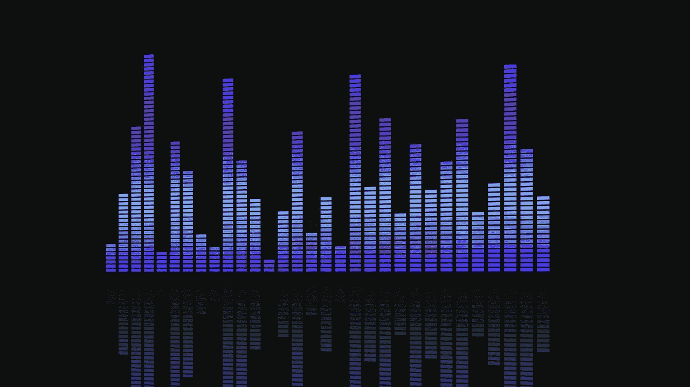
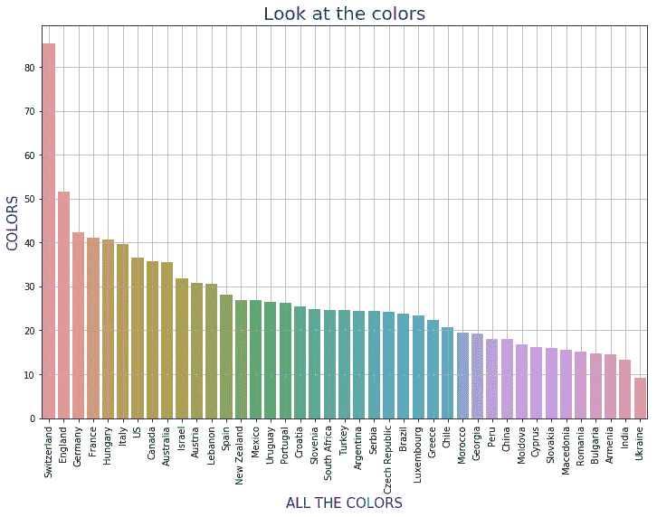
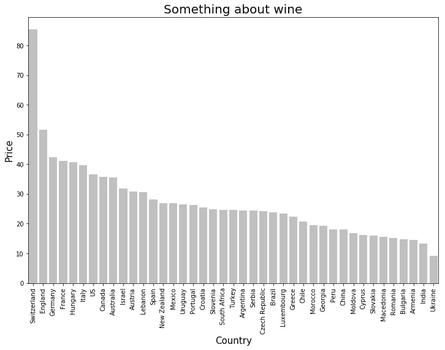
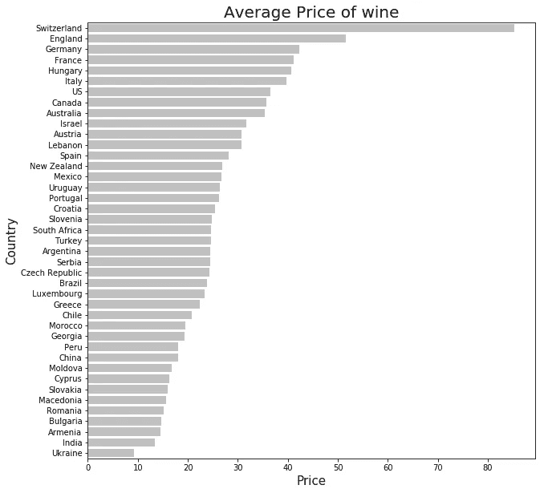
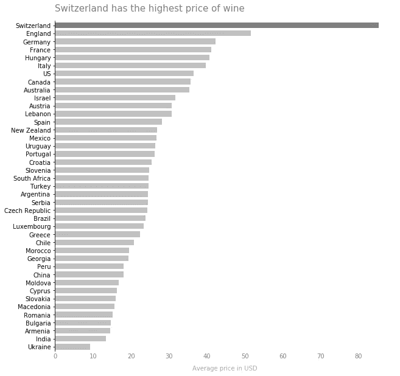
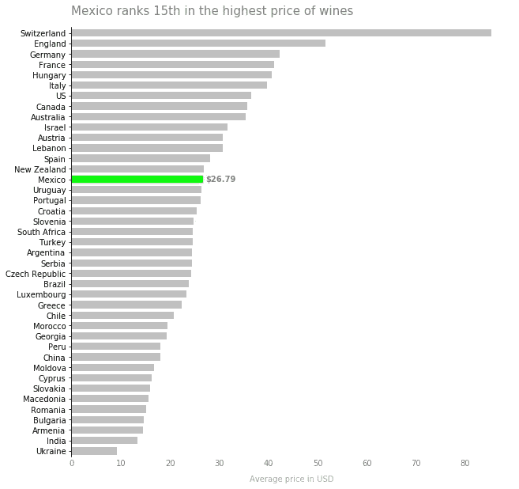

# 取消制作图表

> 原文：<https://towardsdatascience.com/unmaking-graphs-f584625c5bfd?source=collection_archive---------17----------------------->

## 对于图表来说，越少越好吗？是的。

[https://pixabay.com/en/equalizer-eq-sound-level-digital-255396/](https://pixabay.com/en/equalizer-eq-sound-level-digital-255396/)

我很高兴地看了很多图表(* *很多** )，并逐渐了解了哪些图表最有意义。好的图表告诉我关于数据的一件事，它们通过排除干扰和让我简单的头脑容易看到信息来做到这一点。

制作华而不实的图表很容易，但制作简单有效的图表就不那么容易了。

当我第一次创建任何图形时，事情通常是这样的:

想象一下，我刚刚得到一个有趣的新数据集，我正在做一些探索性的数据分析——弓着身子拿着放大镜在键盘上寻找相关性并分析线索。我决定变出一些图表来可视化数据，因为我知道我的视觉皮层会在图案中发现一些我美丽的数学头脑看不见的东西。

我可以使用 Excel、R 或 Python 来处理我的数据，也就是说，这并不重要。唯一重要的是，我的充满活力的条形图充满了旋转的文本、边界线、网格、标题和所有的颜色――它是完美的，它讲述了我的整个故事。(哈哈 j/k 太可怕了。)

你自己看一看，当你看的时候，注意你的眼睛落在哪里，什么东西首先吸引你的注意力。

你注意到的第一件事是什么？第二或第三件事呢？在你对图表有所了解之前，你实际上注意到了多少事情？你可能不知道这个图表是关于什么的，因为我是这样设计它来表达我的观点的，但是有很多事情需要你的注意。这个图表的更少部分会告诉我们更多关于数据的信息。

我们都见过这种充满彩虹的图表。起初，它们看起来确实很酷。但是除了被迷惑，它并不能帮助你理解这一点。桃色/鲑鱼色与大数字有什么关系吗？可能不会，因为图表另一边的短横条看起来完全一样。在这个图表中，所有不同的颜色都是分散注意力的，没有任何意义。让我们去掉它们，用一些对比不那么强烈的东西。黑色对于白色背景来说反差太大了，所以让我们试试简单的灰色。

哇，好多了！仍然不完美，但是现在我们能辨认出一些细节。我认为这是一个关于葡萄酒的图表，但我仍然不确定，因为那些网格线正在杀死我的灵魂。我的眼睛急切地想看着这些条，但这是一种挣扎，因为我被右上角交叉的网格线分散了注意力。我确信这其中有生物学上的原因，但这并不重要，因为我们正在摆脱它们。

*注意:有时你可能需要网格线，这没关系。使用真正的浅灰色让它们消失在背景中。他们不需要成为焦点，也不应该分散注意力。我想我们都同意，如果你使用网格线，他们不应该打你的脸。

哦，哇，如此清晰！没有颜色或网格线，我可以看到这个图表告诉我一些关于葡萄酒的事情。快看。其中一个酒具比其他的都大！要是我能知道酒是什么就好了。我想我*可以*花一点力气阅读旋转的文本，但是我简单的头脑把旋转的文本当成古代的挂毯。我没有时间解读古代文本，所以不要旋转标签来适应 x 轴，让我们旋转条形图，把它变成水平条形图。

嘣！通过切换到水平条形图，我可以很快地分辨出哪个国家的葡萄酒价格最高，因为阅读标签轻而易举。

感觉还是有点局促，还有一些让人分心的标题和标签。文本的意思有点模糊，黑色字体的颜色非常强烈，吸引了我的注意力。改变标题，使其更有目的性，这将有助于把观众的注意力引向什么是重要的，使用灰色字体将有助于把它更多地放在背景中。如果我们去掉几条样条线(边界),我们也可以把东西打开一点。

让我们修改标题和 x 轴标签，给它们一个目的，改变颜色，使它们不那么突出，并删除一些样条线，使它们不那么拥挤。

现在标题告诉你到底发生了什么，你知道这个图的目的。去掉样条线给我们一些喘息的空间，使用深灰色将你的注意力引向瑞士的酒吧。它摸起来很光滑，看起来很舒服。

即使我们不需要用颜色来表达我们的观点，我仍然喜欢用它。如果你决定使用颜色，只是温柔，因为它不需要太多。让我们假设我们在一家墨西哥酿酒厂工作，我们试图将墨西哥葡萄酒的平均价格与世界其他地区进行比较。让我们试着用我们葡萄酒公司的品牌颜色(石灰绿)来代替深灰色。

好吧，我承认'石灰'的颜色是相当不和谐，我可能会淡化一点。事实上，我可能还会对他的图表做很多修改。这需要一点实验来得到它的权利，所以不要害怕。我反复思考如何修改 x 轴，仍然不知道什么对 x 轴最好。我可以说一整天，但是与我们开始时相比，这个图表是一个很大的进步。

最后，你设计图表的方式取决于你的受众和信息。你可以(也应该！)实验一下弄对。所有这些只是为了说明，我们不需要所有的花里胡哨来制作一个有效的图表。绘图库真的很强大，他们喜欢炫耀他们花哨的默认参数。在这种情况下，我实际上通过*移除*默认参数来改进图形。一旦你从图表中排除了所有干扰，就更容易表达你的观点。根据你真正想告诉人们的内容来调整图表。

来源(排名不分先后):

数据集*:*[*https://www.kaggle.com/zynicide/wine-reviews*](https://www.kaggle.com/zynicide/wine-reviews?utm_medium=blog&utm_source=medium&utm_campaign=chris-crawford)

创建更有效的图表:创建有效图表的简明且可读性强的指南。

科尔·努斯鲍默*。用数据讲故事:商业专家数据可视化指南。*