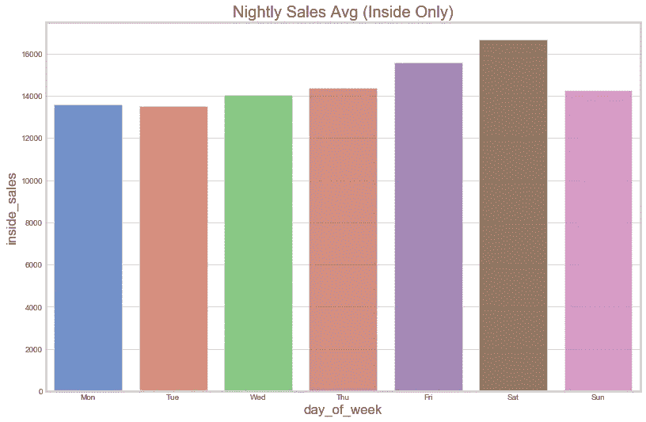
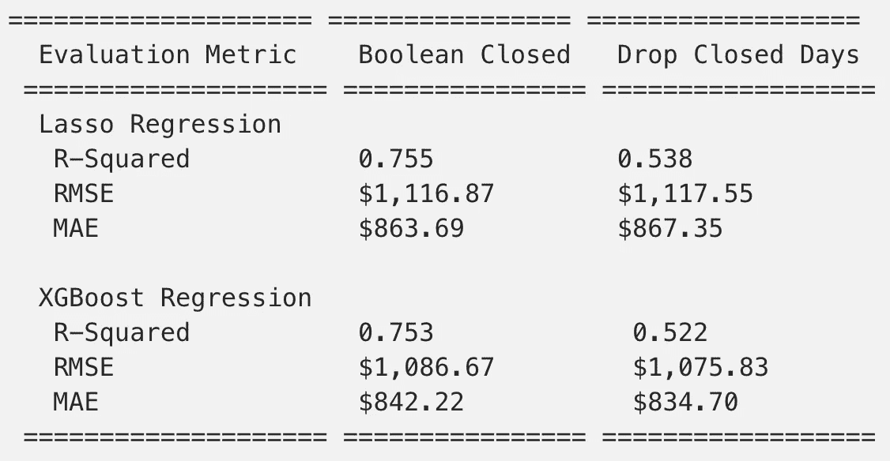
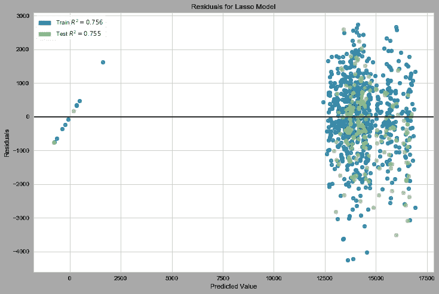
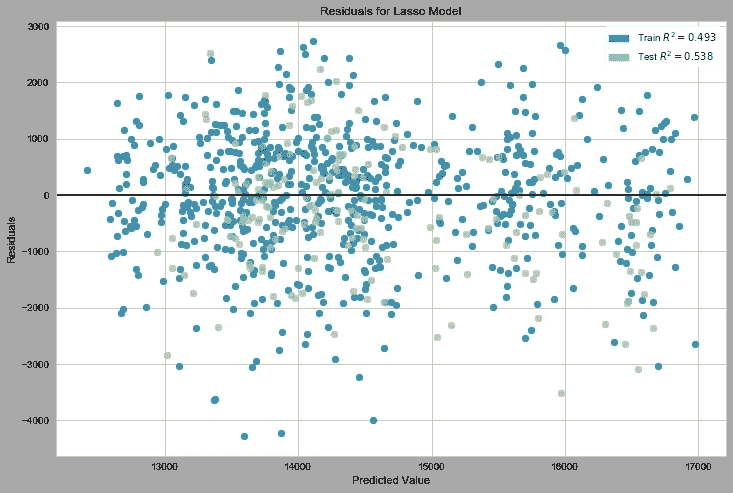
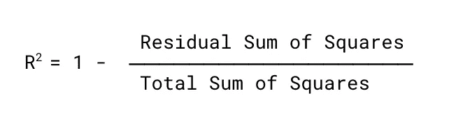

# 拆包 R

> 原文：<https://towardsdatascience.com/unpacking-r%C2%B2-a2a2ffcd27db?source=collection_archive---------30----------------------->

## R 是评估线性回归模型的常用统计量，但正如我发现的，它很容易被误用。

数据科学是一个迭代的过程，对于新从业者来说尤其如此。我们可能在一个项目上花费数周时间，结果却发现了分析中的一个根本性缺陷。这篇文章探讨了我在一个项目中犯的一个基本错误，并解释了它是如何发生的以及它为什么重要。

我的[顶点项目](https://github.com/maks-p/restaurant_sales_forecasting)是一个预测分析工具，它利用历史销售数据和天气数据来预测布鲁克林一家获奖餐厅的每夜和每周销售额。历史销售数据直接来自餐馆的销售点系统(实际上是两个独立的系统，必须进行汇总)，虽然该项目相当简单，但某些元素确实存在挑战。节假日、闭馆日、只在季节性开放的室外座位以及可能会意外关闭的座位、房间租赁费、不准确的客人数数据以及特殊事件都必须得到适当的理解和处理。

我不得不做出的一个决定是如何处理节假日/休市日，此时销售额为 0 美元。我考虑了两个选项:(1)包含一个编码的布尔“关闭”特性，或者(2)从数据集中完全删除关闭的日子(第三个选项是将这些日子视为异常值——稍后将详细介绍)。当我试验这两个选项时，我注意到无论我使用哪一个回归模型，R 值都会根据我如何处理关闭的日子而显著变化。

我最终使用了布尔“关闭”特性，因为它导致了更高的 R 值，但这个决定从来没有真正让我满意过。这篇文章的目的是重温那个决定，并理解为什么我最初的决定是错误的。

# **设置**

为了提供一些背景信息，下图显示了餐厅的餐厅、酒吧和私人餐厅区域的夜间平均销售额，不包括外部区域。



Nightly Average Sales, Jan-2017 — June-2019

这家餐厅在 2017 年 1 月至 2019 年 6 月期间的平均室内销售额为 14，575 美元，标准差为 1，832 美元(我应该注意，这是一家特别成功的餐厅)。

# 比较方法

下表显示了处理关闭天数的两个选项之间的三个不同评估指标的差异——除了 R、[均方根误差](https://en.wikipedia.org/wiki/Root-mean-square_deviation) (RMSE)和[平均绝对误差](https://en.wikipedia.org/wiki/Mean_absolute_error) (MAE):



因此，虽然 RMSE 和梅保持了相当的一致性，但当我删除休市日的观察数据时，R 显著下降。这是为什么呢？是时候打开包装，更好地了解发生了什么。

在我们继续之前，看看这两种情况下的残差是有益的，这将为这里发生的事情提供一些直觉:

**具有编码的布尔闭合特征的残差:**



**剔除休市天数后的残差:**



# 稀有

r 表示因变量(目标变量，在本例中为销售额)的总变化的比例，该比例由自变量(我们的特征变量，如星期几、月份、销售趋势和温度)的变化来解释。

建模环境中 R 的一个最简单的表达式如下:



[残差平方和](https://en.wikipedia.org/wiki/Residual_sum_of_squares)是误差平方和——实际数据点和估计模型预测的数据点之间的差异。[总平方和](https://en.wikipedia.org/wiki/Total_sum_of_squares)代表每个目标观测值与所有目标观测值平均值的偏差总和。

计算 R 的代码如下所示(y_hat 是预测的目标变量——这个特定的代码块计算测试集的 R):

```
sum_squares_residual = sum((y_test - y_hat)**2)
sum_squares_total = sum((y_test - np.mean(y_test))**2)r_squared = 1 - (float(sum_squares_residual))/sum_squares_total
```

我们开始明白为什么包括休市天数是一个错误，但是让我们在计算中采取下一步来真正理解它:

```
Boolean Closed Feature:sum_squares_residual: 225_779_046
sum_squares_total: 921_523_793sum_squares_residual / sum_squares_total = 0.245
r-squared = 0.755Dropped Closed Days:sum_squares_residual: 223_557_101
sum_squares_total: 484_108_603sum_squares_residual / sum_squares_total = 0.46
r-square = 0.538
```

看分母的区别！当关闭的天数减少时，RSS 实际上更低，这应该表示更高的 R，但是分母(TSS)明显更低，导致更高的 RSS / TSS 比率(从而更低的 R)。

这是怎么回事？

由于我包括了封闭日的数据点**，并且明确地将它们从我的异常值调整**中排除，对于数据集中 12 个封闭数据点中的每一个，R 公式从＄14，575(整个数据集的平均值—实际上训练 R 使用训练平均值，测试 R 使用测试平均值)中减去＄0，**，然后对结果**求平方(＄14，575 是＄212，430，625！).**这是一个完全人为构建的方差，没有必要包含在内，但确实有提高我的 R 值的副作用。**休市日不代表自然差异——我们知道为什么这些日子的销售额为 0 美元，并且实际上可以 100%准确地预测这些日子的销售额为 0 美元。它们应该被扔掉。

# 课程

我的第一个错误是不恰当地处理关闭的日子——将它们从数据集中删除会更有意义。当我深入研究 R 时，我还意识到均方根误差或平均绝对误差可能是这种特定应用的更好的模型评估指标(当您阅读本文时，我的项目将会反映出这一点)。如果你真的想探究为什么 R 是一个有缺陷的度量，原因有很多，请看这些来自卡耐基梅隆大学的科斯马·沙立兹的[课堂笔记](http://www.stat.cmu.edu/~cshalizi/mreg/15/lectures/10/lecture-10.pdf)。

这个练习还进一步说明了正确处理异常值的重要性——如果没有正确地考虑这些异常值，机器学习所基于的许多统计假设就根本不起作用。这些封闭的日子实际上是离群值——为他们设计一个功能是错误的方法。

最后，也是最重要和最明显的，这就是为什么**理解统计学和底层数学对数据科学如此重要。**这是我犯的一个简单的错误，考虑到我在这个领域刚刚起步，理论上是可以原谅的，但也很有教育意义。没有人一夜之间成为专家，当事情看起来不对劲时，你可以从探究原因中学到很多，而不只是假设你的模型知道得最好。