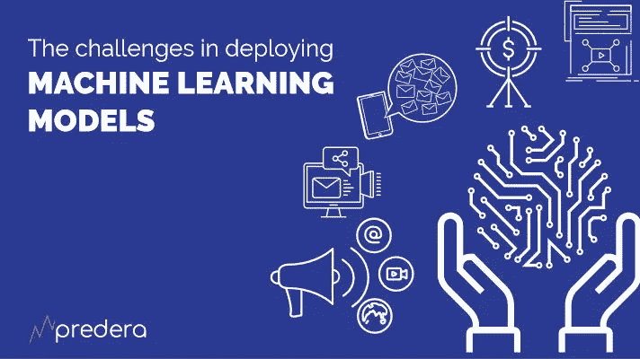
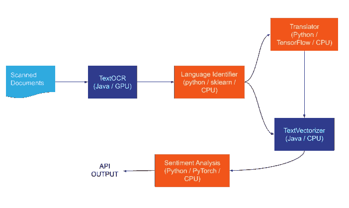
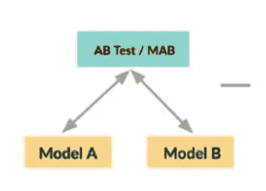
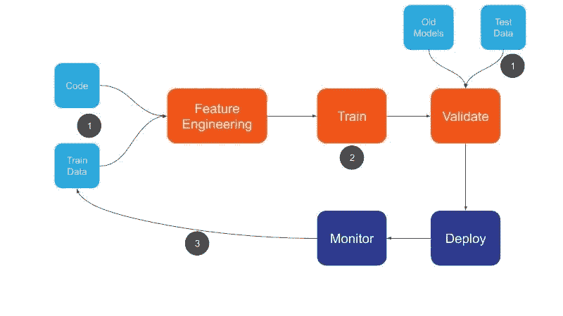

# 解开机器学习部署的复杂性

> 原文：<https://towardsdatascience.com/unpacking-the-complexity-of-machine-learning-deployments-fbc3affc5e7a?source=collection_archive---------40----------------------->

大规模部署和维护机器学习模型是当今组织面临的最紧迫的挑战之一。包括训练、构建和部署机器学习模型的机器学习工作流可能是一个漫长的过程，沿途有许多路障。许多数据科学项目无法投入生产，因为挑战会减缓或停止整个过程。为了克服模型部署的挑战，我们需要识别问题并了解导致问题的原因。当试图将机器学习模型投入生产时，组织面临的一些最大挑战是:

# 机器学习需要异质性

端到端的 ML 应用通常由用不同的编程语言编写的组件组成。根据用例的不同，数据科学家可能会选择 Python、R、Scala 或其他语言来构建一个模型，然后选择另一种语言来构建第二个模型。在一种给定的语言中，有许多可用的框架和工具包。TensorFlow、PyTorch 和 Scikit——学习 Python 的所有工作，但是每一个都针对特定类型的操作进行了调整，并且每一个都输出稍微不同类型的模型。对于数据预处理，基于 JVM 的系统，比如 Apache Spark，通常是首选的，因为这种语言中的静态类型可以更好地支持并行执行。这种异构代码库通常很难保持一致。

框架和工具包的**多样性**使数据科学家能够选择最适合手头问题的语言和工具。然而，他们选择的每个新工具和语言都必须由 IT 团队来启用和处理。容器化技术，比如 Docker，可以解决大量工具带来的不兼容性和可移植性问题。然而，自动依赖检查、错误检查、测试和构建工具将不能跨越语言障碍解决问题。

**再现性**在这些场景中也是一个挑战。数据科学家可以构建模型的许多版本，每个版本使用不同的编程语言、库或同一库的不同版本。很难手动跟踪这些依赖关系。为了解决这些挑战，需要一个 ML 生命周期工具，它可以在训练阶段自动跟踪和记录这些依赖关系，作为代码配置，然后将它们与训练好的模型捆绑在一个准备部署的工件中。

# ML 部署不是独立的

机器学习模型部署不是独立的解决方案。它们通常嵌入或集成到业务应用程序中。通过将模型包装成 REST API 来部署模型是以一种语言无关的方式与业务应用程序集成的最简单的解决方案。

这种方法与微服务架构配合得很好，并且能够单独更新或扩展机器学习模型组件。创建 REST APIs 很容易，因为大多数框架都提供了开箱即用的功能，但有时需要将模型部署为**gRPC API**以实现高效的网络使用和更好的性能，尤其是当输入(图像、视频、文本)的大小很大时。

随着**边缘设备**(手机、物联网等)在计算和存储方面变得越来越强大，直接在这些设备上部署和运行模型的趋势越来越明显。然而，这种情况下的模型仍然需要针对 CPU 和内存使用进行**优化**。在大多数情况下，模型被嵌入到在这些设备上运行的应用程序中，因此出现了**运行时兼容性和可移植性**的挑战。这里的挑战是采用在任何编程语言/库中训练的模型，并优化和导出它以匹配运行时语言和边缘设备的版本。

除了 REST/gRPC API 之外，一种广泛使用的集成不同组件的方法是使用消息传递系统。打包和部署能够与**消息传递系统**集成的模型的能力可以避免大量样板代码并简化部署。

在某些情况下，项目约束和合规性要求决定了部署需求，例如，转换使用 python 库训练的模型，并将其部署到支持 C++运行时的 Azure **机密计算**环境。

# ML 模型定义的复杂性

什么是机器学习模型？是否只有训练后获得的模型参数(例如，逻辑回归模型的权重)？它还需要包括对模型正确工作很重要的特征转换吗？许多库将特性转换和实际的 ML 模型结合在一个抽象中，通常被称为 **ML 管道**。从系统的角度来看，模型可以被认为是一个定义了输入和输出的“黑盒”,或者可以被认为是具有已知语义的操作的组合。模型可以是模型的组合(例如，**集合**，其中来自不同语言或库的模型被组合，或者其中一个模型的输出是另一个模型的输入)。

面向服务的架构和**微服务**已经将应用程序从单一代码转移到更加可组合和可管理的组件上。机器学习甚至更具可组合性，因为它的构建块更加粒度化和分散化。在现实世界的应用程序中，ML 模型是作为单个单元或多个组件来部署和管理的，每个组件都是单独管理和更新的。

例如，一家公关公司希望识别批评其客户的新闻和报道，可以使用以下渠道:

*   使用光学字符识别(OCR)模型从扫描的文档流中提取文本
*   使用语言识别模型识别该文本的语言
*   将非英语文本翻译成英语
*   为情感准备课文

**Figure:** An ML pipeline that extracts text from scanned documents and analyzes the sentiment of OCR’ed text.

在每种情况下，模型都可能使用不同的语言和工具集来开发。

# 测试和验证困难重重

模型随着数据的变化、方法的改进或软件依赖性的改变而不断发展。每次发生这种变化时，都必须重新验证模型性能。这些验证引入了几个挑战和陷阱:

*   必须使用相同的测试和验证数据集来评估模型，以便能够比较不同 ML 模型的性能。
*   为了能够保证可比性，必须在不同的时间和不同的模型中使用相同的评估指标的代码。
*   测试/验证数据集或代码的更新需要重新评估不同的 ML 模型(包括旧的和新的),以便进行比较。这在 CI/CD 管道中引入了独特的挑战，使在生产中自动训练和部署 ML 模型的新版本的过程变得复杂。
*   新模型的改进可能是有代价的，例如更长的预测时间。为了识别这样的影响，基准测试和负载/压力测试必须是验证和决策过程的一部分。

除了在离线测试中验证模型之外，评估模型在生产中的性能也是至关重要的。这将在部署策略和监控小节中讨论。

# 复杂的发布策略

像今天部署的任何软件应用程序一样，ML 模型的发布并没有以任何方式降低复杂性。ML 模型需要比常规软件应用更频繁地更新。

ML 的发布策略和部署基础设施必须考虑异构因素，以及一个模型可能包含多个组件的事实，每个组件都使用不同的编程语言或 ML 框架构建。这些组件中的每一个都可能需要单独或作为一个单元进行更新或回滚。此外，为了从 ML 模型中获得最佳 ROI，能够尽可能快地重复部署模型是很重要的。

在“影子模式”中启动新模型(即，在生产中捕获输入和预测，而不实际服务于这些预测)有助于发现运营问题，对模型进行冒烟测试并分析结果，而不会对最终用户产生任何影响。

**A/B 或 bandit test** 模式需要在生产环境中比较模型性能，并分析对用户体验和 ROI 的影响。然而，在反馈循环长且间接的情况下，这可能是相当具有挑战性的。还应考虑接受人类输入和随机检查的能力。在可用的标记数据较少且错误成本过高的情况下，这是特别需要的。

**Figure:** Example Runtime Model Graph

# CI/CD:一堆不同的管道

软件开发人员使用持续集成(CI)和持续部署(CD)工具已经变得非常普遍。CI/CD 工具正在帮助开发团队将快速准确的更新推向生产。CI/CD 工具的其他好处是可靠性、可再现性、速度、安全性和版本控制。

大多数 CI/CD 工具支持众所周知的软件开发工作流，包括构建、测试和部署步骤。机器学习工作流表现出在传统开发工作流中观察不到的独特特征。

**Figure:** Machine Learning Workflow

传统应用程序和 ML 模型之间最显著的区别是，主要输入不仅仅是代码。相反，有两个同样重要的输入组件:代码和数据。必须对这两个输入应用版本控制，以实现可再现性和可审计性。还必须监控数据和代码的任何变化，然后自动触发工作流。这可能不是小事，尤其是考虑到数据管理的复杂性。正如在模型验证中所讨论的，测试/验证数据的变化需要重新训练和/或重新验证模型。构建 ML 工作流时，必须考虑这一需求。

传统应用程序开发的硬件和软件依赖通常是同质的。在机器学习的情况下，工作流程的每个阶段可能需要特定的硬件和软件组件。培训阶段通常是漫长而密集的计算阶段。一些工作负载可能需要 GPU 等硬件加速器的可用性。用于 ML 工作流的 CI/CD 工具应该能够按需提供这种依赖性。

# 没有监控的 ML 是一场噩梦

监控工具不断发展，以支持当今的云原生分布式容器化应用。监视现在被可观察性所取代，包括日志、跟踪和度量。然而，这些工具仍然需要进一步发展以支持机器学习。

## 范围扩大

监测范围一直在扩大，以支持更多的利益攸关方。当今大多数监控工具不仅帮助开发人员主动监控系统，还帮助开发人员调试和理解问题。

在机器学习的情况下，监测的范围进一步扩大，包括数据科学家和企业主。监控工具需要帮助这些新的涉众了解模型在生产中的表现，并理解其输出。机器学习要监控的指标、要记录的信息、合规性需求和审计要求与常规应用非常不同。在下面的章节中会有更多的介绍。

## 复杂性增加

正如以上章节所讨论的，ML 是异构的。对于单个编程语言或框架来说，标准化和监控部署管道是很容易的。这样做来支持不同的编程语言和框架是耗时、易错和复杂的。鉴于 ML 模型可以由其他模型和组件组成的事实，能够单独跟踪这些组件并能够将问题缩小到其中一个是非常重要的。采用具有容器、服务网格和不可变基础设施的微服务架构是处理和标准化具有异构性的复杂 ML 模型部署的伟大技术。然而，这些工具不容易配置和维护。将这些付诸实践需要专门的团队。

## 硬件加速器

像 TensorFlow、PyTorch、Theanos 等 ML 框架支持使用图形处理单元(GPU)来提高计算速度。Google 提供了 Tensorflow 处理单元(TPU ),它提供了超过 GPU 的加速。英特尔最近发布了用于大规模深度学习训练和推理的神经网络处理器(NNP)。

这些硬件加速器价格昂贵，应监控其使用情况，并根据成本效益进行优化。大多数监控工具不提供这种现成的监控功能，并且需要设置额外的工具/插件。

## ML 特定指标

ML 性能更加多维，集成了几种不同的度量标准。

*   **准确性:**根据反馈和收到的实际数据，模型的预测能力如何
*   **数据漂移:**训练的漂移计算&实际反馈差异(输出)、训练/运行时数据差异的漂移计算(输入)和跨特征相关性的漂移计算
*   **偏差:**输入与输出的计算(训练与实际)
*   **异常:**检测并记录所有异常输入
*   **可解释性:每个预测的主要特征的**

# 结论

机器学习仍处于早期阶段。软件和硬件组件都在不断发展，以满足 ML 的当前需求。它们正以更快的速度发展，但是操作它们所需的工具还没有跟上。

Docker/Kubernetes 和微服务架构可以用来解决异构性和基础设施挑战。Comet 和 MLflow 正试图解决实验版本和再现性问题。SageMaker、Azure ML、Google AI 等云平台服务迎合了可扩展部署的需求。现有的工具可以单独部分解决一些问题。今天最大的挑战是将所有这些工具结合起来操作 ML。大多数情况下，这可能不切实际，尤其是在企业和受监管的行业中。

随着现有工具的发展和新工具的引入来解决这些挑战，人们应该考虑到这样一个事实，即数据科学社区主要由具有学术和研究背景的个人组成。操作 ML 的工具必须足够简单，能够被这些用户使用，同时能够解决 ML 的复杂挑战。