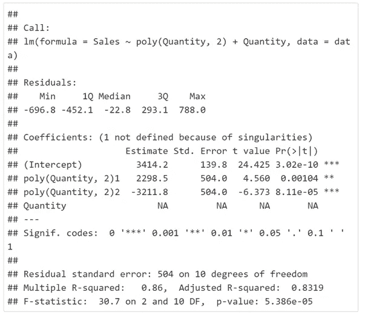

# R 中的解开样条回归

> 原文：<https://towardsdatascience.com/unraveling-spline-regression-in-r-937626bc3d96?source=collection_archive---------6----------------------->


(image by author)

当我们谈论回归时，首先想到的是线性或逻辑回归，以及遥远的多项式回归。线性回归和逻辑回归是两种最流行的回归方法。然而，有许多不同类型的回归方法可以证明在不同的情况下是有用的。今天我们将看看使用阶梯函数的样条回归。

样条回归是一种非参数回归技术。这种回归技术将数据集分成间隔或称为结的点的箱，每个箱有其单独的拟合。让我们看看在 r 中使用阶跃函数的样条回归的一个简单实现。

可视化数据集:

```
Quantity <- c(25,39,45,57,70,85,89,100,110,124,137,150,177)
Sales <- c(1000,1250,2600,3000,3500,4500,5000,4700,4405,4000,3730,3400,3300)
data <- data.frame(Quantity,Sales)
data
```


Quantity Vs Sales Data

```
**library**(plotly)plot_ly(data,x=~Quantity,
        y=~Sales,
        type="scatter"
)
```


Quantity Vs Sales Plot

让我们拟合一个线性回归，看看它是如何工作的:

```
fit <- lm(Sales ~ Quantity, data=data)
summary(fit)
```


```
plot_ly(data,x=~Quantity,
        y=~Sales,
        type="scatter") %>% add_lines(x =  ~Quantity, y = fitted(fit))
```


这里的等式采用以下形式:


在这种情况下:


我们可以看到，在这种情况下，线性回归产生了一个可怕的拟合，从上面的图和 R 平方值可以看出。

现在让我们将一个多项式项(此处为二次项)引入方程，并分析模型的性能。

```
fit2 <- lm(Sales ~ poly(Quantity,2) + Quantity, data=data)
summary(fit2)
```



```
plot_ly(data,x=~Quantity,
        y=~Sales,
        type="scatter") %>% add_lines(x =  ~Quantity, y = fitted(fit2))
```


这里的等式采用以下形式:


在这种情况下:


我们可以看到，这不是一个坏的适合，但也不是一个伟大的。预测的顶点与实际的顶点有些距离。多项式回归也有各种缺点，容易过度拟合。随着功能数量的增加，它会导致复杂性的增加。

样条回归可以克服多项式回归的缺点和线性模型的不足。

让我们通过将数据集分成两个箱来可视化数据集。一个在数量= 89 时出现的峰值的左侧，另一个在右侧，分别如下面两幅图像所示。


现在让我们将上述两幅图像合并成一个方程，并使用阶跃函数进行分段回归或样条回归。

该等式将采用以下形式:


在这种情况下:


这里的 Xbar 称为纽结值。

```
data$Xbar <- ifelse(data$Quantity>89,1,0)
data$diff <- data$Quantity - 89
data$X <- data$diff*data$Xbar

data
```

执行上述操作后，数据将如下所示:


现在让我们拟合上面看到的等式:

下面等式中的 X 是(x-xbar)*Xk

```
reg <- lm(Sales ~ Quantity + X, data = data)

plot_ly(data,x=~Quantity,
        y=~Sales,
        type="scatter") %>% add_lines(x =  ~Quantity, y = fitted(reg))
```


```
summary(reg)
```


从上面的图和 R 平方值可以看出，在这种情况下，样条回归产生了更好的结果。

上述结果也可以在 R:

```
**library**(segmented)

fit_seg <- segmented(fit, seg.Z = ~Quantity, psi = list(Quantity=89))

plot_ly(data,x=~Quantity,
        y=~Sales,
        type="scatter") %>% add_lines(x =  ~Quantity, y = fitted(fit_seg))
```

**注意:**如果不提供断点值(此处数量= 89)，则使用“psi = NA”


```
summary(fit_seg)
```


两种方法产生相同的结果。

这是样条回归的一个简单例子。也可以使用多项式函数来拟合样条，称为多项式样条，因此可以在 X 的单独区域中拟合样条或具有较低次多项式的分段多项式回归，而不是在整个 X 范围内拟合高次多项式。

**选择结的位置和数量**

样条可以通过添加更多的结来建模，从而增加模型的灵活性。一般来说，放置 K 个结导致 K + 1 个函数的拟合。放置结的选择可能取决于各种因素。由于回归在放置更多结的区域非常灵活，因此直观地将结放置在数据变化更多或函数变化更快的地方。看起来相对稳定的区域不需要太多的结，可以使用较少的结。

**结论:**

在本文中，我们学习了使用阶跃函数的样条回归。也可以应用其他类型的多项式函数。常见的一种是三次样条，它使用三阶多项式函数。实现样条的另一种方法是平滑样条。与多项式回归相比，样条曲线通常能提供更好的结果。在样条曲线中，可以通过增加结的数量来增加灵活性，而不增加多项式的次数。一般来说，与多项式回归相比，它们还能产生更稳定的结果。

我希望这篇文章有助于理解样条和分段回归的思想，并开始使用它。

**参考文献:**

[1]Andrew Wheeler 的《回归中的样条》。【http://utdallas.edu/~Andrew.Wheeler/Splines.html 

[2]Shokoufeh Mirza ei 如何开发 R 中的分段线性回归模型。[https://www.youtube.com/watch?v=onfXC1qe7LI](https://www.youtube.com/watch?v=onfXC1qe7LI)

[3]断点分析，分段回归。[https://rpubs.com/MarkusLoew/12164](https://rpubs.com/MarkusLoew/12164)

[4]加雷思·詹姆斯、丹妮拉·威滕、特雷弗·哈斯蒂、罗伯特·蒂布拉尼。《统计学习导论:在 r .纽约的应用》: Springer，2013 年。