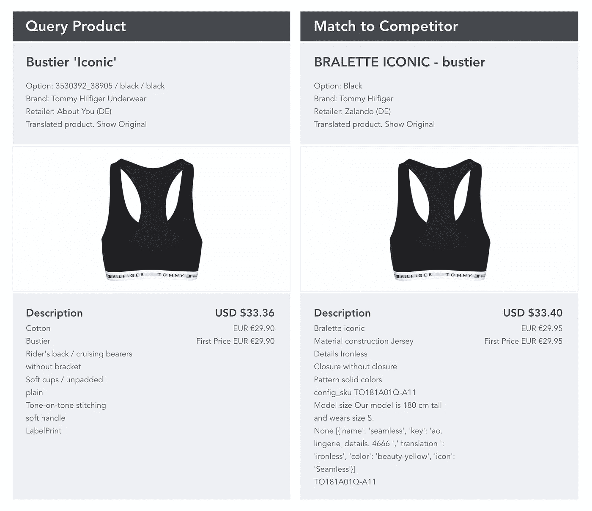

# 用人工智能解开零售中的产品匹配

> 原文：<https://towardsdatascience.com/unravelling-product-matching-with-ai-1a6ef7bd8614?source=collection_archive---------10----------------------->

**TL；博士** : *产品匹配，即对多家零售商出售的同一产品进行匹配的能力，是零售业发展不可或缺的一部分。我们探索一种机器学习方法，通过世界上最大的实时零售数据源提供高准确性和可扩展性。*

产品匹配是零售技术研究的一个重要领域。从 ASOS 和 Zalando 等零售商的角度来看，确保竞争对手之间一致的定价和折扣是一个优先事项，从单一产品层面到整个产品组合重叠。零售商必须在市场上保持竞争力。然而，对零售商不销售或不专门促销的产品的认识也会对利润产生重大影响。零售商独占性(即当没有匹配时)在零售业中可能有利可图。对于任何正在向不同市场扩张或通过多家零售商销售的知名品牌，如耐克和博柏利，很难跟踪产品的价格和所需的描述。品牌希望他们的产品得到统一的展示，零售商可能在这两方面都卖得不够好。

Matching products can have different images, names and descriptions

在[编辑的](https://edited.com/)，我们拥有超过 5 亿个零售产品的数据。这些产品由众多零售商以多种语言和市场销售。它们可以在不同的时间，以不同的品牌(汤米·席尔菲格与汤米·席尔菲格内衣)出售，并带有零售商选择的图像和文字。他们的产品信息范围很广，从详尽的叙述到单个单词描述“服装”或数字标识符。看看上面的例子，基于真实数据，每个产品在名称、描述和图像上都有所不同。在 5 亿的数据集中，这些产品不够独特或相似，不足以使产品匹配成为一项简单的任务。如何才能准确匹配这些产品？更重要的是，如何才能对这些比赛有信心？让我们看看如何以可扩展的方式和高精度实现这一点。

# 每个字节的数据都有帮助

为了了解两种产品是否相同，我们需要尽可能多的产品数据重叠。编辑从零售商网页抓取多个文本字段、图像和元数据(例如抓取时间)。所有这些都被认为是我们模型中的“特征”。例如，一些常见的基于文本的特征包括产品名称、提供的产品描述和产品品牌。

我们需要把这些数据转换成计算机能处理的东西。首先，让我们看看我们基于文本的功能。自然语言处理(NLP)是机器学习的一个子领域，旨在理解计算机如何分析人类语言。一个常见的 NLP 任务是单词嵌入，将单词映射到表示它们的向量，并且存在许多模型来执行该任务。最简单地说，这意味着对文本中的单词进行计数，其中向量的长度相当于词汇表的大小，每个元素代表一个单词。在最复杂的情况下，这可以是对数百万个单词或短语进行训练的模型，以基于训练期间学习的特征产生固定长度的向量，其中单词的表示分布在向量中的几个元素上(例如 [BERT](https://arxiv.org/abs/1810.04805) 和 [XLNet](https://arxiv.org/abs/1906.08237) )。在设计模型基础设施时，必须考虑单词嵌入的复杂性和伸缩能力。

接下来，我们需要重新想象这个过程，这样我们的图像就可以用向量来表示了。这是机器学习研究的一个大领域，被称为计算机视觉。在最基本的情况下，我们可以通过散列函数简单地检查两幅图像是否相同。然而，如果有任何差异，即使在单个像素级别，我们也无法匹配图像。相反，我们使用卷积神经网络(CNN)，这是一种用于我们图像识别的深度学习算法。CNN 在图像上使用移动过滤器来寻找其特征，同时减少需要处理的数据量。在最底层，这些过滤器提取诸如边缘之类的特征。然后，该网络学习如何将这些特征组合起来形成复杂的结构，从而更深入地了解定义产品的组件。然后，它利用这一点来分类产品，例如，作为一个顶部或服装。这些被称为“特征向量”，其中向量的元素对应于从 CNN 学习的特征。

Our model architecture using word embeddings derived from text and feature vectors learned from images

# 绘制世界上最大的实时零售数据集

利用从文本和图像中获得的每个产品的这两个向量，我们可以可视化 EDITED 的数据库中的关系。我们通过使用向量作为高维坐标系统来做到这一点，其中每个元素对应于一个单独轴上的一个坐标。例如，想象一个长度为 2 个元素的向量。这意味着一个元素在 *x* 轴上，另一个元素在 *y-* 轴上，就像一个简单的图表，如上图的散点图所示。扩展到 3 个元素，该图现在有一个 *z-* 轴，并且可以通过 3D 绘图可视化。继续这个过程，直到我们在一个向量中有几百或几千个元素，那么多的维度很难概念化。

这是产品的高维映射，其中彼此靠近的产品将由于它们的特征向量和单词嵌入而共享相似的特征。这转化为我们希望查询的产品与其周围数据点或产品之间的距离，其中距离越短越匹配。折叠到 2D(使用降维技术，如 [SVD](https://en.wikipedia.org/wiki/Singular_value_decomposition) )，我们可以看到下面几个数据点的复杂性。

A 2D representation of mapping for a subset of EDITED data, color-coded by brand

在 EDITED，我们有 5 亿个产品的高维映射！我们称之为“指数”。从存储以及构建和查询索引所花费的时间来看，为一个查询产品检查索引中的每个产品是不现实的。如何才能意识到哪些产品彼此靠近，最关键的是，要快？

进入数据科学的另一个蓬勃发展的领域，近似最近邻居(ANN)，涉及一些世界上最大的科技公司的贡献，包括 Spotify 的[aroy](https://github.com/spotify/annoy)和脸书的 [FAISS](https://github.com/facebookresearch/faiss/) 。这些算法通过猜测产品的最近邻居来平衡准确性和速度。在其核心，人工神经网络随机分裂数据，并重复这一过程，直到一个二叉树结构被创建，其中每一个叶子是每次分裂后的数据子集，分支被用来回忆邻居。通过随机化分裂和创建重复的二叉树，我们获得了最近邻的良好估计。

人工神经网络的最新发展使用了一种类似图形的数据结构，称为[分层可导航小世界图](https://arxiv.org/abs/1603.09320)，它在准确性和速度方面领先于[基准](http://ann-benchmarks.com/)。这里，查询开始遍历索引，其中在每个阶段，针对图的每个节点，记录查询数据点与其邻居之间的距离。基于最小化该距离来选择要遍历的下一个节点，并且再次记录最佳邻居。当满足用户定义的特定标准时，该过程结束，例如要执行的计算次数，返回最近邻居的更好估计。

# 评估评估评估

最后，我们想了解我们的系统性能如何。当我们从高维索引中查询一个产品的邻居时，我们需要检查我们的邻居是否确实匹配，以及我们是否返回了所有可能的匹配。这与 precision(正确的相邻要素的比例)和 recall(返回的匹配要素的比例)相同。除此之外，我们需要匹配和更相关的邻居返回更高的排名，所以对索引有信心。

通过根据与查询产品的距离返回匹配，我们使用了“分级检索”系统。当我们返回大量的邻居(例如 100)时，我们应该能够实现完全召回。

Paul Verhoeven’s Total Recall

然而，我们还想评估无法实现完全召回的查询的准确性。为此，我们将我们的度量修改为“等级为 *k* 的精度”、“正确的 *k* 邻居的比例”和“等级为 *k* 的召回”，在我们的 *k* 邻居中匹配的比例，其中 *k* 是返回的邻居的数量(例如 100)。当我们通过距离过滤我们的邻居时， *k* 将随着每个查询而变化。我们需要确保精度保持在 *k.* 的变化

*Calculating average precision in a ranked retrieval system for a query with four matches*

为此，我们可以计算“平均精度”，这不需要固定的*k。*该方法是可行的——我们迭代通过距离过滤返回的 *k* 个邻居，并且在每次迭代中，如果乘积是匹配的，我们计算该等级的精度。然后，我们使用这些精度值的平均值，如上图所示。这允许我们更严厉地处罚高等级的不匹配，同时也考虑低等级的不匹配。最后，我们计算多个查询的“平均精度”,这是为每个查询计算的平均精度的平均值。这已被证明是 EDITED 的一个宝贵指标，因为它展示了对精确度和召回率的理解，同时优先考虑以用户为中心的功能，如排名。

Ensuring consistent pricing and discounting amongst competitors. These matched products have different names, brands, descriptions and images

Tracking consistency in a brand’s pricing and descriptions across markets and retailers

# 关键要点

我们的模型使用基于文本和图像的特征来创建产品如何相关的高维映射，尽管有不同的描述和图像，也能提供产品匹配。通过使用最新的机器学习进展，我们能够精确、自信地在多个零售商、语言和市场中提取相同的产品，并达到零售业前所未有的规模。

产品匹配是零售业中一个难以应对的挑战，根本原因在于数据的差异和庞大规模。通过在 EDITED 上分享我们的方法，我们希望能够为如何完成这项艰巨的任务提供一些见解。