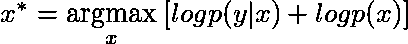
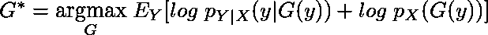

# 无监督对抗图像重建

> 原文：<https://towardsdatascience.com/unsupervised-adversarial-image-reconstruction-4b07ae38541a?source=collection_archive---------22----------------------->

Reconstructing faces from noisy, corrupted images

我最近偶然看到了论文[无监督的对抗性图像重建](https://openreview.net/forum?id=BJg4Z3RqF7)(帕若等人 2019)，并被它迷住了。该文件展示了一种方法来恢复图像从其损坏的副本没有使用任何监督。举个例子，假设你有很多用相机拍摄的图像，但是你在拍摄前只是粗略地清洁了一下镜头，现在你得到的是损坏的图像。您可以使用对抗性图像重建来获得您想要的图像。这不需要任何干净的图像原型供算法使用。很有趣，对吧？这里有一个关于论文中涉及的数学的帖子，可以帮助你更好地理解论文。

# 该配方

像往常一样，让我们假设观察到的数据有潜在的概率分布。具体来说，让

其中 *Y* 是代表受损图像的随机变量，而 *X* 代表我们希望恢复的干净图像。

假设有一个由 *θ* 参数化的贴图 *F* : *X* → *Y* ，它根据参数 *θ* 来破坏图像。这里

可能代表导致损坏的因素，如我们示例中相机镜头上的灰尘。

因此，

在哪里

用于包括附加噪声。

因此，

Equation 1

注意，如果已知 *F* 在 *X* 和 *θ* 中是线性的，等式 1 将与线性回归中看到的等式相同。

我们也可以假设 *θ* 独立于 *X* 。我们的外部失真因素与图像无关。

独立性假设给出了下面的等式。

Equation 2

现在，我们的目标是在给定一个损坏图像(y)的情况下，找到最佳的底层未损坏图像 *x，*。这在数学上可以表示为

Bayes’ rule

注意分母独立于 x，因此我们可以写

我们的目标是优化上面的函数，然而，我们不知道 *p(x)* 长什么样。此外， *log p(y|x)* 涉及边缘化 wrt *θ* ，这不会导致解析形式。

作为实现上述结果的代理，我们将找到从受损图像空间到我们想要恢复的图像空间的**总体**最佳映射(注意期望 wrt y)， *G** 。具体来说，

Equation 3

# 似然项

考虑等式 3 的第一部分。假设要单独优化。

The first term in RHS of Equation 3\. Note that the subscript Y|X has been dropped

相反，让我们尝试优化相关的表达式

这将有助于导出第一个量的分析。

为了将数量化为分析形式，我们将使用许多概率技巧。让我们从思考开始，

根据概率链式法则这是正确的。重新排列并再次使用链式法则，

其中最后一个等式是由于 *θ* 和 *X.* 的独立性。因此，

对 *Y* 和 *θ，*的联合分布取期望 wrt，我们得到

Equation 4

左侧的项与 *θ* 无关，因此

注意到

这里使用等式 2。此外，等式 4 中的最后一项独立于 *x* 。因此，当我们优化 wrt *x.* 时，我们可以忽略它

最后，等式 4 简化为

现在我们可以安全地用 *G(y)* 替换 *x* 得到，

Equation 5

根据等式 1，我们有，

代入等式 5，我们得到，

Equation 6

Model for the likelihood term

# 前一个术语

考虑等式 3 的 RHS 中的另一项，

The second term in RHS of Equation 3

为了理解这个术语的含义，我们必须仔细考虑这篇论文中提到的下面一行

> 最大化 w.r.t .先验项 p(G(y)) …类似于学习映射 G，使得 G(y) …诱导的分布接近分布 P_x。

为了理解上面的陈述，考虑下面的例子。设分布 *P_x* 和 *P_y* 的支撑为集合{1，2，3，4}。让分布由下式给出:

Probability distributions of X and Y

现在我们需要找到一张从 *G* 到 *Y* 到 *X* 的地图，使得上面的数量最大化。当您思考上述问题时，您意识到您必须将图中与高楼对应的 *y 的*映射到与高楼对应的 *x 的*上，以获得数量的高值。因此， *G(y)* 的分布开始看起来与 *X* 的分布相同。上述问题的最优映射 *G** 为

The Map G for the above problem

因此 *G(y)* 的分布与最优情况下的 *X* 相同。

思考先验项的另一种方式是将其与预期条件损失联系起来:

但是上面的方式更直观。

好的，我们现在的目标是匹配两个分布，如果你以前学过甘斯和瓦瑟斯坦甘斯，你会对解决这个问题有一些见解。如果你还没有，看看这个很棒的博客。其思想是 GAN 的生成器试图匹配两个分布，而鉴别器的工作是区分它们。随着时间的推移，你希望发电机赢得比赛，它能够产生样本，鉴别器无法区分。

Model for the prior term

# 把它放在一起

上述思想的结合方式如下。你从观察损坏的图像开始， *y.* 你要求生成器产生未损坏的版本， *x.* 你从它的分布中取样 *θ* 。现在你用 *y_hat = F(x，θ)，*构造 *y_hat，*忽略加性高斯噪声。保持发电机固定，训练鉴别器区分 *y_hat* 和 *y.* 用于更新鉴别器的损失函数为

Discriminator loss

要求鉴别器将 *D(y)推至 1* 并将 *D(y_hat)推至 0。*

使用也包含似然项的损失函数来更新生成器。具体来说，它由下式给出

Generator loss.

其中λ是控制给予 *MSE 的重要性的参数。*发生器试图将 *D(y_hat)的值推至 1。*

The Entire Model

封装上述思想的算法由下式给出:

因此，我们已经理解了以无监督的方式获得图像重建的过程。

我希望你喜欢阅读这篇文章。我很想在下面的部分听到你的评论。干杯！