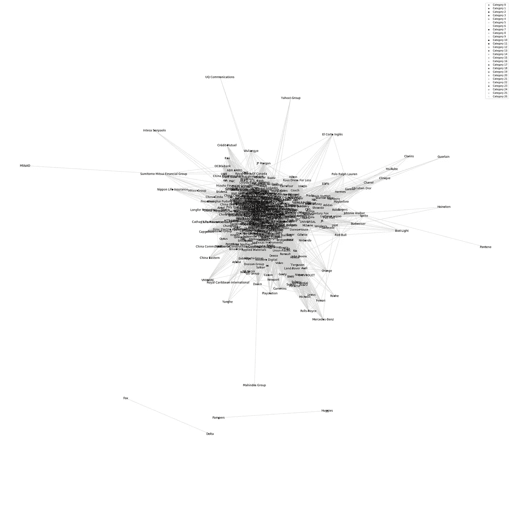
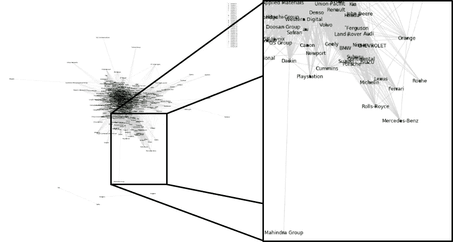
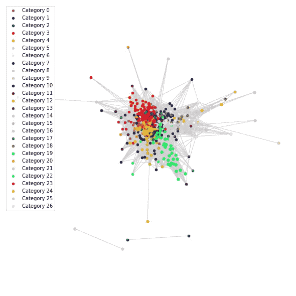
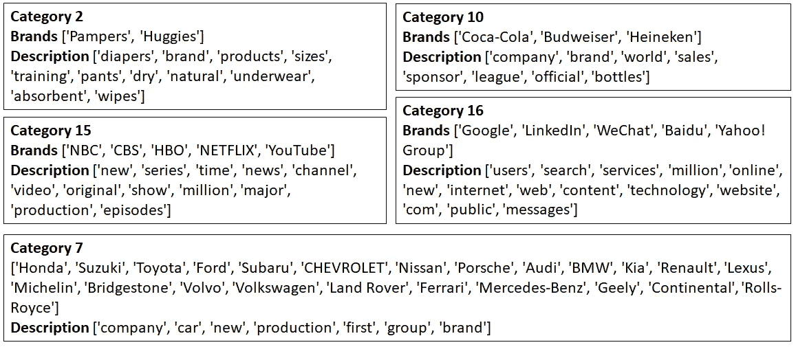

# 无监督的品牌分类

> 原文：<https://towardsdatascience.com/unsupervised-brand-categorization-15170928ea1b?source=collection_archive---------20----------------------->

## 使用人工智能根据品牌的历史对其进行分类

存在 100-1000 个品牌和公司，属于不同的行业和公司。如今，这些都是根据各种行业分类方案(如 NAICS、SIC、NIC 等)手动分类和分组的。这些方案是预先确定的，并不反映企业或品牌不断变化的性质。

使用“代码+人工智能”驱动的机器，我们能否在品牌/公司的旅程中创建一个更动态的分类基础？

这里有一个演示的地面零方法。关键是不要期望用户以“无监督”的机器学习方式提供关键词或分类法。我们在大约 500 个品牌名称上运行机器。对于每个品牌，它们的历程、历史和细节都是从维基百科中有计划地挑选出来的。维基百科是互联网上的事实真相。

然后，这些内容被矢量化。矢量化意味着根据上下文(周围的单词和句子)理解文本文档中的每个单词。这将导致一个品牌的旅程被封装成一个数学向量。然后它变得有利于分组。下面是表示为这些品牌的网络的向量空间。(注意:此处看不到品牌名称，但稍后会显示缩小部分)

每个节点是一个品牌名称，边代表“旅程/历史向量”之间的交叉程度。把它想成是两个品牌的旅程中常见的东西。对 500 个品牌中的每一个进行比较。

历史/内容/历程相似的品牌更接近。下图显示了向量空间的缩小部分。人们可以看到机器自动识别汽车品牌。

这些向量然后被数学地分组到许多类似于行业分类的类别中。下图显示了 27 个类别

**我们能自动命名这些类别吗？**

类别内的旅程向量空间的交集减去跨类别的旅程向量空间的交集将提供独特的类别级洞察。基本上，它将告诉我们哪些因素在一个集群中是共同的，但与其他因素不同。下面是机器自动生成的几个例子。

它按照传统的分类方法对某些品牌进行分类，如尿布品牌，但有趣的是，它提供了新的见解，如可口可乐在第 10 类中是全球主要赞助商的饮料品牌。一种不同的方式来看待品牌的地位。

分类的层次可以更深，尤其是在发现更多品牌组合和需要更多洞察力的情况下。下面是一个特定类别的子分类示例，该类别包含各种设备制造商品牌。

苹果拥有世界上最大的安全移动消费者网络之一。用传统的方法，我们永远不会认为苹果是一个可以与 Hauwei 和 Broadcom 相提并论的品牌。

**这种分类的动态性如何？**

人们可以选择内容的不同部分来达到不同的类别。例如，只有维基百科的“历史”部分可以比较历史旅程，而“产品”部分可以根据产品进行分类。另一种方法是改变内容源本身。例如，如何从客户的角度对品牌进行分类，将要求内容是客户的反馈。下面是一个使用客户反馈显示为品牌网络的示例手机，可以按照本文所示进一步分类。

这项工作可以经常重复，以保持分类的更新，并反映品牌认知或公司业务的任何变化。

传统的人工分类方法无法提供人工智能机器创造的分类所能提供的动力。在公司分析、收益分析、品牌映射、专利分析、研究等方面，我们是否进入了一个新的分类时代？