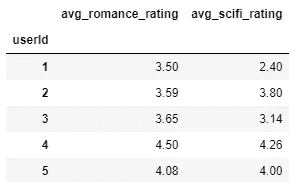
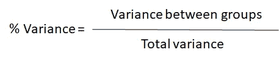
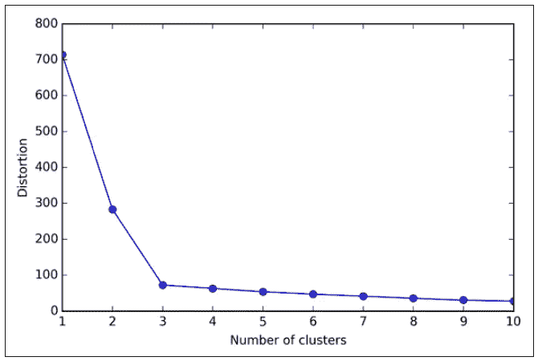
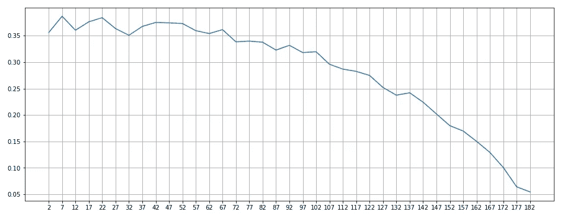
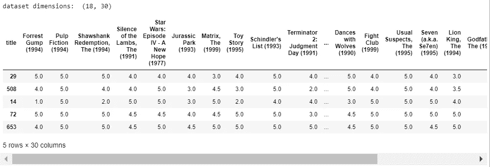
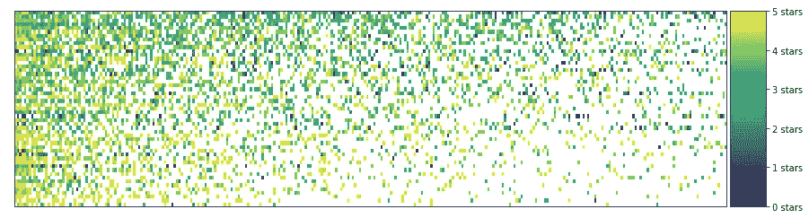
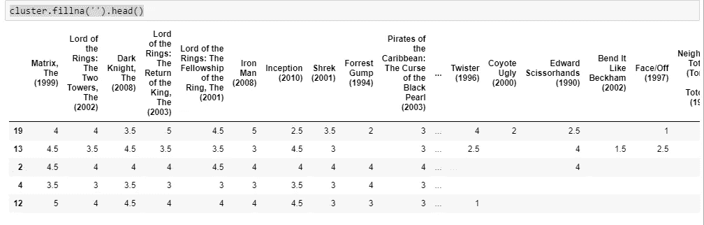

# 无监督分类项目:用聚类分析和 K-Means 构建一个电影推荐器

> 原文：<https://towardsdatascience.com/unsupervised-classification-project-building-a-movie-recommender-with-clustering-analysis-and-4bab0738efe6?source=collection_archive---------2----------------------->


Picture from [Unsplash](https://unsplash.com/photos/95YRwf6CNw8)

# 介绍

这个项目的目标是找出人群中的相似之处，以便为用户建立一个电影推荐系统。我们将分析网飞数据库中的一个数据集，根据人们对电影的评价来探索人们在电影品味上的共同特征。

数据将来自 [MovieLens](https://movielens.org/) [用户评分数据集](https://grouplens.org/datasets/movielens/)。

# 数据集概述

该数据集有两个文件，我们将导入这两个文件并使用它们。

```
**# Import Libraries**
import pandas as pd
import matplotlib.pyplot as plt
import numpy as np
from scipy.sparse import csr_matrix
from mpl_toolkits.axes_grid1 import make_axes_locatable
from sklearn.cluster import KMeans
from sklearn.metrics import mean_squared_error
import itertools
from sklearn.metrics import silhouette_samples, silhouette_score%matplotlib inline**# Import the Movies dataset**
movies = pd.read_csv('ml-latest-small/movies.csv')
movies.head()
```


```
**# Import the ratings dataset**
ratings = pd.read_csv('ml-latest-small/ratings.csv')
ratings.head()
```


我们希望了解数据集的结构是如何工作的，以及在每个表中有多少条记录。

```
**# Print the number of records and the total number of movies**
print('The dataset contains: ', len(ratings), ' ratings of ', len(movies), ' movies.')
```


# 浪漫与科幻

我们将从考虑用户子集开始，发现他们最喜欢的类型。我们将通过定义一个函数来计算每个用户对所有科幻和爱情电影的平均评分。

```
**# Function to get the genre ratings**
def get_genre_ratings(ratings, movies, genres, column_names):
    genre_ratings = pd.DataFrame()
    for genre in genres:        
        genre_movies = movies[movies['genres'].str.contains(genre) ]
        avg_genre_votes_per_user = ratings[ratings['movieId'].isin(genre_movies['movieId'])].loc[:, ['userId', 'rating']].groupby(['userId'])['rating'].mean().round(2)

        genre_ratings = pd.concat([genre_ratings, avg_genre_votes_per_user], axis=1)

    genre_ratings.columns = column_names
    return genre_ratings**# Calculate the average rating of romance and scifi movies**
genre_ratings = get_genre_ratings(ratings, movies, ['Romance', 'Sci-Fi'], ['avg_romance_rating', 'avg_scifi_rating'])
genre_ratings.head()
```



为了有一个更明确的人群子集来研究，我们将偏向我们的分组，只从那些喜欢浪漫或科幻电影的用户那里获得评级。

```
**# Function to get the biased dataset**
def bias_genre_rating_dataset(genre_ratings, score_limit_1, score_limit_2):
    biased_dataset =    genre_ratings[((genre_ratings['avg_romance_rating'] < score_limit_1 - 0.2) & (genre_ratings['avg_scifi_rating'] > score_limit_2)) | ((genre_ratings['avg_scifi_rating'] < score_limit_1) & (genre_ratings['avg_romance_rating'] > score_limit_2))]
    biased_dataset = pd.concat([biased_dataset[:300], genre_ratings[:2]])
    biased_dataset = pd.DataFrame(biased_dataset.to_records()) return biased_dataset**# Bias the dataset**
biased_dataset = bias_genre_rating_dataset(genre_ratings, 3.2, 2.5)**# Printing the resulting number of records & the head of the dataset**
print( "Number of records: ", len(biased_dataset))
biased_dataset.head()
```


我们可以看到有 183 个记录，每一个都有一个浪漫和科幻电影分级。

现在，我们将进行一些可视化分析，以便更好地了解有偏差数据集及其特征。

```
**# Defining the scatterplot drawing function**
def draw_scatterplot(x_data, x_label, y_data, y_label):
    fig = plt.figure(figsize=(8,8))
    ax = fig.add_subplot(111) plt.xlim(0, 5)
    plt.ylim(0, 5)
    ax.set_xlabel(x_label)
    ax.set_ylabel(y_label)
    ax.scatter(x_data, y_data, s=30)**# Plot the scatterplot**
draw_scatterplot(biased_dataset['avg_scifi_rating'],'Avg scifi rating', biased_dataset['avg_romance_rating'], 'Avg romance rating')
```


我们之前制造的偏见现在已经非常清楚了。我们将通过应用 K-Means 把样本分成两个不同的组来进行下一步。

```
**# Let's turn our dataset into a list**
X = biased_dataset[['avg_scifi_rating','avg_romance_rating']].values**# Import KMeans**
from sklearn.cluster import KMeans**# Create an instance of KMeans to find two clusters**
kmeans_1 = KMeans(n_clusters=2)**# Use fit_predict to cluster the dataset**
predictions = kmeans_1.fit_predict(X)**# Defining the cluster plotting function**
def draw_clusters(biased_dataset, predictions, cmap='viridis'):
    fig = plt.figure(figsize=(8,8))
    ax = fig.add_subplot(111)
    plt.xlim(0, 5)
    plt.ylim(0, 5)
    ax.set_xlabel('Avg scifi rating')
    ax.set_ylabel('Avg romance rating')clustered = pd.concat([biased_dataset.reset_index(), pd.DataFrame({'group':predictions})], axis=1)
    plt.scatter(clustered['avg_scifi_rating'], clustered['avg_romance_rating'], c=clustered['group'], s=20, cmap=cmap)**# Plot**
draw_clusters(biased_dataset, predictions)
```


很明显，分组逻辑是基于每个人对爱情电影的评价。对爱情电影平均评分为 3 分或更高的人将属于一组，平均评分低于 3 分的人将属于另一组。

现在我们来看看如果我们将数据集分成三组会发生什么。

```
**# Create an instance of KMeans to find three clusters**
kmeans_2 = KMeans(n_clusters=3)**# Use fit_predict to cluster the dataset**
predictions_2 = kmeans_2.fit_predict(X)**# Plot**
draw_clusters(biased_dataset, predictions_2)
```


现在很明显，科幻小说的评级已经开始发挥作用:

*   喜欢科幻和浪漫的人属于黄色群体。
*   喜欢科幻但不喜欢浪漫的人属于绿色群体。
*   喜欢浪漫但不喜欢科幻的人属于紫色群体。

让我们看看如果我们添加另一个组会发生什么。

```
**# Create an instance of KMeans to find three clusters**
kmeans_3 = KMeans(n_clusters=4)**# Use fit_predict to cluster the dataset**
predictions_3 = kmeans_3.fit_predict(X)**# Plot**
draw_clusters(biased_dataset, predictions_3)
```


从这个分析中，我们可以认识到，我们把数据集分成的组越多，属于每个组的人的偏好就越相似。

# 选择正确的 K 个集群

正如我们在文章[“无监督机器学习:聚类分析”](/unsupervised-machine-learning-clustering-analysis-d40f2b34ae7e)中讨论的:

> 选择正确的聚类数是 K-Means 算法的关键点之一。有一些方法可以找到这个数字:
> 
> 领域知识
> 
> 商业决策
> 
> 肘法
> 
> 由于与数据科学的动机和性质一致，肘方法是首选方法，因为它依赖数据支持的分析方法来做出决策。
> 
> **肘法**
> 
> 肘方法用于确定数据集中聚类的正确数量。它的工作原理是绘制 K 的递增值与使用该 K 时获得的总误差的关系图。



> 目标是找到对于每个聚类不会显著增加方差的 k



> 在这种情况下，我们将选择弯头所在的 k=3。

为了更好地理解这种方法，当我们谈到方差时，我们指的是误差。计算该误差的方法之一是:

*   首先，减去从每个聚类的每个点到其相应组的质心的欧几里德距离。
*   然后，平方这个值(去掉负项)。
*   最后，将所有这些值相加，获得总误差。

所以，现在我们想为我们的数据集找出正确的聚类数。为此，我们将对 Kl 的所有可能值执行肘方法，Kl 的范围将在 1 和我们的数据集的所有元素之间。这样，我们将考虑极端情况下的每一种可能性:

*   如果 K = 1，则所有的点只属于一个群。
*   如果 K =所有数据点，每个数据点是一个单独的组。

```
**# Selecting our dataset to study**
df = biased_dataset[['avg_scifi_rating','avg_romance_rating']]**# Choose the range of k values to test.
# We added a stride of 5 to improve performance. We don't need to calculate the error for every k value**
possible_k_values = range(2, len(X)+1, 5)**# Define function to calculate the clustering errors**
def clustering_errors(k, data):
    kmeans = KMeans(n_clusters=k).fit(data)
    predictions = kmeans.predict(data)
    #cluster_centers = kmeans.cluster_centers_
    # errors = [mean_squared_error(row, cluster_centers[cluster]) for row, cluster in zip(data.values, predictions)]
    # return sum(errors)
    silhouette_avg = silhouette_score(data, predictions)
    return silhouette_avg**# Calculate error values for all k values we're interested in**
errors_per_k = [helper.clustering_errors(k, X) for k in possible_k_values]**# Plot the each value of K vs. the silhouette score at that value**
fig, ax = plt.subplots(figsize=(16, 6))
plt.plot(possible_k_values, errors_per_k)**# Ticks and grid**
xticks = np.arange(min(possible_k_values), max(possible_k_values)+1, 5.0)
ax.set_xticks(xticks, minor=False)
ax.set_xticks(xticks, minor=True)
ax.xaxis.grid(True, which='both')
yticks = np.arange(round(min(errors_per_k), 2), max(errors_per_k), .05)
ax.set_yticks(yticks, minor=False)
ax.set_yticks(yticks, minor=True)
ax.yaxis.grid(True, which='both')
```



从图中可以看出，K 值的最佳选择是:7，22，27，31。根据轮廓分数，增加超出该范围的聚类数会导致最差的聚类。

我们将选择 K = 7，因为它是产生最佳分数的一个，并且将更容易可视化。

```
**# Create an instance of KMeans to find seven clusters**
kmeans_4 = KMeans(n_clusters=7)**# Use fit_predict to cluster the dataset**
predictions_4 = kmeans_4.fit_predict(X)**# Plot**
draw_clusters(biased_dataset, predictions_4, cmap='Accent')
```


# 为我们的分析增加行动

到目前为止，我们只分析了爱情片和科幻片。让我们看看当我们通过添加动作片来添加其他类型时会发生什么。

```
**# Select our biased dataset and add action genre**
biased_dataset_3_genres = get_genre_ratings(ratings, movies, ['Romance','Sci-Fi', 'Action'],                                          
['avg_romance_rating', 'avg_scifi_rating', 'avg_action_rating'])**# Drop null values**
biased_dataset_3_genres = bias_genre_rating_dataset(biased_dataset_3_genres, 3.2, 2.5).dropna()**# Print the number of records and the head of our dataset**
print( "Number of records: ", len(biased_dataset_3_genres))
biased_dataset_3_genres.head()
```


```
**# Turn dataset into a list**
X_with_action = biased_dataset_3_genres[['avg_scifi_rating',                                                   'avg_romance_rating',                                                         'avg_action_rating']].values**# Create an instance of KMeans to find seven clusters**
kmeans_5 = KMeans(n_clusters=7)**# Use fit_predict to cluster the dataset**
predictions_5 = kmeans_5.fit_predict(X_with_action)**# Define 3d plotting function**
def draw_clusters_3d(biased_dataset_3, predictions):
    fig = plt.figure(figsize=(8,8))
    ax = fig.add_subplot(111)plt.xlim(0, 5)
    plt.ylim(0, 5)
    ax.set_xlabel('Avg scifi rating')
    ax.set_ylabel('Avg romance rating')clustered = pd.concat([biased_dataset_3.reset_index(), pd.DataFrame({'group':predictions})], axis=1)colors = itertools.cycle(plt.rcParams["axes.prop_cycle"].by_key()["color"])for g in clustered.group.unique():
        color = next(colors)
        for index, point in clustered[clustered.group == g].iterrows():
            if point['avg_action_rating'].astype(float) > 3: 
                size = 50
            else:
                size = 15
            plt.scatter(point['avg_scifi_rating'], 
                        point['avg_romance_rating'], 
                        s=size, 
                        color=color)**# Plot**
draw_clusters_3d(biased_dataset_3_genres, predictions_5)
```


这里，我们仍然使用浪漫和科幻评分的 x 轴和 y 轴。此外，我们用圆点的大小来表示动作片的评分(圆点越大，动作片的评分越高)。

我们可以看到，随着动作基因的加入，聚类发生了显著的变化。我们添加到 k-means 模型中的数据越多，每个群体的偏好就越相似。

糟糕的是，用这种方法绘图，我们开始失去在分析三维或更多维时正确可视化的能力。因此，在下一节中，我们将研究其他绘图方法，以正确地可视化高达五维的集群。

# 更高级别的聚类

一旦我们看到并理解了 K-Means 算法如何根据用户的电影类型偏好对他们进行分组，我们将对数据集进行更大的了解，并探索用户如何对单部电影进行评级。

为此，我们将按“用户标识”与“用户评级”对数据集进行分组，如下所示。

```
**# Merge the two tables then pivot so we have Users X Movies dataframe**
ratings_title = pd.merge(ratings, movies[['movieId', 'title']], on='movieId' )
user_movie_ratings = pd.pivot_table(ratings_title, index='userId', columns= 'title', values='rating')**# Print he number of dimensions and a subset of the dataset**
print('dataset dimensions: ', user_movie_ratings.shape, '\n\nSubset example:')
user_movie_ratings.iloc[:6, :10]
```


看看这个数据集的子集，很明显有很多“NaN”值，因为大多数用户没有对大多数电影进行评级。这种具有大量“空”值的数据集被称为“稀疏”或“低密度”数据集。

为了解决这个问题，我们将根据评分最高的电影和对电影评分最多的用户对 datsaset 进行排序。因此，我们将在数据集的顶部获得一个更加“密集”的区域。

```
**# Define the sorting by rating function**
def sort_by_rating_density(user_movie_ratings, n_movies, n_users):
    most_rated_movies = get_most_rated_movies(user_movie_ratings, n_movies)
    most_rated_movies = get_users_who_rate_the_most(most_rated_movies, n_users)
    return most_rated_movies**# choose the number of movies and users and sort**
n_movies = 30
n_users = 18
most_rated_movies_users_selection = sort_by_rating_density(user_movie_ratings, n_movies, n_users)**# Print the result**
print('dataset dimensions: ', most_rated_movies_users_selection.shape()
most_rated_movies_users_selection.head()
```



现在，我们想把它形象化。由于我们有大量的维度和数据要绘制，这种情况下的首选方法是“热图”。

```
**# Define the plotting heatmap function**
def draw_movies_heatmap(most_rated_movies_users_selection, axis_labels=True):

    fig = plt.figure(figsize=(15,4))
    ax = plt.gca()

    # Draw heatmap
    heatmap = ax.imshow(most_rated_movies_users_selection,  interpolation='nearest', vmin=0, vmax=5, aspect='auto')if axis_labels:
        ax.set_yticks(np.arange(most_rated_movies_users_selection.shape[0]) , minor=False)
        ax.set_xticks(np.arange(most_rated_movies_users_selection.shape[1]) , minor=False)
        ax.invert_yaxis()
        ax.xaxis.tick_top()
        labels = most_rated_movies_users_selection.columns.str[:40]
        ax.set_xticklabels(labels, minor=False)
        ax.set_yticklabels(most_rated_movies_users_selection.index, minor=False)
        plt.setp(ax.get_xticklabels(), rotation=90)
    else:
        ax.get_xaxis().set_visible(False)
        ax.get_yaxis().set_visible(False)

    ax.grid(False)
    ax.set_ylabel('User id')# Separate heatmap from color bar
    divider = make_axes_locatable(ax)
    cax = divider.append_axes("right", size="5%", pad=0.05)# Color bar
    cbar = fig.colorbar(heatmap, ticks=[5, 4, 3, 2, 1, 0], cax=cax)
    cbar.ax.set_yticklabels(['5 stars', '4 stars','3 stars','2 stars','1 stars','0 stars'])plt.show()**# Print the heatmap**
draw_movies_heatmap(most_rated_movies_users_selection)
```


要理解这张热图:

*   每个专栏都是一部不同的电影。
*   每一行都是不同的用户。
*   单元格的颜色是每个用户对每部电影的评价。每种颜色的数值可以在右边的刻度中查看。
*   白色值对应于尚未给电影评分的用户。

为了提高模型的性能，我们将只对 1000 部电影使用评级。

```
**# Define Function to get the most rated movies**
def get_most_rated_movies(user_movie_ratings, max_number_of_movies):
    # 1- Count
    user_movie_ratings = user_movie_ratings.append(user_movie_ratings.count(), ignore_index=True)
    # 2- sort
    user_movie_ratings_sorted = user_movie_ratings.sort_values(len(user_movie_ratings)-1, axis=1, ascending=False)
    user_movie_ratings_sorted = user_movie_ratings_sorted.drop(user_movie_ratings_sorted.tail(1).index)
    # 3- slice
    most_rated_movies = user_movie_ratings_sorted.iloc[:, :max_number_of_movies]
    return most_rated_movies**# Pivot the dataset and choose the first 1000 movies**
user_movie_ratings =  pd.pivot_table(ratings_title, index='userId', columns= 'title', values='rating')
most_rated_movies_1k = get_most_rated_movies(user_movie_ratings, 1000)
```

此外，由于 k-means 算法不能很好地处理稀疏数据集，我们需要将其转换为 SciPi 库中定义的[稀疏 csr 矩阵](https://docs.scipy.org/doc/scipy-0.19.0/reference/generated/scipy.sparse.csr_matrix.html)类型。为此，我们首先需要将数据集转换为稀疏数据帧，然后使用 pandas 中的`to_coo()`方法将其转换为稀疏矩阵。

```
**# Conversion to sparse csr matrix**
sparse_ratings = csr_matrix(pd.SparseDataFrame(most_rated_movies_1k).to_coo())
```

# 大规模聚类

我们将选取任意数量的群组，以便对所获得的结果进行分析，并找出每个群组内的某些趋势和共性。这个数将是 K = 20。之后，我们将把每个集群绘制成热图。

```
**# 20 clusters**
predictions = KMeans(n_clusters=20, algorithm='full').fit_predict(sparse_ratings)**# Select the mas number of users and movies heatmap cluster**
max_users = 70
max_movies = 50**# Cluster and print some of them**
clustered = pd.concat([most_rated_movies_1k.reset_index(), pd.DataFrame({'group':predictions})], axis=1)
draw_movie_clusters(clustered, max_users, max_movies)
```


我们可以从这些热图中注意到一些事情:

*   聚类中相同颜色的垂直线越多，该聚类中的评级就越相似。
*   一些聚类比其他的更稀疏，这表明该算法倾向于将观看和评价较少电影的人也分组。
*   集群往往有一个主色:如果他们喜欢他们的分级电影，黄色，如果不喜欢，蓝色。
*   具有相同颜色的水平线对应于其评级变化低的用户，他们倾向于喜欢或不喜欢大多数电影。

# 预言；预测；预告

现在，我们将选择一个集群进行分析，并尝试使用它进行预测。

```
**# Pick a cluster ID from the clusters above**
cluster_number = 11**# Let's filter to only see the region of the dataset with the most number of values** 
n_users = 75
n_movies = 300
cluster = clustered[clustered.group == cluster_number].drop(['index', 'group'], axis=1)**# Sort and print the cluster**
cluster = sort_by_rating_density(cluster, n_movies, n_users)
draw_movies_heatmap(cluster, axis_labels=False)
```



现在我们将展示评级:

```
**# Print the ratings**
cluster.fillna('').head()
```



现在，我们将选取一个空白单元格，这些单元格是尚未被用户评级的电影，我们将尝试预测他/她是否会喜欢这部电影。

用户被分在一个群中，其他用户可能与他们有相似的品味，因此有理由认为他/她会用该群中其他用户的平均值来评价一部空白电影。这就是我们将如何进行。

```
**# Fill in the name of the column/movie. e.g. 'Forrest Gump (1994)'**
movie_name = "Matrix, The (1999)"cluster[movie_name].mean()
```


# 推荐

使用上一步的逻辑，如果我们计算每部电影在聚类中的平均分，我们将了解客户对数据集中每部电影的感受。

```
**# The average rating of 20 movies as rated by the users in the cluster**
cluster.mean().head(20)
```


这对我们真的很有用，因为我们可以用它作为推荐引擎，推荐用户去发现他们可能喜欢的电影。

当用户登录我们的应用程序时，我们现在可以向他们展示适合他们口味的推荐。这些推荐的公式是选择该群中用户还没有评级的最高评级的电影。

```
**# Pick a user ID from the dataset** user_id = 19**# Get all this user's ratings**
user_2_ratings  = cluster.loc[user_id, :]**# Which movies did they not rate?** 
user_2_unrated_movies =  user_2_ratings[user_2_ratings.isnull()]**# What are the ratings of these movies the user did not rate?**
avg_ratings = pd.concat([user_2_unrated_movies, cluster.mean()], axis=1, join='inner').loc[:,0]**# Let's sort by rating so the highest rated movies are presented first**
avg_ratings.sort_values(ascending=False)[:20]
```


这些将是我们给用户的前 20 条推荐。

# 最后的话

*如果你喜欢这篇文章，那么你可以看看我关于数据科学和机器学习的其他文章* [*这里*](https://medium.com/@rromanss23) *。*

*如果你想了解更多关于机器学习、数据科学和人工智能的知识* ***请在 Medium*** *上关注我，敬请关注我的下一篇帖子！*