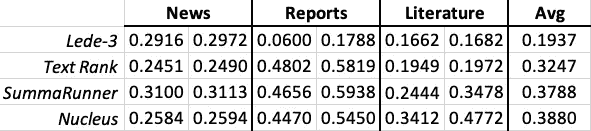

# 无监督抽取摘要:一项比较研究

> 原文：<https://towardsdatascience.com/unsupervised-extractive-summarization-a-comparative-study-ca6ac2181d54?source=collection_archive---------7----------------------->

## Laurent El Ghaoui 和 Tanya Roosta。

T 他的文章涉及摘要，目标是提取几个句子，很好地概括一个给定的文档或一组文档。有监督的方法寻求学习基于大量的例子提取哪些句子；它们在实践中的应用和部署可能具有挑战性，因为它们需要大型、高质量的训练集。无监督的方法不需要任何训练集，并且仅与语料库一起工作以进行总结。在这里，我们探索如何非监督的方法可以与最先进的，监督提取摘要方法竞争。

B **背景。**抽取方法通过直接从源文本中选择重要的现有单词、短语或句子的子集来生成摘要。关于这个主题有大量的科学文献；最近的调查有([萨基奥*等人*，2016](https://hal.archives-ouvertes.fr/hal-00782442/document) ，[甘比尔*等人，* 2017](https://link.springer.com/article/10.1007/s10462-016-9475-9) ，[白羊座*等人*，2019](https://arxiv.org/abs/1904.00688) ，[帕帕吉安诺普卢*等人，* 2019](https://arxiv.org/pdf/1905.05044.pdf) )。

抽象概括可以与抽象概括形成对比，抽象概括与抽象概括的不同之处在于它试图从零开始生成新的句子，而不是从源文档中提取句子。把提取摘要想象成一支荧光笔，把抽象摘要想象成一个人类作家。抽象方法通常更难开发，因为它们需要高性能的自然语言生成技术，这本身就是一个活跃的研究领域，参见例如( [Boutkan *等人，*2019](https://arxiv.org/abs/1905.01975)；[曾*等，* 2019](https://arxiv.org/abs/1611.03382) *)* 及其引用文献。最近还提出了结合抽取和抽象方法的混合策略，例如参见([彭*等*)。，2019](https://arxiv.org/abs/1904.04428) )。

迄今为止，最先进的有监督的纯提取摘要技术依赖于神经网络体系结构；summary runner([Nallapati*et al .*，2018](https://www.aaai.org/ocs/index.php/AAAI/AAAI17/paper/viewPaper/14636) *)* 它采用了一种“递归神经网络”，是该类别的最佳模型代表之一。

如([格鲁斯基*等人*所述。，2018](https://arxiv.org/abs/1804.11283') )在新闻数据集上，非常简单的(无监督的)基线，比如选取一篇新闻文章的前几个句子，仍然能够击败这些高级的监督模型。这可能是通常用于评估的数据集的一个产物:新闻文章倾向于以这样一种方式写作，即前几个句子给出文章的主旨，这在新闻编辑室的说法中被称为“导语”；但这也指出了一个事实，即无人监管的方法仍有可能战胜有人监管的方法。

先前在无监督提取摘要方面的工作集中在统计的、基于图的和基于优化的方法上。统计方法( [Saggio *et al.* ，2016](https://hal.archives-ouvertes.fr/hal-00782442/document) )以 TF-IDF 评分等简单统计为核心。基于图的方法( [Barrios et al .，2016](https://arxiv.org/abs/1602.03606) )将文本表示为链接句子的网络，并使用基于图的排序方法生成摘要；基于优化的方法( [Durrett et al .，2016](https://arxiv.org/abs/1603.08887) )使用稀疏优化、整数线性规划和约束优化等技术。

D数据集合。为了比较摘要算法，最好有包含“黄金”或参考摘要的数据集。在我们的比较中，我们使用了标准和不太标准的数据集。

数据集 *CNN* 和*每日邮报* (DM)，在[这里](https://cs.nyu.edu/~kcho/DMQA/)可用，都包含新闻文章，通常有 1 或 2 页长，通常只有几个句子长的“黄金”摘要是手工编写的。

对于这些标准数据集，我们开源了[这里](https://github.com/SumUpAnalytics/goldsum)两个有用的新数据集，因为它们包含更长的文档:

*   *2019 金融展望* (FO)数据集包含来自多家大型金融机构的 10 份公开发布的金融报告。每份报告从 10 页到 144 页不等，平均长度为 33 页。没有黄金总结*本身*。我们选择将黄金摘要定义为句子的集合，或句子的一部分，在内容中以粗体显示；或者，在内容中突出显示为插页的任何句子。
*   *古典文学书籍(CL)* 数据集包含 11 本英文古典书籍，范围从 53 页到 1139 页，中值长度为 198 页。这本书每章的黄金摘要通常有 20 页长，从 [WikiSummary](http://wikisum.com/w/Main_Page) 中获取。

E 摘要领域中使用的评估指标通常基于所谓的 [ROUGE scores](https://www.aclweb.org/anthology/W04-1013) ，其测量提取的句子与其参考对应物之间的词汇重叠，例如，与参考摘要共享的字数。许多作者注意到这种纯词汇测量的缺点，特别是当参考文献摘要使用的语言在意义上相似，但在词的选择上不同。这促使研究人员提出更多基于语义的方法，主要是为了更好地处理同义词。

( [Ng *et al.* ，2015](https://aclweb.org/anthology/D15-1222) )的论文通过所谓的[句子嵌入](https://openreview.net/forum?id=SyK00v5xx)来测量提取的句子和参考摘要之间的相似性，从而解决同义性问题；其他方法，如 ROUGE 2.0 基于固定的同义词列表和/或主题的使用。

R结果。我们比较了四种不同的方法:

*   [*Lede-3*](https://arxiv.org/pdf/1804.11283.pdf)*:*使用前 3 个句子的简单基线。
*   [*文本排名*](https://www.aclweb.org/anthology/W04-3252) *:* 一种基于图的无监督方法。
*   [*sum runner*](https://www.aaai.org/ocs/index.php/AAAI/AAAI17/paper/viewPaper/14636)*:*上面提到的有监督的提取摘要神经网络算法。
*   [*Nucleus*](https://www.sumup.ai/#/nucleus)*:*是指 [sumup.ai](https://www.sumup.ai) 开发并商业化的专有文本包中的无监督的、提取的摘要器。

下表显示了与词汇模糊度量相对应的分数，显示了 95%的置信区间。(所示的度量对应于召回和精度测量的调和平均值；它不应与分类中典型的 F1 分数相混淆；对于汇总重叠度量，这些数字通常要低得多。)

Average performance (ROUGE-1 F score) for four extractive summarization methods evaluated on three kinds data sets: News (averaged over CNN and Daily Mail datasets), reports on 2019 Financial Outlooks and classical literature books.

我们观察到，当数据包含较短的文档(CNN 和 DM，*即* news)时，SummaRunner 似乎更受青睐；但是在这种情况下，简单基线(Lede-3)几乎做得一样好。面对更长的文档，如报告和文献，基线和基于图表的方法都被其他两种模型所主导，相差甚远。在不同的数据集上，非监督方法 Nucleus 与复杂的监督模型不相上下。

其他词汇度量，如 ROUGE-*，以及测量，如精度、召回率等。，或使用语义胭脂度量，指向相同的结论。