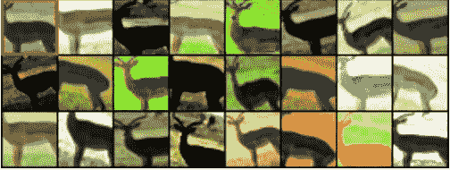
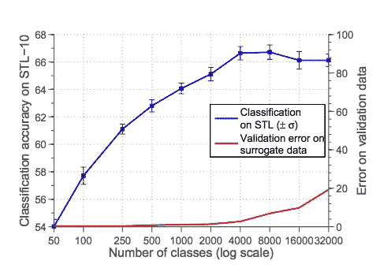
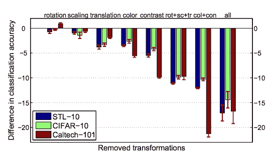

# 无监督特征学习

> 原文：<https://towardsdatascience.com/unsupervised-feature-learning-46a2fe399929?source=collection_archive---------5----------------------->

图像任务上的深度卷积网络接受形式为*(高度 x 宽度 x 通道)*的图像矩阵，并通过一系列参数函数将它们处理成低维特征。监督和非监督学习任务都旨在从原始数据中学习语义上有意义的特征表示。

训练深度监督学习模型需要以标记的 *(x，y)* 对的形式的海量数据。无监督学习不需要相应的标签 *(y)* ，最常见的例子就是自动编码器。自动编码器将 x 作为输入，将它通过一系列层来压缩维度，然后在重建 x 的效果方面受到批评。自动编码器最终会学习一组描述数据 x 的特征，但是，这些特征可能对监督学习或辨别任务不是很有用。

使用自动编码器的无监督特征学习的一个扩展是去噪自动编码器。去噪自动编码器将受损图像(原始图像添加了某种形式的随机矩阵)作为输入，并重建原始图像。同样，这些特征对于辨别任务不是很有用，然而，希望这两个例子足以解释如何构建无监督的特征学习任务。

[Dosovitskiy 等人](https://papers.nips.cc/paper/5548-discriminative-unsupervised-feature-learning-with-convolutional-neural-networks.pdf)提出了一种非常有趣的无监督特征学习方法，使用极端数据增强来创建无监督学习的代理类。他们的方法从图像中裁剪出 32 x 32 的小块，并根据采样的幅度参数使用一组变换对它们进行变换。他们训练一个深度 CNN，根据它们的扩充“代理”类对这些补丁进行分类。



The top left image is a 32 x 32 patch taken from the STL-10 dataset. Dosovitskiy et al. proceed to form all of these other images by sampling a parameter vector that defines a set of transformations. Each of these resulting images belongs to a surrogate class. A Deep Learning model will classify images according to these classes.

链接到论文:

 [## 基于卷积神经网络的判别性无监督特征学习

### 神经信息处理系统电子会议录

papers.nips.cc](https://papers.nips.cc/paper/5548-discriminative-unsupervised-feature-learning-with-convolutional-neural-networks) 

在本文中，使用了 6 种变换:平移、缩放、旋转、对比度 1、对比度 2 和颜色添加。这些变换中的每一个都带有一个参数，该参数定义了增加的幅度。例如，translate →(垂直，0.1(面片大小))。幅度参数可以存储在单个向量中。这些向量从参数的总体分布中采样，以变换面片。

这些幅度参数被离散化，使得在参数的边界之间存在有限的值空间，例如范围在[0.2，0.1，0，-0.1，-0.2]之间的平移幅度。离散化的细化导致大量代理类的整体构建。例如，如果有 5 个平移值、5 个缩放值、5 个旋转值、5 个对比度 1 值、5 个对比度 2 值和 5 个颜色添加值。有 5⁶ = 15，625 个结果代理类。

因此，Dosovitskiy 等人试图回答的问题是:

> 应该使用多少代理类？

# 构造的代理类的数量



Note the y-axis on the left corresponds to the classification performance using unsupervised features on the supervised STL-10 discriminative task and the y-axis on the right corresponds to the error of the classifier on different surrogate classes, (very low error rate for 50–2000 surrogate classes)

该图显示，大约 2000 个代理类的性能开始趋于稳定。因此，大多数增强之间没有太多的间隔。另一个有趣的问题出现了:

> 每个代理类应该使用多少个扩充样本？

# 用于代理类的扩充样本


上面的图显示了 2000 个代理类在前面的图中被证明是最优的；在每类大约 32 到 64 个样本时，性能开始稳定下来。

考虑一下用于这种方法的扩充数据集的大小是很有趣的。

```
32x32x3 patches → 2,000 surrogate classes → 64 samples per class(32x32x3) x 2000 x 64 = 393,216,000 pixels
```

只有大约 393 MB，对于大多数现代计算机来说，这真的不是一个大问题。然而，如果他们将方法从 32 x 32 小块改变为完整的图像，这可能变得巨大，需要使用在线数据增强技术。

# 变换的多样性



他们还研究了使用不同的转换来构造代理类。如上图所示，当仅使用颜色和对比度时，数据集和所使用的增强之间存在一些差异，在 Caltech-101 spike 中尤为明显。但是，使用所有增强在所有三个数据集上都具有一致的高性能。这表明，通过添加更多的转换，结果可能会进一步改善。

感谢您阅读这篇介绍无监督特征学习的论文！我认为看到深度神经网络如何在一项任务中学习特征并将其很好地转移到另一项任务是非常有趣的。使用在任务上训练的深度特征，例如本文中描述的 Exemplar-CNN，对于辨别任务也是有用的。请在评论中告诉我你对此的想法。