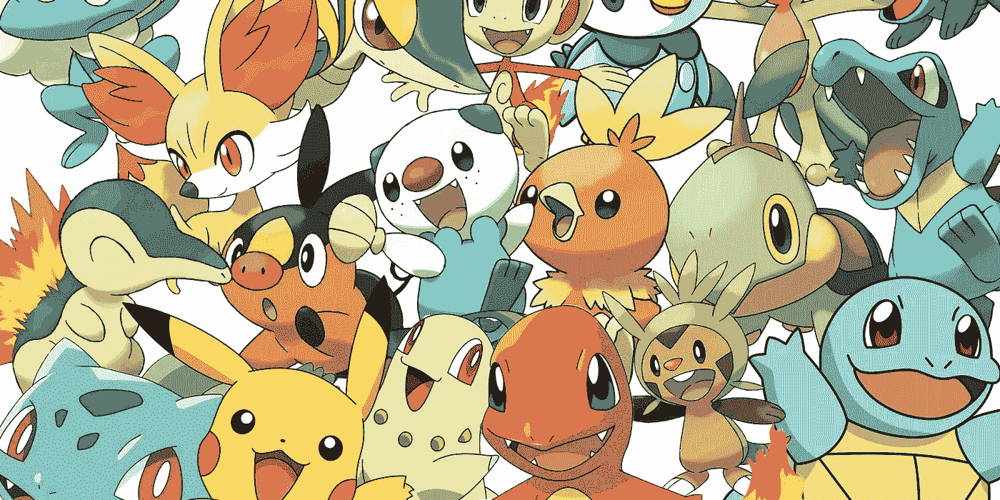
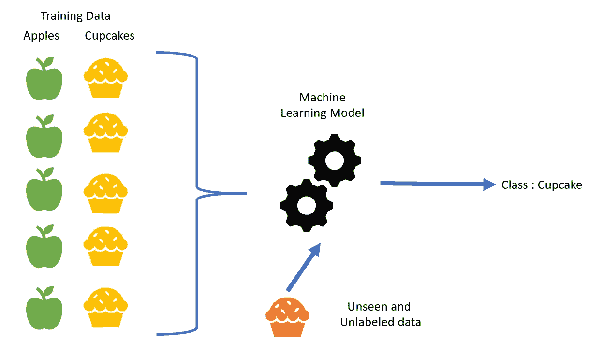
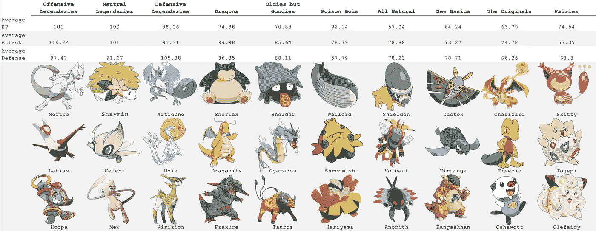

# 无监督学习:聚类

> 原文：<https://towardsdatascience.com/unsupervised-learning-clustering-60f13b4c27f1?source=collection_archive---------19----------------------->



[Pokemon is 21 years old. Think about that.](https://modojo.com/article/23519/pokeacutemon-turns-21-years-old-today)

## 对…的介绍

一个算法如何得知哪些口袋妖怪是传奇，哪些不值得你超球

大约一周前，我写了一篇关于预测《权力的游戏》中一场战斗结果的文章,以便讨论包括流水线和堆栈回归在内的主题。我把这封信发给了我母亲，让她看看我在实习项目中学到的东西，她的回答大致是这样的:“你在*温特伯格……*把我搞糊涂了，你就不能写一篇关于口袋妖怪或者我能理解的东西的文章吗？”

因此，本周，考虑到我将在项目培训的最后一周研究什么，我开始搜索口袋妖怪数据集。我最初偶然发现了一组[图像](https://www.kaggle.com/kvpratama/pokemon-images-dataset)，意在用来教导算法口袋妖怪是什么样子，以便生成新的口袋妖怪。(剧透:结果[吓人。](https://boingboing.net/2019/05/13/ai-generated-pokemon-that-shou.html))然后，我找到了超过 800 个口袋妖怪的特征的[全集](https://www.kaggle.com/rounakbanik/pokemon)，我决定使用它来练习一些无监督的学习——具体来说，就是聚类。是否有某些特征将口袋妖怪捆绑在一起？算法会按代拆分他们吗？按类型？在游戏过程中，当我们试图决定口袋妖怪是否值得保留和训练时，我们的大脑是否会产生相同的潜意识集群？

让我们来了解一下！

如果你对我的发现比对编码和技术部分更感兴趣，请随意跳到你开始看所有口袋妖怪的地方！

首先，介绍无监督学习:

当谈到“机器学习”这个沉重的话题时，实际上有两种类型:有人监督的和无人监督的。监督是一个过程，在这个过程中，你教算法如何标记事物，或者你给它每个观察值一个 y 值，并训练它预测未标记观察值的 y 值。



[Examples of Supervised Learning](https://medium.com/@canburaktumer/machine-learning-basics-with-examples-part-2-supervised-learning-e2b740ff014c)

这就是我前面提到的《权力的游戏》中发生的事情——我正在训练一个模型，根据之前已经被标记为胜利或失败的战斗，将一场战斗分类为胜利或失败。监督学习对于*预测*更有用，因为它学习一组和另一组之间的差异，允许它对训练集之外的观察结果进行分类。然而，如果我们的目标不是分类，而是组织呢？这就是无监督学习的用武之地。

## 那么什么是无监督学习呢？

无监督学习有三种类型:聚类(我们将要关注的)、降维和自动编码。

降维(也称为数据压缩)确实如其名。它会找到压缩和编码数据的方法，以便更容易、更快、更便宜地在模型中运行。它通常用于图像，以便分解它们，但保留大部分信息。数据压缩基于这样的假设，即大多数数据多少有些冗余，可以重新格式化以更有效地包含信息。有两种类型的数据压缩:**主成分分析**，它寻找传达大部分方差的变量的线性组合，以及**奇异值分解**，它将数据集分解成三个更小的矩阵。一个**自动编码器**在缩小数据的意义上非常类似于数据压缩，但它通过深度学习来做到这一点，其中数据被输入到一个神经网络，通过加权，塑造一个输出，这是数据的最佳表示。

集群也名副其实。它获取未标记的数据，并将其组织到相似的组中。有三种方法可以做到这一点。首先，有 **k 均值聚类**，它创建 k 个互斥组。它通过将 k 个随机质心分配给数据并将观测值分配给它们最接近的质心来实现这一点。质心位于这些观察值的中心，并且重复该过程，直到质心有效地停止移动。困难之处在于选择一个合适的 k 值的过程可能很复杂。较大的 k 意味着较小的组，因此粒度更大，但是您可能希望更广泛地对组进行聚类。下面是一个带有交互式可视化的源代码，它进一步清晰地解释了 k-means 聚类。

[](https://www.naftaliharris.com/blog/visualizing-k-means-clustering/) [## 可视化 K-均值聚类

### 不幸的是，尽管 k-means 肯定会收敛，但它所收敛到的最终聚类配置…

www.naftaliharris.com](https://www.naftaliharris.com/blog/visualizing-k-means-clustering/) 

```
from sklearn.cluster import KMeans
k = 10
kmeans = KMeans(n_clusters=k).fit(X)
kmeans.labels_
```

还有从 n 个聚类开始的**层次聚类**，每个聚类对应一个观察值。从那里，它将最近的两个聚类组合成一个更大的聚类，并重复这一过程，直到所有的观察结果都在一个聚类中。这被称为**凝聚集群和** g，它的逆过程(一群分裂成许多群)被称为**分裂集群**。您可以划分生成的树状图，以获得所需的聚类数。


[Hierarchical Clustering](https://www.google.com/url?sa=i&source=images&cd=&cad=rja&uact=8&ved=2ahUKEwi5yMjvquniAhWjr1kKHRxlAaUQjhx6BAgBEAM&url=http%3A%2F%2Fwww.datanovia.com%2Fen%2Fwp-content%2Fuploads%2Fdn-tutorials%2F003-hierarchical-clustering-in-r%2Ffigures%2F&psig=AOvVaw0v7aKEXXyoh_X-GwO543SL&ust=1560614099551261)

```
from sklearn.cluster import AgglomerativeClustering
clusters = AgglomerativeClustering(n_clusters=10).fit(X)
clusters.labels_
```

最后，还有**概率聚类**，这是一种较软的聚类形式，它不是给每个观察值分配一个组，而是分配一个组的概率。如果您想知道某个观察与某个组的相似程度，而不仅仅是与该组最相似，这将很有帮助。

无监督学习有两个主要挑战。首先，特别是对于集群，需要探究产生的集群。该算法将拆分数据，但它不会告诉您它是如何做到的，也不会告诉您聚类中的相似性是什么，这可能是执行的目标。第二，很难知道它是否正常工作。与监督学习不同，没有可用于评估它的准确性度量。

回到口袋妖怪！


[link](https://www.engadget.com/2017/01/25/you-can-now-transfer-your-old-pokemon-to-sun-and-moon/)

有了 800 个口袋妖怪的数据集，包括 HP(生命值)、攻击和防御、主要类型和次要类型以及世代等特征，我决定看看算法如何将口袋妖怪分成集群。我有几个预测，第一个是分成几代。我是在假设过去 21 年里，他们一定下意识地让新的口袋妖怪客观上变得更好的基础上形成的。(他们没有。)我发现的群体与我感觉到的大多数人在玩耍时无意中形成的群体非常相似。有一些口袋妖怪值得捕捉、训练和战斗，还有一些是你为了你的口袋妖怪而捕捉的，并把它们留在你的电脑里(这个概念我多年前玩的时候还不明白，我的意思是你如何把你实际捕捉的口袋妖怪储存在电脑里？).

我的主要外卖？传说中的口袋妖怪和非传说中的口袋妖怪是有客观区别的。这是有道理的，但事实证明，在 10 个集群中，有两个是完全传奇式的，一个有一个非传奇式的，当该功能不包括在提供给机器的数据中时，它就溜了进来。不仅如此，它还分裂了顶级进攻者、顶级防守者和少数之间的平衡。

就非传奇的口袋妖怪而言，它也做了一些奇怪的事情。它创造了一群强龙口袋妖怪，一群年长但强水/正常型口袋妖怪，一群高 HP 高攻击低防御的毒/战斗型口袋妖怪，一群高攻防但低 HP 的自然岩/虫/水)型口袋妖怪，一群较新的一般口袋妖怪(多为首发和低进化)，一群年长的一般口袋妖怪，一群 HP 体面但攻防低的仙鬼型口袋妖怪。

所以…本质上它创造了这些“你想要这些”、“你可以用这些”和“不要在这些上面浪费时间”的集群。这里和那里显然有一些有问题的决定，例如鲤鱼王，一个臭名昭著的无用的口袋妖怪进化前，被放在更老但强大的水/正常类型，而它实际上应该在更老和平均组。然而，它的进化 Gyarados 恰好在同一个组中，并且这种趋势跨越了大多数组，其中进化都在同一个群中，不管一个是否明显优于另一个。

总而言之，这种疯狂似乎有某种方法。



# 结论

如果你想了解你拥有的数据类型，聚类和无监督学习通常是一个非常有用的工具。然而，你从中获得的洞察力取决于你和你对数据的理解。最终由您来决定您的集群意味着什么以及如何使用它们。

此外，也许我们应该给鲤鱼王一个机会。


[Magikarp’s Confusing Evolution](https://screenrant.com/detective-pikachu-magikarp-evolve-gyarados-writer/)

[https://github . com/taylorfogarty/launch/blob/master/neural _ net _ pokemon . ipynb](https://github.com/taylorfogarty/launch/blob/master/neural_net_pokemon.ipynb)