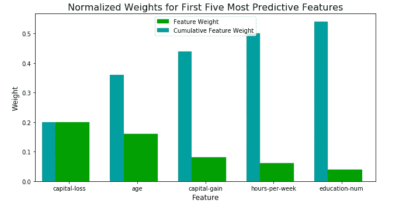
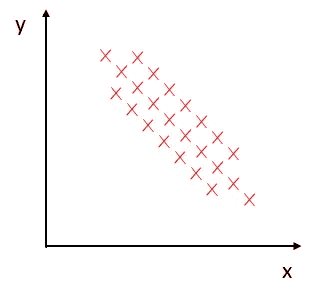
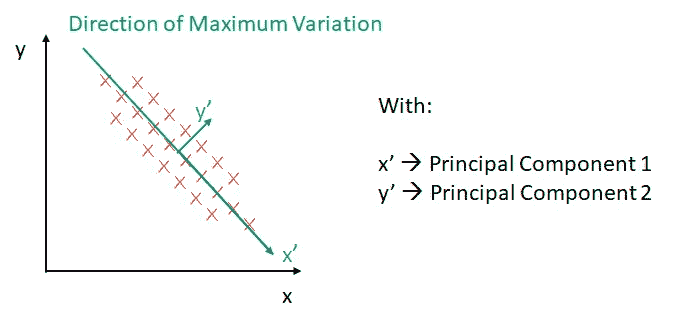
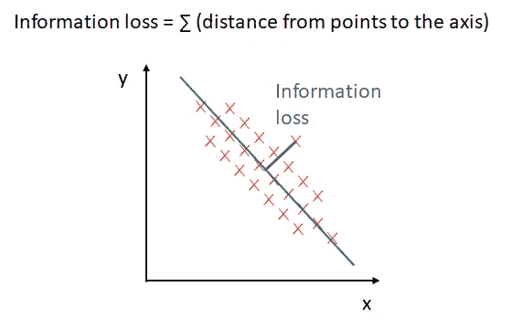
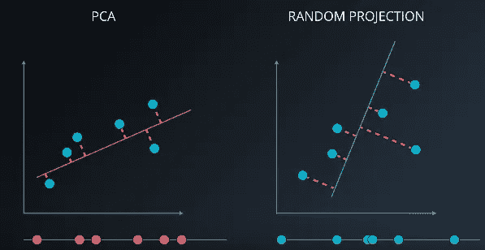
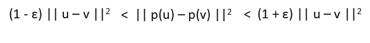
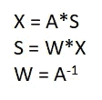
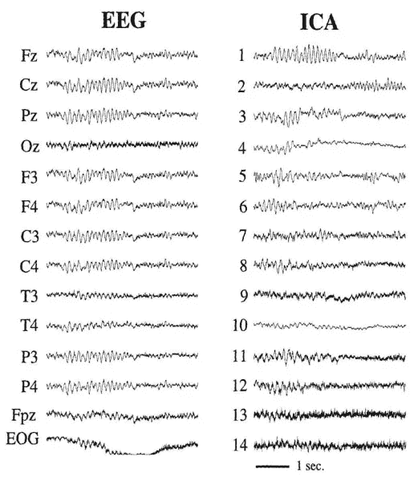

# 无监督学习:降维

> 原文：<https://towardsdatascience.com/unsupervised-learning-dimensionality-reduction-ddb4d55e0757?source=collection_archive---------3----------------------->

## 压缩特征，减少过度拟合和噪声，提高效率和性能


Picture from [Unsplash](https://unsplash.com/photos/K2RZYdZTNSc)

# 介绍

如[之前的文章](/unsupervised-machine-learning-clustering-analysis-d40f2b34ae7e)所述，无监督学习是指一种机器学习算法和技术，这些算法和技术通过未标记的数据进行训练和反馈。换句话说，我们事先不知道正确的解或目标变量的值。

这些类型的算法的主要目标是研究数据的内在和隐藏结构，以便获得有意义的见解，将数据集分成相似的组或简化它们。

在整篇文章中，我们将探讨一些最常用于降低数据集维度的算法和技术。

**降维基础**

维度是数据集中存在的变量、特征或特性的数量。这个维度被表示为列，目标是减少它们的数量。

在大多数情况下，这些列是相关的，因此，存在一些冗余信息，这会增加数据集的噪声。这种冗余信息对机器学习模型的训练和性能有负面影响，这就是为什么使用降维方法变得至关重要。这是降低模型复杂度和避免过拟合的一个非常有用的方法。

降维有两个主要类别:

*   特征选择→我们选择原始数据集的特征子集。
*   特征提取→我们从原始集合中提取信息来建立新的特征子空间。

# 特征选择

特征选择代表一系列用于减少给定数据集的维度特征空间的贪婪算法。目标是获得一个能够自动选择与所面临问题最相关的特征子集的模型。

> 贪婪算法在组合搜索的每个阶段做出局部最优的选择，并且通常产生次优的解决方案。这就是它们不同于穷举搜索算法的地方，穷举搜索算法评估整个组合集并产生整体最优解。贪婪算法的好处是它们在计算上更有效率，以精度为代价，但是大多数时候它们产生足够好的解。

这样可以提高训练过程的计算效率，减少数据集的噪声，避免过拟合，降低模型的复杂度。

我们将研究两种主要的特征选择技术:

*   顺序向后选择或 SBS
*   随机森林具有重要性

## **顺序反向选择**

SBS 算法背后的思想如下:

*   我们将设置我们想要在数据集中的最终特征数
*   然后，我们将设置一个标准函数，该函数负责最小化因移除数据集的某个要素而导致的性能损失。
*   在每次迭代中，该算法将通过简单地计算去除每个当前特征之前和之后的性能来计算性能的降低。
*   然后，将从数据集中移除导致性能下降最小的要素。
*   如果数据集中存在的要素数等于 *d* 数(在开始时设置),则算法停止。否则，它将完成另一次迭代。

## **随机森林的特征重要性**

我们已经在[以前的文章](/supervised-learning-basics-of-classification-and-main-algorithms-c16b06806cd3)中研究了随机森林算法。这是一种集成算法，它将一组弱决策树模型结合起来，以建立一个更健壮、更精确的模型。

使用随机森林，我们可以通过计算森林中所有决策树的平均杂质减少量来评估每个特征的重要性，以及它们对模型信息的贡献。这将在不对数据是否是线性可分的做出任何假设的情况下完成。

这是一种非常简单的获取特性重要性的方法，因为我们将使用 scikit-learn 库的随机森林实现，它已经在拟合了一个 *RandomForesClassifier 之后通过使用 *feature_importance_* 属性收集了特性重要性。*

在之前的文章中，我们已经研究过这个[的一个例子，我们想找出那些最有助于预测一个特定的个人收入是否达到或超过 50，000 美元的特征。](/classification-project-finding-donors-853db66fbb8c)

```
***# Import Ada Boost Classifier***
from sklearn.ensemble import AdaBoostClassifier

***# Train the supervised model on the training*** 
model = AdaBoostClassifier().fit(X_train, y_train)

***# Extract the feature importances using .feature_importances****_* 
importances = model.feature_importances_

***# Plot***
vs.feature_plot(importances, X_train, y_train)
```



# 特征抽出

特征提取也用于减少某个数据集的特征数量，但与特征选择相反，输出特征不会与原始特征相同。

使用特征提取时，我们将数据投影到一个新的特征空间，因此新的特征将是原始特征的组合，以保留最相关信息的方式进行压缩。

一些最常用的无监督特征提取算法是:

*   主成分分析
*   随机投影
*   独立成分分析

## **主成分分析**

为了理解 PCA 算法是如何工作的，让我们考虑以下数据分布:



PCA 找到一个新的象限系统(y’和 x’轴),该系统是仅通过平移和旋转从旧系统获得的。

*   它会将坐标系的中心从原点(0，0)移动到数据点分布的中心。
*   然后，它会将 x 轴移动到变化的主轴，这是相对于数据点变化最大的一个轴(最大扩散的方向)。
*   然后，它将另一个与主轴正交的轴移动到不太重要的变化方向。



基本上，PCA 在高维数据中找到最大方差的方向，并将该数据投影到一个新的子空间中，该子空间具有与原始子空间相同或更少的维度。

这些包含最大方差的新方向称为主分量，它们具有相互正交的约束。

**最大方差和信息损失**

数据点将在最大方差的方向上投影，以形成新的轴。离轴越远的点，信息损失越大。



一个数学事实是，当我们将点投影到最大方差的方向上时，它最小化了从旧的和更高维的数据点到其新的变换值的距离。换句话说，它使信息损失最小化。

**特征转换的 PCA 核心思想**

总的来说，主成分分析所做的是将每个特征结合起来，并自动提取出最相关的特征。这是一种系统化的方法，将输入特征转换成主成分，并将它们用作新特征。

主成分是在投影或压缩数据时使方差最大化(信息损失最小化)的方向。

沿着主成分的数据方差越大，该方向包含的信息就越多，主成分的等级就越高。

主成分的数量将少于或等于输入特征的数量。

**Scikit-Learn PCA 实现**

让我们看一个在 Scikit-Learn 库中如何实现这个算法的例子。

```
***# Import PCA Algorithm***
from sklearn.decomposition import PCA

***# Initialize the algorithm and set the number of PC's***
pca = PCA(n_components=2)

***# Fit the model to data*** 
pca.fit(data)***# Get list of PC's***
pca.components_***# Transform the model to data*** 
pca.transform(data)***# Get the eigenvalues***
pca.explained_variance_ratio
```

**何时使用 PCA**

*   当潜在特征驱动数据中的模式时。
*   为了降维。
*   来可视化高维数据。
*   以减少噪音。
*   作为提高其他算法性能的预处理步骤。

## 随机投影

随机投影是一种强大的降维方法，在计算上比 PCA 更有效。它通常用于因维数过多而无法直接计算主成分分析的数据集。

像 PCA 一样，它获取具有 *d* 维度和 *n* 样本的数据集，并产生具有 *k* 维度的数据集的变换，其中 *k* 远小于*d*(*k*<<*d*)。



**方法**

基本前提是通过乘以一个随机矩阵来降低数据集的维数。这将把数据集投影到新的特征子空间中。

**理论方法:约翰逊—林登施特劳斯引理**

> 高维欧几里得空间中具有 *N* 个样本的数据集可以被向下映射到低得多的维度中的空间，其方式在很大程度上保持了到点的距离。

换句话说，计算数据集中两点之间的距离平方，新数据集中这两点的距离必须是:

*   小于距离的平方乘以(1-ε)
*   大于距离的平方乘以(1+ε)



被认为是数据点的 *u* 和 *v* 。

**随机投影 Scikit-learn 实现**

```
***# Import Random Projection Algorithm***
from sklearn.random_projection import SparseRandomProjection

***# Initialize the algorithm and set the number of PC's***
randprojection = SparseRandomProjection()

***# Fit and transformthe model to data*** 
randprojection.fit_transform(data)
```

ε值ε是数据集各点之间允许的误差水平。ε的默认值为 0.1。

我们可以使用随机投影，方法是设置一些组件，或者指定ε的值，并让算法自动计算维数的保守值。

## 独立成分分析

ICA 是一种类似于 PCA 或随机投影的降维方法，它采用一组特征并产生在某种程度上有用的不同组。

但是当 PCA 试图最大化方差时，ICA 假设特征是独立源的混合物，并且它试图隔离这些混合在数据集中的独立源。

ICA 背后的动机是获取原始特征集，并尝试识别独立贡献于数据集的那些特征，换句话说，那些与其他特征具有 leat 相关性的特征。所以它会分离出那些最重要的成分。这个问题叫做盲源分离。

**高级算法**

*   x:是我们的原始数据集。
*   答:混合矩阵
*   源矩阵
*   w:分解矩阵

这些变量的关系如下:



所以目标是计算 W，以便能够获得 S，独立特征的源矩阵。

为此，该算法将执行以下步骤:

1.  以 X 为数据集，它会居中并白化它。
2.  选择一个初始随机权重矩阵 W1，W2，…，Wn。
3.  估计 W，包含向量。
4.  去相关。
5.  从步骤 3 开始重复，直到收敛

ICA 假设这些成分是统计独立的。它们必须具有非高斯分布，因为如果它们是高斯分布，我们将无法恢复原始信号。

从这一点出发，中心极限定理说，独立变量之和的分布趋于高斯分布。

**Sci-kit 学习中的 ICA 实现**

```
***# Import Independent Component Analysis Algorithm***
from sklearn.decomposition import FastICA

***# Initialize the algorithm and set the number of PC's***
ica = FastICA(n_components=2)

***# Fit and transform the model to data. It returns a list of independent components*** 
ica.fit_transform(data)
```

ICA 的一个有趣的应用是脑电图数据的分析。以下是来自持续 4.5 秒的 EEG 扫描的 14 个通道的读数以及从数据集中提取的独立分量的示例。



Original Paper: [https://www.semanticscholar.org/paper/Applying-Independent-Component-Analysis-to-Factor-Cha-Chan/a34be08a20eba7523600203a32abb026a8dd85a3](https://www.semanticscholar.org/paper/Applying-Independent-Component-Analysis-to-Factor-Cha-Chan/a34be08a20eba7523600203a32abb026a8dd85a3)

# 最后的话

*如果你喜欢这篇文章，那么你可以看看我关于数据科学和机器学习的其他文章* [*这里*](https://medium.com/@rromanss23) *。*

*如果你想了解更多关于机器学习、数据科学和人工智能的知识* ***请在 Medium*** *上关注我，敬请关注我的下一篇帖子！*