# 股票期权定价中异常检测的无监督学习

> 原文：<https://towardsdatascience.com/unsupervised-learning-for-anomaly-detection-in-stock-options-pricing-e599728958c7?source=collection_archive---------5----------------------->

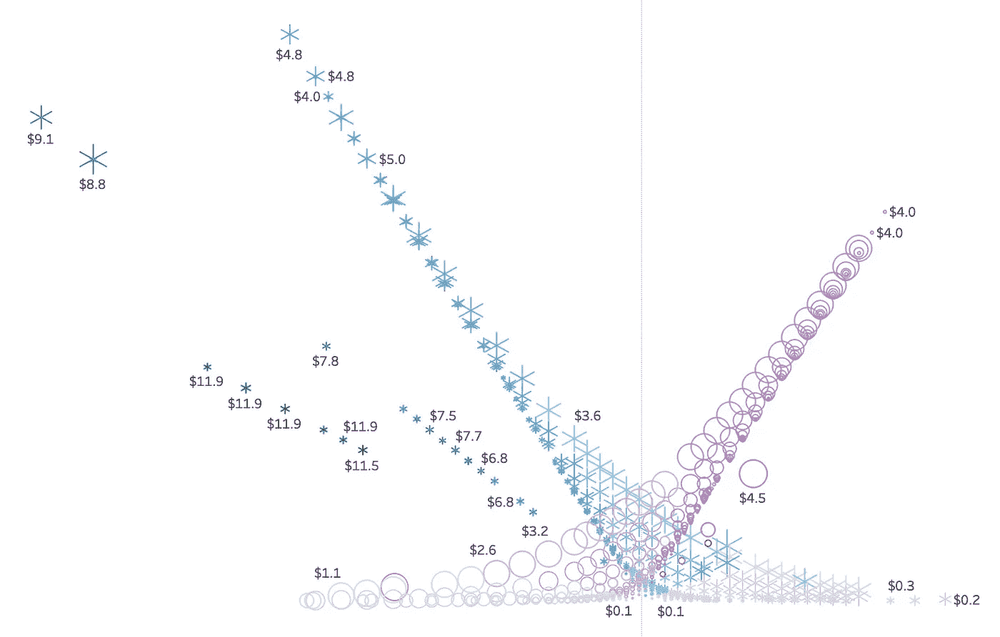

> [链接](https://github.com/borisbanushev/anomaliesinoptions)到 Github(笔记本+数据)。

**注意**:这篇文章是预测股票价格的更广泛工作的一部分。结果(识别出的异常)是**模型(在 **GAN** 架构内)[链接到 post](/aifortrading-2edd6fac689d) 的一个特征(输入)。**

# **1.动机**

**期权估价是一项非常困难的任务。首先，它需要使用大量数据点(下面列出了一些)，其中一些非常主观(如隐含波动率——见下文),难以精确计算。例如，让我们检查呼叫的*θ*—**θ**的计算:**

**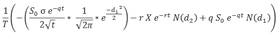**

**其中 **N(d1)** 和 **N(d2)** 分别是标准正态分布的累积分布函数:**

**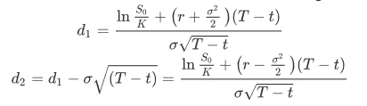**

**期权定价困难的另一个例子是用于计算期权价格的布莱克-斯科尔斯公式。计算到期日为 **t** 且当前价格为 **S0** 的欧式看涨期权价格的公式为:**

****

**The Black-Scholes formula for pricing a European call option.**

**第二，**布莱克-斯科尔斯**模型，又称*二叉树*，为了模型准确，需要满足很多假设。然而，这些规则在现实生活中往往无法实现。其中一些包括:**

*   **该模型假设基础波动率( **σ** )在期权有效期内保持不变，不受基础股价水平变化的影响。很多时候，波动性随着执行价格的变化而变化——执行价格和基础价格之间的差异越大，波动性就越大。这种现象被称为**波动微笑** ( *参见下图*)，**
*   **假设恒定的无风险回报率(随着全球经济每天都在变化，这是很难预测的事情)，**
*   **该模型没有考虑流动性风险和额外的费用/收费。**
*   **它假设股票回报遵循对数正态分布(这意味着该模型忽略了价格大幅偏离、飙升或下跌的可能性，这在实际交易中很容易观察到)，**
*   **它假设没有股息支付。股息支付改变了股票的当前价值，进而改变了期权价格，**
*   **该模型仅适用于欧式期权。**

**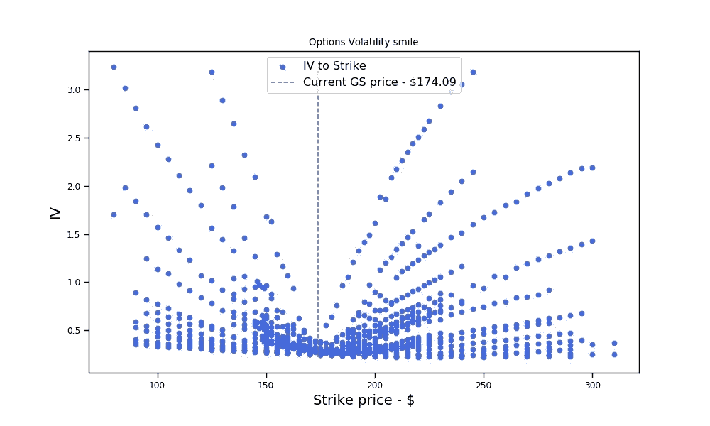**

***Not a perfect smile at this example, but we only used data for one day.***

**上述假设在现实生活中很少能得到满足，这一事实正是可以观察到异常现象的原因。这反过来又创造了很多机会，我们可以用机器/深度学习来探索和利用，比如**套利交易**。**

****注意**:为了让我们完全理解异常检测是否有效(以及如何有效)，了解希腊期权是很重要的。因此，我们将简要介绍它们:**

*   ****隐含波动率-σ** :隐含波动率是对价格变化幅度的估计。更高的数字意味着交易者认为期权可以带来巨大的变化。基本上，只是一个波动指数。**
*   ****Delta** : **δ** 衡量期权价格相对于标的股票价格的变化幅度。0.5 的 delta 意味着股票每移动 1 美元，期权将改变 50 美分( **δ** 是价格的一阶导数)。**
*   ****γ**:**γ**衡量股价变化时 **δ** 的变化速度。高数值意味着这是一个非常活跃的选项，可能会迅速增加或减少价值(这是价格的二阶导数)。**
*   ****θ**:**θ**衡量期权每天因时间衰减而损失价值的速度。当到期日到来时，θ增加。**
*   ****Vega**:Vega*Vega*衡量期权价格对隐含波动率变化的敏感程度。没有钱的期权，或者离到期还有很长时间的期权对隐含波动率的变化更敏感，**
*   ****Rho:** *rho* 是衍生产品价格相对于无风险利率变化的变化率。(我们没有 Rho，tho 的数据)。**

**所以，回到异常检测。**

# **2.数据**

**期权数据可以在 historicaloptiondata.com 找到。这将花费你 1-2K 美元，但数据丰富有序。**

```
# Filtered options data for Goldman Sachs
options_df = pd.read_csv('option_GS_df.csv', parse_dates=["Expiration", ' DataDate'])# Let's create **Maturity** and **Spread** features
options_df['date_diff'] = (options_df['Expiration'] - options_df[' DataDate']).dt.days
options_df['Spread'] = options_df['Ask'] - options_df['Bid']
```

**我们将在本帖中使用的数据是 2016 年 1 月 5 日高盛期权的每日报价。它包含不同到期日的定价(加上波动率和希腊),以及在该日期创建的行权价格。当天的当前(GS)价格为 174.09 美元。共有 22 个特性和 858 行(每行是截至 2016 年 1 月 5 日不同行使和到期日的定价和希腊人)。查看 Github repo 了解更多信息——顶部的链接。**

```
options_df.shape**output** >>> (858, 22)
```

**我们有什么特点？**

```
print(', '.join(x for x in options_df.columns))**output** >> UnderlyingPrice, OptionSymbol, Type, Expiration,  DataDate, Strike, Last, Bid, Ask, Volume, OpenInterest, T1OpenInterest, IVMean, IVBid, IVAsk, Delta, Gamma, Theta, Vega, AKA, date_diff, Spread
```

**基本上我们需要的所有功能都有了。让我们将数据可视化成一对图，其中:**

*   **我们互相暗算的*特征*是 Strike，Bid，Delta，Gamma，Vega，和 Spread(我们不会暗算每一个特征)，**
*   ***色调*是期权的类型(看涨或看跌)，**
*   ***对角线*当然是各个特征的分布。**

**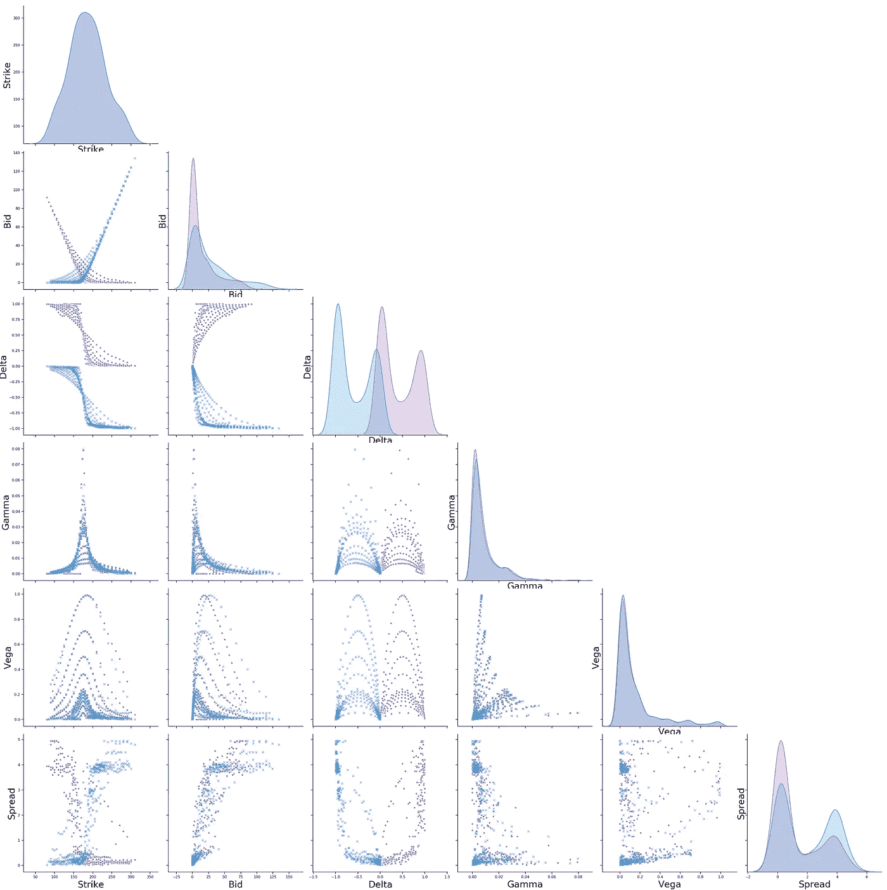**

**Goldman Sachs options data for 2016/01/05\. *The purple-ish color represents the calls, and the blue — the puts.***

# **3.用于发现异常值(异常)的无监督学习**

****什么是异常现象？**在我们的案例中(以及一般情况下),异常是期权逻辑中的任何不匹配。**例如**，两个看涨期权的买入(或卖出)价格具有相同的执行价格，但是，比方说，在执行日有 1-2 天的差异，这两个价格应该几乎相同(除非有什么不寻常的事情，这可能在希腊人身上有所体现)。因此，这两种期权的投标价格的巨大差异不会是正常的。或者，举例来说，高θ或小织女星( *OTM* )期权的到期时间较长。诸如此类。**

> ****注意**:我们将再次跳过期权定价背后的技术和数学方面(如随机过程、布朗运动和扩散方程)。相反，我们试图看看我们是否可以使用机器学习来近似所有这些使用数据的数学公式(数据驱动的方法与模型驱动的方法相反)。结果可能不会像原始公式那样精确，但计算量会更小。或者，另一方面，机器学习可以“学习”如何进行金融建模(如期权定价)，甚至比金融数学更好，因为我们可以在模型中纳入许多新方法和数据，允许模型揭示对人类隐藏的模式和相关性。**

**出于异常检测的目的，我们将使用**隔离林**。**

**让我们可视化一个交易日(2016/01/05)的期权数据，并尝试看看我们是否可以直观地识别异常。有几件事看起来很可疑——这些可能是(也可能不是)异常现象:**

*   **在**图 2** 中，奇怪的是，一份看跌期权合约的 delta 比它旁边的合约小得多，考虑到该合约具有相同的特征——买入价/卖出价的平均值、当前价格和执行价格之间的差异、非常非常接近的到期日——它是底部的选项，蓝色被灰色看跌期权包围(有点隐藏)。另一边，有一个同样异常的叫声——被灰色圆圈包围的紫色圆圈。**
*   **在**图 3** —(在右侧)中，有几个看涨期权(我们知道它们是看涨期权，因为看涨期权具有正的 delta —在 0 和 1 之间),具有明显更低的θ范围——圆圈具有小于(-4.5)的θ，考虑到具有相同特征的其他期权(附近)具有大于(-1.5)的θ。**

**我们感兴趣的主要特征将是买价/卖价(或我们创建的特征——这些特征的平均值)和价差(*=卖价*)。理论上，相同类型的期权、成交价格和到期日不应该有明显不同的价格和价差。**

> **以下四个图表是用 Tableau 制作的。**

**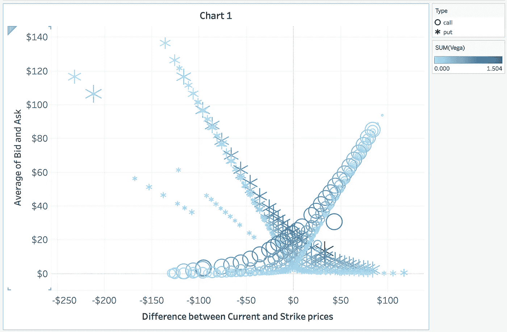**

**GS options data (x-axis is the difference between the Current price and the Strike price, and the y-axis is the average of the Bid and Ask — basically the option’s price), where the circles represent calls and the stars are puts. The clustering color is based on **Vega**.**

**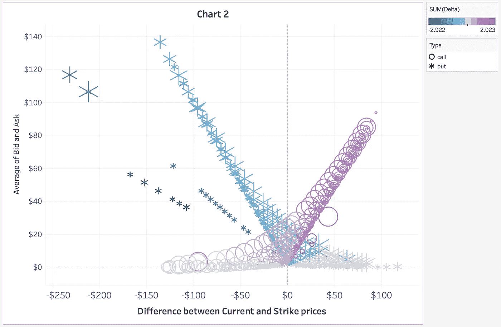**

**GS options data (following the logic in Chart 1) but the clustering color is based on the **Delta**.**

**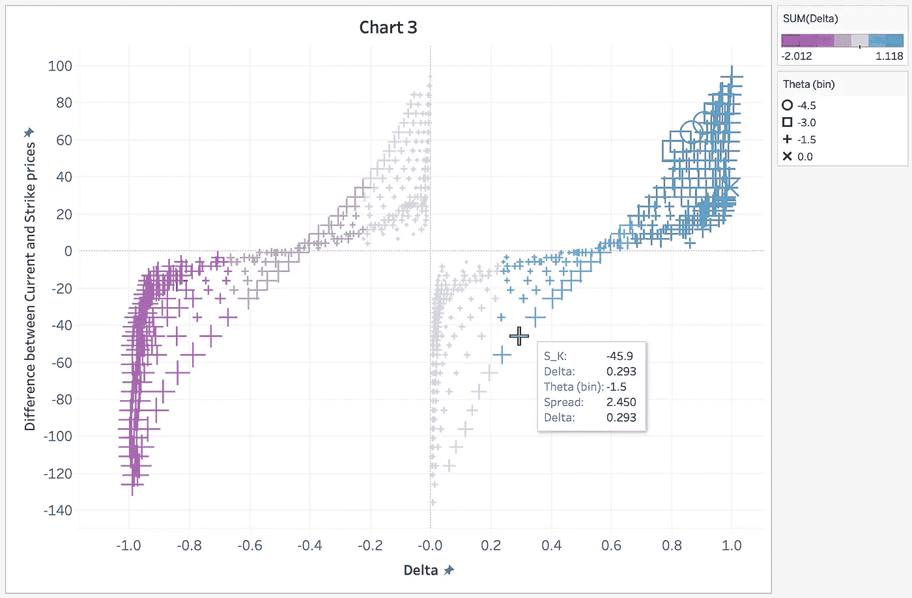**

**GS options data (x-axis is the Delta, y-axis is the difference between Current price and Strike price). The clustering color is based on the **Delta** and the clustering shape (circle, square, plus, and x) is based on the **Theta**.**

**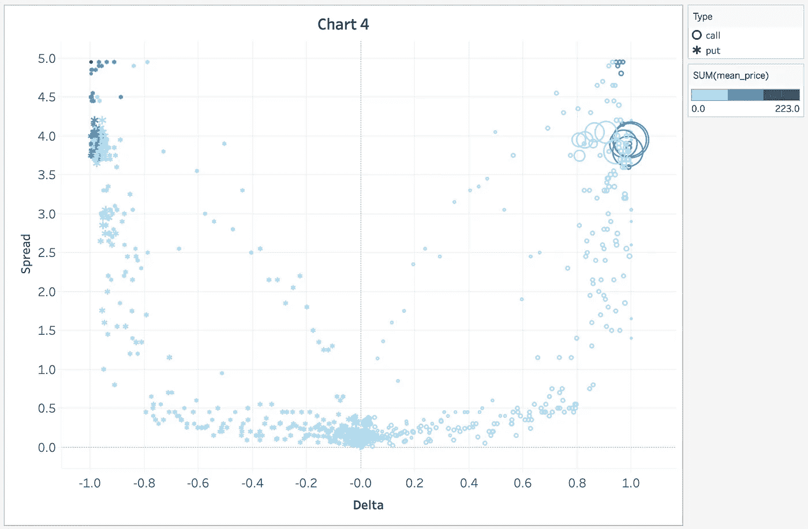**

**GS options data (x-axis is **Delta**, y-axis is the **Spread**) where clustering color range comes from the mean price of **Bid** and **Ask**.**

**好了，让我们进入异常检测。我们的赌注是，通过数据分布，该算法将学习这些 optoins 规则，并设法发现不符合“*平均*分布的数据点。**

```
it_X_train = options_df[['Strike', 'Delta', 'Gamma', 'date_diff']]
it_X_train['s_k'] = options_df['UnderlyingPrice'] - options_df['Strike']
it_X_train['b_a_mean'] = (options_df['Bid'] + options_df['Ask']) / 2
it_X_train['b_a_mean'] = it_X_train['b_a_mean'].apply(lambda x: int(round(x, 0)))
it_X_train['s_k'] = it_X_train['s_k'].apply(lambda x: int(round(x, 0)))
```

**我们不会将每个特征都用于异常检测。我们使用的功能有:**

```
print(', '.join(col_names[x] for x in it_X_train.columns))**output** >>> Strike, Delta, Gamma, Difference between Date of valuation and Exercise date, Difference between Current and Strike prices, Average of Bid and Ask.
```

**我们为什么要使用这些功能？我们希望使用(一起)应该遵循上述选项逻辑的功能。这六个被选择的特征中的破碎逻辑应该构成一个'*奇怪的*契约。**

****隔离林**的逻辑极其简单:**

```
clf = IsolationForest(max_samples='auto', contamination=.025,\
                      n_estimators=10, \
                      random_state=19117,  max_features=it_X_train.shape[1])clf.fit(it_X_train)
y_pred_train = clf.predict(it_X_train)
```

# **4.结果**

**让我们想象一下模型的结果。x 轴是当前价格和执行价格之间的差异，y 轴是买价和卖价的平均值(如上面的图表 1 和 2)。蓝色的 **x** 和紫色的圆圈分别是看跌期权和看涨期权，特征分布没有异常。其他的都是异常现象。**

**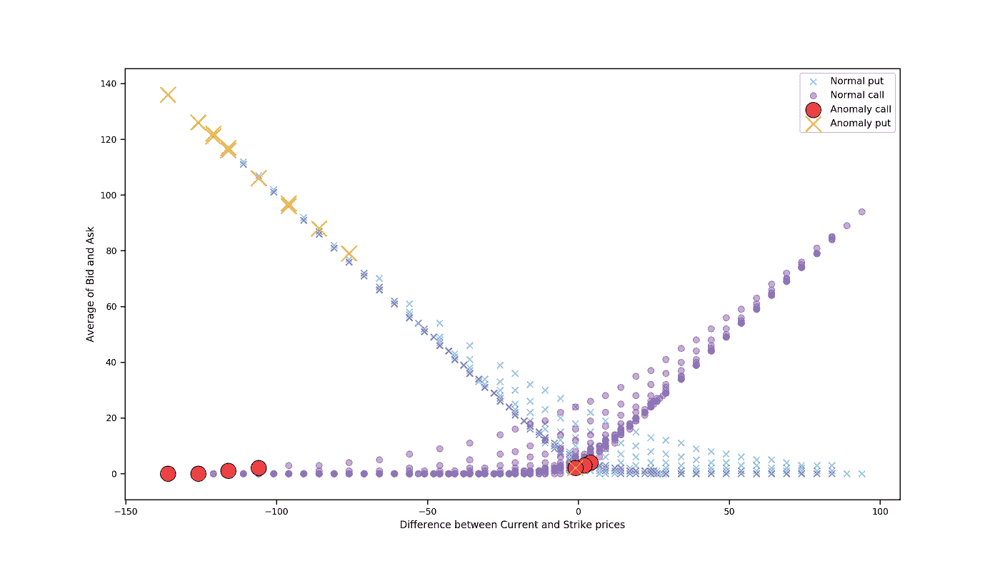**

**这些是隔离林发现的异常。有趣的是，我们发现(尽管从上一张图中看不到，因为我似乎无法修复 python 和 Tableau 之间的 y 轴刻度)识别的异常(红色和橙色)就是我们在上面的 4 张图中观察到的异常(**我交叉引用了每个合同的索引**)。**

**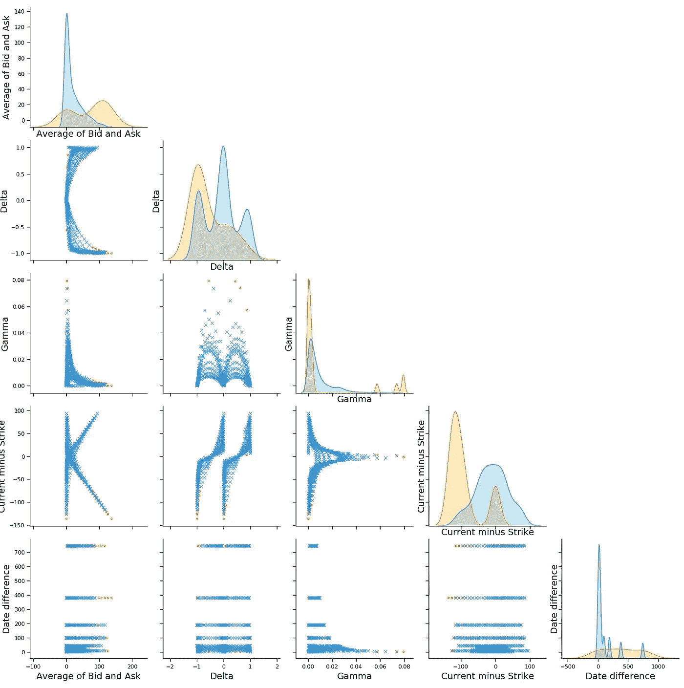**

**Pair-plot between the features we used for anomaly detection. (*Date difference is the number of days until expiration*)**

**从这个配对图中可以观察到异常期权定价样本:**

*   **他们的平均价格(**出价**和**要价**的平均值)高于其他选项，**
*   **它们平均分布在不同的期限上(尽管原始数据主要分布在更接近的期限附近)，**
*   **它们当前的负执行价格不像原始数据那样正态分布。**

**如上所述，我们创建了股票期权定价异常检测，以便将其用作预测高盛股票价格变动的一个特征。期权定价的异常对于预测股票价格的变动到底有多重要？[在这里查看](/aifortrading-2edd6fac689d)。(*还在做，不过*)**

**感谢阅读。**

**最好的，鲍里斯**